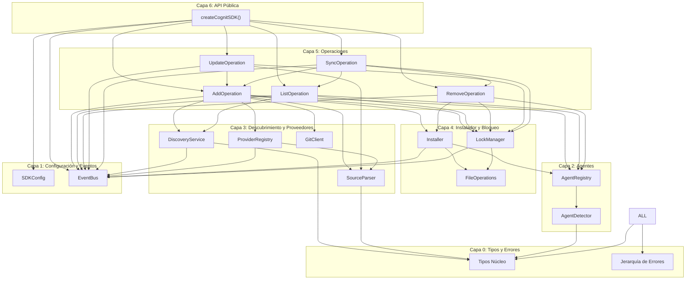
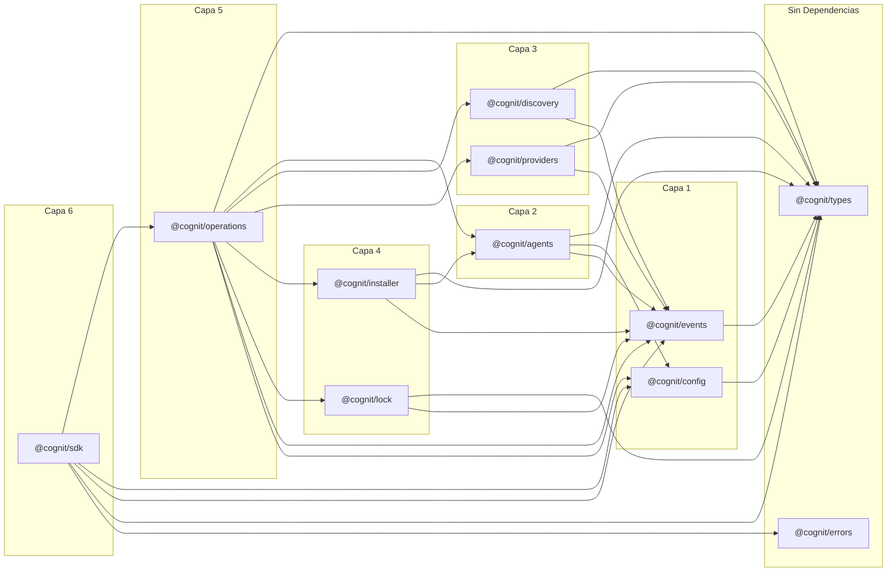
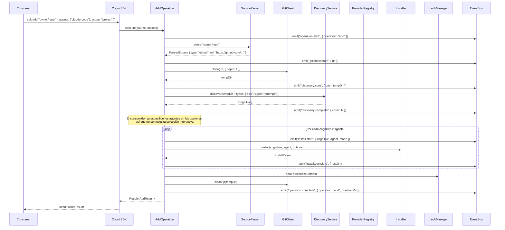

# 01 - Arquitectura del Núcleo del SDK

**Autor:** Agent A -- Arquitecto del Núcleo del SDK
**Fecha:** 2026-02-09
**Estado:** Plan

---

## 1. Principios de Diseño

1. **Agnóstico a la interfaz** -- El SDK nunca lee stdin, escribe en stdout ni solicita información al usuario. Devuelve datos; los consumidores deciden cómo presentarlos.
2. **Composición sobre singletons** -- Cada servicio recibe sus dependencias a través de la inyección por constructor. Sin estado mutable a nivel de módulo.
3. **Eventos, no console.log** -- El SDK emite eventos tipados para observabilidad. Cero E/S directa.
4. **Resultado sobre excepciones** -- Las operaciones devuelven `Result<T, E>` para fallos esperados. Solo las condiciones verdaderamente inesperadas lanzan excepciones.
5. **TypeScript Estricto** -- Sin `any`. Mínimo `unknown` (solo en los límites de la deserialización). Mapas constantes en lugar de enums. Tipos marcados para identificadores de dominio.
6. **Solo ESM, Node >= 20** -- Sin CommonJS, sin build dual. Base moderna.
7. **Testeable por defecto** -- Cada módulo depende de interfaces, no de implementaciones. Toda la E/S abstraída detrás de adaptadores inyectables.

---

## 2. Arquitectura en Capas

```
Capa 0: Tipos y Errores         (tipos puros, cero dependencias)
Capa 1: Configuración y Eventos (configuración del SDK, bus de eventos)
Capa 2: Agentes y Registro      (definiciones de agentes, detección)
Capa 3: Descubrimiento y Proveedores (escaneo de sistema de archivos, obtención remota)
Capa 4: Bloqueo e Instalador    (gestión de archivos de bloqueo, operaciones de archivos)
Capa 5: Operaciones             (añadir, eliminar, listar, actualizar, sincronizar)
Capa 6: API Pública             (fachada del SDK, función de fábrica)
```

Cada capa solo puede importar de las capas inferiores. Nunca hacia arriba.

---

## 3. Diagrama de Componentes



---

## 4. Grafo de Dependencias (estratificación estricta)



Nota: estos son módulos lógicos dentro de un solo paquete, no paquetes npm separados. El prefijo `@cognit/` es solo notacional.

---

## 5. Patrón de Composición (Inyección de Dependencias)

El SDK utiliza **inyección por constructor** con una raíz de composición en `createCognitSDK()`.

```typescript
// Raíz de composición -- el ÚNICO lugar donde las implementaciones concretas se conectan
export function createCognitSDK(userConfig?: Partial<SDKConfig>): CognitSDK {
  const config = resolveConfig(userConfig);
  const eventBus = new EventBusImpl();

  // Capa 2
  const agentRegistry = new AgentRegistryImpl(config, eventBus);
  const agentDetector = new AgentDetectorImpl(agentRegistry, config.fs);

  // Capa 3
  const sourceParser = new SourceParserImpl();
  const gitClient = new GitClientImpl(config, eventBus);
  const providerRegistry = new ProviderRegistryImpl(eventBus);
  registerDefaultProviders(providerRegistry, config);
  const discoveryService = new DiscoveryServiceImpl(config.fs, eventBus);

  // Capa 4
  const fileOps = new FileOperationsImpl(config.fs);
  const lockManager = new LockManagerImpl(config, fileOps, eventBus);
  const installer = new InstallerImpl(agentRegistry, fileOps, eventBus);

  // Capa 5
  const operations = {
    add: new AddOperation({ discoveryService, providerRegistry, sourceParser, gitClient, installer, lockManager, agentRegistry, agentDetector, eventBus, config }),
    list: new ListOperation({ discoveryService, agentRegistry, lockManager, eventBus, config }),
    remove: new RemoveOperation({ installer, lockManager, agentRegistry, eventBus, config }),
    update: new UpdateOperation({ lockManager, sourceParser, gitClient, discoveryService, providerRegistry, installer, agentRegistry, eventBus, config }),
    sync: new SyncOperation({ lockManager, installer, agentRegistry, agentDetector, eventBus, config }),
  };

  return new CognitSDKImpl(config, eventBus, operations, agentRegistry, providerRegistry);
}
```

### ¿Por qué no singletons?

La base de código de cognit existente utiliza un singleton `ProviderRegistryImpl` (`registry.ts:30`). Esto crea problemas:
- No se pueden ejecutar instancias de SDK en paralelo con diferentes configuraciones (por ejemplo, en pruebas).
- No se puede simular/reemplazar para pruebas sin trucos a nivel de módulo.
- Dependencias ocultas: los consumidores no saben qué necesita un módulo.

Con DI, cada dependencia es explícita, reemplazable y testeable.

---

## 6. Estrategia de Manejo de Errores

### 6.1 Jerarquía de Errores

Todos los errores del SDK extienden una clase base `CognitError`:

```
CognitError (clase base abstracta)
  |-- ProviderError
  |     |-- ProviderFetchError
  |     |-- ProviderMatchError
  |-- InstallError
  |     |-- PathTraversalError
  |     |-- SymlinkError
  |     |-- FileWriteError
  |-- DiscoveryError
  |     |-- ParseError (frontmatter)
  |     |-- ScanError
  |-- LockError
  |     |-- LockReadError
  |     |-- LockWriteError
  |     |-- LockMigrationError
  |-- ConfigError
  |     |-- InvalidConfigError
  |-- SourceError
  |     |-- SourceParseError
  |     |-- GitCloneError
  |-- AgentError
  |     |-- AgentNotFoundError
  |     |-- AgentDetectionError
```

### 6.2 Patrón Result

Para las operaciones donde el fallo es **esperado** (por ejemplo, obtener un cognitivo remoto que podría no existir), utilizamos una unión discriminada:

```typescript
type Result<T, E extends CognitError = CognitError> =
  | { ok: true; value: T }
  | { ok: false; error: E };
```

Para los errores verdaderamente **inesperados** (errores del programador, estados imposibles), lanzamos una excepción.

### 6.3 Directrices

| Escenario | Estrategia |
|----------|----------|
| La obtención remota devuelve 404 | `Result` con `ProviderFetchError` |
| Archivo de bloqueo corrupto | `Result` con `LockReadError` |
| Se detecta un salto de ruta (path traversal) | `Result` con `PathTraversalError` |
| Configuración de SDK inválida | Lanzar `InvalidConfigError` en el momento de la construcción |
| El módulo recibe un tipo incorrecto | Lanzar excepción (error del programador) |

---

## 7. Sistema de Eventos

El SDK comunica el progreso, los cambios de estado y los diagnósticos a través de un bus de eventos tipados. Los consumidores se suscriben a los eventos que les interesan.

### 7.1 Interfaz del Bus de Eventos

```typescript
interface EventBus {
  emit<K extends keyof SDKEventMap>(event: K, payload: SDKEventMap[K]): void;
  on<K extends keyof SDKEventMap>(event: K, handler: (payload: SDKEventMap[K]) => void): Unsubscribe;
  once<K extends keyof SDKEventMap>(event: K, handler: (payload: SDKEventMap[K]) => void): Unsubscribe;
}

type Unsubscribe = () => void;
```

### 7.2 Categorías de Eventos

```
sdk:initialized
sdk:error

operation:start         { operation: string, options: unknown }
operation:complete      { operation: string, result: unknown, durationMs: number }
operation:error         { operation: string, error: CognitError }

discovery:start         { path: string }
discovery:found         { cognitive: CognitiveRef, type: CognitiveType }
discovery:complete      { count: number, durationMs: number }

provider:fetch:start    { providerId: string, url: string }
provider:fetch:complete { providerId: string, url: string, found: boolean }

install:start           { cognitive: string, agent: string, mode: InstallMode }
install:symlink         { source: string, target: string }
install:copy            { source: string, target: string }
install:complete        { cognitive: string, agent: string, result: InstallResult }

lock:read               { path: string }
lock:write              { path: string, entryCount: number }
lock:migrate            { from: number, to: number }

git:clone:start         { url: string }
git:clone:complete      { url: string, path: string, durationMs: number }

agent:detect:start      { }
agent:detect:found      { agent: AgentType }
agent:detect:complete   { agents: AgentType[], durationMs: number }

progress:start          { id: string, message: string, total?: number }
progress:update         { id: string, message: string, current?: number }
progress:complete       { id: string, message: string }
```

### 7.3 Uso en un consumidor CLI

```typescript
const sdk = createCognitSDK();

// Conectar eventos al spinner de la CLI
sdk.on('progress:start', ({ message }) => spinner.start(message));
sdk.on('progress:update', ({ message }) => spinner.text = message);
sdk.on('progress:complete', ({ message }) => spinner.succeed(message));

// Conectar eventos a logs detallados
sdk.on('git:clone:start', ({ url }) => log.debug(`Clonando ${url}...`));
```

---

## 8. Sistema de Configuración

### 8.1 Forma de SDKConfig

```typescript
interface SDKConfig {
  /** Directorio base para el almacenamiento canónico de cognitivos. Por defecto: '.agents' */
  agentsDir: string;

  /** Nombre del archivo de bloqueo. Por defecto: '.cognit-lock.json' */
  lockFileName: string;

  /** Directorio de trabajo. Por defecto: process.cwd() */
  cwd: string;

  /** Directorio personal para instalaciones globales. Por defecto: os.homedir() */
  homeDir: string;

  /** Adaptador de sistema de archivos para testabilidad */
  fs: FileSystemAdapter;

  /** Configuración de Git */
  git: {
    /** Tiempo de espera de clonación en ms. Por defecto: 30_000 */
    cloneTimeoutMs: number;
    /** Profundidad de clonación superficial. Por defecto: 1 */
    depth: number;
  };

  /** Configuración de proveedores */
  providers: {
    /** Token de GitHub para llamadas a la API. Se detecta automáticamente si no se proporciona. */
    githubToken?: string;
    /** Registros de proveedores personalizados */
    custom?: HostProvider[];
  };

  /** Configuración de agentes */
  agents: {
    /** Ruta al directorio que contiene las definiciones YAML de los agentes */
    definitionsPath?: string;
    /** Configuraciones de agentes adicionales para registrar en tiempo de ejecución */
    additional?: AgentConfig[];
  };

  /** Configuración de telemetría */
  telemetry: {
    /** Habilitar/deshabilitar telemetría. Por defecto: true */
    enabled: boolean;
    /** Endpoint de telemetría personalizado */
    endpoint?: string;
  };
}
```

### 8.2 Estrategia de Resolución

```typescript
function resolveConfig(partial?: Partial<SDKConfig>): SDKConfig {
  return {
    agentsDir: partial?.agentsDir ?? '.agents',
    lockFileName: partial?.lockFileName ?? '.cognit-lock.json',
    cwd: partial?.cwd ?? process.cwd(),
    homeDir: partial?.homeDir ?? homedir(),
    fs: partial?.fs ?? nodeFs,     // fs nativo de Node.js por defecto
    git: {
      cloneTimeoutMs: partial?.git?.cloneTimeoutMs ?? 30_000,
      depth: partial?.git?.depth ?? 1,
    },
    providers: {
      githubToken: partial?.providers?.githubToken ?? detectGitHubToken(),
      custom: partial?.providers?.custom ?? [],
    },
    agents: {
      definitionsPath: partial?.agents?.definitionsPath,
      additional: partial?.agents?.additional ?? [],
    },
    telemetry: {
      enabled: partial?.telemetry?.enabled ?? true,
      endpoint: partial?.telemetry?.endpoint,
    },
  };
}
```

Los consumidores solo sobrescriben lo que necesitan:

```typescript
// Mínimo -- todos los valores por defecto
const sdk = createCognitSDK();

// Pruebas -- inyectar un sistema de archivos falso
const sdk = createCognitSDK({
  cwd: '/tmp/test-project',
  homeDir: '/tmp/test-home',
  fs: memoryFs,
  telemetry: { enabled: false },
});
```

---

## 9. Adaptador de Sistema de Archivos (FileSystem Adapter)

Toda la E/S del sistema de archivos pasa por un adaptador inyectable. Esto permite:
- Pruebas unitarias sin tocar el sistema de archivos real.
- Portabilidad futura (navegador, Deno, etc.).

```typescript
interface FileSystemAdapter {
  readFile(path: string, encoding: 'utf-8'): Promise<string>;
  writeFile(path: string, content: string, encoding: 'utf-8'): Promise<void>;
  mkdir(path: string, options?: { recursive?: boolean }): Promise<void>;
  readdir(path: string, options?: { withFileTypes: true }): Promise<Dirent[]>;
  stat(path: string): Promise<Stats>;
  lstat(path: string): Promise<Stats>;
  symlink(target: string, path: string): Promise<void>;
  readlink(path: string): Promise<string>;
  rm(path: string, options?: { recursive?: boolean; force?: boolean }): Promise<void>;
  rename(oldPath: string, newPath: string): Promise<void>;
  exists(path: string): Promise<boolean>;
  copyDirectory(source: string, target: string): Promise<void>;
}
```

La implementación por defecto envuelve `fs/promises` de Node.js. Las pruebas utilizan una implementación en memoria.

---

## 10. Diseño Agnóstico a la Interfaz

El SDK tiene **cero** conocimiento de:
- Terminales, colores, spinners.
- stdin/stdout/stderr.
- Prompts interactivos.
- Análisis de argumentos CLI.
- Servidores HTTP o ciclos de solicitud/respuesta.

### Lo que devuelve el SDK frente a lo que hace un consumidor CLI

| El SDK devuelve | El consumidor CLI hace |
|-------------|-------------------|
| `Result<Cognitive[]>` | Renderiza una tabla formateada con picocolors |
| `AgentDetectionResult[]` | Muestra un prompt de selección múltiple |
| `InstallResult` con `symlinkFailed: true` | Imprime una advertencia amarilla |
| evento `progress:start` | Inicia un spinner de `ora` |
| `CognitError` con datos estructurados | Formatea un mensaje de error legible para humanos |

El límite está claro: el SDK produce **datos estructurados y eventos**. El consumidor produce **salida dirigida a humanos**.

---

## 11. Superficie de la API Pública

### 11.1 Exportaciones

```typescript
// Punto de entrada principal
export { createCognitSDK } from './sdk.js';
export type { CognitSDK } from './sdk.js';

// Tipos (para que los consumidores los usen en su propio código)
export type {
  Cognitive, CognitiveType, Skill, Prompt, Rule, AgentCognitive,
  AgentConfig, AgentType, AgentDetectionResult,
  ParsedSource, SourceDescriptor,
  InstallMode, InstallScope, InstallResult, InstallTarget,
  LockFile, LockEntry,
  SDKConfig,
  SDKEventMap,
  Result,
  HostProvider, ProviderMatch,
} from './types/index.js';

// Errores (para que los consumidores los capturen/comparen)
export {
  CognitError,
  ProviderError, ProviderFetchError,
  InstallError, PathTraversalError,
  DiscoveryError, ParseError,
  LockError,
  ConfigError,
  SourceError, GitCloneError,
  AgentError,
} from './errors/index.js';

// Tipos de categorías
export type { Category, CategoryMapping } from './types/category.js';
```

### 11.2 Interfaz Fachada del SDK (SDK Facade)

```typescript
interface CognitSDK {
  // -- Operaciones --
  add(source: string, options?: AddOptions): Promise<Result<AddResult>>;
  list(options?: ListOptions): Promise<Result<ListResult>>;
  remove(name: string, options?: RemoveOptions): Promise<Result<RemoveResult>>;
  update(options?: UpdateOptions): Promise<Result<UpdateResult>>;
  sync(options?: SyncOptions): Promise<Result<SyncResult>>;

  // -- Acceso al registro --
  readonly agents: AgentRegistry;
  readonly providers: ProviderRegistry;

  // -- Suscripción a eventos --
  on<K extends keyof SDKEventMap>(event: K, handler: (payload: SDKEventMap[K]) => void): Unsubscribe;
  once<K extends keyof SDKEventMap>(event: K, handler: (payload: SDKEventMap[K]) => void): Unsubscribe;

  // -- Configuración --
  readonly config: Readonly<SDKConfig>;

  // -- Ciclo de vida --
  dispose(): Promise<void>;
}
```

### 11.3 Módulos Internos frente a Públicos

| Módulo | Público | Interno |
|--------|--------|----------|
| `types/` | Todas las exportaciones de tipos | -- |
| `errors/` | Todas las clases de errores | -- |
| `sdk.ts` | `createCognitSDK`, `CognitSDK` | `CognitSDKImpl` |
| `config/` | Tipo `SDKConfig` | `resolveConfig()` |
| `events/` | `SDKEventMap`, `Unsubscribe` | `EventBusImpl` |
| `agents/` | Interfaz `AgentRegistry` | `AgentRegistryImpl`, `AgentDetectorImpl` |
| `providers/` | `HostProvider`, interfaz `ProviderRegistry` | Proveedores concretos |
| `discovery/` | -- | `DiscoveryServiceImpl` |
| `installer/` | -- | `InstallerImpl`, `FileOperationsImpl` |
| `lock/` | -- | `LockManagerImpl` |
| `operations/` | Tipos de opciones/resultados de operaciones | Implementaciones de operaciones |

---

## 12. Flujo de Datos: `sdk.add("owner/repo")`



---

## 13. Estructura de Directorios (Paquete SDK)

```
src/
  index.ts                    # Exportaciones públicas
  sdk.ts                      # createCognitSDK(), CognitSDKImpl

  types/
    index.ts                  # Re-exportaciones de barril para todos los tipos
    cognitive.ts              # Cognitive, CognitiveType, Skill, Prompt, Rule, Agent
    agent.ts                  # AgentConfig, AgentType, AgentDetectionResult
    provider.ts               # HostProvider, ProviderMatch, SourceDescriptor
    installer.ts              # InstallMode, InstallScope, InstallResult, InstallTarget
    lock.ts                   # LockFile, LockEntry, LockVersion
    operations.ts             # AddOptions, ListOptions, RemoveOptions, etc.
    category.ts               # Category, CategoryMapping
    config.ts                 # SDKConfig
    events.ts                 # SDKEventMap, tipos de carga útil de eventos
    result.ts                 # Result<T, E>
    branded.ts                # AgentName, CognitiveName, utilidades para tipos marcados

  errors/
    index.ts                  # Re-exportaciones de barril
    base.ts                   # CognitError
    provider.ts               # ProviderError, ProviderFetchError
    install.ts                # InstallError, PathTraversalError, SymlinkError
    discovery.ts              # DiscoveryError, ParseError
    lock.ts                   # LockError, LockReadError, LockWriteError
    config.ts                 # ConfigError, InvalidConfigError
    source.ts                 # SourceError, SourceParseError, GitCloneError
    agent.ts                  # AgentError, AgentNotFoundError

  config/
    index.ts                  # resolveConfig()
    defaults.ts               # Valores por defecto
    validation.ts             # Validación de configuración

  events/
    index.ts                  # EventBusImpl
    types.ts                  # Re-exportar desde types/events.ts

  agents/
    index.ts                  # AgentRegistryImpl
    registry.ts               # Lógica del registro núcleo
    detector.ts               # AgentDetectorImpl
    __generated__/
      agents.ts               # Configs de agentes compiladas (desde YAML)
      agent-type.ts           # Unión AgentType
      cognitive-types.ts      # Unión CognitiveType + constantes

  discovery/
    index.ts                  # DiscoveryServiceImpl
    scanner.ts                # Lógica de escaneo del sistema de archivos
    parser.ts                 # Análisis de frontmatter
    plugin-manifest.ts        # Soporte para manifiesto de plugin de Claude

  providers/
    index.ts                  # ProviderRegistryImpl, registerDefaultProviders
    registry.ts               # Implementación del registro
    mintlify.ts               # MintlifyProvider
    huggingface.ts            # HuggingFaceProvider
    wellknown.ts              # WellKnownProvider
    direct.ts                 # DirectURLProvider
    github.ts                 # GitHubProvider (nuevo: proveedor nativo de la API de GitHub)

  source/
    index.ts                  # SourceParserImpl
    parser.ts                 # Análisis de URL/ruta
    git.ts                    # GitClientImpl

  installer/
    index.ts                  # InstallerImpl
    file-ops.ts               # FileOperationsImpl
    paths.ts                  # Sanitización de rutas, directorios canónicos
    symlink.ts                # Creación de symlinks con respaldo

  lock/
    index.ts                  # LockManagerImpl
    reader.ts                 # Lectura de archivos de bloqueo + migración
    writer.ts                 # Escritura de archivos de bloqueo
    hash.ts                   # Hashing de contenido, tree SHA de GitHub

  operations/
    index.ts                  # Barril de operaciones
    add.ts                    # AddOperation
    list.ts                   # ListOperation
    remove.ts                 # RemoveOperation
    update.ts                 # UpdateOperation
    sync.ts                   # SyncOperation

  fs/
    index.ts                  # FileSystemAdapter, nodeFs por defecto
    node.ts                   # Envoltorio de fs/promises de Node.js
    memory.ts                 # Implementación en memoria (para pruebas)
```

---

## 14. Configuración del Paquete

```jsonc
// package.json (campos relevantes)
{
  "name": "@synapsync/cognit-sdk",
  "type": "module",
  "exports": {
    ".": {
      "types": "./dist/index.d.ts",
      "import": "./dist/index.js"
    }
  },
  "types": "./dist/index.d.ts",
  "files": ["dist"],
  "engines": {
    "node": ">=20"
  },
  "scripts": {
    "build": "tsc",
    "test": "vitest",
    "compile-agents": "tsx scripts/compile-agents.ts",
    "prebuild": "npm run compile-agents"
  }
}
```

```jsonc
// tsconfig.json (campos relevantes)
{
  "compilerOptions": {
    "target": "ES2022",
    "module": "NodeNext",
    "moduleResolution": "NodeNext",
    "strict": true,
    "noUncheckedIndexedAccess": true,
    "exactOptionalPropertyTypes": true,
    "declaration": true,
    "declarationMap": true,
    "sourceMap": true,
    "outDir": "dist",
    "rootDir": "src"
  }
}
```

---

## 15. Estrategia de Testabilidad

### 15.1 Todo Inyectable

Cada módulo depende de interfaces. Las pruebas inyectan implementaciones mock/stub/fake:

```typescript
// Probando AddOperation sin sistema de archivos real ni git
const fakeFs = createMemoryFs({ /* archivos semilla */ });
const fakeGit = { clone: async () => '/tmp/fake-clone' };
const fakeEventBus = createCapturingEventBus(); // registra todos los eventos emitidos

const addOp = new AddOperation({
  discoveryService: new DiscoveryServiceImpl(fakeFs, fakeEventBus),
  gitClient: fakeGit,
  installer: new InstallerImpl(agentRegistry, new FileOperationsImpl(fakeFs), fakeEventBus),
  // ...
});

const result = await addOp.execute('owner/repo', { agents: ['claude-code'] });
assert(result.ok);
assert.equal(fakeEventBus.events.length, 8); // verificar secuencia de eventos
```

### 15.2 Categorías de Pruebas

| Categoría | Qué prueba | Dependencias |
|----------|--------------|--------------|
| Unidad | Funciones individuales, analizadores, validadores | Ninguna (funciones puras) |
| Integración | Interacciones entre módulos (ej. Installer + FileOps) | FS en memoria |
| Contrato | Implementaciones de proveedores contra la interfaz | Mocks de HTTP |

### 15.3 Sin Estado Global

Debido a que no hay singletons:
- Las pruebas se ejecutan en paralelo de forma segura.
- Sin contaminación entre ejecuciones de pruebas.
- No es necesario `beforeEach` para limpiar registros globales.

---

## 16. Ruta de Migración desde el Cognit Existente

El código existente (`/Users/rperaza/joicodev/owned/SynapSync/projects/cognit`) se mapea a la nueva arquitectura:

| Módulo existente | Nuevo módulo SDK | Cambios clave |
|-----------------|----------------|-------------|
| `core/types.ts` | `types/` | Dividir en archivos enfocados, añadir tipos marcados |
| `core/__generated__/` | `agents/__generated__/` | Misma generación de código, nueva ubicación |
| `services/registry/` | `agents/` | Inyectar dependencias en lugar de singleton |
| `services/discovery/` | `discovery/` | Aceptar `FileSystemAdapter` |
| `services/source/` | `source/` | Extraer interfaz, inyectar git |
| `services/installer/` | `installer/` | Unificar 3 funciones de instalación en una |
| `services/lock/` | `lock/` | Aceptar `FileSystemAdapter`, inyectar configuración |
| `providers/` | `providers/` | Reemplazar singleton con registro inyectado |
| `providers/registry.ts` (singleton) | `providers/registry.ts` (clase) | Recibe dependencias vía constructor |
| `commands/*.ts` | `operations/` | Lógica pura, sin UI, devuelve `Result` |
| `ui/` | **No en el SDK** | Se queda en el consumidor CLI |
| `utils/logger.ts` | **No en el SDK** | Reemplazado por el sistema de eventos |

### Qué se elimina del SDK

- Todos los alias `@deprecated` (`Skill`, `RemoteSkill`, etc.).
- Todo el código de UI (`ui/`, `@clack/prompts`, `ora`, `picocolors`).
- Uso directo de `console.log` / `process.stdout`.
- Análisis de `process.argv`.
- Telemetría a `add-skill.vercel.sh` (reemplazada por un endpoint configurable).
- El comando `find` (depende de la API externa de `skills.sh` -- se convierte en una característica a nivel de consumidor).

---

## 17. Puntos de Extensibilidad

### 17.1 Proveedores Personalizados

```typescript
const sdk = createCognitSDK({
  providers: {
    custom: [myCustomProvider],
  },
});
```

### 17.2 Definiciones de Agentes Personalizadas

```typescript
const sdk = createCognitSDK({
  agents: {
    additional: [{
      name: 'my-internal-agent',
      displayName: 'Agente Interno',
      dirs: { skill: { local: '.internal/skills', global: undefined } },
      detectInstalled: async () => true,
    }],
  },
});
```

### 17.3 Tipos Cognitivos Personalizados (Futuro)

El sistema de tipos está diseñado para que `CognitiveType` pueda extenderse. La configuración basada en YAML (`config/cognitive-types.yaml`) ya admite esto; añadir un nuevo tipo es una edición de YAML + reconstrucción.

Para la extensibilidad en tiempo de ejecución (futuro), el SDK podría aceptar definiciones de tipos cognitivos adicionales en la configuración:

```typescript
const sdk = createCognitSDK({
  cognitiveTypes: {
    additional: [{ name: 'workflow', subdir: 'workflows', fileName: 'WORKFLOW.md' }],
  },
});
```

Esto no está en el alcance inicial pero la arquitectura lo admite.

---

## 18. Modelo de Concurrencia

- Todas las operaciones son `async` y no bloqueantes.
- El escaneo de directorios por descubrimiento se realiza en paralelo (se preserva el patrón existente).
- La instalación de múltiples cognitivos en múltiples agentes se puede paralelizar.
- El acceso al archivo de bloqueo se serializa por instancia de SDK (cola en memoria).
- El método `dispose()` espera a que finalicen las operaciones en curso antes de resolverse.

---

## 19. Consideraciones de Seguridad

Preservado de la base de código existente:
- Prevención de salto de ruta (`sanitizeName`, `isPathSafe`, `isContainedIn`).
- Contención en directorio temporal.
- Validación de rutas del manifiesto de plugin.
- Sin ejecución de código arbitrario.

Añadido en el SDK:
- `FileSystemAdapter` puede forzar sandboxing.
- La validación de configuración evita la inyección de rutas maliciosas.
- Las URLs de los proveedores se validan antes de la obtención.
- Los objetivos de clonación de Git se validan y contienen.

---

## 20. Decisiones Clave de Diseño

| Decisión | Elección | Racional |
|----------|----------|-----------|
| DI frente a singletons | DI | Testabilidad, paralelismo, explicidad |
| Result frente a excepciones | Híbrido | Result para fallos esperados, lanzar excepción para errores de código |
| Eventos frente a callbacks | Eventos | Desacoplado, múltiples oyentes, componible |
| Paquete único frente a monorepo | Paquete único | Más simple, sin sobrecarga de coordinación de versiones |
| Solo ESM | Sí | Base moderna, Node 20+, sin el lastre de CJS |
| Mapas constantes frente a enums | Mapas constantes | Mejor inferencia de tipos, eliminable por tree-shaking, sin sobrecarga en tiempo de ejecución |
| FS en memoria para pruebas | Sí | Rápido, determinista, sin necesidad de limpieza |
| Unificar las 3 funciones de instalación | Sí | Las funciones actuales comparten el 80% de la lógica |
