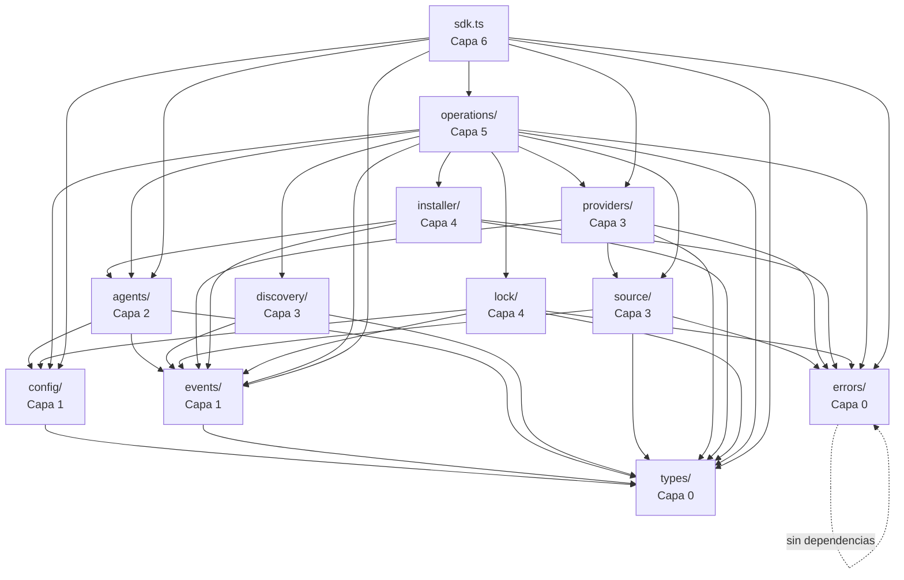

# 03 - Desglose de Módulos y Análisis de Dependencias

**Autor:** Agent A -- Arquitecto del Núcleo del SDK
**Fecha:** 2026-02-09
**Estado:** Plan

---

## 1. Grafo de Dependencias de Módulos



---

## 2. Detalles del Módulo

### 2.1 `types/` -- Definiciones de Tipos Núcleo

**Capa:** 0 (sin dependencias)
**Responsabilidad:** Todas las definiciones de tipos TypeScript, tipos marcados, utilidades de resultado y mapas constantes.

#### API Pública
```typescript
// Todo se exporta: este es el vocabulario compartido
export type { Cognitive, CognitiveType, CognitiveRef, Skill, Prompt, Rule, AgentCognitive }
export type { RemoteCognitive, WellKnownCognitive }
export type { AgentConfig, AgentType, AgentDirConfig, AgentDetectionResult, AgentRegistry }
export type { HostProvider, ProviderMatch, ProviderRegistry, SourceDescriptor, SourceParser, GitClient }
export type { InstallMode, InstallScope, InstallTarget, InstallResult, InstallRequest, Installer }
export type { LockFile, LockEntry, LockManager }
export type { AddOptions, AddResult, ListOptions, ListResult, RemoveOptions, RemoveResult, UpdateOptions, UpdateResult, SyncOptions, SyncResult }
export type { Category, CategoryMapping }
export type { SDKConfig, FileSystemAdapter, GitConfig, ProviderConfig, AgentRegistryConfig, TelemetryConfig }
export type { SDKEventMap, EventBus, Unsubscribe }
export type { Result }
export type { AgentName, CognitiveName, SafeName, SourceIdentifier }

export { COGNITIVE_TYPE_CONFIGS, COGNITIVE_SUBDIRS, COGNITIVE_FILE_NAMES, AGENTS_DIR }
export { DEFAULT_CATEGORIES }
export { ok, err, unwrap, mapResult }
export { agentName, cognitiveName, safeName, sourceIdentifier }
```

#### API Interna
Ninguna -- todos los tipos son públicos.

#### Dependencias
Ninguna.

#### Estructura de Archivos
```
types/
  index.ts          # Re-exportaciones de barril
  cognitive.ts      # Cognitive, CognitiveType, RemoteCognitive, CognitiveRef
  agent.ts          # AgentConfig, AgentType, AgentDetectionResult, AgentRegistry
  provider.ts       # HostProvider, ProviderMatch, ProviderRegistry, SourceDescriptor, SourceParser, GitClient
  installer.ts      # InstallMode, InstallScope, InstallTarget, InstallResult, Installer
  lock.ts           # LockFile, LockEntry, LockManager
  operations.ts     # AddOptions, AddResult, ListOptions, etc.
  category.ts       # Category, CategoryMapping
  config.ts         # SDKConfig, FileSystemAdapter
  events.ts         # SDKEventMap, EventBus, Unsubscribe
  result.ts         # Result<T,E>, ok(), err(), unwrap()
  branded.ts        # AgentName, CognitiveName, SafeName, SourceIdentifier + constructores
```

#### Estrategia de Pruebas
- **Pruebas de tipos puras**: Solo en tiempo de compilación; si compila, los tipos son correctos.
- **Constructores de tipos marcados**: Pruebas unitarias para la lógica de validación (rechazar entradas incorrectas).
- **Utilidades de Result**: Pruebas unitarias para `ok`, `err`, `unwrap`, `mapResult`.

---

### 2.2 `errors/` -- Jerarquía de Errores

**Capa:** 0 (sin dependencias más allá de los tipos)
**Responsabilidad:** Todas las clases de error tipadas.

#### API Pública
```typescript
export { CognitError }
export { ProviderError, ProviderFetchError, ProviderMatchError }
export { InstallError, PathTraversalError, SymlinkError, FileWriteError }
export { DiscoveryError, ParseError, ScanError }
export { LockError, LockReadError, LockWriteError, LockMigrationError }
export { ConfigError, InvalidConfigError }
export { SourceError, SourceParseError, GitCloneError }
export { AgentError, AgentNotFoundError, AgentDetectionError }
export { ERROR_CODES, type ErrorCode }
```

#### API Interna
Ninguna -- todos los errores son públicos.

#### Dependencias
Ninguna (los errores no referencian a ningún otro módulo).

#### Estructura de Archivos
```
errors/
  index.ts          # Re-exportaciones de barril
  base.ts           # Clase abstracta CognitError
  provider.ts       # ProviderError, ProviderFetchError, ProviderMatchError
  install.ts        # InstallError, PathTraversalError, SymlinkError, FileWriteError
  discovery.ts      # DiscoveryError, ParseError, ScanError
  lock.ts           # LockError, LockReadError, LockWriteError, LockMigrationError
  config.ts         # ConfigError, InvalidConfigError
  source.ts         # SourceError, SourceParseError, GitCloneError
  agent.ts          # AgentError, AgentNotFoundError, AgentDetectionError
  codes.ts          # Mapa de constantes ERROR_CODES
```

#### Estrategia de Pruebas
- Pruebas unitarias: Verificar la jerarquía de `instanceof`, las propiedades `code` y `module`, y la salida de `toJSON()`.
- Pruebas de coincidencia de errores: Verificar que un `ProviderFetchError instanceof ProviderError` y un `ProviderError instanceof CognitError`.

---

### 2.3 `config/` -- Configuración del SDK

**Capa:** 1
**Responsabilidad:** Resolver, validar y proporcionar la configuración del SDK.

#### API Pública
```typescript
export type { SDKConfig } // re-exportado desde types/
```

#### API Interna
```typescript
export function resolveConfig(partial?: Partial<SDKConfig>): SDKConfig;
export function validateConfig(config: SDKConfig): void; // lanza InvalidConfigError
```

#### Dependencias
- `types/` (SDKConfig, FileSystemAdapter)
- `errors/` (InvalidConfigError)

#### Estructura de Archivos
```
config/
  index.ts          # resolveConfig(), validateConfig()
  defaults.ts       # Valores por defecto para cada campo de configuración
  validation.ts     # Reglas de validación
```

#### Estrategia de Pruebas
- Pruebas unitarias: `resolveConfig()` con entradas parciales, verificar que se apliquen los valores por defecto.
- Pruebas unitarias: `validateConfig()` rechaza configuraciones inválidas (cwd negativo, rutas inexistentes, etc.).
- Pruebas unitarias: Fusión de configuración; los sobrescrituras parciales se aplican correctamente.

---

### 2.4 `events/` -- Bus de Eventos

**Capa:** 1
**Responsabilidad:** Emisión y suscripción de eventos tipados.

#### API Pública
```typescript
export type { EventBus, SDKEventMap, Unsubscribe } // re-exportado desde types/
```

#### API Interna
```typescript
export class EventBusImpl implements EventBus {
  emit<K extends keyof SDKEventMap>(event: K, payload: SDKEventMap[K]): void;
  on<K extends keyof SDKEventMap>(event: K, handler: (payload: SDKEventMap[K]) => void): Unsubscribe;
  once<K extends keyof SDKEventMap>(event: K, handler: (payload: SDKEventMap[K]) => void): Unsubscribe;
}

/** Para pruebas: captura todos los eventos emitidos */
export function createCapturingEventBus(): EventBus & {
  readonly events: Array<{ event: string; payload: unknown }>;
};
```

#### Dependencias
- `types/` (SDKEventMap, Unsubscribe)

#### Estructura de Archivos
```
events/
  index.ts          # EventBusImpl, createCapturingEventBus
```

#### Estrategia de Pruebas
- Pruebas unitarias: Suscribir, emitir, verificar que el manejador se llame con la carga útil correcta.
- Pruebas unitarias: `once` se dispara exactamente una vez.
- Pruebas unitarias: La cancelación de suscripción elimina el manejador.
- Pruebas unitarias: `createCapturingEventBus` captura los eventos en orden.

---

### 2.5 `agents/` -- Registro y Detección de Agentes

**Capa:** 2
**Responsabilidad:** Gestionar las configuraciones de los agentes, detectar agentes instalados, resolver rutas específicas por agente.

#### API Pública (vía interfaces)
```typescript
export type { AgentRegistry } // interfaz de types/
```

#### API Interna
```typescript
export class AgentRegistryImpl implements AgentRegistry {
  constructor(config: SDKConfig, eventBus: EventBus);
  getAll(): ReadonlyMap<AgentType, AgentConfig>;
  get(type: AgentType): AgentConfig | undefined;
  getUniversalAgents(cognitiveType?: CognitiveType): AgentType[];
  getNonUniversalAgents(cognitiveType?: CognitiveType): AgentType[];
  isUniversal(type: AgentType, cognitiveType?: CognitiveType): boolean;
  getDir(type: AgentType, cognitiveType: CognitiveType, scope: 'local' | 'global'): string | undefined;
  detectInstalled(): Promise<AgentDetectionResult[]>;
  register(config: AgentConfig): void;
}
```

#### Dependencias
- `types/` (AgentConfig, AgentType, CognitiveType, AgentDetectionResult, SDKConfig)
- `config/` (SDKConfig para homeDir, agents.additional)
- `events/` (EventBus para eventos agent:detect:*)

#### Interfaces Consumidas
- `SDKConfig` (de config)
- `EventBus` (de events)
- `FileSystemAdapter` (de config, para detección)

#### Estructura de Archivos
```
agents/
  index.ts                  # AgentRegistryImpl
  registry.ts               # Lógica del registro núcleo
  detector.ts               # Lógica de detección (verificaciones de sistema de archivos)
  __generated__/
    agents.ts               # Record de configuraciones de agentes compiladas <AgentType, AgentConfig>
    agent-type.ts           # Tipo de unión AgentType
    cognitive-types.ts      # Unión CognitiveType + constantes COGNITIVE_*
```

#### Prevención de Dependencias Circulares
- El módulo `agents/` importa solo de `types/` y `config/`.
- NO importa de `installer/`, `lock/`, `discovery/` u `operations/`.
- Los archivos en `__generated__/` son datos puros; sin importaciones del resto del SDK.

#### Estrategia de Pruebas
- Pruebas unitarias: `AgentRegistryImpl.getAll()`, `.get()`, `.getUniversalAgents()`.
- Pruebas unitarias: `register()` añade agentes, rechaza duplicados.
- Pruebas de integración: `detectInstalled()` con sistema de archivos simulado (sembrar directorios de agentes, verificar detección).
- Pruebas de contrato: Verificar que los agentes generados coincidan con la forma esperada.

---

### 2.6 `discovery/` -- Descubrimiento de Cognitivos

**Capa:** 3
**Responsabilidad:** Escanear los directorios del sistema de archivos para encontrar archivos cognitivos (SKILL.md, AGENT.md, PROMPT.md, RULE.md), analizar su frontmatter y devolver objetos `Cognitive` estructurados.

#### API Pública (vía interfaz)
```typescript
// Sin exportación pública directa; se accede a través de operaciones
```

#### API Interna
```typescript
export interface DiscoveryService {
  discover(basePath: string, options?: DiscoverOptions): Promise<Cognitive[]>;
  discoverByType(basePath: string, type: CognitiveType, options?: DiscoverOptions): Promise<Cognitive[]>;
}

export interface DiscoverOptions {
  subpath?: string;
  types?: CognitiveType[];
  includeInternal?: boolean;
  fullDepth?: boolean;
}

export class DiscoveryServiceImpl implements DiscoveryService {
  constructor(fs: FileSystemAdapter, eventBus: EventBus);
}
```

#### Dependencias
- `types/` (Cognitive, CognitiveType, CognitiveRef, COGNITIVE_FILE_NAMES, COGNITIVE_SUBDIRS)
- `events/` (EventBus para eventos discovery:*)

#### Interfaces Consumidas
- `FileSystemAdapter` (para readdir, readFile, stat)
- `EventBus` (para la emisión de eventos)

#### Dependencias Externas
- `gray-matter` (análisis de frontmatter YAML)

#### Estructura de Archivos
```
discovery/
  index.ts              # DiscoveryServiceImpl
  scanner.ts            # Lógica de escaneo de FS (findCognitiveDirs, buildPrioritySearchDirs)
  parser.ts             # Lógica de análisis de frontmatter (parseCognitiveMd, hasCognitiveMd)
  plugin-manifest.ts    # Soporte para manifiesto de plugin de Claude
```

#### Estrategia de Pruebas
- Pruebas unitarias: `parser.ts` -- analizar frontmatter válido/inválido, verificar forma de Cognitive.
- Pruebas unitarias: `scanner.ts` -- con FS en memoria, sembrar directorios, verificar descubrimiento.
- Pruebas de integración: `DiscoveryServiceImpl.discover()` completo con estructuras de directorios realistas.
- Casos de borde: Directorios vacíos, frontmatter faltante, filtrado de internal=true.

---

### 2.7 `providers/` -- Proveedores de Host Remoto

**Capa:** 3
**Responsabilidad:** Obtener cognitivos de hosts remotos (Mintlify, HuggingFace, endpoints well-known, URLs directas). Gestionar un registro de proveedores.

#### API Pública (vía interfaces)
```typescript
export type { HostProvider, ProviderRegistry, ProviderMatch } // de types/
```

#### API Interna
```typescript
export class ProviderRegistryImpl implements ProviderRegistry {
  constructor(eventBus: EventBus);
  register(provider: HostProvider): void;
  findProvider(url: string): HostProvider | null;
  getAll(): readonly HostProvider[];
}

export function registerDefaultProviders(registry: ProviderRegistry, config: SDKConfig): void;

// Proveedores concretos
export class MintlifyProvider implements HostProvider { /* ... */ }
export class HuggingFaceProvider implements HostProvider { /* ... */ }
export class WellKnownProvider implements HostProvider { /* ... */ }
export class DirectURLProvider implements HostProvider { /* ... */ }
```

#### Dependencias
- `types/` (HostProvider, ProviderMatch, RemoteCognitive, SourceIdentifier, CognitiveType)
- `events/` (EventBus para eventos provider:fetch:*)
- `errors/` (ProviderError, ProviderFetchError)
- `source/` (para la manipulación de URLs en algunos proveedores)

#### Interfaces Consumidas
- `EventBus`

#### Dependencias Externas
- `gray-matter` (análisis de frontmatter en el contenido obtenido)

#### Estructura de Archivos
```
providers/
  index.ts              # ProviderRegistryImpl, registerDefaultProviders
  registry.ts           # Implementación del registro
  mintlify.ts           # MintlifyProvider
  huggingface.ts        # HuggingFaceProvider
  wellknown.ts          # WellKnownProvider
  direct.ts             # DirectURLProvider
```

#### Prevención de Dependencias Circulares
- Los proveedores importan solo de `types/` y `events/`.
- Los proveedores NO importan de `agents/`, `installer/`, `lock/` u `operations/`.
- Si un proveedor necesita lógica de análisis de origen, importa de `source/` (misma capa, direccional).

#### Estrategia de Pruebas
- Pruebas unitarias por proveedor: Simular respuestas HTTP, verificar `match()`, `fetchCognitive()`, `toRawUrl()`.
- Pruebas unitarias: `ProviderRegistryImpl` -- registrar, findProvider, rechazo de duplicados.
- Pruebas de contrato: Verificar que cada proveedor implemente `HostProvider` correctamente.

---

### 2.8 `source/` -- Análisis de Origen y Git

**Capa:** 3
**Responsabilidad:** Analizar cadenas de origen brutas (URLs, rutas, abreviaturas) en objetos `SourceDescriptor` estructurados. Gestionar operaciones de clonación de git.

#### API Interna
```typescript
export class SourceParserImpl implements SourceParser {
  parse(source: string): SourceDescriptor;
  getOwnerRepo(source: SourceDescriptor): string | undefined;
}

export class GitClientImpl implements GitClient {
  constructor(config: SDKConfig, eventBus: EventBus);
  clone(url: string, options?: GitCloneOptions): Promise<string>;
  cleanup(tempDir: string): Promise<void>;
}
```

#### Dependencias
- `types/` (SourceDescriptor, ParsedSource, GitCloneOptions)
- `events/` (EventBus para eventos git:clone:*)
- `errors/` (SourceParseError, GitCloneError)

#### Dependencias Externas
- `simple-git` (operaciones de clonación de git)

#### Estructura de Archivos
```
source/
  index.ts          # Exportaciones de barril
  parser.ts         # SourceParserImpl
  git.ts            # GitClientImpl
```

#### Estrategia de Pruebas
- Pruebas unitarias: `SourceParserImpl.parse()` con muchas variantes de entrada (URL de GitHub, GitLab, ruta local, abreviatura owner/repo, con subruta, con referencia).
- Pruebas unitarias: extracción de `getOwnerRepo()`.
- Pruebas de integración: `GitClientImpl.clone()` con un git simulado (o repositorio de prueba).

---

### 2.9 `installer/` -- Instalación de Archivos

**Capa:** 4
**Responsabilidad:** Instalar cognitivos en los directorios de los agentes mediante symlink o copia. Manejar la estructura de directorios canónica, la seguridad de las rutas y la lógica de respaldo.

#### API Interna
```typescript
export class InstallerImpl implements Installer {
  constructor(agentRegistry: AgentRegistry, fileOps: FileOperations, eventBus: EventBus);

  install(request: InstallRequest, target: InstallTarget, options: InstallerOptions): Promise<InstallResult>;
  remove(cognitiveName: string, cognitiveType: CognitiveType, target: InstallTarget): Promise<boolean>;
}

export interface FileOperations {
  copyDirectory(source: string, target: string): Promise<void>;
  cleanAndCreateDirectory(dir: string): Promise<void>;
  createSymlink(source: string, target: string): Promise<boolean>;
  writeFile(path: string, content: string): Promise<void>;
  removeDirectory(dir: string): Promise<void>;
}

export class FileOperationsImpl implements FileOperations {
  constructor(fs: FileSystemAdapter);
}

// Utilidades de ruta
export function sanitizeName(raw: string): SafeName;
export function getCanonicalDir(cognitiveType: CognitiveType, isGlobal: boolean, cwd: string, homeDir: string): string;
export function isPathSafe(base: string, target: string): boolean;
export function isContainedIn(parent: string, child: string): boolean;
```

#### Dependencias
- `types/` (InstallRequest, InstallTarget, InstallResult, InstallMode, CognitiveType, SafeName)
- `agents/` (AgentRegistry para la resolución de rutas)
- `events/` (EventBus para eventos install:*)
- `errors/` (InstallError, PathTraversalError, SymlinkError)

#### Interfaces Consumidas
- `AgentRegistry` (de agents)
- `FileSystemAdapter` (de config/types)
- `EventBus`

#### Estructura de Archivos
```
installer/
  index.ts          # InstallerImpl
  file-ops.ts       # FileOperationsImpl
  paths.ts          # sanitizeName, getCanonicalDir, isPathSafe, isContainedIn
  symlink.ts        # Creación de symlinks multiplataforma con respaldo
```

#### Nota de Diseño Clave: Función de Instalación Unificada
La base de código existente tiene 3 funciones de instalación separadas:
- `installCognitiveForAgent()` -- cognitivo del sistema de archivos local.
- `installRemoteCognitiveForAgent()` -- cognitivo remoto de un solo archivo.
- `installWellKnownCognitiveForAgent()` -- cognitivo well-known de varios archivos.

Estas comparten un ~80% de lógica. El nuevo SDK las unifica en un solo `Installer.install()` que acepta una unión discriminada `InstallRequest`:

```typescript
// Existente: 3 funciones, mucha duplicación
installCognitiveForAgent(cognitive, agentType, options)
installRemoteCognitiveForAgent(skill, agentType, options)
installWellKnownCognitiveForAgent(skill, agentType, options)

// Nuevo: 1 función con entrada de unión discriminada
installer.install(
  { kind: 'local', cognitive },      // o
  { kind: 'remote', cognitive },     // o
  { kind: 'wellknown', cognitive },
  target, options
)
```

#### Estrategia de Pruebas
- Pruebas unitarias: `sanitizeName()` con varias entradas (espacios, barras, puntos, unicode).
- Pruebas unitarias: `isPathSafe()` con intentos de salto de ruta.
- Pruebas unitarias: `getCanonicalDir()` para proyecto frente a global.
- Pruebas de integración: `InstallerImpl.install()` con FS en memoria:
  - Modo symlink: verificar que se creen el directorio canónico y el symlink.
  - Modo copia: verificar copia directa.
  - Respaldo de symlink: verificar el respaldo a copia cuando falla el symlink.
  - Agente universal: verificar que no haya symlink para instalaciones globales universales.
- Pruebas de integración: `InstallerImpl.remove()` -- verificar la limpieza.

---

### 2.10 `lock/` -- Gestión del Archivo de Bloqueo

**Capa:** 4
**Responsabilidad:** Leer, escribir, migrar y consultar el archivo `.cognit-lock.json`.

#### API Interna
```typescript
export class LockManagerImpl implements LockManager {
  constructor(config: SDKConfig, fileOps: FileOperations, eventBus: EventBus);

  read(): Promise<LockFile>;
  write(lock: LockFile): Promise<void>;
  addEntry(name: string, entry: Omit<LockEntry, 'installedAt' | 'updatedAt'>): Promise<void>;
  removeEntry(name: string): Promise<boolean>;
  getEntry(name: string): Promise<LockEntry | null>;
  getAllEntries(): Promise<Readonly<Record<string, LockEntry>>>;
  getBySource(): Promise<ReadonlyMap<SourceIdentifier, { names: string[]; entry: LockEntry }>>;
  getLastSelectedAgents(): Promise<readonly string[] | undefined>;
  saveLastSelectedAgents(agents: readonly string[]): Promise<void>;
}

// Utilidades de hash
export function computeContentHash(content: string): string;
export function fetchCognitiveFolderHash(ownerRepo: string, cognitivePath: string, token?: string | null): Promise<string | null>;
```

#### Dependencias
- `types/` (LockFile, LockEntry, SourceIdentifier, CognitiveType)
- `config/` (SDKConfig para la ruta del archivo de bloqueo, homeDir)
- `events/` (EventBus para eventos lock:*)
- `errors/` (LockError, LockReadError, LockWriteError, LockMigrationError)

#### Interfaces Consumidas
- `FileOperations` (de installer, para E/S de archivos)
- `SDKConfig`
- `EventBus`

#### Estructura de Archivos
```
lock/
  index.ts          # LockManagerImpl
  reader.ts         # Lectura, análisis y migración de archivos de bloqueo
  writer.ts         # Escritura de archivos de bloqueo
  hash.ts           # computeContentHash, fetchCognitiveFolderHash
```

#### Estrategia de Pruebas
- Pruebas unitarias: Leer archivo de bloqueo con varias versiones (rutas de migración).
- Pruebas unitarias: Escritura y relectura de ida y vuelta.
- Pruebas unitarias: `addEntry()`, `removeEntry()`, `getEntry()`.
- Pruebas unitarias: lógica de agrupación de `getBySource()`.
- Pruebas unitarias: `computeContentHash()`.
- Pruebas de integración: `fetchCognitiveFolderHash()` con la API de GitHub simulada.
- Casos de borde: Archivo de bloqueo vacío, JSON corrupto, eliminación de versión antigua.

---

### 2.11 `operations/` -- Operaciones del SDK

**Capa:** 5
**Responsabilidad:** Orquestar las operaciones de alto nivel (add, list, remove, update, sync) componiendo los servicios de las capas inferiores.

#### API Interna
```typescript
interface OperationDeps {
  discoveryService: DiscoveryService;
  providerRegistry: ProviderRegistry;
  sourceParser: SourceParser;
  gitClient: GitClient;
  installer: Installer;
  lockManager: LockManager;
  agentRegistry: AgentRegistry;
  eventBus: EventBus;
  config: SDKConfig;
}

export class AddOperation {
  constructor(deps: OperationDeps);
  execute(source: string, options?: AddOptions): Promise<Result<AddResult>>;
}

export class ListOperation {
  constructor(deps: Pick<OperationDeps, 'discoveryService' | 'agentRegistry' | 'lockManager' | 'eventBus' | 'config'>);
  execute(options?: ListOptions): Promise<Result<ListResult>>;
}

export class RemoveOperation {
  constructor(deps: Pick<OperationDeps, 'installer' | 'lockManager' | 'agentRegistry' | 'eventBus' | 'config'>);
  execute(name: string, options?: RemoveOptions): Promise<Result<RemoveResult>>;
}

export class UpdateOperation {
  constructor(deps: OperationDeps);
  execute(options?: UpdateOptions): Promise<Result<UpdateResult>>;
}

export class SyncOperation {
  constructor(deps: Pick<OperationDeps, 'lockManager' | 'installer' | 'agentRegistry' | 'eventBus' | 'config'>);
  execute(options?: SyncOptions): Promise<Result<SyncResult>>;
}
```

#### Dependencias
- Todas las capas inferiores (tipos, errores, config, eventos, agentes, descubrimiento, proveedores, origen, instalador, bloqueo).

#### Estructura de Archivos
```
operations/
  index.ts          # Exportaciones de barril
  add.ts            # AddOperation
  list.ts           # ListOperation
  remove.ts         # RemoveOperation
  update.ts         # UpdateOperation
  sync.ts           # SyncOperation
```

#### Nota de Diseño Clave: Las operaciones NO son comandos CLI
El archivo `commands/add.ts` existente (1,244 líneas) mezcla la lógica con la interfaz de usuario. En el nuevo SDK:
- `AddOperation` maneja ÚNICAMENTE la lógica (analizar origen, clonar, descubrir, instalar, bloquear).
- Devuelve `Result<AddResult>`, una estructura de datos.
- NO solicita información al usuario, no muestra spinners ni formatea la salida.
- Si el consumidor necesita seleccionar agentes o cognitivos de forma interactiva, lee el campo `discovered` de un paso intermedio y vuelve a llamar al SDK.

#### Estrategia de Pruebas
- Pruebas unitarias por operación: Inyectar mocks para todas las dependencias, verificar la orquestación correcta.
- Pruebas de integración: Conectar implementaciones reales con FS en memoria, verificar de extremo a extremo.
- Pruebas de manejo de errores: Verificar que las operaciones devuelvan `err(...)` para los fallos esperados.
- Verificación de eventos: Asegurar que se emitan los eventos correctos en el orden correcto.

---

### 2.12 `fs/` -- Adaptador de Sistema de Archivos

**Capa:** 0 (implementaciones en la Capa 1)
**Responsabilidad:** Proporcionar una interfaz `FileSystemAdapter` e implementaciones.

#### API Pública
```typescript
export type { FileSystemAdapter, FsStats, Dirent } // de types/
```

#### API Interna
```typescript
export const nodeFs: FileSystemAdapter;  // Envoltorio de fs/promises nativo de Node.js
export function createMemoryFs(seed?: Record<string, string>): FileSystemAdapter;
```

#### Dependencias
- `types/` (interfaz FileSystemAdapter)

#### Estructura de Archivos
```
fs/
  index.ts          # Exportaciones de barril
  node.ts           # Implementación de fs/promises de Node.js
  memory.ts         # Implementación en memoria para pruebas
```

#### Estrategia de Pruebas
- `node.ts`: Mínima; envuelve la biblioteca estándar.
- `memory.ts`: Pruebas unitarias que verifican el comportamiento correcto (mkdir -p, readdir con tipos, symlink, etc.).

---

## 3. Preocupaciones Transversales

### 3.1 Prevención de Dependencias Circulares

La estratificación estricta evita ciclos:

| Regla | Cumplimiento |
|------|-------------|
| La capa N solo importa de las capas < N | Revisión de código + linting de importación |
| Sin importaciones laterales dentro de la misma capa (excepto `providers` -> `source`) | Reglas de ESLint `no-restricted-imports` |
| Los archivos `__generated__/` no importan NADA del SDK | El script de generación de código lo impone |
| `types/` y `errors/` tienen cero importaciones intra-SDK | La estructura de barril lo evita |

Configuración de ESLint para imponerlo:

```json
{
  "rules": {
    "no-restricted-imports": ["error", {
      "patterns": [
        { "group": ["../operations/*"], "message": "Las capas inferiores no pueden importar de operations/" },
        { "group": ["../sdk"], "message": "Solo index.ts puede importar de sdk.ts" }
      ]
    }]
  }
}
```

### 3.2 Patrón de Exportaciones de Barril (Barrel Exports)

Cada módulo tiene un `index.ts` que controla su superficie pública:

```typescript
// agents/index.ts
export { AgentRegistryImpl } from './registry.js';
export type { AgentRegistry } from '../types/agent.js';
// Los detalles internos (internos de detector.ts) NO se exportan
```

### 3.3 Gestión del Código Generado

```
Pipeline en tiempo de construcción:
  agents/*.yaml  ─┐
  config/cognitive-types.yaml ─┤──→  scripts/compile-agents.ts  ──→  agents/__generated__/
                               │                                       ├── agents.ts
                               │                                       ├── agent-type.ts
                                                                       └── cognitive-types.ts
```

Archivos generados:
- Se guardan en el repositorio (para soporte de IDE).
- Tienen un encabezado `// AUTO-GENERATED -- DO NOT EDIT`.
- No importan nada del SDK.
- Se regeneran mediante `npm run compile-agents`.

---

## 4. Cómo se Componen los Módulos

### 4.1 Flujo de la Operación Add

```
AddOperation
  ├── usa SourceParser.parse() para entender el origen
  ├── usa GitClient.clone() para orígenes git
  ├── usa DiscoveryService.discover() para encontrar cognitivos en el directorio clonado/local
  ├── usa ProviderRegistry.findProvider() para orígenes basados en URL
  ├── usa Installer.install() para cada par cognitivo x agente
  ├── usa LockManager.addEntry() para registrar la instalación
  └── emite eventos vía EventBus en cada paso
```

### 4.2 Flujo de la Operación List

```
ListOperation
  ├── usa AgentRegistry.detectInstalled() para encontrar agentes activos
  ├── usa DiscoveryService.discover() para escanear los directorios de los agentes
  ├── usa LockManager.getAllEntries() para los metadatos
  └── compone los resultados en ListResult
```

### 4.3 Flujo de la Operación Remove

```
RemoveOperation
  ├── usa LockManager.getEntry() para encontrar los metadatos del cognitivo
  ├── usa AgentRegistry para resolver rutas específicas por agente
  ├── usa Installer.remove() para eliminar archivos/symlinks
  └── usa LockManager.removeEntry() para limpiar el archivo de bloqueo
```

### 4.4 Flujo de la Operación Update

```
UpdateOperation
  ├── usa LockManager.getAllEntries() para encontrar los cognitivos instalados
  ├── para cada uno: usa fetchCognitiveFolderHash() para verificar actualizaciones
  ├── para aquellos con actualizaciones: vuelve a ejecutar el flujo Add con el origen actualizado
  └── registra los nuevos hashes en el archivo de bloqueo
```

### 4.5 Flujo de la Operación Sync

```
SyncOperation
  ├── usa LockManager.getAllEntries() para obtener lo que debería estar instalado
  ├── usa AgentRegistry.detectInstalled() para encontrar los agentes actuales
  ├── compara el estado esperado frente al estado real
  ├── usa Installer.install() para volver a crear los symlinks/copias faltantes
  └── informa de las entradas huérfanas
```

---

## 5. Tabla de Resumen de Dependencias de Módulos

| Módulo | Depende De | Dependencia De |
|--------|-----------|---------------|
| `types/` | -- | Todo |
| `errors/` | -- | Todo excepto types |
| `config/` | types | agents, lock, operations, sdk |
| `events/` | types | agents, discovery, providers, source, installer, lock, operations, sdk |
| `fs/` | types | config (vía adaptador), discovery, installer, lock |
| `agents/` | types, config, events | installer, operations, sdk |
| `discovery/` | types, events, fs | operations |
| `providers/` | types, events, errors, source | operations, sdk |
| `source/` | types, events, errors | providers, operations |
| `installer/` | types, agents, events, errors, fs | operations |
| `lock/` | types, config, events, errors, fs | operations |
| `operations/` | todo lo anterior | sdk |
| `sdk.ts` | operations, config, events, types, errors, agents, providers | Consumidor (API pública) |

---

## 6. Estimación de Conteo de Archivos

| Módulo | Archivos | LOC Estimadas |
|--------|-------|---------------|
| `types/` | 12 | ~600 |
| `errors/` | 9 | ~250 |
| `config/` | 3 | ~120 |
| `events/` | 1 | ~80 |
| `fs/` | 3 | ~200 |
| `agents/` | 4 + 3 generados | ~300 + ~600 generados |
| `discovery/` | 4 | ~350 |
| `providers/` | 6 | ~800 |
| `source/` | 3 | ~350 |
| `installer/` | 4 | ~400 |
| `lock/` | 4 | ~350 |
| `operations/` | 6 | ~700 |
| `sdk.ts` + `index.ts` | 2 | ~150 |
| **Total** | **~64** | **~5,250** |

Esta es una reducción significativa de las ~9,200 LOC existentes porque:
- Sin código de UI (ahorra ~700 LOC).
- Sin análisis de argumentos CLI (ahorra ~500 LOC).
- Función de instalación unificada (ahorra ~300 LOC).
- Sin alias obsoletos (ahorra ~200 LOC).
- Sin código de endpoint de telemetría (ahorra ~100 LOC).

---

## 7. Orden de Inicialización del Módulo

Cuando se llama a `createCognitSDK()`:

```
1. resolveConfig()         → SDKConfig
2. new EventBusImpl()      → EventBus
3. new AgentRegistryImpl() → AgentRegistry (carga agentes generados + config.agents.additional)
4. new SourceParserImpl()  → SourceParser
5. new GitClientImpl()     → GitClient
6. new ProviderRegistryImpl() + registerDefaultProviders() → ProviderRegistry
7. new DiscoveryServiceImpl() → DiscoveryService
8. new FileOperationsImpl() → FileOperations
9. new LockManagerImpl()   → LockManager
10. new InstallerImpl()    → Installer
11. Construir todas las operaciones → Operations
12. new CognitSDKImpl()    → CognitSDK
13. eventBus.emit('sdk:initialized')
```

Ningún módulo necesita inicialización asíncrona. Todo es síncrono en el momento de la construcción. La detección asíncrona (ej., `detectInstalled()`) ocurre bajo demanda.
