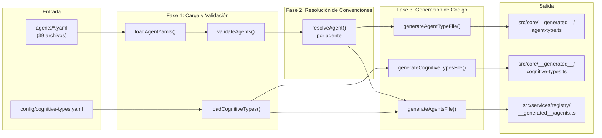
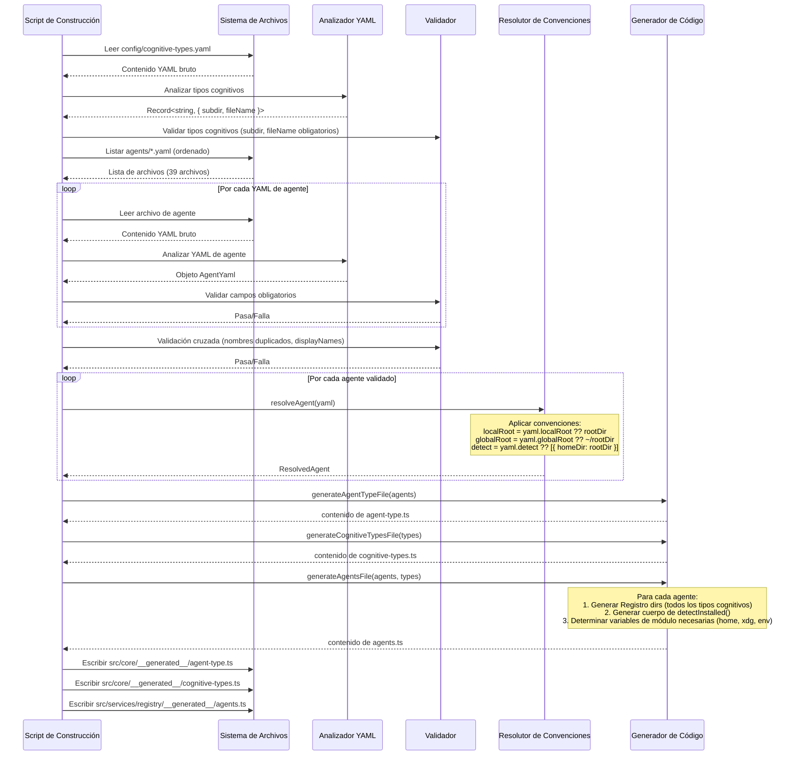

# 04 - Sistema de Configuración de Agentes

## 1. Descripción General

El sistema de configuración de agentes es el puente entre el SDK universal de cognit y los más de 39 agentes de codificación de IA a los que se dirige. Cada agente tiene convenciones de directorio únicas, métodos de detección y comportamientos de plataforma. El sistema utiliza archivos YAML como única fuente de verdad, compilados a TypeScript en tiempo de construcción para un coste de análisis nulo en tiempo de ejecución y una seguridad de tipos completa.

---

## 2. Definición del Esquema YAML

### 2.1 Referencia Completa de Campos

```yaml
# ── Campos Obligatorios ──────────────────────────────────────────────────

name: string
# Identificador único de máquina. Debe coincidir con el nombre del archivo (ej., claude-code.yaml -> name: claude-code).
# Patrón: /^[a-z0-9]([a-z0-9-]*[a-z0-9])?$/
# Se utiliza como clave en el Record<AgentType, AgentConfig> generado.

displayName: string
# Nombre legible por humanos que se muestra en prompts, logs e interfaz de usuario.
# Debe ser único (insensible a mayúsculas) en todos los agentes.
# Ejemplos: "Claude Code", "GitHub Copilot", "OpenCode"

# ── Resolución de Directorios (se requiere rootDir o localRoot) ──────────

rootDir: string?
# Abreviatura: establece localRoot, globalRoot y detect simultáneamente mediante convención.
# - localRoot por defecto es rootDir (ej., ".cursor")
# - globalRoot por defecto es "~/{rootDir}" (ej., "~/.cursor")
# - detect por defecto es [{ homeDir: rootDir }]
# Use rootDir para agentes simples que siguen el patrón estándar.

localRoot: string?
# Directorio raíz local (ámbito de proyecto) explícito.
# Relativo a la raíz del proyecto (cwd).
# Ejemplos: ".cursor", ".agents", ".claude"
# Si es una cadena vacía "", los subdirectorios cognitivos se colocan directamente bajo cwd.

globalRoot: string | { firstExists: string[] }?
# Directorio raíz global explícito. Admite:
# - Ruta simple:      "~/.cursor"
# - Var de entorno:   "${XDG_CONFIG_HOME}/opencode"
# - Env con respaldo: "${CODEX_HOME:~/.codex}"
# - Primero-que-exista: { firstExists: ["${CLAUDE_CONFIG_DIR:~/.claude}", "~/.claude"] }
#
# Sustitución de variables de ruta:
#   ~/             -> join(homedir(), ...)
#   ${XDG_CONFIG_HOME}/  -> join(xdgConfig ?? ~/.config, ...)
#   ${CODEX_HOME:fallback} -> process.env.CODEX_HOME?.trim() || fallback
#   ${CLAUDE_CONFIG_DIR:fallback} -> process.env.CLAUDE_CONFIG_DIR?.trim() || fallback

# ── Reglas de Detección ──────────────────────────────────────────────────

detect: DetectRule[]?
# Array de reglas de detección. El agente está "instalado" si CUALQUIER regla coincide (lógica OR).
# Si se omite, el valor por defecto es [{ homeDir: rootDir }].
# Cada regla verifica la existencia de una ruta o variable de entorno.

# DetectRule es uno de:
#   homeDir: string       -> existsSync(join(homedir(), value))
#   xdgConfig: string     -> existsSync(join(xdgConfig, value))
#   cwdDir: string        -> existsSync(join(cwd, value))
#   absolutePath: string  -> existsSync(value)
#   envVar: string        -> process.env[value] existe y la ruta existe
#   envResolved: string   -> existsSync(resolvedEnvVar)  (ej., "codexHome", "claudeHome")
#   envResolvedPath:      -> existsSync(join(resolvedVar, subpath))
#     var: string
#     subpath: string

# ── Flags Opcionales ─────────────────────────────────────────────────────

showInUniversalList: boolean?
# Si este agente aparece en la lista de "agentes universales".
# Por defecto: true (omitir para incluir).
# Establezca en false para agentes que comparten .agents/ pero no deberían seleccionarse automáticamente
# (ej., replit, que usa .agents/ pero es solo en la nube).
```

### 2.2 Valores por Defecto por Convención

Cuando solo se proporciona `rootDir`, el compilador aplica estas convenciones:

| Campo | Convención | Ejemplo (rootDir: `.cursor`) |
|---|---|---|
| `localRoot` | `= rootDir` | `.cursor` |
| `globalRoot` | `= ~/{rootDir}` | `~/.cursor` |
| `detect` | `= [{ homeDir: rootDir }]` | `[{ homeDir: ".cursor" }]` |
| `showInUniversalList` | `= true` (omitido) | `true` |

Esto significa que la definición de agente más simple es de solo 3 líneas:

```yaml
name: cursor
displayName: Cursor
rootDir: .cursor
```

---

## 3. Ejemplos de Agentes Reales

### 3.1 Agente Mínimo (Basado en Convenciones)

```yaml
# agents/cursor.yaml
name: cursor
displayName: Cursor
rootDir: .cursor
```

**Resuelto a:**
- localRoot: `.cursor`
- globalRoot: `~/.cursor`
- detect: `[{ homeDir: ".cursor" }]`
- dirs.skill: `{ local: ".cursor/skills", global: "~/.cursor/skills" }`

### 3.2 Agente con Variable de Entorno

```yaml
# agents/claude-code.yaml
name: claude-code
displayName: Claude Code
rootDir: .claude
globalRoot: ${CLAUDE_CONFIG_DIR:~/.claude}
detect:
  - envResolved: claudeHome
```

**Diferencia clave:** `globalRoot` utiliza una variable de entorno con un respaldo. La detección verifica la variable `claudeHome` resuelta en lugar de un directorio simple.

### 3.3 Agente Compatible con XDG

```yaml
# agents/opencode.yaml
name: opencode
displayName: OpenCode
localRoot: .agents
globalRoot: ${XDG_CONFIG_HOME}/opencode
detect:
  - xdgConfig: opencode
  - envResolvedPath:
      var: claudeHome
      subpath: skills
```

**Diferencias clave:**
- Utiliza `.agents` como localRoot (compartido con otros agentes).
- La raíz global sigue la especificación XDG Base Directory.
- Dos reglas de detección (OR): verifica la configuración XDG O el directorio de skills de Claude (porque OpenCode puede leer las skills de Claude).

### 3.4 Agente con Detección Multi-Origen

```yaml
# agents/codex.yaml
name: codex
displayName: Codex
localRoot: .agents
globalRoot: ${CODEX_HOME:~/.codex}
detect:
  - envResolved: codexHome
  - absolutePath: /etc/codex
```

**Diferencia clave:** Detecta a través de una variable de entorno O una ruta absoluta en todo el sistema (`/etc/codex`).

### 3.5 Agente con Ruta Global No Estándar

```yaml
# agents/windsurf.yaml
name: windsurf
displayName: Windsurf
rootDir: .windsurf
globalRoot: ~/.codeium/windsurf
detect:
  - homeDir: .codeium/windsurf
```

**Diferencia clave:** La raíz global NO es `~/.windsurf`, es `~/.codeium/windsurf`. La detección coincide con la ruta global real, no con el rootDir local.

### 3.6 Agente Oculto de la Lista Universal

```yaml
# agents/replit.yaml
name: replit
displayName: Replit
localRoot: .agents
globalRoot: ${XDG_CONFIG_HOME}/agents
showInUniversalList: false
detect:
  - cwdDir: .agents
```

**Diferencia clave:** `showInUniversalList: false` significa que este agente no se seleccionará automáticamente al instalar en "agentes universales". Utiliza la detección `cwdDir` (verifica el directorio de trabajo actual, no el personal).

### 3.7 Agente Simple Basado en el Directorio Personal

```yaml
# agents/gemini-cli.yaml
name: gemini-cli
displayName: Gemini CLI
rootDir: .gemini
globalRoot: ~/.gemini
detect:
  - homeDir: .gemini
```

**Diferencia clave:** Especifica explícitamente `globalRoot` y `detect` a pesar de que coinciden con las convenciones. Esto es válido y da como resultado la misma salida.

---

## 4. Subdirectorios de Tipos Cognitivos

### 4.1 Definición de Tipos

Los tipos cognitivos se definen en `config/cognitive-types.yaml`:

```yaml
skill:
  subdir: skills
  fileName: SKILL.md

agent:
  subdir: agents
  fileName: AGENT.md

prompt:
  subdir: prompts
  fileName: PROMPT.md
```

### 4.2 Estructura de Directorios por Agente

Para cada agente, el compilador genera un registro `dirs` que mapea cada tipo cognitivo a rutas locales y globales:

```
dirs: {
  skill:  { local: "{localRoot}/skills",  global: "{globalRoot}/skills"  },
  agent:  { local: "{localRoot}/agents",  global: "{globalRoot}/agents"  },
  prompt: { local: "{localRoot}/prompts", global: "{globalRoot}/prompts" },
}
```

**Ejemplo para `claude-code`:**

```
dirs: {
  skill:  { local: ".claude/skills",  global: join(claudeHome, "skills")  },
  agent:  { local: ".claude/agents",  global: join(claudeHome, "agents")  },
  prompt: { local: ".claude/prompts", global: join(claudeHome, "prompts") },
}
```

**Ejemplo para `opencode` (compartido .agents):**

```
dirs: {
  skill:  { local: ".agents/skills",  global: join(configHome, "opencode/skills")  },
  agent:  { local: ".agents/agents",  global: join(configHome, "opencode/agents")  },
  prompt: { local: ".agents/prompts", global: join(configHome, "opencode/prompts") },
}
```

### 4.3 Añadir un Nuevo Tipo Cognitivo

Para añadir un nuevo tipo (ej., `rule`):

1. Añadir a `config/cognitive-types.yaml`:
   ```yaml
   rule:
     subdir: rules
     fileName: RULE.md
   ```
2. Ejecutar el script de compilación. Cada agente obtiene automáticamente `dirs.rule`.
3. No es necesario modificar los archivos YAML de los agentes.

---

## 5. Detección de Agentes

### 5.1 Cómo Funciona la Detección

La detección determina qué agentes de codificación de IA están instalados actualmente en el sistema del usuario. El SDK llama a `detectInstalledAgents()`, que ejecuta todas las funciones de detección de agentes en paralelo y devuelve la lista de agentes detectados.

```typescript
async function detectInstalledAgents(): Promise<AgentType[]> {
  const results = await Promise.all(
    Object.entries(agents).map(async ([type, config]) => ({
      type: type as AgentType,
      installed: await config.detectInstalled(),
    }))
  );
  return results.filter((r) => r.installed).map((r) => r.type);
}
```

### 5.2 Referencia de Reglas de Detección

| Tipo de Regla | Qué Verifica | Ejemplo |
|---|---|---|
| `homeDir` | `existsSync(join(homedir(), value))` | `homeDir: ".cursor"` verifica `~/.cursor` |
| `xdgConfig` | `existsSync(join(xdgConfig, value))` | `xdgConfig: "opencode"` verifica `~/.config/opencode` |
| `cwdDir` | `existsSync(join(cwd, value))` | `cwdDir: ".agents"` verifica `./.agents` |
| `absolutePath` | `existsSync(value)` | `absolutePath: "/etc/codex"` |
| `envVar` | `process.env[value] ? existsSync(process.env[value]) : false` | `envVar: "CURSOR_HOME"` |
| `envResolved` | `existsSync(resolvedVar)` | `envResolved: "codexHome"` verifica `$CODEX_HOME` o `~/.codex` |
| `envResolvedPath` | `existsSync(join(resolvedVar, subpath))` | Verifica `join(claudeHome, "skills")` |

### 5.3 Precedencia de Detección

Múltiples reglas utilizan la lógica OR: si CUALQUIER regla coincide, se detecta que el agente está instalado. Esto maneja casos donde los agentes pueden instalarse en múltiples ubicaciones (ej., Codex a través de variable de entorno O `/etc/codex`).

---

## 6. Grupos de Compatibilidad

### 6.1 Agentes con Directorio Compartido

Varios agentes comparten el directorio local `.agents/`:

| localRoot | Agentes |
|---|---|
| `.agents` | codex, opencode, github-copilot, amp, replit, mcpjam, kode, crush, pochi, qoder, ... |
| `.cursor` | cursor |
| `.claude` | claude-code |
| `.windsurf` | windsurf |
| `.roo` | roo |
| `.goose` | goose |
| `.gemini` | gemini-cli |

### 6.2 Agentes Universales

Los agentes que utilizan `.agents` como su localRoot son "agentes universales": leen de la misma ubicación canónica. Al instalar en modo symlink:

- El cognitivo se escribe UNA VEZ en `.agents/cognit/skills/<nombre>/`.
- Para los agentes universales, este ES el directorio del agente (no se necesita symlink).
- Para los agentes no universales (ej., cursor), se crea un symlink de `.cursor/skills/<nombre>` a la ubicación canónica.

### 6.3 Implicaciones para el SDK

El SDK debe rastrear qué agentes comparten directorios para:
1. Evitar instalaciones duplicadas (escribir el mismo archivo dos veces en `.agents/skills/`).
2. Determinar correctamente los agentes "universales" para la optimización de symlinks.
3. Manejar correctamente la eliminación (no eliminar un cognitivo compartido si otros agentes aún lo usan).

---

## 7. Pipeline de Compilación

### 7.1 Resumen del Pipeline



### 7.2 Fase 1: Cargar y Validar

**Paso 1a: Cargar archivos YAML**
```
- Leer todos los archivos *.yaml del directorio agents/
- Analizar cada uno con el analizador YAML
- Para cada archivo:
  - Verificar que existe el campo "name"
  - Verificar que existe el campo "displayName"
  - Verificar que el nombre coincide con el del archivo (claude-code.yaml debe tener name: claude-code)
  - Verificar que se especifica "rootDir" o "localRoot"
```

**Paso 1b: Validación Cruzada**
```
- Comprobar nombres duplicados
- Comprobar displayNames duplicados (insensible a mayúsculas)
- Fallar la construcción si hay errores de validación
```

**Paso 1c: Cargar Tipos Cognitivos**
```
- Leer config/cognitive-types.yaml
- Validar que cada entrada tiene "subdir" y "fileName"
- Devolver como Record<string, { subdir: string; fileName: string }>
```

### 7.3 Fase 2: Resolver Convenciones

Para cada YAML de agente, aplicar convención sobre configuración:

```
Entrada: { name: "cursor", displayName: "Cursor", rootDir: ".cursor" }

Resolver:
  localRoot  = yaml.localRoot ?? yaml.rootDir        -> ".cursor"
  globalRoot = yaml.globalRoot ?? "~/" + yaml.rootDir -> "~/.cursor"
  detect     = yaml.detect ?? [{ homeDir: rootDir }]  -> [{ homeDir: ".cursor" }]

Salida: ResolvedAgent {
  name: "cursor",
  displayName: "Cursor",
  localRoot: ".cursor",
  globalRoot: "~/.cursor",
  detect: [{ homeDir: ".cursor" }]
}
```

### 7.4 Fase 3: Generación de Código

#### Salida 1: `agent-type.ts`

```typescript
// AUTO-GENERATED by scripts/compile-agents.ts -- DO NOT EDIT
// Source: agents/*.yaml

export type AgentType =
  | 'amp'
  | 'claude-code'
  | 'codex'
  | 'cursor'
  // ... 35 más
  | 'zencoder';
```

#### Salida 2: `cognitive-types.ts`

```typescript
// AUTO-GENERATED by scripts/compile-agents.ts -- DO NOT EDIT
// Source: config/cognitive-types.yaml

export type CognitiveType = 'skill' | 'agent' | 'prompt';

export const COGNITIVE_SUBDIRS: Record<CognitiveType, string> = {
  skill: 'skills',
  agent: 'agents',
  prompt: 'prompts',
};

export const COGNITIVE_FILE_NAMES: Record<CognitiveType, string> = {
  skill: 'SKILL.md',
  agent: 'AGENT.md',
  prompt: 'PROMPT.md',
};

export const AGENTS_DIR = '.agents';
```

#### Salida 3: `agents.ts`

```typescript
// AUTO-GENERATED by scripts/compile-agents.ts -- DO NOT EDIT
// Source: agents/*.yaml

import { homedir } from 'os';
import { join } from 'path';
import { existsSync } from 'fs';
import { xdgConfig } from 'xdg-basedir';
import type { AgentConfig, AgentType } from '../../../core/types.ts';

const home = homedir();
const configHome = xdgConfig ?? join(home, '.config');
const codexHome = process.env.CODEX_HOME?.trim() || join(home, '.codex');
const claudeHome = process.env.CLAUDE_CONFIG_DIR?.trim() || join(home, '.claude');

export const agents: Record<AgentType, AgentConfig> = {
  'cursor': {
    name: 'cursor',
    displayName: 'Cursor',
    dirs: {
      skill: { local: '.cursor/skills', global: join(home, '.cursor/skills') },
      agent: { local: '.cursor/agents', global: join(home, '.cursor/agents') },
      prompt: { local: '.cursor/prompts', global: join(home, '.cursor/prompts') },
    },
    detectInstalled: async () => {
      return existsSync(join(home, '.cursor'));
    },
  },
  'claude-code': {
    name: 'claude-code',
    displayName: 'Claude Code',
    dirs: {
      skill: { local: '.claude/skills', global: join(claudeHome, 'skills') },
      agent: { local: '.claude/agents', global: join(claudeHome, 'agents') },
      prompt: { local: '.claude/prompts', global: join(claudeHome, 'prompts') },
    },
    detectInstalled: async () => {
      return existsSync(claudeHome);
    },
  },
  // ... 37 agentes más
};
```

### 7.5 Reglas Detalladas de Generación de Código

**Generación de la expresión de la raíz global:**

| Patrón YAML | Código Generado |
|---|---|
| `~/.cursor` | `join(home, '.cursor')` |
| `${XDG_CONFIG_HOME}/opencode` | `join(configHome, 'opencode')` |
| `${CODEX_HOME:~/.codex}` | `codexHome` (variable de módulo pre-resuelta) |
| `${CLAUDE_CONFIG_DIR:~/.claude}` | `claudeHome` (variable de módulo pre-resuelta) |
| `~/.codeium/windsurf` | `join(home, '.codeium/windsurf')` |
| `{ firstExists: [...] }` | `existsSync(p1) ? p1 : existsSync(p2) ? p2 : p3` |

**Generación del cuerpo de detección:**

| Regla YAML | Código Generado |
|---|---|
| `homeDir: ".cursor"` | `existsSync(join(home, '.cursor'))` |
| `xdgConfig: "opencode"` | `existsSync(join(configHome, 'opencode'))` |
| `cwdDir: ".agents"` | `existsSync(join(process.cwd(), '.agents'))` |
| `absolutePath: "/etc/codex"` | `existsSync('/etc/codex')` |
| `envResolved: "codexHome"` | `existsSync(codexHome)` |
| `envResolvedPath: { var: "claudeHome", subpath: "skills" }` | `existsSync(join(claudeHome, 'skills'))` |

---

## 8. Manejo de Plataformas

### 8.1 Rutas XDG

El SDK utiliza `xdg-basedir` para el soporte multiplataforma de XDG:

| Plataforma | Valor por Defecto de `XDG_CONFIG_HOME` | Ejemplo |
|---|---|---|
| macOS | `~/.config` | `/Users/bob/.config` |
| Linux | `~/.config` | `/home/bob/.config` |
| Windows | `%APPDATA%` (vía xdg-basedir) | `C:\Users\bob\AppData\Roaming` |

### 8.2 Variables de Entorno

Resueltas en el momento de la carga del módulo (no en tiempo de compilación):

| Variable | Resolución |
|---|---|
| `CODEX_HOME` | `process.env.CODEX_HOME?.trim() \|\| join(home, '.codex')` |
| `CLAUDE_CONFIG_DIR` | `process.env.CLAUDE_CONFIG_DIR?.trim() \|\| join(home, '.claude')` |
| `XDG_CONFIG_HOME` | Mediante el paquete `xdg-basedir` |

### 8.3 Separadores de Ruta

Todas las rutas YAML utilizan barras inclinadas hacia adelante. La función `join()` en el código generado maneja los separadores específicos de la plataforma en tiempo de ejecución.

### 8.4 Soporte para Symlinks en Windows

Windows requiere el Modo Desarrollador para los symlinks. El instalador detecta el fallo del symlink y recurre al modo copia de forma transparente.

---

## 9. Reglas de Validación

### 9.1 Validación en Tiempo de Construcción

| Regla | Mensaje de Error |
|---|---|
| Falta `name` | `{archivo}: falta el campo obligatorio "name"` |
| Falta `displayName` | `{archivo}: falta el campo obligatorio "displayName"` |
| Discrepancia nombre/archivo | `{archivo}: el nombre "{nombre}" no coincide con el archivo "{esperado}"` |
| Faltan rootDir y localRoot | `{archivo}: debe especificar "rootDir" o "localRoot"` |
| `name` duplicado | `Nombre de agente duplicado: "{nombre}"` |
| `displayName` duplicado (insensible a mayúsculas) | `displayName "{nombre}" duplicado en los agentes: {lista}` |
| Tipo de regla de detección desconocido | `Regla de detección desconocida: {json}` |

### 9.2 Formato del Nombre

Los nombres de los agentes deben:
- Estar en minúsculas alfanuméricas con guiones.
- Coincidir con el nombre del archivo YAML (sin extensión).
- Ser únicos en todos los agentes.

### 9.3 Validación de Tipos Cognitivos

Cada entrada de tipo cognitivo debe tener:
- `subdir`: cadena no vacía.
- `fileName`: cadena no vacía.

---

## 10. Añadir un Nuevo Agente: Guía Paso a Paso

### Paso 1: Crear el Archivo YAML

Cree `agents/<nombre-del-agente>.yaml`:

```yaml
name: mi-agente
displayName: Mi Agente
rootDir: .mi-agente
```

### Paso 2: Elegir el Patrón de Configuración

**Patrón A: Agente simple con su propio directorio**
```yaml
name: mi-agente
displayName: Mi Agente
rootDir: .mi-agente
```

**Patrón B: Agente que utiliza el directorio compartido .agents**
```yaml
name: mi-agente
displayName: Mi Agente
localRoot: .agents
globalRoot: ${XDG_CONFIG_HOME}/mi-agente
detect:
  - xdgConfig: mi-agente
```

**Patrón C: Agente con variable de entorno**
```yaml
name: mi-agente
displayName: Mi Agente
rootDir: .mi-agente
globalRoot: ${MI_AGENTE_HOME:~/.mi-agente}
detect:
  - envVar: MI_AGENTE_HOME
  - homeDir: .mi-agente
```

### Paso 3: Ejecutar el Compilador

```bash
npx tsx scripts/compile-agents.ts
```

Esto genera:
- La unión `AgentType` actualizada incluyendo `'mi-agente'`.
- El registro `agents` actualizado con la configuración completa para `'mi-agente'`.
- Todos los directorios de tipos cognitivos auto-generados.

### Paso 4: Verificar

```bash
npx tsx scripts/validate-agents.ts
```

### Paso 5: Probar la Detección

El nuevo agente se incluye automáticamente en `detectInstalledAgents()`. No se necesitan cambios en el código.

---

## 11. Interfaces del Sistema de Agentes del SDK

### 11.1 Tipos Núcleo

```typescript
/** Unión de todos los identificadores de agentes conocidos. Auto-generado. */
type AgentType = 'amp' | 'claude-code' | 'codex' | /* ... */ 'zencoder';

/** Unión de todos los tipos cognitivos. Auto-generado. */
type CognitiveType = 'skill' | 'agent' | 'prompt';

/** Configuración en tiempo de ejecución para un único agente. */
interface AgentConfig {
  /** Identificador de máquina (coincide con AgentType) */
  name: string;
  /** Nombre para mostrar legible por humanos */
  displayName: string;
  /** Mapeos de directorios por tipo cognitivo */
  dirs: Record<CognitiveType, {
    /** Directorio local del proyecto (relativo a cwd) */
    local: string;
    /** Directorio global (ruta absoluta, undefined si no es compatible) */
    global: string | undefined;
  }>;
  /** Función de detección asíncrona: devuelve true si el agente está instalado */
  detectInstalled: () => Promise<boolean>;
  /** Si se debe incluir en la lista de agentes universales */
  showInUniversalList?: boolean;
}
```

### 11.2 Servicio AgentRegistry del SDK

```typescript
interface AgentRegistryService {
  /** Obtener todos los agentes registrados */
  getAll(): Record<AgentType, AgentConfig>;

  /** Obtener una configuración de agente específica */
  get(agentType: AgentType): AgentConfig;

  /** Detectar qué agentes están instalados en el sistema */
  detectInstalled(): Promise<AgentType[]>;

  /** Obtener agentes que utilizan el directorio universal .agents */
  getUniversalAgents(): AgentType[];

  /** Verificar si un agente utiliza el directorio universal para un tipo dado */
  isUniversalForType(agentType: AgentType, cognitiveType: CognitiveType): boolean;

  /** Resolver el directorio cognitivo para un agente */
  getCognitiveDir(
    agentType: AgentType,
    cognitiveType: CognitiveType,
    scope: 'local' | 'global'
  ): string | undefined;
}
```

---

## 12. Diagrama del Pipeline de Compilación (Detallado)



---

## 13. Consideraciones Futuras

### 13.1 Registro de Agentes en Tiempo de Ejecución

El sistema actual es totalmente de tiempo de compilación. Una mejora futura podría permitir el registro en tiempo de ejecución de agentes personalizados:

```typescript
sdk.agents.register({
  name: 'mi-agente-personalizado',
  displayName: 'Mi Agente Personalizado',
  dirs: { /* ... */ },
  detectInstalled: async () => existsSync('~/.mi-agente'),
});
```

### 13.2 Metadatos de Capacidades de Agentes

Los futuros campos YAML podrían describir las capacidades del agente:

```yaml
capabilities:
  supportsSkills: true
  supportsAgents: false
  supportsPrompts: true
  maxFileSize: 100000  # bytes
  symlinkSupport: true
```

### 13.3 Versiones de Agentes

Rastrear qué versiones de agentes son compatibles con qué características cognitivas:

```yaml
minimumVersion: "1.5.0"
features:
  multiFile: true       # desde la versión X
  frontmatter: true     # desde la versión Y
```
