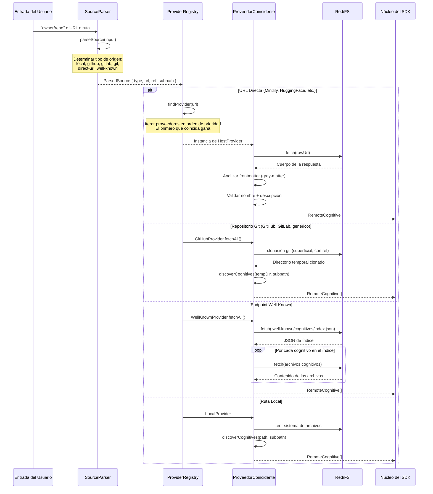
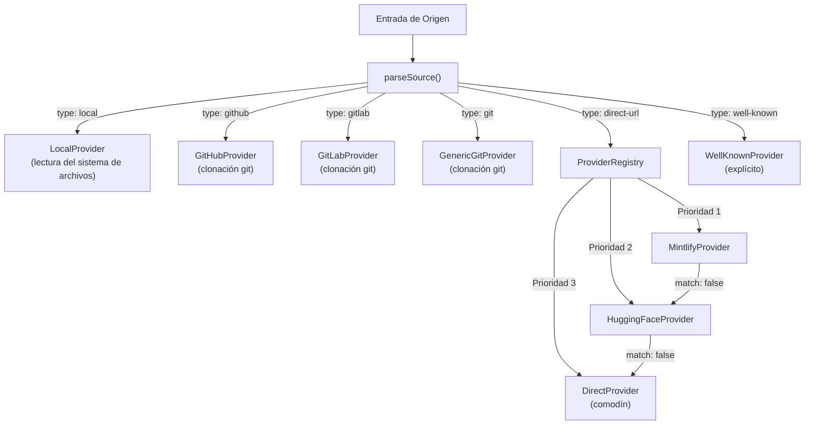
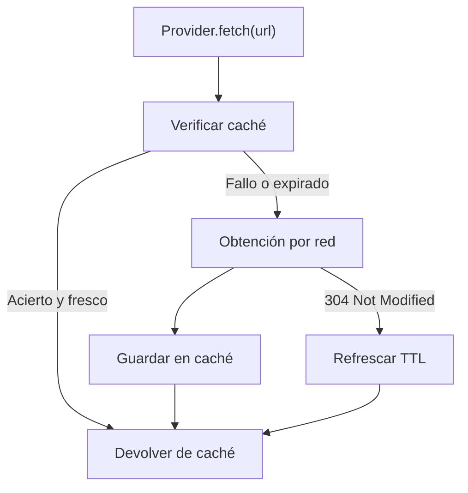
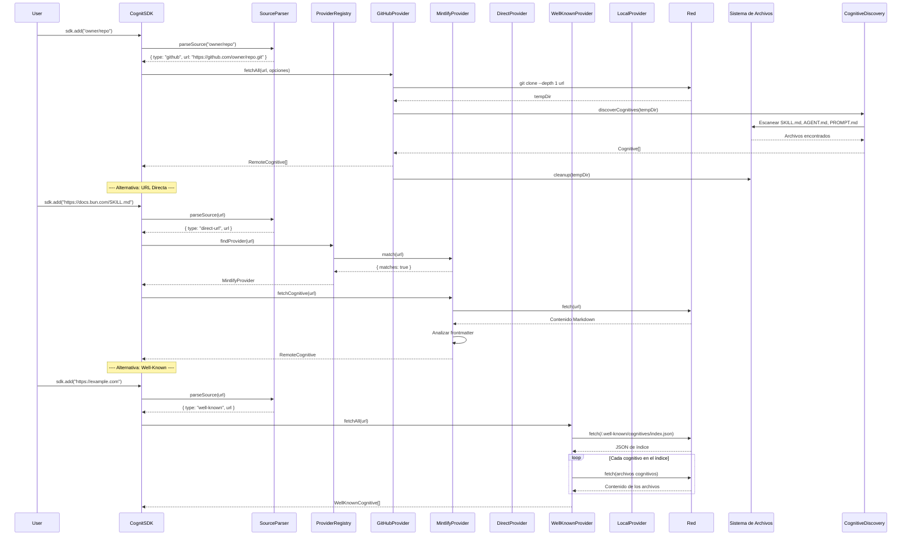

# 05 - Sistema de Proveedores

## 1. Descripción General

El sistema de proveedores es la capa de abstracción que resuelve entradas de origen arbitrarias (URLs, rutas, identificadores abreviados) en cognitivos concretos. Desacopla el SDK de cualquier plataforma de hosting específica, lo que hace que sea trivial añadir nuevas fuentes sin modificar la lógica de instalación central.

El ciclo de vida es: **analizar origen -> emparejar proveedor -> resolver/obtener -> devolver cognitivos**.

---

## 2. Interfaz HostProvider

### 2.1 Contrato Completo

```typescript
/**
 * Interfaz para proveedores de hosting de cognitivos remotos.
 *
 * Cada proveedor sabe cómo:
 * 1. Detectar si una entrada de origen le pertenece (match)
 * 2. Obtener y analizar archivos cognitivos desde el origen (fetchCognitive/fetchAll)
 * 3. Convertir URLs orientadas al usuario en URLs de contenido bruto (toRawUrl)
 * 4. Proporcionar identificadores de origen estables para bloqueo/telemetría (getSourceIdentifier)
 *
 * Los proveedores no tienen estado. Todo el estado (caché, etc.) reside en la capa de servicios del SDK.
 */
interface HostProvider {
  /** Identificador de máquina único (ej., "github", "mintlify", "huggingface") */
  readonly id: string;

  /** Nombre para mostrar legible por humanos (ej., "GitHub", "Mintlify", "HuggingFace") */
  readonly displayName: string;

  /**
   * Verificar si una cadena de origen coincide con este proveedor.
   *
   * Se llama durante la resolución del origen. El primer proveedor que devuelva
   * matches: true gana (el orden de prioridad importa).
   *
   * @param source - Cadena de origen bruta (URL, ruta, abreviatura)
   * @returns Resultado de la coincidencia con identificador de origen opcional
   */
  match(source: string): ProviderMatch;

  /**
   * Obtener un único cognitivo del origen.
   *
   * Para orígenes que apuntan a un solo archivo cognitivo (ej., una URL directa a SKILL.md),
   * esto devuelve ese cognitivo. Para orígenes con múltiples cognitivos, devuelve null y
   * el llamador debería usar fetchAll().
   *
   * @param source - La URL o ruta de origen
   * @param options - Opciones de obtención (filtro de tipo cognitivo, etc.)
   * @returns El cognitivo analizado, o null si no se encuentra o es inválido
   */
  fetchCognitive(
    source: string,
    options?: ProviderFetchOptions
  ): Promise<RemoteCognitive | null>;

  /**
   * Obtener todos los cognitivos de un origen.
   *
   * Para orígenes que contienen múltiples cognitivos (ej., un repositorio Git, un
   * índice de endpoint well-known), esto devuelve todos los cognitivos descubiertos.
   *
   * @param source - La URL o ruta de origen
   * @param options - Opciones de obtención (filtro de tipo, subruta, etc.)
   * @returns Array de cognitivos descubiertos (vacío si no se encuentra ninguno)
   */
  fetchAll(
    source: string,
    options?: ProviderFetchOptions
  ): Promise<RemoteCognitive[]>;

  /**
   * Convertir una URL orientada al usuario a una URL de contenido bruto (raw).
   *
   * Ejemplos:
   * - URL de blob de GitHub -> URL de raw.githubusercontent.com
   * - URL de blob de HuggingFace -> URL raw
   * - URL de Mintlify -> la misma (ya es raw)
   *
   * @param url - La URL orientada al usuario
   * @returns La URL de contenido bruto
   */
  toRawUrl(url: string): string;

  /**
   * Obtener un identificador de origen estable para el archivo de bloqueo y telemetría.
   *
   * Debe ser determinista: la misma entrada siempre produce la misma salida.
   * Se utiliza como clave para agrupar cognitivos del mismo origen.
   *
   * @param source - La URL o ruta de origen
   * @returns Identificador estable (ej., "owner/repo", "mintlify/com", "wellknown/example.com")
   */
  getSourceIdentifier(source: string): string;
}
```

### 2.2 Tipos de Soporte

```typescript
/** Resultado de un intento de coincidencia de proveedor. */
interface ProviderMatch {
  /** Si este proveedor puede manejar el origen */
  matches: boolean;
  /** Identificador de origen precalculado (optimización para evitar re-analizar) */
  sourceIdentifier?: string;
}

/** Opciones pasadas a los métodos de obtención (fetch). */
interface ProviderFetchOptions {
  /** Filtrar por tipo de cognitivo */
  cognitiveType?: CognitiveType;
  /** Subruta dentro del origen (ej., "skills/react-best-practices") */
  subpath?: string;
  /** Referencia de Git (rama, etiqueta, commit) */
  ref?: string;
  /** Filtro de nombre de cognitivo específico */
  nameFilter?: string;
  /** Tiempo de espera en milisegundos */
  timeout?: number;
  /** Señal para cancelación */
  signal?: AbortSignal;
}

/** Un cognitivo obtenido de un origen remoto. */
interface RemoteCognitive {
  /** Nombre para mostrar (del frontmatter) */
  name: string;
  /** Descripción (del frontmatter) */
  description: string;
  /** Contenido markdown completo incluyendo frontmatter */
  content: string;
  /** Nombre del directorio para la instalación */
  installName: string;
  /** URL de origen original */
  sourceUrl: string;
  /** Proveedor que obtuvo este cognitivo */
  providerId: string;
  /** Identificador de origen estable */
  sourceIdentifier: string;
  /** Metadatos del frontmatter */
  metadata?: Record<string, unknown>;
  /** Tipo de cognitivo detectado */
  cognitiveType?: CognitiveType;
  /** Archivos adicionales (para cognitivos multi-archivo) */
  files?: Map<string, string>;
}
```

---

## 3. Ciclo de Vida del Proveedor



---

## 4. Proveedores Integrados

### 4.1 GitHubProvider

**Propósito:** Maneja los repositorios de GitHub, el tipo de origen más común.

```typescript
class GitHubProvider implements HostProvider {
  readonly id = 'github';
  readonly displayName = 'GitHub';

  /**
   * Coincidencias:
   * - "owner/repo"                    (abreviatura)
   * - "owner/repo/path/to/skill"      (abreviatura con subruta)
   * - "owner/repo@skill-name"         (abreviatura con filtro de nombre)
   * - "https://github.com/owner/repo" (URL completa)
   * - "https://github.com/owner/repo/tree/branch"
   * - "https://github.com/owner/repo/tree/branch/path"
   * - "https://github.com/owner/repo.git" (URL git)
   */
  match(source: string): ProviderMatch;

  /**
   * Clona el repositorio (superficial), descubre los cognitivos
   * y devuelve los que coinciden.
   *
   * Estrategia de clonación:
   * - Clonación superficial (depth=1) para mayor velocidad
   * - Si se especifica ref, clona esa referencia específica
   * - Si se especifica subpath, solo descubre dentro de esa ruta
   * - Limpia el directorio temporal después de la operación
   */
  async fetchAll(source: string, options?: ProviderFetchOptions): Promise<RemoteCognitive[]>;

  /**
   * Para URLs de GitHub de un solo archivo (URLs de blob que terminan en SKILL.md),
   * los obtiene a través de raw.githubusercontent.com sin clonar.
   */
  async fetchCognitive(source: string, options?: ProviderFetchOptions): Promise<RemoteCognitive | null>;

  /**
   * Convierte las URLs de GitHub a URLs de contenido bruto (raw):
   * github.com/o/r/blob/main/SKILL.md -> raw.githubusercontent.com/o/r/main/SKILL.md
   */
  toRawUrl(url: string): string;

  /**
   * Devuelve "owner/repo" para el identificador de origen.
   */
  getSourceIdentifier(source: string): string;
}
```

**Patrones de Análisis de Origen:**

| Entrada | Analizado como |
|---|---|
| `owner/repo` | `{ url: "https://github.com/owner/repo.git" }` |
| `owner/repo/skills/react` | `{ url: "https://github.com/owner/repo.git", subpath: "skills/react" }` |
| `owner/repo@skill-name` | `{ url: "https://github.com/owner/repo.git", nameFilter: "skill-name" }` |
| `https://github.com/o/r` | `{ url: "https://github.com/o/r.git" }` |
| `https://github.com/o/r/tree/main` | `{ url: "https://github.com/o/r.git", ref: "main" }` |
| `https://github.com/o/r/tree/main/skills` | `{ url: "https://github.com/o/r.git", ref: "main", subpath: "skills" }` |

### 4.2 LocalProvider

**Propósito:** Maneja las rutas del sistema de archivos local para desarrollo y pruebas.

```typescript
class LocalProvider implements HostProvider {
  readonly id = 'local';
  readonly displayName = 'Local';

  /**
   * Coincidencias:
   * - Rutas absolutas: "/Users/bob/skills"
   * - Rutas relativas: "./my-skills", "../shared-skills"
   * - Directorio actual: "."
   * - Rutas de Windows: "C:\Users\bob\skills"
   */
  match(source: string): ProviderMatch;

  /**
   * Descubre los cognitivos del sistema de archivos local.
   * No se necesita clonación; lee directamente de la ruta.
   */
  async fetchAll(source: string, options?: ProviderFetchOptions): Promise<RemoteCognitive[]>;

  /**
   * Leer un único archivo cognitivo del sistema de archivos.
   */
  async fetchCognitive(source: string, options?: ProviderFetchOptions): Promise<RemoteCognitive | null>;

  /** Las rutas locales ya son "raw" */
  toRawUrl(url: string): string;

  /** Devuelve la ruta absoluta resuelta */
  getSourceIdentifier(source: string): string;
}
```

**Resolución de Rutas:**

| Entrada | Ruta Resuelta |
|---|---|
| `/Users/bob/skills` | `/Users/bob/skills` |
| `./my-skills` | `{cwd}/my-skills` |
| `../shared` | `{cwd}/../shared` (resuelta) |
| `.` | `{cwd}` |
| `C:\Users\bob` | `C:\Users\bob` |

### 4.3 RegistryProvider (Futuro)

**Propósito:** Obtener cognitivos de una API de registro personalizada (ej., el registro interno de una empresa).

```typescript
class RegistryProvider implements HostProvider {
  readonly id = 'registry';
  readonly displayName = 'Registry';

  constructor(private config: RegistryConfig) {}

  /**
   * Coincidencias:
   * - "registry:package-name"
   * - "registry:@scope/package-name"
   * - URLs de registro personalizadas configuradas en .cognitrc
   */
  match(source: string): ProviderMatch;

  /**
   * Obtiene los metadatos y archivos del cognitivo de la API del registro.
   *
   * Contrato de la API (propuesta):
   *
   * GET /api/v1/cognitives/:name
   * Respuesta: {
   *   name: string,
   *   version: string,
   *   description: string,
   *   cognitiveType: CognitiveType,
   *   files: Record<string, string>,
   *   metadata: Record<string, unknown>
   * }
   *
   * GET /api/v1/cognitives?q=search-term&type=skill
   * Respuesta: {
   *   results: Array<{
   *     name: string,
   *     description: string,
   *     version: string,
   *     downloads: number,
   *     author: string
   *   }>
   * }
   */
  async fetchCognitive(source: string, options?: ProviderFetchOptions): Promise<RemoteCognitive | null>;
  async fetchAll(source: string, options?: ProviderFetchOptions): Promise<RemoteCognitive[]>;

  toRawUrl(url: string): string;
  getSourceIdentifier(source: string): string;
}

interface RegistryConfig {
  /** URL base de la API del registro */
  url: string;
  /** Token de autenticación (opcional) */
  token?: string;
  /** Nombre del registro para mostrar */
  name?: string;
}
```

### 4.4 WellKnownProvider

**Propósito:** Descubre cognitivos a través de URIs well-known RFC 8615 en `/.well-known/cognitives/`.

```typescript
class WellKnownProvider implements HostProvider {
  readonly id = 'well-known';
  readonly displayName = 'Well-Known Cognitives';

  /**
   * Coincide con cualquier URL HTTP(S) que NO sea un host git conocido
   * y que NO termine con un nombre de archivo cognitivo.
   *
   * Hosts excluidos: github.com, gitlab.com, huggingface.co
   */
  match(url: string): ProviderMatch;

  /**
   * Flujo de descubrimiento:
   * 1. Obtener {baseUrl}/.well-known/cognitives/index.json
   * 2. Respaldo: {baseUrl}/.well-known/skills/index.json (legacy)
   * 3. Analizar el índice para obtener las entradas de los cognitivos
   * 4. Obtener los archivos de cada cognitivo
   *
   * Formato del JSON del índice:
   * {
   *   "cognitives": [
   *     {
   *       "name": "mi-skill",
   *       "description": "Hace algo útil",
   *       "files": ["SKILL.md", "helpers.md"]
   *     }
   *   ]
   * }
   */
  async fetchAll(source: string, options?: ProviderFetchOptions): Promise<WellKnownCognitive[]>;

  /**
   * Obtiene un cognitivo específico por nombre del índice.
   * Si la URL especifica una ruta de cognitivo, utiliza esa.
   * Si el índice tiene un solo cognitivo, devuelve ese.
   * De lo contrario, devuelve null (el llamador debería usar fetchAll).
   */
  async fetchCognitive(source: string, options?: ProviderFetchOptions): Promise<WellKnownCognitive | null>;

  /** Obtiene el índice y lo devuelve, o null si no se encuentra */
  async fetchIndex(baseUrl: string): Promise<{ index: WellKnownIndex; resolvedBaseUrl: string } | null>;

  toRawUrl(url: string): string;

  /** Devuelve "wellknown/{hostname}" o "{sld}/{tld}" */
  getSourceIdentifier(url: string): string;
}

interface WellKnownCognitive extends RemoteCognitive {
  /** Todos los archivos en el cognitivo, indexados por ruta relativa */
  files: Map<string, string>;
  /** La entrada del index.json */
  indexEntry: WellKnownCognitiveEntry;
}
```

**Estrategia de Resolución de URLs:**

| URL de Entrada | Endpoints Probados (en orden) |
|---|---|
| `https://example.com` | `https://example.com/.well-known/cognitives/index.json` |
| `https://example.com/docs` | `https://example.com/docs/.well-known/cognitives/index.json` seguido de `https://example.com/.well-known/cognitives/index.json` |
| `https://example.com/.well-known/cognitives/mi-skill` | Obtención directa del cognitivo |

### 4.5 DirectProvider

**Propósito:** Proveedor comodín para URLs directas que apuntan a archivos cognitivos.

```typescript
class DirectProvider implements HostProvider {
  readonly id = 'direct-url';
  readonly displayName = 'Direct URL';

  /**
   * Coincide con cualquier URL HTTP(S) que termine en un nombre de archivo cognitivo conocido
   * (SKILL.md, AGENT.md, PROMPT.md -- insensible a mayúsculas).
   *
   * Se registra al FINAL para que los proveedores específicos de host tengan prioridad.
   */
  match(url: string): ProviderMatch;

  /**
   * Obtiene la URL directamente, analiza el frontmatter.
   * Maneja transformaciones de URL:
   * - URLs de blob de GitHub -> raw.githubusercontent.com
   * - URLs de blob de GitLab -> URLs raw
   * - Otras URLs -> tal cual
   */
  async fetchCognitive(source: string, options?: ProviderFetchOptions): Promise<RemoteCognitive | null>;

  /** fetchAll devuelve un array de un solo elemento si fetchCognitive tiene éxito */
  async fetchAll(source: string, options?: ProviderFetchOptions): Promise<RemoteCognitive[]>;

  toRawUrl(url: string): string;

  /** Devuelve "github/owner/repo", "gitlab/owner/repo", o el nombre de host */
  getSourceIdentifier(url: string): string;
}
```

### 4.6 MintlifyProvider

**Propósito:** Maneja los sitios de documentación alojados en Mintlify con archivos cognitivos.

```typescript
class MintlifyProvider implements HostProvider {
  readonly id = 'mintlify';
  readonly displayName = 'Mintlify';

  /**
   * Coincide con las URLs HTTP(S) que terminan en un nombre de archivo cognitivo,
   * EXCLUYENDO github.com, gitlab.com y huggingface.co.
   *
   * La validación real de Mintlify ocurre durante la obtención:
   * el frontmatter debe contener `metadata.mintlify-proj`.
   * Si está ausente, devuelve null y el DirectProvider puede manejarlo en su lugar.
   */
  match(url: string): ProviderMatch;

  /**
   * Obtiene la URL, valida el frontmatter específico de Mintlify.
   * Utiliza `metadata.mintlify-proj` como el nombre de instalación.
   */
  async fetchCognitive(url: string, options?: ProviderFetchOptions): Promise<RemoteCognitive | null>;

  async fetchAll(url: string, options?: ProviderFetchOptions): Promise<RemoteCognitive[]>;

  /** Las URLs de Mintlify ya son URLs directas de contenido */
  toRawUrl(url: string): string;

  /** Devuelve "mintlify/com" (agrupa todas las skills de Mintlify juntas) */
  getSourceIdentifier(url: string): string;
}
```

### 4.7 HuggingFaceProvider

**Propósito:** Maneja los repositorios de HuggingFace Spaces.

```typescript
class HuggingFaceProvider implements HostProvider {
  readonly id = 'huggingface';
  readonly displayName = 'HuggingFace';

  /**
   * Coincide con las URLs de huggingface.co con la ruta /spaces/
   * que terminan en un nombre de archivo cognitivo.
   */
  match(url: string): ProviderMatch;

  /**
   * Convierte las URLs de blob en URLs raw, obtiene el contenido,
   * analiza el frontmatter. El nombre de instalación proviene de
   * `metadata.install-name` o del nombre del repositorio.
   */
  async fetchCognitive(url: string, options?: ProviderFetchOptions): Promise<RemoteCognitive | null>;

  async fetchAll(url: string, options?: ProviderFetchOptions): Promise<RemoteCognitive[]>;

  /** /blob/ -> /raw/ */
  toRawUrl(url: string): string;

  /** Devuelve "huggingface/owner/repo" */
  getSourceIdentifier(url: string): string;
}
```

---

## 5. Registro de Proveedores

### 5.1 Registro y Prioridad

Los proveedores se registran en un orden específico. El primer proveedor cuyo `match()` devuelva `true` gana.

```typescript
class ProviderRegistryImpl implements ProviderRegistry {
  private providers: HostProvider[] = [];

  register(provider: HostProvider): void {
    if (this.providers.some(p => p.id === provider.id)) {
      throw new Error(`El proveedor con id "${provider.id}" ya está registrado`);
    }
    this.providers.push(provider);
  }

  findProvider(source: string): HostProvider | null {
    for (const provider of this.providers) {
      const match = provider.match(source);
      if (match.matches) return provider;
    }
    return null;
  }

  getProviders(): HostProvider[] {
    return [...this.providers];
  }
}
```

### 5.2 Orden de Registro por Defecto

```typescript
// Orden de prioridad (el primero que coincida gana):
registry.register(mintlifyProvider);      // 1. Mintlify (host específico)
registry.register(huggingFaceProvider);   // 2. HuggingFace (host específico)
registry.register(directUrlProvider);     // 3. URL Directa (comodín para URLs **/SKILL.md)
// Nota: el wellKnownProvider NO se registra automáticamente.
// Se utiliza explícitamente cuando parseSource devuelve type: "well-known".
// Nota: GitHubProvider y LocalProvider son manejados por el analizador de origen,
// no por el registro de proveedores (necesitan clonación/operaciones del sistema de archivos).
```

### 5.3 Diagrama de Prioridad de Registro



---

## 6. Análisis del Origen (Source Parsing)

### 6.1 Tipo ParsedSource

```typescript
interface ParsedSource {
  type: 'github' | 'gitlab' | 'git' | 'local' | 'direct-url' | 'well-known';
  url: string;
  subpath?: string;
  localPath?: string;
  ref?: string;
  nameFilter?: string;
  cognitiveFilter?: CognitiveType;
}
```

### 6.2 Reglas de Resolución (en orden)

```
1. isLocalPath(input)?           -> type: "local"
   (absoluta, ./, ../, ., .., C:\)

2. isDirectCognitiveUrl(input)?  -> type: "direct-url"
   (http(s) + termina en SKILL.md/AGENT.md/PROMPT.md, no URLs de repos github.com/gitlab.com)

3. githubTreeWithPath coincidencia? -> type: "github" (con ref + subpath)
   github.com/owner/repo/tree/branch/path

4. githubTree coincidencia?         -> type: "github" (con ref)
   github.com/owner/repo/tree/branch

5. githubRepo coincidencia?         -> type: "github"
   github.com/owner/repo

6. gitlabTreeWithPath coincidencia? -> type: "gitlab" (con ref + subpath)
   gitlab.com/group/repo/-/tree/branch/path

7. gitlabTree coincidencia?         -> type: "gitlab" (con ref)
   gitlab.com/group/repo/-/tree/branch

8. gitlabRepo coincidencia?         -> type: "gitlab"
   gitlab.com/group/repo

9. owner/repo@name coincidencia?    -> type: "github" (con nameFilter)
   (sin prefijo :, sin prefijo ./)

10. owner/repo(/path)? coincidencia? -> type: "github" (abreviatura)
    (sin prefijo :, sin prefijo ./)

11. isWellKnownUrl(input)?       -> type: "well-known"
    (http(s), no hosts git, no archivo cognitivo, no .git)

12. respaldo                     -> type: "git" (URL git genérica)
```

### 6.3 Ejemplos

| Entrada | Tipo Analizado | URL | Extras |
|---|---|---|---|
| `vercel-labs/skills` | `github` | `https://github.com/vercel-labs/skills.git` | |
| `vercel-labs/skills/react` | `github` | `https://github.com/vercel-labs/skills.git` | subpath: `react` |
| `vercel-labs/skills@find-skills` | `github` | `https://github.com/vercel-labs/skills.git` | nameFilter: `find-skills` |
| `./mis-skills` | `local` | `/ruta/abs/mis-skills` | localPath establecido |
| `https://docs.bun.com/docs/SKILL.md` | `direct-url` | (la misma) | |
| `https://example.com` | `well-known` | (la misma) | |
| `git@github.com:owner/repo.git` | `git` | (la misma) | |

---

## 7. Estrategia de Almacenamiento en Caché

### 7.1 Caché de Clonación

Para los proveedores basados en Git, evita volver a clonar el mismo repo:

```typescript
interface CloneCache {
  /** Ubicación del directorio de caché */
  dir: string;  // ej., ~/.cache/cognit/clones/

  /**
   * Obtener o clonar un repositorio.
   * Clave: URL git normalizada + ref.
   * TTL: configurable (por defecto: 1 hora para CLI, 0 para SDK)
   */
  getOrClone(url: string, ref?: string): Promise<string>;

  /** Invalidar una entrada de caché específica */
  invalidate(url: string, ref?: string): Promise<void>;

  /** Limpiar todos los clones en caché */
  clear(): Promise<void>;
}
```

**Clave de caché:** SHA256 de `{url_normalizada}#{ref || 'HEAD'}`
**Ubicación de caché:** `~/.cache/cognit/clones/{hash}/`
**TTL:** Configurable por operación (ej., `add` usa 0 = siempre fresco; `check` usa 1h)

### 7.2 Caché de Obtención (Fetch)

Para los proveedores basados en HTTP, guarda las respuestas de obtención:

```typescript
interface FetchCache {
  /** Ubicación de la caché */
  dir: string;  // ej., ~/.cache/cognit/fetch/

  /**
   * Obtener o realizar un fetch de una URL.
   * Utiliza ETag/Last-Modified para solicitudes condicionales cuando sea posible.
   */
  getOrFetch(url: string, options?: { ttl?: number }): Promise<Response>;

  /** Limpiar la caché de obtención */
  clear(): Promise<void>;
}
```

**Ubicación de caché:** `~/.cache/cognit/fetch/{hash}.json` (contenido + cabeceras)
**TTL:** 15 minutos por defecto para well-known/registro, 0 para URLs directas

### 7.3 Flujo de Caché



---

## 8. Manejo de Errores

### 8.1 Tipos de Error por Proveedor

```typescript
/** Error base para todos los fallos del proveedor */
class ProviderError extends Error {
  constructor(
    message: string,
    readonly providerId: string,
    readonly source: string,
    readonly cause?: Error
  ) {
    super(message);
    this.name = 'ProviderError';
  }
}

/** La clonación de Git falló (red, autenticación, repo no encontrado) */
class GitCloneError extends ProviderError {
  constructor(source: string, cause?: Error) {
    super(`Fallo al clonar el repositorio: ${source}`, 'github', source, cause);
    this.name = 'GitCloneError';
  }
}

/** La obtención HTTP falló */
class FetchError extends ProviderError {
  constructor(
    source: string,
    providerId: string,
    readonly status?: number,
    cause?: Error
  ) {
    super(`Fallo al obtener: ${source} (estado: ${status})`, providerId, source, cause);
    this.name = 'FetchError';
  }
}

/** El archivo cognitivo tiene un frontmatter inválido o inexistente */
class InvalidCognitiveError extends ProviderError {
  constructor(source: string, providerId: string, reason: string) {
    super(`Cognitivo inválido en ${source}: ${reason}`, providerId, source);
    this.name = 'InvalidCognitiveError';
  }
}

/** No se encontraron cognitivos en el origen */
class NoCognitivesFoundError extends ProviderError {
  constructor(source: string, providerId: string) {
    super(`No se encontraron cognitivos en: ${source}`, providerId, source);
    this.name = 'NoCognitivesFoundError';
  }
}
```

### 8.2 Manejo de Errores por Proveedor

| Proveedor | Errores Posibles | Recuperación |
|---|---|---|
| **GitHub** | Tiempo de espera de clonación, requiere autenticación, repo no encontrado, rama no encontrada | Reintentar una vez, luego fallar con mensaje |
| **Local** | Ruta no encontrada, permiso denegado | Fallar inmediatamente con la ruta clara |
| **Mintlify** | Tiempo de espera de obtención, frontmatter inválido, falta mintlify-proj | Devolver null (pasar al DirectProvider) |
| **HuggingFace** | Tiempo de espera de obtención, no es una URL de Spaces, frontmatter inválido | Devolver null |
| **WellKnown** | No hay index.json, formato de índice inválido, fallo en la obtención de archivos individuales | Probar ruta heredada (legacy), omitir fallos individuales |
| **Direct** | Tiempo de espera de obtención, frontmatter inválido | Devolver null |
| **Registry** | Fallo de autenticación, error de la API, paquete no encontrado | Fallar con error específico |

---

## 9. Creación de Proveedores Personalizados

### 9.1 Punto de Extensión

```typescript
import { CognitSDK } from '@synapsync/cognit-sdk';

// Crear un proveedor personalizado
const miProveedorEmpresa: HostProvider = {
  id: 'mi-empresa',
  displayName: 'Registro de Mi Empresa',

  match(source: string): ProviderMatch {
    if (source.startsWith('company://')) {
      return { matches: true, sourceIdentifier: `company/${source.slice(10)}` };
    }
    return { matches: false };
  },

  async fetchCognitive(source: string): Promise<RemoteCognitive | null> {
    const name = source.replace('company://', '');
    const response = await fetch(`https://api-interna.miempresa.com/cognitives/${name}`);
    if (!response.ok) return null;
    const data = await response.json();
    return {
      name: data.name,
      description: data.description,
      content: data.content,
      installName: data.name,
      sourceUrl: source,
      providerId: 'mi-empresa',
      sourceIdentifier: `company/${name}`,
      cognitiveType: data.type,
    };
  },

  async fetchAll(source: string): Promise<RemoteCognitive[]> {
    const cognitive = await this.fetchCognitive(source);
    return cognitive ? [cognitive] : [];
  },

  toRawUrl(url: string): string { return url; },
  getSourceIdentifier(source: string): string { return `company/${source.replace('company://', '')}`; },
};

// Registrarlo
const sdk = new CognitSDK();
sdk.providers.register(miProveedorEmpresa);

// Ahora "company://mi-skill" funciona como origen
await sdk.operations.add('company://mi-skill', { agent: ['claude-code'] });
```

### 9.2 Convención de Paquetes de Plugins de Proveedores

```typescript
// @mi-empresa/cognit-provider-internal
export function createInternalProvider(config: { apiUrl: string; token: string }): HostProvider {
  return {
    id: 'internal',
    displayName: 'Registro Interno',
    // ... implementación
  };
}
```

---

## 10. Flujo Completo de Resolución del Proveedor



---

## 11. Sistema de Proveedores en la Arquitectura del SDK

```typescript
/** Sistema de proveedores expuesto por el SDK */
interface ProviderSystemService {
  /** Registrar un proveedor personalizado (prepend = añadir antes de los integrados) */
  register(provider: HostProvider, options?: { prepend?: boolean }): void;

  /** Buscar el proveedor para un origen */
  findProvider(source: string): HostProvider | null;

  /** Obtener todos los proveedores registrados */
  getProviders(): HostProvider[];

  /** Analizar una cadena de origen bruta en una forma estructurada */
  parseSource(input: string): ParsedSource;

  /** Resolver un origen en cognitivos (combina análisis + provider.fetch) */
  resolve(
    source: string,
    options?: ProviderFetchOptions
  ): Promise<ResolvedSource>;
}

/** Resultado de resolver un origen */
interface ResolvedSource {
  /** El proveedor coincidente */
  provider: HostProvider;
  /** El origen analizado */
  parsed: ParsedSource;
  /** Cognitivos descubiertos */
  cognitives: RemoteCognitive[];
  /** Identificador de origen para bloqueo/telemetría */
  sourceIdentifier: string;
  /** Directorio temporal a limpiar (si es clonación git) */
  tempDir?: string;
}
```
