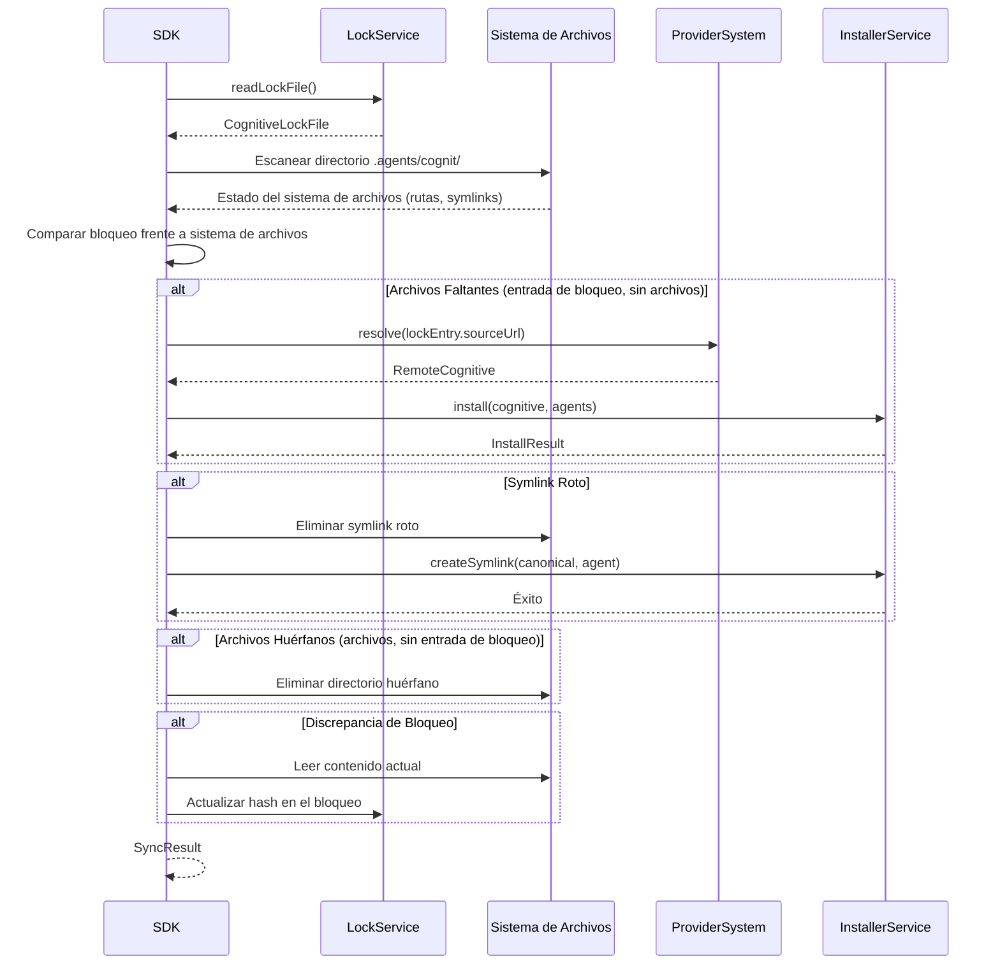
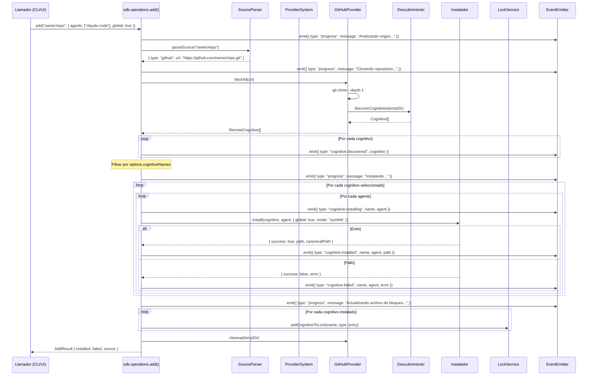
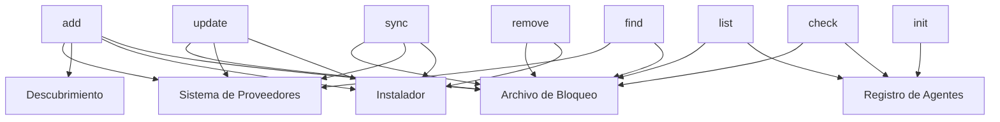

# 06 - Operaciones del SDK

## 1. Descripción General

Las operaciones son la capa de acciones públicas del SDK. Cada operación es una función componible y agnóstica a la interfaz que utiliza los servicios del SDK (proveedores, agentes, instalador, bloqueo, descubrimiento) para realizar una acción del usuario. Las operaciones devuelven datos estructurados y emiten eventos; nunca imprimen en la consola ni solicitan información al usuario directamente.

Todas las operaciones siguen un patrón consistente:
- Aceptan una interfaz de opciones.
- Devuelven una interfaz de resultado tipada.
- Emiten eventos para el seguimiento del progreso.
- Lanzan errores tipados para los casos de fallo.
- Son totalmente independientes de las preocupaciones de CLI/UI.

---

## 2. Arquitectura de las Operaciones

```typescript
/**
 * Todas las operaciones reciben el contexto del SDK, que proporciona acceso a los servicios.
 * Este se inyecta a través de la instancia del SDK, no se importa globalmente.
 */
interface OperationContext {
  agents: AgentRegistryService;
  providers: ProviderSystemService;
  installer: InstallerService;
  lock: LockService;
  discovery: DiscoveryService;
  cache: CacheService;
  events: EventEmitter;
}

/**
 * Tipo de resultado base para todas las operaciones.
 * Cada operación extiende esto con campos específicos.
 */
interface OperationResult {
  /** Si la operación tuvo éxito en general */
  success: boolean;
  /** Mensaje de resumen legible por humanos */
  message: string;
}

/**
 * Tipos de eventos emitidos por las operaciones.
 * Los consumidores de UI escuchan estos eventos para mostrar el progreso.
 */
type OperationEvent =
  | { type: 'progress'; message: string; phase: string }
  | { type: 'warning'; message: string }
  | { type: 'cognitive:discovered'; cognitive: RemoteCognitive }
  | { type: 'cognitive:installing'; name: string; agent: string }
  | { type: 'cognitive:installed'; name: string; agent: string; path: string }
  | { type: 'cognitive:failed'; name: string; agent: string; error: string }
  | { type: 'cognitive:removed'; name: string; agent: string }
  | { type: 'cognitive:updated'; name: string; oldHash: string; newHash: string }
  | { type: 'sync:drift'; name: string; issue: string }
  | { type: 'sync:fixed'; name: string; action: string };
```

---

## 3. Operaciones

### 3.1 add

**Propósito:** Obtener cognitivos de un origen e instalarlos en los agentes de destino.

#### Entrada

```typescript
interface AddOptions {
  /** Cadena de origen (owner/repo, URL, ruta) */
  source: string;
  /** Agentes de destino (si está vacío, el SDK devuelve los agentes disponibles para que el llamador elija) */
  agents?: AgentType[];
  /** Instalar globalmente (dir personal) frente a localmente (dir del proyecto) */
  global?: boolean;
  /** Método de instalación */
  mode?: 'symlink' | 'copy';
  /** Filtrar cognitivos específicos por nombre */
  cognitiveNames?: string[];
  /** Filtrar por tipo de cognitivo */
  cognitiveType?: CognitiveType;
  /** Subruta dentro del origen */
  subpath?: string;
  /** Referencia de Git (rama, etiqueta, commit) */
  ref?: string;
  /** Omitir confirmación (para uso no interactivo) */
  confirmed?: boolean;
  /** Incluir cognitivos internos/ocultos */
  includeInternal?: boolean;
  /** Escaneo de profundidad completa (no solo directorios prioritarios) */
  fullDepth?: boolean;
}
```

#### Salida

```typescript
interface AddResult extends OperationResult {
  /** Cognitivos instalados con éxito */
  installed: InstalledCognitiveInfo[];
  /** Instalaciones fallidas */
  failed: FailedInstallInfo[];
  /** Información del origen */
  source: {
    type: string;
    identifier: string;
    url: string;
    provider: string;
  };
  /** Cognitivos que estaban disponibles pero no se seleccionaron (para flujos interactivos) */
  available?: CognitiveInfo[];
}

interface InstalledCognitiveInfo {
  name: string;
  cognitiveType: CognitiveType;
  /** Resultados de instalación por agente */
  agents: Array<{
    agent: AgentType;
    path: string;
    canonicalPath?: string;
    mode: 'symlink' | 'copy';
    symlinkFailed?: boolean;
  }>;
}

interface FailedInstallInfo {
  name: string;
  agent: AgentType;
  error: string;
}

interface CognitiveInfo {
  name: string;
  description: string;
  cognitiveType: CognitiveType;
  installName: string;
}
```

#### Algoritmo

```
1. ANALIZAR cadena de origen mediante SourceParser
   -> ParsedSource { type, url, ref, subpath, nameFilter }

2. RESOLVER origen mediante el sistema de Proveedores
   SI type == "local":
     - Validar que la ruta existe
     - sourceDir = localPath
   SI type == "github" | "gitlab" | "git":
     - Clonar repositorio (superficial, con ref si se especifica)
     - sourceDir = tempDir
   SI type == "direct-url":
     - Buscar proveedor coincidente en el registro
     - Obtener cognitivo vía proveedor.fetchCognitive(url)
     - IR AL paso 5 (omitir descubrimiento)
   SI type == "well-known":
     - Obtener todos los cognitivos vía WellKnownProvider.fetchAll(url)
     - IR AL paso 4 (omitir descubrimiento en sistema de archivos)

3. DESCUBRIR cognitivos en el directorio de origen
   - Escanear archivos SKILL.md, AGENT.md, PROMPT.md
   - Aplicar filtro de subruta
   - Aplicar filtro de tipo
   - Analizar frontmatter para nombre + descripción
   -> Cognitive[]

4. FILTRAR cognitivos
   - Aplicar filtro cognitiveNames (si se especifica)
   - Aplicar nameFilter de la sintaxis @nombre
   - Aplicar filtro de cognitiveType
   SI ningún cognitivo coincide: LANZAR NoCognitivesFoundError
   SI múltiples cognitivos Y sin filtro Y no confirmado:
     Devolver resultado con available[] establecido (el llamador debe elegir)

5. PREPARAR instalación
   PARA CADA cognitivo seleccionado:
     PARA CADA agente de destino:
       - Resolver ruta canónica: .agents/cognit/{tipo}/{nombre}/
       - Resolver ruta específica por agente: {agentDir}/{tipo}/{nombre}/
       - Verificar instalación existente (detección de sobrescritura)
   -> PreparedInstallation { items, targetAgents, paths }

6. EJECUTAR instalación
   PARA CADA cognitivo:
     - Escribir en la ubicación canónica
     PARA CADA agente:
       SI mode == "symlink" Y el agente es universal:
         - Omitir (la ruta canónica ES la ruta del agente)
       SI mode == "symlink":
         - Crear symlink: rutaAgente -> rutaCanonica
         - En caso de fallo: recurrir a copia
       SI mode == "copy":
         - Copiar archivos a la rutaAgente

7. ACTUALIZAR archivo de bloqueo
   PARA CADA cognitivo instalado con éxito:
     - Calcular/obtener hash de contenido
     - Escribir entrada de bloqueo con origen, tipo, hash, marca de tiempo

8. LIMPIEZA
   - Eliminar directorio temporal (si fue clonación git)
   -> AddResult
```

#### Eventos Emitidos

| Evento | Cuándo |
|---|---|
| `progress: "Analizando origen..."` | Paso 1 |
| `progress: "Clonando repositorio..."` | Paso 2 (git) |
| `progress: "Descubriendo cognitivos..."` | Paso 3 |
| `cognitive:discovered` | Cada cognitivo encontrado |
| `progress: "Instalando..."` | Inicio del paso 6 |
| `cognitive:installing` | Antes de cada instalación de agente |
| `cognitive:installed` | Después de una instalación exitosa |
| `cognitive:failed` | Después de una instalación fallida |

#### Casos de Error

| Error | Condición |
|---|---|
| `ProviderError` | El origen no se puede resolver |
| `GitCloneError` | La clonación de Git falla |
| `NoCognitivesFoundError` | No hay cognitivos en el origen |
| `InvalidCognitiveError` | Faltan campos en el frontmatter |
| `PathTraversalError` | El nombre del cognitivo escaparía del directorio |

---

### 3.2 list

**Propósito:** Listar los cognitivos instalados desde el archivo de bloqueo y el sistema de archivos.

#### Entrada

```typescript
interface ListOptions {
  /** Ámbito del cual listar */
  scope?: 'global' | 'local' | 'all';
  /** Filtrar por tipo de cognitivo */
  cognitiveType?: CognitiveType;
  /** Filtrar por agente */
  agent?: AgentType;
  /** Incluir información detallada (rutas, hashes, etc.) */
  detailed?: boolean;
}
```

#### Salida

```typescript
interface ListResult extends OperationResult {
  /** Cognitivos instalados */
  cognitives: InstalledCognitiveEntry[];
  /** Conteo total */
  count: number;
}

interface InstalledCognitiveEntry {
  /** Nombre del cognitivo */
  name: string;
  /** Tipo de cognitivo */
  cognitiveType: CognitiveType;
  /** Información del origen desde el archivo de bloqueo */
  source: {
    identifier: string;
    type: string;
    url: string;
  };
  /** Marcas de tiempo de instalación */
  installedAt: string;
  updatedAt: string;
  /** Ruta canónica (.agents/cognit/...) */
  canonicalPath: string;
  /** Agentes para los que este cognitivo está instalado */
  agents: Array<{
    agent: AgentType;
    path: string;
    isSymlink: boolean;
    exists: boolean;
  }>;
  /** Hash de contenido para la detección de actualizaciones */
  contentHash: string;
}
```

#### Algoritmo

```
1. LEER archivo de bloqueo
   -> CognitiveLockFile { cognitives: Record<string, CognitiveLockEntry> }

2. PARA CADA cognitivo bloqueado:
   a. Resolver ruta canónica
   b. Verificar si la ruta canónica existe en el sistema de archivos
   c. PARA CADA agente instalado:
      - Resolver ruta específica por agente
      - Verificar si la ruta existe
      - Verificar si es un symlink
   d. Aplicar filtros (ámbito, tipo, agente)

3. FUSIONAR el estado del sistema de archivos con las entradas de bloqueo
   - Marcar archivos faltantes (existe entrada de bloqueo pero no los archivos)
   - Marcar archivos huérfanos (existen los archivos pero no la entrada de bloqueo)

4. ORDENAR por nombre

5. DEVOLVER ListResult
```

#### Eventos Emitidos

| Evento | Cuándo |
|---|---|
| `progress: "Leyendo archivo de bloqueo..."` | Paso 1 |
| `progress: "Escaneando sistema de archivos..."` | Paso 2 |
| `warning: "El cognitivo X está en el archivo de bloqueo pero faltan los archivos"` | Paso 3 |

---

### 3.3 remove

**Propósito:** Eliminar los cognitivos instalados de los agentes y del archivo de bloqueo.

#### Entrada

```typescript
interface RemoveOptions {
  /** Nombres de los cognitivos a eliminar */
  names: string[];
  /** Solo eliminar de agentes específicos */
  agents?: AgentType[];
  /** Eliminar instalados globalmente */
  global?: boolean;
  /** Omitir confirmación */
  confirmed?: boolean;
}
```

#### Salida

```typescript
interface RemoveResult extends OperationResult {
  /** Eliminados con éxito */
  removed: Array<{
    name: string;
    agents: Array<{
      agent: AgentType;
      path: string;
    }>;
  }>;
  /** No encontrados */
  notFound: string[];
}
```

#### Algoritmo

```
1. PARA CADA nombre en names:
   a. Buscar en el archivo de bloqueo
   b. SI no se encuentra: añadir a notFound[]
   c. SI se encuentra:
      - Determinar agentes afectados (options.agents o todos)
      - Determinar rutas a eliminar

2. SI no se confirma:
   Devolver resultado con el plan de eliminación (el llamador confirma)

3. EJECUTAR eliminación:
   PARA CADA cognitivo:
     PARA CADA agente:
       a. Eliminar symlink/directorio específico del agente
     b. Eliminar directorio canónico (.agents/cognit/{tipo}/{nombre}/)
     c. Eliminar del archivo de bloqueo

4. DEVOLVER RemoveResult
```

#### Eventos Emitidos

| Evento | Cuándo |
|---|---|
| `cognitive:removed` | Después de cada eliminación de agente |
| `progress: "Actualizando archivo de bloqueo..."` | Paso 3c |

#### Casos de Error

| Error | Condición |
|---|---|
| `CognitiveNotFoundError` | El nombre no está en el archivo de bloqueo |
| `PermissionError` | No se pueden eliminar archivos |

---

### 3.4 update

**Propósito:** Verificar y aplicar actualizaciones a los cognitivos instalados.

#### Entrada

```typescript
interface UpdateOptions {
  /** Cognitivos específicos a actualizar (vacío = todos) */
  names?: string[];
  /** Solo verificar, no aplicar */
  checkOnly?: boolean;
  /** Omitir confirmación */
  confirmed?: boolean;
}
```

#### Salida

```typescript
interface UpdateResult extends OperationResult {
  /** Cognitivos con actualizaciones disponibles */
  updates: Array<{
    name: string;
    source: string;
    currentHash: string;
    newHash: string;
    applied: boolean;
  }>;
  /** Cognitivos ya actualizados */
  upToDate: string[];
  /** Cognitivos que no se pudieron verificar */
  errors: Array<{
    name: string;
    error: string;
  }>;
}
```

#### Algoritmo

```
1. LEER archivo de bloqueo
   - Obtener todos los cognitivos bloqueados (o filtrar por nombres)

2. PARA CADA cognitivo:
   a. Obtener el hash actual de la fuente remota
      - GitHub: usar Trees API para obtener el SHA de la carpeta
      - Otros: volver a obtener y calcular el hash de contenido
   b. Comparar con el cognitiveFolderHash almacenado
   c. SI es diferente: marcar como updateAvailable (actualización disponible)

3. SI checkOnly: devolver los resultados sin aplicar

4. SI no se confirma:
   Devolver resultado con las actualizaciones disponibles (el llamador confirma)

5. APLICAR actualizaciones:
   PARA CADA cognitivo con actualización:
     a. Volver a obtener el cognitivo de la fuente original
     b. Reinstalar (mismos agentes, mismo modo)
     c. Actualizar el archivo de bloqueo con el nuevo hash y marca de tiempo

6. DEVOLVER UpdateResult
```

#### Eventos Emitidos

| Evento | Cuándo |
|---|---|
| `progress: "Verificando {nombre}..."` | Paso 2 |
| `cognitive:updated` | Paso 5 por cognitivo |

---

### 3.5 sync

**Propósito:** Reconciliar el archivo de bloqueo con el estado real del sistema de archivos, corrigiendo desviaciones.

#### Entrada

```typescript
interface SyncOptions {
  /** Ámbito a sincronizar */
  scope?: 'global' | 'local' | 'all';
  /** Solo informar desviaciones, no corregir */
  dryRun?: boolean;
  /** Omitir confirmación */
  confirmed?: boolean;
}
```

#### Salida

```typescript
interface SyncResult extends OperationResult {
  /** Problemas encontrados y su resolución */
  issues: SyncIssue[];
  /** Número de problemas corregidos */
  fixed: number;
  /** Número de problemas restantes (dry-run o no corregibles) */
  remaining: number;
}

interface SyncIssue {
  /** El cognitivo afectado */
  name: string;
  /** Tipo de desviación */
  type: 'missing_files' | 'broken_symlink' | 'orphaned_files' | 'lock_mismatch' | 'missing_lock';
  /** Descripción legible por humanos */
  description: string;
  /** La acción tomada (o que se tomaría en dry-run) */
  action: string;
  /** Si fue corregido */
  fixed: boolean;
}
```

#### Algoritmo

```
1. LEER archivo de bloqueo
2. ESCANEAR sistema de archivos (directorio canónico .agents/cognit/)

3. DETECTAR desviaciones:
   a. Existe la entrada de bloqueo, faltan los archivos:
      type: "missing_files"
      action: "Volver a obtener de la fuente y reinstalar"
   b. Existe el symlink pero falta el destino:
      type: "broken_symlink"
      action: "Eliminar symlink roto y reinstalar"
   c. Existen los archivos pero no hay entrada de bloqueo:
      type: "orphaned_files"
      action: "Eliminar archivos huérfanos o añadir al bloqueo"
   d. El hash de bloqueo no coincide con el contenido del archivo:
      type: "lock_mismatch"
      action: "Actualizar hash de bloqueo a partir de los archivos actuales"
   e. Existe la ruta específica del agente pero no hay ruta canónica:
      type: "missing_lock"
      action: "Crear entrada de bloqueo a partir del estado del sistema de archivos"

4. SI dryRun: devolver los problemas sin corregirlos

5. SI no se confirma:
   Devolver los problemas (el llamador confirma)

6. CORREGIR desviaciones:
   PARA CADA problema:
     CASO "missing_files": volver a obtener de la fuente de bloqueo y reinstalar
     CASO "broken_symlink": volver a crear el symlink
     CASO "orphaned_files": eliminar archivos
     CASO "lock_mismatch": recalcular hash y actualizar bloqueo
     CASO "missing_lock": crear entrada de bloqueo

7. DEVOLVER SyncResult
```

#### Diagrama del Flujo de Sincronización



#### Eventos Emitidos

| Evento | Cuándo |
|---|---|
| `sync:drift` | Cada desviación detectada |
| `sync:fixed` | Cada desviación resuelta |
| `progress: "Escaneando..."` | Paso 2 |
| `progress: "Corrigiendo desviaciones..."` | Paso 6 |

---

### 3.6 init

**Propósito:** Crear el andamiaje de un nuevo cognitivo (generar plantilla SKILL.md, AGENT.md, etc.).

#### Entrada

```typescript
interface InitOptions {
  /** Tipo cognitivo a crear */
  cognitiveType: CognitiveType;
  /** Nombre para el cognitivo */
  name: string;
  /** Descripción */
  description?: string;
  /** Directorio de salida (por defecto: cwd) */
  outputDir?: string;
  /** Nombre del autor */
  author?: string;
}
```

#### Salida

```typescript
interface InitResult extends OperationResult {
  /** Ruta al cognitivo creado */
  path: string;
  /** Archivos creados */
  files: string[];
  /** El tipo de cognitivo */
  cognitiveType: CognitiveType;
}
```

#### Algoritmo

```
1. VALIDAR nombre (minúsculas alfanuméricas + guiones)
2. DETERMINAR directorio de salida
   - Por defecto: {cwd}/{nombre}/
   - O: {outputDir}/{nombre}/
3. VERIFICAR si el directorio ya existe
4. CREAR directorio
5. GENERAR archivo de plantilla:
   - SKILL.md / AGENT.md / PROMPT.md con frontmatter:
     ---
     name: {nombre}
     description: {description || "TODO: Añadir descripción"}
     ---
     # {nombre}
     TODO: Añadir contenido aquí.
6. DEVOLVER InitResult
```

#### Casos de Error

| Error | Condición |
|---|---|
| `DirectoryExistsError` | El directorio de salida ya existe |
| `InvalidNameError` | El nombre no coincide con el patrón |

---

### 3.7 check

**Propósito:** Verificar la integridad de los cognitivos instalados.

#### Entrada

```typescript
interface CheckOptions {
  /** Cognitivos específicos a verificar (vacío = todos) */
  names?: string[];
  /** Ámbito a verificar */
  scope?: 'global' | 'local' | 'all';
}
```

#### Salida

```typescript
interface CheckResult extends OperationResult {
  /** Cognitivos saludables */
  healthy: string[];
  /** Problemas encontrados */
  issues: CheckIssue[];
}

interface CheckIssue {
  name: string;
  type: 'broken_symlink' | 'missing_canonical' | 'missing_agent_dir' |
        'lock_orphan' | 'filesystem_orphan' | 'hash_mismatch';
  description: string;
  severity: 'error' | 'warning';
}
```

#### Algoritmo

```
1. LEER archivo de bloqueo
2. PARA CADA cognitivo:
   a. Verificar que existe la ruta canónica
   b. Verificar que todos los symlinks de los agentes son válidos
   c. Verificar que el hash de contenido coincide con el de bloqueo
   d. Verificar la integridad de la entrada de bloqueo (campos obligatorios)
3. ESCANEAR sistema de archivos para buscar directorios huérfanos
4. DEVOLVER CheckResult
```

---

### 3.8 find / search

**Propósito:** Descubrir cognitivos de fuentes remotas sin instalarlos.

#### Entrada

```typescript
interface FindOptions {
  /** Consulta de búsqueda */
  query?: string;
  /** Fuente en la que buscar (por defecto: todas las fuentes configuradas) */
  source?: string;
  /** Filtrar por tipo de cognitivo */
  cognitiveType?: CognitiveType;
  /** Resultados máximos */
  limit?: number;
}
```

#### Salida

```typescript
interface FindResult extends OperationResult {
  /** Cognitivos descubiertos */
  results: DiscoveredCognitive[];
  /** Total disponible (puede ser más que el límite) */
  total: number;
  /** La fuente en la que se buscó */
  source: string;
}

interface DiscoveredCognitive {
  name: string;
  description: string;
  cognitiveType: CognitiveType;
  source: string;
  sourceUrl: string;
  /** Si ya está instalado */
  installed: boolean;
}
```

#### Algoritmo

```
1. DETERMINAR fuente de búsqueda:
   - Si se especifica fuente: usar esa fuente.
   - Si se especifica consulta y no hay fuente: buscar en la API de búsqueda configurada.
   - Si no hay ninguno: error.

2. RESOLVER origen mediante el sistema de proveedores
   -> RemoteCognitive[]

3. REFERENCIA CRUZADA con el archivo de bloqueo
   - Marcar los cognitivos ya instalados

4. APLICAR filtros (tipo, coincidencia de consulta)

5. ORDENAR por relevancia (coincidencia de nombre, luego coincidencia de descripción)

6. APLICAR límite

7. DEVOLVER FindResult
```

---

## 4. Diagrama de Secuencia de la Operación Add (Detallado)



---

## 5. Cómo se Componen las Operaciones Internamente

### 5.1 Servicios Compartidos

Todas las operaciones comparten las mismas instancias de servicio a través del `OperationContext`:

```
                     OperationContext
                          |
          +-------+-------+--------+--------+
          |       |       |        |        |
       Agentes Proveedores Instalador Bloqueo Descubrimiento
          |       |       |        |        |
          v       v       v        v        v
     [AgentConfig] [HostProvider] [fs ops] [lock CRUD] [scanner]
```

### 5.2 Dependencias de las Operaciones



### 5.3 Ejemplos de Composición Interna

**update reutiliza add internamente:**
```typescript
async function update(options: UpdateOptions): Promise<UpdateResult> {
  // 1. Verificar actualizaciones (usa bloqueo + proveedores)
  const updates = await checkForUpdates(options);

  // 2. Para cada actualización, delegar en la operación add
  for (const update of updates) {
    const addResult = await add({
      source: update.sourceUrl,
      agents: update.agents,
      global: update.isGlobal,
      mode: update.mode,
      confirmed: true,  // Ya confirmado por el flujo de actualización
    });
  }
}
```

**sync reutiliza add y remove:**
```typescript
async function sync(options: SyncOptions): Promise<SyncResult> {
  const issues = detectDrift();

  for (const issue of issues) {
    switch (issue.type) {
      case 'missing_files':
        // Reinstalar = add con el mismo origen
        await add({ source: issue.sourceUrl, confirmed: true });
        break;
      case 'orphaned_files':
        // Limpiar = remove
        await remove({ names: [issue.name], confirmed: true });
        break;
    }
  }
}
```

---

## 6. API Pública del SDK

Todas las operaciones se exponen a través de la instancia del SDK:

```typescript
class CognitSDK {
  readonly operations: {
    add(options: AddOptions): Promise<AddResult>;
    list(options?: ListOptions): Promise<ListResult>;
    remove(options: RemoveOptions): Promise<RemoveResult>;
    update(options?: UpdateOptions): Promise<UpdateResult>;
    sync(options?: SyncOptions): Promise<SyncResult>;
    init(options: InitOptions): Promise<InitResult>;
    check(options?: CheckOptions): Promise<CheckResult>;
    find(options: FindOptions): Promise<FindResult>;
  };

  readonly agents: AgentRegistryService;
  readonly providers: ProviderSystemService;
  readonly events: TypedEventEmitter<OperationEvent>;
}

// Uso desde un CLI:
const sdk = new CognitSDK();

sdk.events.on('progress', (e) => spinner.text = e.message);
sdk.events.on('cognitive:installed', (e) => console.log(`Instalado ${e.name} en ${e.agent}`));

const result = await sdk.operations.add({
  source: 'vercel-labs/skills',
  agents: ['claude-code', 'cursor'],
  global: true,
  mode: 'symlink',
  confirmed: true,
});

if (result.success) {
  console.log(`Instalados ${result.installed.length} cognitivos`);
}

// Uso desde una UI web:
const sdk = new CognitSDK();

const result = await sdk.operations.add({
  source: 'owner/repo',
  // No se especificaron agentes -> result.available se rellenará
});

if (result.available) {
  // Mostrar UI de selección
  const selected = await showSelectionDialog(result.available);
  // Volver a ejecutar con la selección
  const finalResult = await sdk.operations.add({
    source: 'owner/repo',
    cognitiveNames: selected.map(s => s.name),
    agents: selectedAgents,
    confirmed: true,
  });
}
```

---

## 7. Sistema de Eventos

### 7.1 Emisor de Eventos Tipado

```typescript
interface TypedEventEmitter<T extends { type: string }> {
  on<K extends T['type']>(
    type: K,
    handler: (event: Extract<T, { type: K }>) => void
  ): void;

  off<K extends T['type']>(
    type: K,
    handler: (event: Extract<T, { type: K }>) => void
  ): void;

  emit(event: T): void;
}
```

### 7.2 Ejemplo de Flujo de Eventos (add)

```
1. { type: "progress", message: "Analizando origen...", phase: "parse" }
2. { type: "progress", message: "Clonando repositorio...", phase: "fetch" }
3. { type: "progress", message: "Descubriendo cognitivos...", phase: "discover" }
4. { type: "cognitive:discovered", cognitive: { name: "react-best-practices", ... } }
5. { type: "cognitive:discovered", cognitive: { name: "typescript-patterns", ... } }
6. { type: "progress", message: "Instalando...", phase: "install" }
7. { type: "cognitive:installing", name: "react-best-practices", agent: "claude-code" }
8. { type: "cognitive:installed", name: "react-best-practices", agent: "claude-code", path: "..." }
9. { type: "cognitive:installing", name: "react-best-practices", agent: "cursor" }
10. { type: "cognitive:installed", name: "react-best-practices", agent: "cursor", path: "..." }
11. { type: "progress", message: "Actualizando archivo de bloqueo...", phase: "lock" }
```

---

## 8. Jerarquía de Errores

```typescript
/** Error base del SDK */
class CognitError extends Error {
  constructor(
    message: string,
    readonly code: string,
    readonly cause?: Error
  ) {
    super(message);
    this.name = 'CognitError';
  }
}

/** Fallo en el análisis del origen */
class SourceParseError extends CognitError {
  constructor(source: string, reason: string) {
    super(`No se puede analizar el origen "${source}": ${reason}`, 'SOURCE_PARSE_ERROR');
  }
}

/** El proveedor no pudo obtener los datos */
class ProviderError extends CognitError {
  constructor(message: string, readonly providerId: string, readonly source: string) {
    super(message, 'PROVIDER_ERROR');
  }
}

/** Fallo en la clonación de Git */
class GitCloneError extends ProviderError {
  constructor(url: string, cause?: Error) {
    super(`Fallo al clonar: ${url}`, 'github', url);
    this.code = 'GIT_CLONE_ERROR';
  }
}

/** No se encontraron cognitivos */
class NoCognitivesFoundError extends CognitError {
  constructor(source: string) {
    super(`No se encontraron cognitivos en: ${source}`, 'NO_COGNITIVES_FOUND');
  }
}

/** Cognitivo inválido (frontmatter incorrecto) */
class InvalidCognitiveError extends CognitError {
  constructor(path: string, reason: string) {
    super(`Cognitivo inválido en ${path}: ${reason}`, 'INVALID_COGNITIVE');
  }
}

/** Intento de salto de ruta (path traversal) */
class PathTraversalError extends CognitError {
  constructor(name: string) {
    super(`Posible salto de ruta en el nombre del cognitivo: ${name}`, 'PATH_TRAVERSAL');
  }
}

/** Cognitivo no encontrado en el bloqueo */
class CognitiveNotFoundError extends CognitError {
  constructor(name: string) {
    super(`Cognitivo "${name}" no encontrado en el archivo de bloqueo`, 'COGNITIVE_NOT_FOUND');
  }
}
```

---

## 9. Diseño No Interactivo

Todas las operaciones están diseñadas para un uso no interactivo. El SDK NUNCA:
- Lee de stdin.
- Escribe en stdout/stderr.
- Llama a `process.exit()`.
- Utiliza prompts interactivos.

En su lugar, cuando se necesita la entrada del usuario:
1. La operación devuelve un resultado indicando qué opciones están disponibles.
2. El llamador (CLI/UI) presenta las opciones.
3. El llamador vuelve a llamar a la operación con la selección.

Este patrón de dos fases mantiene el SDK completamente desacoplado de cualquier framework de UI.

```typescript
// Fase 1: Descubrimiento (no se especifican agentes)
const descubrimiento = await sdk.operations.add({
  source: 'owner/repo',
});
// descubrimiento.available = [{ name: "skill-a", ... }, { name: "skill-b", ... }]
// descubrimiento.success = false (incompleto - necesita entrada del usuario)

// Fase 2: Instalación (con las selecciones del usuario)
const result = await sdk.operations.add({
  source: 'owner/repo',
  cognitiveNames: ['skill-a'],
  agents: ['claude-code'],
  global: true,
  confirmed: true,
});
// result.success = true
// result.installed = [{ name: "skill-a", agents: [...] }]
```
