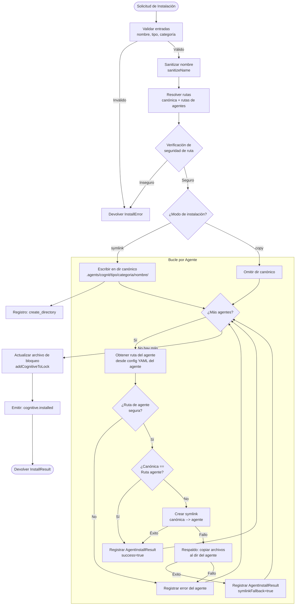

# 07 -- Sistema de Instalador

## 1. Descripción General

El Instalador es el módulo núcleo responsable de colocar los cognitivos en el sistema de archivos. Maneja dos modos de instalación (symlink, copia), dos ámbitos de instalación (proyecto, global), validación de seguridad, operaciones atómicas, reversión (rollback) en caso de fallo y diferencias entre plataformas. El Instalador es agnóstico a la interfaz: expone una API programática consumida por operaciones (añadir, actualizar, sincronizar), no por el código CLI directamente.

---

## 2. Modos de Instalación

### 2.1 Symlink (Por Defecto)

Los archivos se escriben una vez en la **ubicación canónica central** y se vinculan mediante symlink en el directorio de cada agente. Este es el modo recomendado porque:

- Fuente única de verdad: al actualizar el archivo canónico se actualizan todos los agentes.
- Eficiencia de disco: sin duplicación de archivos.
- Permite que la operación `sync` detecte desviaciones.

### 2.2 Copia (Copy)

Los archivos se copian directamente al directorio de cada agente. Se utiliza cuando:

- El sistema de archivos no admite symlinks (Windows sin Modo Desarrollador).
- El usuario lo solicita explícitamente (flag `--copy`).
- La creación del symlink falla (respaldo automático).

---

## 3. Ámbitos de Instalación

### 3.1 Nivel de Proyecto (Por Defecto)

Se instala en el directorio del proyecto actual. El almacenamiento central reside en:

```
<raiz-del-proyecto>/.agents/cognit/<tipo>/<categoria>/<nombre>/
```

Los symlinks específicos por agente apuntan desde:

```
<raiz-del-proyecto>/.<agente>/<tipo>/<nombre>/  -->  ../../.agents/cognit/<tipo>/<categoria>/<nombre>/
```

### 3.2 Nivel Global

Se instala en el directorio personal del usuario. El almacenamiento central reside en:

```
~/.agents/cognit/<tipo>/<categoria>/<nombre>/
```

Los symlinks específicos por agente apuntan desde:

```
~/<directorio-global-agente>/<tipo>/<nombre>/  -->  ../.agents/cognit/<tipo>/<categoria>/<nombre>/
```

Las rutas globales siguen las convenciones XDG en Linux/macOS y `%APPDATA%` en Windows (ver Sección 8).

---

## 4. Patrón de Almacenamiento Canónico

### 4.1 Directorio Central (Fuente de Verdad)

Todos los cognitivos se almacenan centralmente, organizados por tipo y categoría:

```
.agents/cognit/
  skills/
    frontend/
      react-19/
        SKILL.md
        assets/
          diagram.png
      next-app-router/
        SKILL.md
    planning/
      task-decomposition/
        SKILL.md
  prompts/
    backend/
      api-design/
        PROMPT.md
  agents/
    devops/
      ci-pipeline/
        AGENT.md
  rules/
    security/
      owasp-top-10/
        RULE.md
```

### 4.2 Directorio de Agente (Symlinks, Aplanado)

Los directorios de los agentes aplanan el nivel de categoría, ya que la mayoría de los agentes no admiten categorías:

```
.claude/skills/
  react-19/  -->  ../../.agents/cognit/skills/frontend/react-19/
  next-app-router/  -->  ../../.agents/cognit/skills/frontend/next-app-router/
  task-decomposition/  -->  ../../.agents/cognit/skills/planning/task-decomposition/

.cursor/skills/
  react-19/  -->  ../../.agents/cognit/skills/frontend/react-19/
```

Principio clave: **el central tiene categorías, los directorios de agentes se aplanan**. El SDK gestiona este mapeo de forma transparente.

### 4.3 Por qué este Patrón

1. **Un solo archivo canónico**: las actualizaciones se propagan a todos los agentes vía symlinks.
2. **Categorías para la organización**: los humanos y las herramientas pueden navegar por departamento.
3. **Compatibilidad con agentes**: los agentes ven una lista plana, sin conocer las categorías.
4. **Alineación con el archivo de bloqueo**: el archivo de bloqueo hace referencia a las rutas canónicas.

---

## 5. Interfaces TypeScript

```typescript
// ── Modo de Instalación ────────────────────────────────

/** Cómo se colocan los archivos en los directorios de los agentes */
type InstallMode = 'symlink' | 'copy';

/** Dónde se instala el cognitivo */
type InstallScope = 'project' | 'global';

// ── Opciones de Instalación ──────────────────────────────

interface InstallOptions {
  /** Modo de instalación. Por defecto 'symlink'. */
  mode: InstallMode;

  /** Ámbito de instalación. Por defecto 'project'. */
  scope: InstallScope;

  /** Raíz del proyecto para instalaciones de ámbito de proyecto. Por defecto process.cwd(). */
  projectRoot: string;

  /** Agentes de destino. Si está vacío, se instala en todos los agentes detectados. */
  agents: AgentType[];

  /** Categoría del cognitivo. Por defecto 'general'. */
  category: string;

  /** El tipo de cognitivo (skill, prompt, rule, agent). */
  cognitiveType: CognitiveType;

  /** Forzar sobrescritura si ya está instalado. */
  force: boolean;

  /** Prueba en seco: informa de las acciones sin ejecutarlas. */
  dryRun: boolean;
}

// ── Resultado de la Instalación ───────────────────────────

interface InstallResult {
  /** Si la instalación tuvo éxito */
  success: boolean;

  /** La ruta canónica donde se almacenó el cognitivo */
  canonicalPath: string;

  /** Resultados de instalación por agente */
  agentResults: AgentInstallResult[];

  /** Modo de instalación general utilizado */
  mode: InstallMode;

  /** Errores encontrados durante la instalación */
  errors: InstallError[];

  /** Acciones realizadas (para informes / deshacer) */
  actions: InstallAction[];
}

interface AgentInstallResult {
  /** El agente al que corresponde este resultado */
  agent: AgentType;

  /** Si la instalación en este agente tuvo éxito */
  success: boolean;

  /** La ruta en el directorio del agente */
  agentPath: string;

  /** El modo realmente utilizado (puede diferir del solicitado si el symlink recurrió a copia) */
  actualMode: InstallMode;

  /** Si la creación del symlink falló y se recurrió a la copia */
  symlinkFallback: boolean;

  /** Mensaje de error si falló */
  error?: string;
}

// ── Acción de Instalación (para reversión) ───────────────

type InstallActionType =
  | 'create_directory'
  | 'write_file'
  | 'create_symlink'
  | 'copy_file'
  | 'copy_directory'
  | 'remove_existing';

interface InstallAction {
  type: InstallActionType;
  path: string;
  /** Para symlinks, el destino del enlace */
  target?: string;
  /** Ruta de respaldo si eliminamos un archivo/directorio existente */
  backupPath?: string;
}

// ── Error de Instalación ─────────────────────────────────

type InstallErrorCode =
  | 'PATH_TRAVERSAL'
  | 'ELOOP'
  | 'PERMISSION_DENIED'
  | 'DISK_FULL'
  | 'AGENT_UNSUPPORTED'
  | 'NAME_CONFLICT'
  | 'ATOMIC_WRITE_FAILED'
  | 'ROLLBACK_FAILED'
  | 'UNKNOWN';

interface InstallError {
  code: InstallErrorCode;
  message: string;
  path?: string;
  agent?: AgentType;
  cause?: Error;
}

// ── Interfaz Installer ─────────────────────────────────

interface Installer {
  /**
   * Instalar un cognitivo desde una fuente de directorio local.
   * Copia los archivos a la ubicación canónica y luego crea symlinks a los agentes.
   */
  installFromDirectory(
    sourcePath: string,
    name: string,
    options: Partial<InstallOptions>
  ): Promise<InstallResult>;

  /**
   * Instalar un cognitivo desde contenido bruto (ej., obtenido de un proveedor).
   * Escribe el contenido en la ubicación canónica y luego crea symlinks a los agentes.
   */
  installFromContent(
    content: string,
    name: string,
    options: Partial<InstallOptions>
  ): Promise<InstallResult>;

  /**
   * Instalar un cognitivo con múltiples archivos (ej., proveedor well-known).
   * Escribe todos los archivos en la ubicación canónica y luego crea symlinks a los agentes.
   */
  installFromFiles(
    files: Map<string, string>,
    name: string,
    options: Partial<InstallOptions>
  ): Promise<InstallResult>;

  /**
   * Desinstalar un cognitivo: eliminar symlinks de agentes y el directorio canónico.
   */
  uninstall(
    name: string,
    cognitiveType: CognitiveType,
    options: { scope: InstallScope; projectRoot?: string }
  ): Promise<UninstallResult>;

  /**
   * Verificar si un cognitivo está instalado para un agente específico.
   */
  isInstalled(
    name: string,
    agent: AgentType,
    cognitiveType: CognitiveType,
    options: { scope: InstallScope; projectRoot?: string }
  ): Promise<boolean>;
}

interface UninstallResult {
  success: boolean;
  removedPaths: string[];
  errors: InstallError[];
}
```

---

## 6. Resolución de Rutas

### 6.1 Detección de la Raíz del Proyecto

El SDK sube desde `cwd` buscando marcadores en orden:

1. Directorio `.agents/cognit/` (proyecto gestionado por el SDK).
2. Directorio `.git/` (raíz del repositorio git).
3. `package.json` (raíz del proyecto Node).

Si no se encuentra ninguno, se utiliza `cwd` como raíz del proyecto.

```typescript
async function findProjectRoot(startDir: string): Promise<string> {
  let dir = resolve(startDir);
  const root = parse(dir).root;

  while (dir !== root) {
    // Comprobar primero el marcador del SDK
    if (await exists(join(dir, '.agents', 'cognit'))) return dir;
    // Luego la raíz git
    if (await exists(join(dir, '.git'))) return dir;
    // Luego el package.json
    if (await exists(join(dir, 'package.json'))) return dir;

    dir = dirname(dir);
  }

  return startDir;
}
```

### 6.2 Rutas Globales

| Plataforma | Ruta Base | Ruta Completa |
|----------|-----------|-----------|
| macOS | `~/.agents/cognit/` | `/Users/<usuario>/.agents/cognit/skills/frontend/react-19/` |
| Linux | `${XDG_DATA_HOME}/cognit/` o `~/.local/share/cognit/` | `~/.local/share/cognit/skills/frontend/react-19/` |
| Windows | `%APPDATA%\cognit` | `C:\Users\<usuario>\AppData\Roaming\cognit\skills\frontend
eact-19` |

El SDK utiliza una función `getGlobalBase()` que respeta XDG en Linux:

```typescript
function getGlobalBase(): string {
  if (process.platform === 'win32') {
    return join(process.env.APPDATA || join(homedir(), 'AppData', 'Roaming'), 'cognit');
  }
  if (process.platform === 'linux') {
    const xdgData = process.env.XDG_DATA_HOME || join(homedir(), '.local', 'share');
    return join(xdgData, 'cognit');
  }
  // macOS y otros
  return join(homedir(), '.agents', 'cognit');
}
```

### 6.3 Construcción de la Ruta Canónica

```typescript
function getCanonicalPath(
  cognitiveType: CognitiveType,
  category: string,
  name: string,
  scope: InstallScope,
  projectRoot?: string
): string {
  const base = scope === 'global'
    ? getGlobalBase()
    : join(projectRoot || process.cwd(), '.agents', 'cognit');

  const typeSubdir = COGNITIVE_SUBDIRS[cognitiveType]; // ej., 'skills'
  const safeName = sanitizeName(name);
  const safeCategory = sanitizeName(category);

  return join(base, typeSubdir, safeCategory, safeName);
}
```

### 6.4 Construcción de la Ruta del Agente

```typescript
function getAgentPath(
  agent: AgentType,
  cognitiveType: CognitiveType,
  name: string,
  scope: InstallScope,
  projectRoot?: string
): string {
  const agentConfig = agents[agent];
  const dirs = agentConfig.dirs[cognitiveType];

  const base = scope === 'global'
    ? dirs.global    // ej., '~/.cursor/skills'
    : join(projectRoot || process.cwd(), dirs.local);  // ej., '.cursor/skills'

  return join(base, sanitizeName(name));
}
```

---

## 7. Seguridad

### 7.1 Prevención de Salto de Ruta (Path Traversal)

Cada ruta se valida antes de su uso:

```typescript
function isPathSafe(basePath: string, targetPath: string): boolean {
  const normalizedBase = normalize(resolve(basePath));
  const normalizedTarget = normalize(resolve(targetPath));
  return (
    normalizedTarget.startsWith(normalizedBase + sep) ||
    normalizedTarget === normalizedBase
  );
}
```

Se llama:
- Antes de crear directorios canónicos.
- Antes de crear symlinks de agentes.
- Antes de escribir cualquier archivo (especialmente archivos de proveedores well-known).
- Antes de eliminar directorios durante la desinstalación.

### 7.2 Sanitización de Nombres

```typescript
function sanitizeName(name: string): string {
  return name
    .toLowerCase()
    .replace(/[^a-z0-9._]+/g, '-')     // Reemplazar caracteres no seguros con guiones
    .replace(/^[.\-]+|[.\-]+$/g, '')    // Eliminar puntos y guiones iniciales/finales
    .substring(0, 255)                   // Límite de nombre del sistema de archivos
    || 'unnamed-cognitive';              // Respaldo si está vacío
}
```

### 7.3 Detección de ELOOP

Los symlinks circulares (ELOOP) se detectan cuando:
- La ruta canónica resuelve a la misma ubicación que la ruta del agente (porque el directorio del agente es en sí mismo un symlink a `.agents/`).
- Una instalación anterior dejó un symlink circular roto.

Manejo:
1. Antes de crear un symlink, se resuelven tanto el origen como el destino a través de `realpath()`.
2. Si resuelven a la misma ubicación, se omite la creación del symlink (se devuelve éxito).
3. Si se captura ELOOP durante `lstat()`, se elimina el enlace roto por la fuerza y se reintenta.

### 7.4 Contención Temporal

Cuando los archivos se obtienen de fuentes remotas, se escriben primero en `os.tmpdir()`. El SDK valida que:
- Las rutas temporales estén dentro de `os.tmpdir()`.
- Los directorios temporales se limpien después de la instalación (incluso en caso de fallo).
- Ningún symlink escape del directorio temporal.

### 7.5 Permisos

- Los directorios se crean con los permisos por defecto (0o755 en Unix).
- Los archivos se escriben con los permisos por defecto (0o644 en Unix).
- Los symlinks heredan los permisos del origen.
- El SDK nunca cambia los permisos de los archivos después de su creación.

---

## 8. Reversión (Rollback) y Fallo Parcial

### 8.1 Seguimiento de Acciones

Cada operación del sistema de archivos se registra como una `InstallAction`. Si la instalación falla a mitad de camino, el motor de reversión invierte las acciones en orden LIFO (el último en entrar es el primero en salir):

```typescript
async function rollback(actions: InstallAction[]): Promise<void> {
  // Orden inverso: deshacer la última acción primero
  for (const action of actions.reverse()) {
    try {
      switch (action.type) {
        case 'create_directory':
        case 'copy_directory':
          await rm(action.path, { recursive: true, force: true });
          break;
        case 'write_file':
        case 'copy_file':
        case 'create_symlink':
          await rm(action.path, { force: true });
          break;
        case 'remove_existing':
          // Restaurar desde el respaldo si está disponible
          if (action.backupPath) {
            await rename(action.backupPath, action.path);
          }
          break;
      }
    } catch {
      // Registrar pero continuar -- reversión al mejor esfuerzo
    }
  }
}
```

### 8.2 Estrategia de Éxito Parcial

Al instalar en múltiples agentes:

1. Escribir primero en el directorio canónico (operación única).
2. Crear symlinks a cada agente secuencialmente.
3. Si falla el symlink de algún agente:
   - Registrar el fallo en `AgentInstallResult`.
   - Continuar con el siguiente agente (NO revertir los agentes exitosos).
   - Informar el éxito parcial en `InstallResult`.

El archivo de bloqueo solo se descubre después de que el directorio canónico se haya escrito correctamente. Los fallos de los symlinks de los agentes se registran pero no bloquean la actualización del archivo de bloqueo.

### 8.3 Escrituras Atómicas

Las escrituras de archivos utilizan el patrón de archivo temporal y posterior renombrado:

```typescript
async function atomicWriteFile(targetPath: string, content: string): Promise<void> {
  const tempPath = targetPath + '.tmp.' + process.pid;
  await writeFile(tempPath, content, 'utf-8');
  await rename(tempPath, targetPath);
}
```

Esto asegura que el archivo de destino nunca esté en un estado parcialmente escrito. Si el proceso se bloquea durante la escritura, solo queda el archivo `.tmp` (que se limpia en la siguiente ejecución).

---

## 9. Operaciones de Archivo

### 9.1 Copia de Directorio

```typescript
async function copyDirectory(src: string, dest: string): Promise<void> {
  await mkdir(dest, { recursive: true });
  const entries = await readdir(src, { withFileTypes: true });

  await Promise.all(
    entries
      .filter(entry => !isExcluded(entry.name, entry.isDirectory()))
      .map(async entry => {
        const srcPath = join(src, entry.name);
        const destPath = join(dest, entry.name);

        if (entry.isDirectory()) {
          await copyDirectory(srcPath, destPath);
        } else {
          await cp(srcPath, destPath, { dereference: true });
        }
      })
  );
}
```

Archivos excluidos: `README.md`, `metadata.json`, `.git/`, archivos que comienzan con `_`.

### 9.2 Creación de Symlink

```typescript
async function createSymlink(target: string, linkPath: string): Promise<boolean> {
  const resolvedTarget = resolve(target);
  const resolvedLinkPath = resolve(linkPath);

  // Omitir si las rutas resuelven a la misma ubicación
  if (resolvedTarget === resolvedLinkPath) return true;

  // Comprobar con los symlinks de los padres resueltos
  const realTarget = await resolveParentSymlinks(target);
  const realLinkPath = await resolveParentSymlinks(linkPath);
  if (realTarget === realLinkPath) return true;

  // Manejar entrada existente en la ruta del enlace
  try {
    const stats = await lstat(linkPath);
    if (stats.isSymbolicLink()) {
      const existingTarget = await readlink(linkPath);
      if (resolve(dirname(linkPath), existingTarget) === resolvedTarget) return true;
      await rm(linkPath);
    } else {
      await rm(linkPath, { recursive: true });
    }
  } catch (err: unknown) {
    if (isErrnoException(err) && err.code === 'ELOOP') {
      await rm(linkPath, { force: true });
    }
    // ENOENT es lo esperado: el enlace aún no existe
  }

  // Crear directorio padre
  await mkdir(dirname(linkPath), { recursive: true });

  // Calcular la ruta relativa del symlink
  const realLinkDir = await resolveParentSymlinks(dirname(linkPath));
  const relativePath = relative(realLinkDir, target);
  const symlinkType = platform() === 'win32' ? 'junction' : undefined;

  await symlink(relativePath, linkPath, symlinkType);
  return true;
}
```

### 9.3 Limpiar y Crear

Antes de escribir en un directorio, se limpia (se elimina y se vuelve a crear):

```typescript
async function cleanAndCreateDirectory(path: string): Promise<void> {
  try {
    await rm(path, { recursive: true, force: true });
  } catch {
    // Ignorar errores de limpieza
  }
  await mkdir(path, { recursive: true });
}
```

---

## 10. Soporte para Windows

### 10.1 Junction vs Symlink

En Windows:
- Los **Symlinks** requieren privilegios de administrador o el Modo Desarrollador habilitado.
- Las **Junctions** funcionan sin privilegios pero solo para directorios.

El SDK utiliza junctions en Windows pasando `'junction'` a `fs.symlink()`:

```typescript
const symlinkType = process.platform === 'win32' ? 'junction' : undefined;
await symlink(relativePath, linkPath, symlinkType);
```

### 10.2 Detección de Soporte para Symlink

Antes de la primera operación de symlink, el SDK comprueba si los symlinks son compatibles:

```typescript
async function checkSymlinkSupport(testDir: string): Promise<boolean> {
  if (process.platform !== 'win32') return true;

  const testTarget = join(testDir, '.symlink-test-target');
  const testLink = join(testDir, '.symlink-test');

  try {
    await writeFile(testTarget, 'test', 'utf-8');
    await symlink(testTarget, testLink);
    await rm(testLink);
    await rm(testTarget);
    return true;
  } catch {
    // Limpiar en caso de fallo
    try { await rm(testLink, { force: true }); } catch {}
    try { await rm(testTarget, { force: true }); } catch {}
    return false;
  }
}
```

Si no se admiten los symlinks, el SDK recurre al modo copia con una advertencia.

### 10.3 Normalización de los Separadores de Ruta

Todas las rutas guardadas en el archivo de bloqueo y utilizadas para los destinos de los symlinks utilizan barras inclinadas hacia adelante. El SDK normaliza en el límite:

```typescript
function normalizeForStorage(p: string): string {
  return p.replace(/\/g, '/');
}
```

---

## 11. Diagrama del Flujo de Instalación



---

## 12. Referencia del Código Existente

La base de código de cognit actual implementa este patrón en:

| Archivo | Propósito | LOC |
|------|---------|-----|
| `src/services/installer/orchestrator.ts` | 3 variantes de instalación (directorio, remota, well-known) | 423 |
| `src/services/installer/file-ops.ts` | copyDirectory, createSymlink, cleanAndCreateDirectory | 149 |
| `src/services/installer/paths.ts` | sanitizeName, isPathSafe, getCanonicalDir | 109 |
| `src/services/installer/listing.ts` | listInstalledCognitives, isCognitiveInstalled | 312 |

El rediseño del SDK unifica las 3 variantes de instalación en una única interfaz `Installer` con los métodos `installFromDirectory`, `installFromContent` e `installFromFiles`. También añade:

- Rutas canónicas con conocimiento de la categoría (`.agents/cognit/<tipo>/<categoria>/<nombre>/`).
- Seguimiento de acciones para la reversión (rollback).
- Tipos de error estructurados.
- Soporte para dry-run en el nivel del instalador.
- Emisión de eventos para observabilidad.

---

## 13. Casos de Borde

| Escenario | Manejo |
|----------|----------|
| El directorio del agente es un symlink a `.agents/` | resolveParentSymlinks lo detecta y omite la creación del symlink |
| El nombre del cognitivo contiene `../` | sanitizeName lo elimina; isPathSafe rechaza el resultado |
| Dos cognitivos con el mismo nombre y diferentes categorías | Las claves del archivo de bloqueo son `tipo:categoria:nombre`; el directorio del agente utiliza solo el nombre (el último gana con una advertencia) |
| Instalación interrumpida a mitad de escritura | El motor de reversión elimina los archivos parciales; la siguiente ejecución limpia los archivos `.tmp` |
| Disco lleno durante la escritura | atomicWriteFile deja solo el archivo `.tmp`; la reversión limpia |
| El destino del symlink se elimina después de la instalación | El archivo de bloqueo sigue teniendo la entrada; `sync` o `doctor` detectan el enlace roto |
| Instalación global en un agente sin soporte global | Devuelve `AgentInstallResult` con `success: false` y el error `AGENT_UNSUPPORTED` |
| Instalaciones concurrentes | Escrituras atómicas a nivel de archivo vía renombrado; el archivo de bloqueo utiliza lectura-modificación-escritura con archivo temporal |
