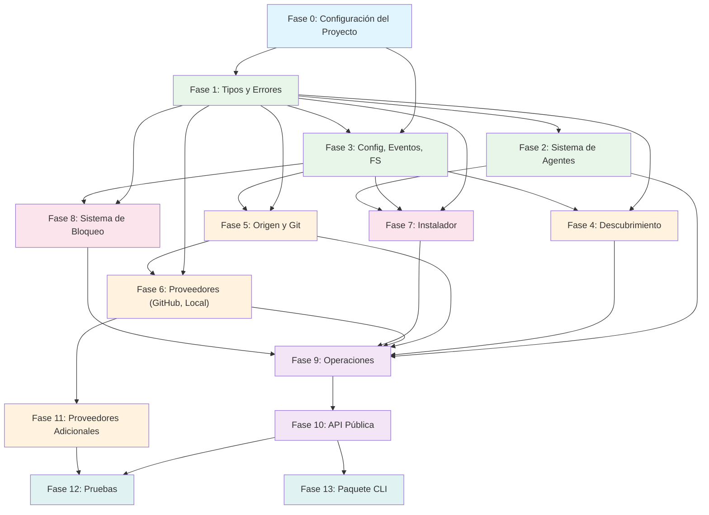

# 11 - Hoja de Ruta de Implementación

**Autor:** Agent D -- Planificador de Implementación
**Fecha:** 2026-02-09
**Estado:** Plan

---

## Descripción General

Esta hoja de ruta descompone el SDK completo en 12 fases de implementación. Cada fase está diseñada para ser ejecutada por un agente Claude con contexto completo. Las fases están ordenadas por dependencia: cada fase solo depende de las fases que la precedieron. Cada fase incluye archivos específicos a crear, interfaces a implementar, pruebas a escribir y criterios de aceptación.

La estructura del monorepo sigue el plan de directorios de `09-directory-structure.md`. El paquete del SDK reside en `packages/cognit-core/` y la CLI en `packages/cognit-cli/`.

---

## Fase 0: Configuración del Proyecto

**Objetivo:** Crear el esqueleto del monorepo con todas las herramientas de construcción, configuración y CI.

**Dependencias:** Ninguna (este es el punto de partida).

### Archivos a Crear

```
cognit-cli/                              # Raíz del repositorio
  package.json                           # Configuración raíz del workspace de pnpm
  pnpm-workspace.yaml                   # { packages: ["packages/*"] }
  tsconfig.json                          # Configuración TS raíz con referencias
  .gitignore
  .eslintrc.json                         # ESLint con reglas no-restricted-imports
  .prettierrc
  LICENSE

  packages/
    cognit-core/
      package.json                       # @synapsync/cognit-core
      tsconfig.json                      # Extiende la raíz, composite: true
      tsup.config.ts                     # Salida ESM, dts: true
      vitest.config.ts                   # Configuración del ejecutor de pruebas

    cognit-cli/
      package.json                       # cognit (nombre del binario CLI)
      tsconfig.json                      # Extiende la raíz, referencia a cognit-core
      tsup.config.ts                     # Empaquetar CLI
      bin/
        cli.js                           # Envoltorio shebang #!/usr/bin/env node
```

### Detalles de la Configuración

**`package.json` raíz:**
- `"private": true`
- `"type": "module"`
- `"packageManager": "pnpm@9.x"`
- Scripts: `build`, `test`, `lint`, `compile-agents`, `clean`

**`tsconfig.json` raíz:**
- `target: "ES2022"`, `module: "ESNext"`, `moduleResolution: "bundler"`
- `strict: true`, `exactOptionalPropertyTypes: true`, `noUncheckedIndexedAccess: true`
- `declaration: true`, `declarationMap: true`, `sourceMap: true`
- Referencias a ambos paquetes

**`cognit-core/package.json`:**
- `name: "@synapsync/cognit-core"`
- `type: "module"`
- `exports: { ".": { import, types } }`
- `engines: { node: ">=20" }`
- Dependencias: `gray-matter`, `simple-git`, `xdg-basedir`
- Dependencias de desarrollo: `vitest`, `tsup`, `typescript`, `tsx`

**`cognit-core/vitest.config.ts`:**
- Archivos de prueba: `tests/**/*.test.ts`
- Proveedor de cobertura: v8
- Umbrales de cobertura: sentencias 80%, ramas 75%, funciones 80%

**`pnpm-workspace.yaml`:**
```yaml
packages:
  - "packages/*"
```

### Definición de Terminado

- [ ] `pnpm install` tiene éxito.
- [ ] `pnpm run build` compila ambos paquetes (archivos index.ts vacíos por ahora).
- [ ] `pnpm run test` ejecuta vitest (sin pruebas aún, pero sale con 0).
- [ ] `pnpm run lint` ejecuta eslint sin errores.
- [ ] El modo estricto de TypeScript se impone en ambos paquetes.
- [ ] `.gitignore` excluye `node_modules/`, `dist/`, `coverage/`, `__generated__/`.
- [ ] El tsconfig raíz referencia ambos paquetes correctamente.

### Instrucciones para el Agente Implementador

1. Crear primero el directorio raíz y todos los archivos de configuración.
2. Crear ambos directorios de paquetes con sus propias configuraciones.
3. Crear archivos `src/index.ts` de marcador de posición en ambos paquetes (exportaciones vacías).
4. Verificar que todo el pipeline de construcción funcione de extremo a extremo.
5. NO añadir ningún código fuente más allá de los archivos de marcador de posición.

---

## Fase 1: Sistema de Tipos y Tipos Núcleo

**Objetivo:** Implementar todos los tipos, tipos marcados, utilidades de resultado, jerarquía de errores y tipos de eventos. Estos son la base de la que dependen todos los demás módulos.

**Dependencias:** Fase 0 (configuración del proyecto).

### Archivos a Crear

```
packages/cognit-core/src/
  types/
    index.ts                    # Re-exportaciones de barril para todos los tipos
    branded.ts                  # AgentName, CognitiveName, SafeName, SourceIdentifier + constructores
    result.ts                   # Result<T,E>, ok(), err(), unwrap(), mapResult()
    cognitive.ts                # Cognitive, CognitiveType, CognitiveRef, Skill, Prompt, Rule, AgentCognitive, RemoteCognitive, COGNITIVE_TYPE_CONFIGS, COGNITIVE_SUBDIRS, COGNITIVE_FILE_NAMES, AGENTS_DIR
    agent.ts                    # AgentConfig, AgentType (marcador), AgentDirConfig, AgentDetectionResult, interfaz AgentRegistry
    provider.ts                 # HostProvider, ProviderMatch, ProviderRegistry, SourceDescriptor, SourceParser, GitClient, GitCloneOptions, ProviderFetchOptions
    installer.ts                # InstallMode, InstallScope, InstallTarget, InstallResult, InstallRequest, WellKnownCognitive, Installer, InstallerOptions
    lock.ts                     # LockFile, LockEntry, LockManager, LOCK_VERSION
    operations.ts               # AddOptions, AddResult, ListOptions, ListResult, RemoveOptions, RemoveResult, UpdateOptions, UpdateResult, SyncOptions, SyncResult, InstallResultEntry, InstalledCognitive, UpdateCheckEntry
    category.ts                 # Category, CategoryMapping, DEFAULT_CATEGORIES
    config.ts                   # SDKConfig, FileSystemAdapter, FsStats, Dirent, GitConfig, ProviderConfig, AgentRegistryConfig, TelemetryConfig
    events.ts                   # SDKEventMap, Unsubscribe, interfaz EventBus

  errors/
    index.ts                    # Re-exportaciones de barril
    base.ts                     # Clase abstracta CognitError
    provider.ts                 # ProviderError, ProviderFetchError, ProviderMatchError
    install.ts                  # InstallError, PathTraversalError, SymlinkError, FileWriteError
    discovery.ts                # DiscoveryError, ParseError, ScanError
    lock.ts                     # LockError, LockReadError, LockWriteError, LockMigrationError
    config.ts                   # ConfigError, InvalidConfigError
    source.ts                   # SourceError, SourceParseError, GitCloneError
    agent.ts                    # AgentError, AgentNotFoundError, AgentDetectionError
    codes.ts                    # Mapa de constantes ERROR_CODES, tipo ErrorCode
```

### Interfaces a Implementar (de `02-type-system.md`)

- Todos los constructores de tipos marcados con validación (`agentName`, `cognitiveName`, `safeName`, `sourceIdentifier`).
- Unión discriminada `Result<T, E>` con las utilidades `ok()`, `err()`, `unwrap()`, `mapResult()`.
- Clase base abstracta `CognitError` con `code`, `module`, `toJSON()`.
- Todas las subclases de error (ver 02-type-system.md Sección 12).
- Mapa de constantes `ERROR_CODES`.
- Todos los mapas constantes (`const maps`) para tipos cognitivos (`COGNITIVE_TYPE_CONFIGS`, `COGNITIVE_SUBDIRS`, etc.).
- Mapa de constantes `DEFAULT_CATEGORIES`.

### Pruebas a Escribir

```
packages/cognit-core/tests/
  types/
    branded.test.ts             # validación de agentName, cognitiveName rechaza barras, safeName rechaza puntos
    result.test.ts              # creación de ok/err, unwrap éxito/lanzamiento, mapResult
  errors/
    hierarchy.test.ts           # cadenas de instanceof (ProviderFetchError instanceof ProviderError instanceof CognitError)
    codes.test.ts               # Todas las clases de error tienen entradas coincidentes en ERROR_CODES
    serialization.test.ts       # toJSON() produce la forma esperada
```

### Definición de Terminado

- [ ] Todos los archivos de tipos compilan con cero errores bajo `strict: true`.
- [ ] Los constructores de tipos marcados rechazan entradas inválidas y lanzan excepciones.
- [ ] `Result<T, E>` funciona con tipos genéricos.
- [ ] Todas las clases de error forman cadenas de `instanceof` correctas.
- [ ] Cada error tiene una propiedad `code` y `module`.
- [ ] El mapa `ERROR_CODES` cubre cada clase de error.
- [ ] `toJSON()` en los errores produce un objeto plano con name, code, module, message, cause.
- [ ] Todas las pruebas pasan.
- [ ] `packages/cognit-core/src/index.ts` re-exporta todos los tipos y errores públicos.

---

## Fase 2: Sistema de Agentes (Definiciones YAML + Script de Compilación + Registro)

**Objetivo:** Implementar el sistema de definición de agentes basado en YAML, el pipeline de compilación a TypeScript y el registro de agentes.

**Dependencias:** Fase 1 (tipos y errores).

### Archivos a Crear

```
packages/cognit-core/
  agents/                               # Definiciones YAML de agentes (39+ archivos)
    claude-code.yaml
    cursor.yaml
    codex.yaml
    opencode.yaml
    windsurf.yaml
    gemini-cli.yaml
    github-copilot.yaml
    goose.yaml
    roo.yaml
    amp.yaml
    ... (los 39+ agentes)

  config/
    cognitive-types.yaml                # definiciones de skill, agent, prompt, rule
    categories.yaml                     # Definiciones de categorías por defecto

  scripts/
    compile-agents.ts                   # Pipeline de compilación YAML -> TypeScript
    validate-agents.ts                  # Script de validación de YAML de agentes

  src/
    agents/
      index.ts                          # Exportaciones de AgentRegistryImpl
      registry.ts                       # Clase AgentRegistryImpl
      detector.ts                       # AgentDetectorImpl (lógica de detección)
      __generated__/
        agents.ts                       # Configs de agentes compiladas Record<AgentType, AgentConfig>
        agent-type.ts                   # Tipo de unión AgentType
        cognitive-types.ts              # Unión CognitiveType + constantes COGNITIVE_*
```

### Interfaces a Implementar (de `04-agent-system.md`)

- `AgentRegistryImpl` implementando la interfaz `AgentRegistry`:
  - `getAll()`, `get()`, `getUniversalAgents()`, `getNonUniversalAgents()`.
  - `isUniversal()`, `getDir()`, `detectInstalled()`, `register()`.
- `AgentDetectorImpl` utilizando verificaciones de sistema de archivos según las reglas de detección YAML.
- Fases del script de compilación: Cargar YAML -> Validar -> Resolver convenciones -> Generar TypeScript.

### Pipeline de Compilación (de `04-agent-system.md` Sección 7)

El script de compilación debe:
1. Leer todos los archivos `agents/*.yaml`.
2. Leer `config/cognitive-types.yaml`.
3. Validar los campos obligatorios (name, displayName, rootDir/localRoot).
4. Realizar validación cruzada (sin nombres/displayNames duplicados).
5. Resolver convenciones (rootDir -> localRoot, globalRoot, detect).
6. Generar `agent-type.ts` (unión AgentType).
7. Generar `cognitive-types.ts` (unión CognitiveType + mapas constantes).
8. Generar `agents.ts` (Record<AgentType, AgentConfig> completo con funciones detectInstalled).
9. Escribir todos los archivos con el encabezado `// AUTO-GENERATED -- DO NOT EDIT`.

### Pruebas a Escribir

```
packages/cognit-core/tests/
  agents/
    registry.test.ts            # getAll, get, getUniversalAgents, getNonUniversalAgents, isUniversal, getDir, register
    detector.test.ts            # detectInstalled con FS simulado (sembrar directorios de agentes)
    generated.test.ts           # Verificar que los agentes generados coinciden con la forma y el conteo esperados
  scripts/
    compile-agents.test.ts      # Compilación de extremo a extremo: dado un YAML de prueba, verificar el TS de salida
```

### Definición de Terminado

- [ ] `pnpm run compile-agents` genera los 3 archivos de salida sin errores.
- [ ] La unión `AgentType` generada incluye los 39+ agentes.
- [ ] `agents.ts` generado contiene la configuración completa para cada agente.
- [ ] `AgentRegistryImpl` carga los agentes generados y responde a todas las consultas.
- [ ] `detectInstalled()` funciona con el adaptador de sistema de archivos inyectado.
- [ ] `register()` añade agentes en tiempo de ejecución.
- [ ] Convención sobre configuración: un YAML de 3 líneas (name, displayName, rootDir) produce una configuración completa correcta.
- [ ] Todas las pruebas pasan.
- [ ] El pipeline de construcción ejecuta `compile-agents` antes de la compilación de TypeScript.

---

## Fase 3: Config, Eventos y Adaptador de Sistema de Archivos

**Objetivo:** Implementar la resolución de la configuración del SDK, el bus de eventos y la capa de abstracción del sistema de archivos.

**Dependencias:** Fase 1 (tipos y errores).

### Archivos a Crear

```
packages/cognit-core/src/
  config/
    index.ts                    # resolveConfig(), validateConfig()
    defaults.ts                 # Valores de configuración por defecto
    validation.ts             # Reglas de validación de configuración

  events/
    index.ts                    # EventBusImpl, createCapturingEventBus

  fs/
    index.ts                    # Exportaciones de barril
    node.ts                     # Envoltorio de fs/promises de Node.js implementando FileSystemAdapter
    memory.ts                 # Implementación de FS en memoria (para pruebas)
```

### Interfaces a Implementar (de `01-architecture.md`)

- `resolveConfig(partial?)`: fusiona la configuración del usuario con los valores por defecto.
- `validateConfig()`: lanza `InvalidConfigError` para configuraciones no válidas.
- `EventBusImpl` implementando `EventBus`: `emit()`, `on()`, `once()`.
- `createCapturingEventBus()`: utilidad de prueba que registra todos los eventos.
- `nodeFs`: adaptador de sistema de archivos real de Node.js.
- `createMemoryFs(seed?)`: sistema de archivos en memoria para pruebas.

### Pruebas a Escribir

```
packages/cognit-core/tests/
  config/
    resolve.test.ts             # resolveConfig con entradas parciales, verificar valores por defecto
    validation.test.ts          # validateConfig rechaza configuraciones incorrectas
  events/
    event-bus.test.ts           # suscribir, emitir, verificar manejador; once se dispara una vez; unsubscribe funciona; bus de captura registra eventos
  fs/
    memory.test.ts              # mkdir -p, readdir con tipos, ida y vuelta readFile/writeFile, symlink, exists, rm
```

### Definición de Terminado

- [ ] `resolveConfig()` rellena todos los valores por defecto cuando se llama sin argumentos.
- [ ] `resolveConfig()` fusiona correctamente las sobrescrituras parciales.
- [ ] `validateConfig()` rechaza `cwd` vacío, tiempos de espera negativos, etc.
- [ ] `EventBusImpl.on()` entrega cargas útiles tipadas a los manejadores.
- [ ] `EventBusImpl.once()` se dispara exactamente una vez.
- [ ] La cancelación de suscripción elimina el manejador.
- [ ] `createCapturingEventBus()` registra los eventos en orden.
- [ ] `nodeFs` envuelve todas las operaciones de `fs/promises` requeridas.
- [ ] `createMemoryFs()` implementa todos los métodos de `FileSystemAdapter`.
- [ ] El FS en memoria admite mkdir recursivo, symlink y readdir con tipos de archivo.
- [ ] Todas las pruebas pasan.

---

## Fase 4: Motor de Descubrimiento

**Objetivo:** Implementar el sistema de escaneo del sistema de archivos y de análisis de frontmatter que descubre los archivos cognitivos.

**Dependencias:** Fase 1 (tipos), Fase 3 (eventos, adaptador de sistema de archivos).

### Archivos a Crear

```
packages/cognit-core/src/
  discovery/
    index.ts                    # Exportaciones de DiscoveryServiceImpl
    scanner.ts                  # Escaneo del sistema de archivos (findCognitiveDirs, buildPrioritySearchDirs)
    parser.ts                   # Análisis de frontmatter (parseCognitiveMd, hasCognitiveMd)
    plugin-manifest.ts          # Soporte para manifiesto de plugin de Claude (plugin-manifest.json)
```

### Interfaces a Implementar (de `03-modules.md` Sección 2.6)

- `DiscoveryServiceImpl` implementando `DiscoveryService`:
  - `discover(basePath, options?)`: escanea un árbol de directorios en busca de archivos cognitivos.
  - `discoverByType(basePath, type, options?)`: busca un tipo específico.
- `scanner.ts`:
  - `findCognitiveDirs(fs, basePath, types?)`: recorre el árbol de directorios buscando SKILL.md/AGENT.md/PROMPT.md/RULE.md.
  - `buildPrioritySearchDirs(basePath)`: genera directorios de búsqueda ordenados por prioridad para escanear.
- `parser.ts`:
  - `parseCognitiveMd(content, filePath)`: analiza el frontmatter con `gray-matter`, valida los campos requeridos (nombre, descripción), devuelve `Cognitive`.
  - `hasCognitiveMd(fs, dirPath, type)`: verifica si un directorio contiene un archivo cognitivo.
- `plugin-manifest.ts`:
  - `parsePluginManifest(manifestPath)`: analiza el formato `plugin-manifest.json` de Claude.

### Dependencias Externas

- `gray-matter` (análisis de frontmatter YAML).

### Pruebas a Escribir

```
packages/cognit-core/tests/
  discovery/
    parser.test.ts              # Frontmatter válido, campos faltantes, archivo vacío, YAML inválido, metadatos varios
    scanner.test.ts             # FS en memoria con estructuras de directorios sembradas, verificar descubrimiento
    discovery.test.ts           # DiscoveryServiceImpl completo con directorios realistas, filtrado por tipo, subruta, filtrado interno
    plugin-manifest.test.ts     # Análisis de manifiesto de plugin de Claude
```

### Definición de Terminado

- [ ] `parseCognitiveMd()` extrae correctamente el nombre, la descripción, el tipo y todos los metadatos del frontmatter.
- [ ] El analizador devuelve `ParseError` para los archivos a los que les faltan campos obligatorios en el frontmatter.
- [ ] El escáner encuentra todos los archivos cognitivos en estructuras de directorios anidadas.
- [ ] `DiscoveryServiceImpl.discover()` devuelve los `Cognitive[]` correctos para un FS en memoria sembrado.
- [ ] El filtrado por tipo funciona (solo descubrir skills, solo descubrir prompts, etc.).
- [ ] El filtrado por subruta funciona (solo descubrir dentro de un subdirectorio específico).
- [ ] El filtrado `internal: true` funciona (omitir cognitivos internos).
- [ ] Se emiten los eventos: `discovery:start`, `discovery:found`, `discovery:complete`.
- [ ] Todas las pruebas pasan.

---

## Fase 5: Analizador de Origen y Cliente de Git

**Objetivo:** Implementar el análisis de cadenas de origen y las operaciones de clonación de git.

**Dependencias:** Fase 1 (tipos), Fase 3 (eventos, configuración).

### Archivos a Crear

```
packages/cognit-core/src/
  source/
    index.ts                    # Exportaciones de barril
    parser.ts                 # SourceParserImpl
    git.ts                    # GitClientImpl
```

### Interfaces a Implementar (de `05-provider-system.md` Sección 6)

- `SourceParserImpl` implementando `SourceParser`:
  - `parse(source)`: detecta el tipo de origen a partir de una cadena bruta (URL de GitHub, ruta local, abreviatura, etc.).
  - `getOwnerRepo(source)`: extrae `owner/repo` de fuentes de git.
- `GitClientImpl` implementando `GitClient`:
  - `clone(url, options?)`: clonación superficial en un directorio temporal.
  - `cleanup(tempDir)`: elimina el directorio temporal.

### Reglas de Análisis de Origen (de `05-provider-system.md` Sección 6.2)

Orden de prioridad:
1. `isLocalPath(input)` -> `local`.
2. `isDirectCognitiveUrl(input)` -> `direct-url`.
3. Árbol de GitHub con ruta -> `github` con ref + subruta.
4. URL de repositorio de GitHub -> `github`.
5. Patrones de GitLab -> `gitlab`.
6. `owner/repo@nombre` -> `github` con nameFilter.
7. `owner/repo(/ruta)?` -> `github` (abreviatura).
8. URL Well-known -> `well-known`.
9. Respaldo -> `git`.

### Dependencias Externas

- `simple-git` (operaciones de clonación de git).

### Pruebas a Escribir

```
packages/cognit-core/tests/
  source/
    parser.test.ts              # Variantes de entrada exhaustivas: owner/repo, owner/repo/path, owner/repo@name, URLs de GitHub (tree, blob, plain), URLs de GitLab, rutas locales (absoluta, relativa, .), URLs directas, URLs well-known, URLs git genéricas
    git.test.ts                 # Clonación con git simulado (o prueba de integración con un repo real pequeño)
```

### Definición de Terminado

- [ ] `SourceParserImpl.parse()` identifica correctamente todos los tipos de origen.
- [ ] La abreviatura `owner/repo` se resuelve a la URL de GitHub.
- [ ] La extracción de subruta funciona para `owner/repo/path/to/skill`.
- [ ] La extracción del filtro de nombre funciona para `owner/repo@skill-name`.
- [ ] La extracción de referencia funciona para `github.com/o/r/tree/branch`.
- [ ] Las rutas locales (absoluta, relativa, `.`) se detectan correctamente.
- [ ] Se detectan las URLs cognitivas directas (que terminan en SKILL.md).
- [ ] `GitClientImpl.clone()` crea un directorio temporal con el contenido clonado.
- [ ] `GitClientImpl.cleanup()` elimina el directorio temporal.
- [ ] Eventos emitidos: `git:clone:start`, `git:clone:complete`, `git:clone:error`.
- [ ] Todas las pruebas pasan.

---

## Fase 6: Sistema de Proveedores

**Objetivo:** Implementar el registro de proveedores y los proveedores iniciales (GitHub, Local). Los proveedores adicionales (Mintlify, HuggingFace, etc.) se aplazan a la Fase 9.

**Dependencias:** Fase 1 (tipos), Fase 3 (eventos), Fase 5 (analizador de origen).

### Archivos a Crear

```
packages/cognit-core/src/
  providers/
    index.ts                    # ProviderRegistryImpl, registerDefaultProviders
    registry.ts                 # Implementación del registro
    github.ts                   # GitHubProvider (API de GitHub nativa, no clonación git)
    local.ts                    # LocalProvider (lectura del sistema de archivos)
```

### Interfaces a Implementar (de `05-provider-system.md`)

- `ProviderRegistryImpl` implementando `ProviderRegistry`:
  - `register(provider)`: añade un proveedor (rechaza duplicados).
  - `findProvider(source)`: el primero que coincida gana.
  - `getAll()`: lista todos los proveedores.
- `registerDefaultProviders(registry, config)`: registra los proveedores integrados en orden de prioridad.
- `GitHubProvider` implementando `HostProvider`:
  - `match()`, `fetchCognitive()`, `fetchAll()`, `toRawUrl()`, `getSourceIdentifier()`.
- `LocalProvider` implementando `HostProvider`:
  - `match()`, `fetchCognitive()`, `fetchAll()`, `toRawUrl()`, `getSourceIdentifier()`.

### Pruebas a Escribir

```
packages/cognit-core/tests/
  providers/
    registry.test.ts            # Registrar, findProvider, rechazo de duplicados, orden de prioridad
    github.test.ts              # match() con varios patrones de URL, conversión a toRawUrl, getSourceIdentifier
    local.test.ts               # match() con patrones de ruta, fetchCognitive desde FS en memoria
```

### Definición de Terminado

- [ ] `ProviderRegistryImpl` registra proveedores y los encuentra por URL.
- [ ] Se rechazan los IDs de proveedor duplicados.
- [ ] La prioridad del primero que coincide funciona correctamente.
- [ ] `GitHubProvider.match()` coincide con las URLs de GitHub y las abreviaturas.
- [ ] `GitHubProvider.toRawUrl()` convierte las URLs de blob a raw.githubusercontent.com.
- [ ] `LocalProvider.match()` coincide con rutas absolutas y relativas.
- [ ] `LocalProvider.fetchCognitive()` lee del FS en memoria.
- [ ] Eventos emitidos: `provider:fetch:start`, `provider:fetch:complete`, `provider:fetch:error`.
- [ ] Todas las pruebas pasan.

---

## Fase 7: Instalador

**Objetivo:** Implementar el instalador unificado que escribe los cognitivos en directorios canónicos y crea symlinks/copias en los directorios de los agentes.

**Dependencias:** Fase 1 (tipos), Fase 2 (agentes), Fase 3 (eventos, adaptador de sistema de archivos).

### Archivos a Crear

```
packages/cognit-core/src/
  installer/
    index.ts                    # Exportaciones de InstallerImpl
    installer.ts                # Clase InstallerImpl (función de instalación unificada)
    file-ops.ts                 # FileOperationsImpl (copyDirectory, createSymlink, cleanAndCreate, atomicWrite)
    paths.ts                    # sanitizeName, getCanonicalDir, getAgentPath, isPathSafe, isContainedIn, findProjectRoot
    symlink.ts                  # Creación de symlinks multiplataforma con detección de ELOOP, respaldo a copia
```

### Interfaces a Implementar (de `07-installer.md`)

- `InstallerImpl` implementando `Installer`:
  - `install(request: InstallRequest, target: InstallTarget, options: InstallerOptions)`: instalación unificada que maneja cognitivos locales, remotos y well-known.
  - `remove(cognitiveName, cognitiveType, target)`: eliminar del directorio del agente.
- `FileOperationsImpl` implementando `FileOperations`:
  - `copyDirectory(source, target)`: copia recursiva con exclusiones.
  - `cleanAndCreateDirectory(dir)`: eliminar y volver a crear.
  - `createSymlink(source, target)`: con detección de ELOOP, rutas relativas, soporte para junctions de Windows.
  - `writeFile(path, content)`: escritura atómica (temporal + renombrar).
  - `removeDirectory(dir)`: eliminación recursiva.
- Utilidades de ruta:
  - `sanitizeName(raw)`: minúsculas, reemplazar caracteres no seguros, eliminar puntos, limitar longitud.
  - `getCanonicalDir(type, category, name, scope, cwd, homeDir)`: `.agents/cognit/<tipo>/<categoria>/<nombre>/`.
  - `getAgentPath(agent, type, name, scope, cwd)`: `.<agente>/<tipo>/<nombre>/` (aplanado, sin categoría).
  - `isPathSafe(base, target)`: prevención de salto de ruta.
  - `isContainedIn(parent, child)`: comprobación de contención.

### Diseño Clave (de `07-installer.md` Sección 4)

- Ruta canónica central: `.agents/cognit/<tipo>/<categoria>/<nombre>/`.
- Ruta del agente (aplanada): `.<agente>/<tipo>/<nombre>/`.
- Dirección del symlink: directorio del agente -> directorio canónico.
- Los agentes universales (que usan `.agents/` como localRoot) omiten la creación de symlinks.

### Pruebas a Escribir

```
packages/cognit-core/tests/
  installer/
    paths.test.ts               # sanitizeName (espacios, barras, puntos, unicode, vacío), isPathSafe (salto), getCanonicalDir, getAgentPath
    file-ops.test.ts            # copyDirectory, createSymlink (éxito, ELOOP, respaldo), atomicWrite, cleanAndCreate -- todo con FS en memoria
    installer.test.ts           # InstallerImpl completo con FS en memoria:
                                #   - Modo symlink: dir canónico + symlink creado
                                #   - Modo copia: copia directa
                                #   - Respaldo de symlink a copia en caso de fallo
                                #   - Agente universal: no se necesita symlink
                                #   - Cognitivo remoto: contenido escrito en canónico
                                #   - Cognitivo WellKnown: múltiples archivos escritos
    symlink.test.ts             # resolveParentSymlinks, detección de ELOOP, cálculo de ruta relativa
```

### Definición de Terminado

- [ ] `sanitizeName()` produce nombres de sistema de archivos seguros para todos los casos de borde.
- [ ] `isPathSafe()` rechaza intentos de salto con `../`.
- [ ] `InstallerImpl.install()` escribe en el dir canónico y crea symlinks para los agentes no universales.
- [ ] Los agentes universales (localRoot `.agents/`) omiten la creación del symlink.
- [ ] El modo copia escribe directamente en el directorio del agente.
- [ ] El fallo del symlink recurre a la copia con `symlinkFailed: true` en el resultado.
- [ ] La detección de ELOOP funciona (symlinks circulares manejados).
- [ ] La categoría se incluye en la ruta canónica pero se aplana en la ruta del agente.
- [ ] `InstallerImpl.remove()` limpia los symlinks y los directorios canónicos.
- [ ] Eventos emitidos: `install:start`, `install:symlink`, `install:copy`, `install:complete`.
- [ ] Todas las pruebas pasan.

---

## Fase 8: Sistema de Archivo de Bloqueo

**Objetivo:** Implementar la lectura, escritura, migración y operaciones CRUD del archivo de bloqueo.

**Dependencias:** Fase 1 (tipos), Fase 3 (configuración, eventos, adaptador de sistema de archivos).

### Archivos a Crear

```
packages/cognit-core/src/
  lock/
    index.ts                    # Exportaciones de LockManagerImpl
    manager.ts                  # Clase LockManagerImpl
    reader.ts                   # Lectura del archivo de bloqueo, análisis JSON, detección de versión, migración
    writer.ts                   # Escritura del archivo de bloqueo (atómica: temporal + renombrar)
    hash.ts                     # computeContentHash (SHA-256), fetchCognitiveFolderHash (GitHub Trees API)
    migration.ts                # migrateFromV3, migrateFromV4 -> v5
```

### Interfaces a Implementar (de `08-lock-system.md`)

- `LockManagerImpl` implementando `LockManager`:
  - `read()`: lee el archivo de bloqueo, migra si es necesario, devuelve vacío si no se encuentra.
  - `write(lock)`: escritura atómica.
  - `addEntry(name, entry)`: añade/actualiza con marcas de tiempo automáticas.
  - `removeEntry(name)`: elimina, devuelve true si existía.
  - `getEntry(name)`: obtiene una única entrada.
  - `getAllEntries()`: obtiene todas las entradas.
  - `getBySource()`: agrupa las entradas por identificador de origen.
  - `getLastSelectedAgents()` / `saveLastSelectedAgents(agents)`: persistencia de preferencias.
- Utilidades de hash:
  - `computeContentHash(content)`: resumen hex SHA-256.
  - `fetchCognitiveFolderHash(ownerRepo, cognitivePath, token?)`: API de árboles de GitHub.

### Esquema del Archivo de Bloqueo (de `08-lock-system.md` Sección 3)

Versión 5 con claves compuestas `{tipo}:{categoria}:{nombre}`, bloque de metadatos con marcas de tiempo y versión del SDK, campos por entrada para el origen, hashes, estado de instalación, marcas de tiempo.

### Pruebas a Escribir

```
packages/cognit-core/tests/
  lock/
    manager.test.ts             # CRUD completo: leer vacío, addEntry, getEntry, removeEntry, getAllEntries, getBySource
    reader.test.ts              # Leer v5 válido, leer v4 (migración), leer v3 (migración), leer JSON corrupto (grácil), leer archivo faltante (vacío)
    writer.test.ts              # Ida y vuelta de escritura y relectura, escritura atómica (verificar que no hay estado parcial)
    hash.test.ts                # computeContentHash determinista, valores SHA-256 conocidos
    migration.test.ts           # migración v4 -> v5 (cognitivos -> entradas, añadir categoría, añadir metadatos)
```

### Definición de Terminado

- [ ] `LockManagerImpl.read()` devuelve un archivo de bloqueo vacío cuando el archivo no existe.
- [ ] `LockManagerImpl.read()` analiza archivos de bloqueo v5 válidos.
- [ ] Las versiones antiguas (v3, v4) se migran a v5 al leer.
- [ ] Un JSON corrupto devuelve un archivo de bloqueo vacío (no bloquea la ejecución).
- [ ] `addEntry()` establece `installedAt` en las entradas nuevas, `updatedAt` en las existentes.
- [ ] `removeEntry()` devuelve true si la entrada existía, false de lo contrario.
- [ ] `getBySource()` agrupa las entradas correctamente.
- [ ] `write()` utiliza el patrón atómico de archivo temporal y renombrado.
- [ ] `computeContentHash()` produce un SHA-256 hex determinista.
- [ ] Eventos emitidos: `lock:read`, `lock:write`, `lock:migrate`.
- [ ] Todas las pruebas pasan.

---

## Fase 9: Operaciones

**Objetivo:** Implementar todas las operaciones del SDK: add, list, remove, update, sync, check, init, find.

**Dependencias:** Fase 2 (agentes), Fase 3 (configuración, eventos), Fase 4 (descubrimiento), Fase 5 (origen), Fase 6 (proveedores), Fase 7 (instalador), Fase 8 (bloqueo).

### Archivos a Crear

```
packages/cognit-core/src/
  operations/
    index.ts                    # Exportaciones de barril
    add.ts                      # AddOperation
    list.ts                     # ListOperation
    remove.ts                   # RemoveOperation
    update.ts                   # UpdateOperation
    sync.ts                     # SyncOperation
    check.ts                    # CheckOperation (verificación de integridad)
    init.ts                     # InitOperation (andamiaje de nuevo cognitivo)
    find.ts                     # FindOperation (descubrir cognitivos remotos sin instalar)
```

### Interfaces a Implementar (de `06-operations.md`)

Cada clase de operación recibe las dependencias a través de la inyección por constructor:

- **AddOperation**: Analizar origen -> resolver proveedor -> clonar/obtener -> descubrir cognitivos -> filtrar -> instalar -> actualizar bloqueo.
- **ListOperation**: Leer archivo de bloqueo -> escanear sistema de archivos -> fusionar estado -> filtrar -> devolver.
- **RemoveOperation**: Buscar en el bloqueo -> resolver rutas -> eliminar archivos/symlinks -> eliminar entrada de bloqueo.
- **UpdateOperation**: Leer bloqueo -> obtener hashes remotos -> comparar -> reinstalar actualizados -> actualizar bloqueo.
- **SyncOperation**: Leer bloqueo -> escanear sistema de archivos -> detectar desviación (archivos faltantes, symlinks rotos, huérfanos) -> corregir.
- **CheckOperation**: Leer bloqueo -> verificar que las rutas canónicas existen -> verificar symlinks válidos -> verificar hashes.
- **InitOperation**: Validar nombre -> crear directorio -> generar archivo de plantilla con frontmatter.
- **FindOperation**: Analizar origen -> resolver proveedor -> obtener cognitivos -> referencia cruzada con el estado de instalación del bloqueo -> filtrar.

### Diseño No Interactivo (de `06-operations.md` Sección 9)

Las operaciones devuelven datos, no prompts. Cuando se necesita la entrada del usuario (ej., selección de agente, selección de cognitivo), la operación devuelve un resultado intermedio con las opciones `available`. El consumidor (CLI) presenta las opciones y vuelve a llamar con las selecciones.

### Pruebas a Escribir

```
packages/cognit-core/tests/
  operations/
    add.test.ts                 # Flujo add completo con dependencias simuladas: analizar -> descubrir -> instalar -> bloquear
    list.test.ts                # Listar con filtros (tipo, agente, ámbito), incluir datos de bloqueo
    remove.test.ts              # Eliminar de todos los agentes, eliminar de un agente específico, caso no encontrado
    update.test.ts              # Modo solo verificación, actualización con hash cambiado, caso ya actualizado
    sync.test.ts                # Detectar archivos faltantes, symlinks rotos, huérfanos; verificar correcciones
    check.test.ts               # Estado saludable, symlink roto, canónico faltante, discrepancia de hash
    init.test.ts                # Crear plantilla de skill, crear plantilla de prompt, error de directorio existente
    find.test.ts                # Descubrir del origen, referencia cruzada del estado instalado
```

### Definición de Terminado

- [ ] `AddOperation.execute()` completa el flujo completo de analizar -> descubrir -> instalar -> bloquear.
- [ ] Add devuelve los cognitivos `available` cuando se encuentran múltiples y no se especificó un filtro.
- [ ] `ListOperation.execute()` devuelve los cognitivos instalados con los datos del agente y del bloqueo.
- [ ] `RemoveOperation.execute()` elimina archivos, symlinks y entradas de bloqueo.
- [ ] `UpdateOperation.execute()` detecta cambios de hash y reinstala.
- [ ] `SyncOperation.execute()` corrige los symlinks rotos, los archivos faltantes y las entradas huérfanas.
- [ ] `CheckOperation.execute()` informa del estado saludable/problemas para todos los cognitivos instalados.
- [ ] `InitOperation.execute()` crea un directorio de cognitivo con un archivo de plantilla.
- [ ] Todas las operaciones emiten los eventos correctos a través de EventBus.
- [ ] Todas las operaciones devuelven `Result<T, E>` para los fallos esperados.
- [ ] Ninguna operación lee de stdin, escribe en stdout ni llama a process.exit.
- [ ] Todas las pruebas pasan.

---

## Fase 10: Superficie de la API Pública

**Objetivo:** Crear la fachada del SDK, la raíz de composición (`createCognitSDK()`) y la exportación de barril `index.ts` pública.

**Dependencias:** Todas las fases anteriores (0-9).

### Archivos a Crear

```
packages/cognit-core/src/
  sdk.ts                        # Fábrica createCognitSDK(), clase CognitSDKImpl
  index.ts                      # Actualizar con todas las exportaciones públicas
```

### Interfaces a Implementar (de `01-architecture.md` Sección 5, 11)

- `createCognitSDK(userConfig?)`: raíz de composición que conecta todas las dependencias:
  1. `resolveConfig()`.
  2. `new EventBusImpl()`.
  3. `new AgentRegistryImpl()`.
  4. `new SourceParserImpl()`.
  5. `new GitClientImpl()`.
  6. `new ProviderRegistryImpl()` + `registerDefaultProviders()`.
  7. `new DiscoveryServiceImpl()`.
  8. `new FileOperationsImpl()`.
  9. `new LockManagerImpl()`.
  10. `new InstallerImpl()`.
  11. Construir todas las operaciones.
  12. `new CognitSDKImpl()`.
  13. Emitir `sdk:initialized`.

- `CognitSDKImpl` implementando `CognitSDK`:
  - `add(source, options?)`, `list(options?)`, `remove(name, options?)`, `update(options?)`, `sync(options?)`.
  - `readonly agents: AgentRegistry`.
  - `readonly providers: ProviderRegistry`.
  - `on()`, `once()`: suscripción a eventos.
  - `readonly config: Readonly<SDKConfig>`.
  - `dispose()`: limpieza.

### Exportaciones Públicas (de `01-architecture.md` Sección 11.1)

```typescript
// Entrada principal
export { createCognitSDK } from './sdk.js';
export type { CognitSDK } from './sdk.js';

// Todos los tipos
export type { Cognitive, CognitiveType, Skill, Prompt, Rule, AgentCognitive, ... } from './types/index.js';

// Todos los errores
export { CognitError, ProviderError, InstallError, ... } from './errors/index.js';

// Categorías
export type { Category, CategoryMapping } from './types/category.js';
```

### Pruebas a Escribir

```
packages/cognit-core/tests/
  sdk.test.ts                   # createCognitSDK() con valores por defecto, con configuración personalizada, con FS en memoria
  integration/
    add-flow.test.ts            # Flujo add completo a través de la fachada del SDK con FS en memoria
    list-flow.test.ts           # Flujo list completo a través de la fachada del SDK
    remove-flow.test.ts         # Flujo remove completo a través de la fachada del SDK
```

### Definición de Terminado

- [ ] `createCognitSDK()` funciona con cero argumentos (todos los valores por defecto).
- [ ] `createCognitSDK({ fs: memoryFs })` funciona para las pruebas.
- [ ] `sdk.add()`, `sdk.list()`, `sdk.remove()`, `sdk.update()`, `sdk.sync()` delegan en las operaciones.
- [ ] `sdk.on()` y `sdk.once()` se suscriben a los eventos.
- [ ] `sdk.agents` expone `AgentRegistry`.
- [ ] `sdk.providers` expone `ProviderRegistry`.
- [ ] `sdk.config` es de solo lectura.
- [ ] `sdk.dispose()` limpia los recursos.
- [ ] `import { createCognitSDK, CognitError } from '@synapsync/cognit-core'` funciona.
- [ ] Todas las pruebas de integración pasan.
- [ ] El paquete se construye y produce archivos `dist/index.mjs` + `dist/index.d.mts` válidos.

---

## Fase 11: Proveedores Adicionales

**Objetivo:** Implementar los proveedores restantes: Mintlify, HuggingFace, WellKnown, URL Directa.

**Dependencias:** Fase 6 (base del sistema de proveedores).

### Archivos a Crear

```
packages/cognit-core/src/
  providers/
    mintlify.ts                 # MintlifyProvider
    huggingface.ts              # HuggingFaceProvider
    wellknown.ts                # WellKnownProvider (RFC 8615)
    direct.ts                   # DirectURLProvider (comodín)
```

### Interfaces a Implementar (de `05-provider-system.md` Secciones 4.4-4.7)

- **MintlifyProvider**: emparejar URLs HTTP(S) con nombres de archivos cognitivos (excluyendo hosts git), validar `metadata.mintlify-proj` en el frontmatter.
- **HuggingFaceProvider**: emparejar URLs `huggingface.co/spaces/`, convertir URLs de blob -> raw.
- **WellKnownProvider**: obtener `/.well-known/cognitives/index.json`, analizar el índice, obtener los archivos individuales.
- **DirectURLProvider**: comodín para cualquier URL HTTP(S) que termine en un nombre de archivo cognitivo, registrado el ÚLTIMO en prioridad.

### Orden de Registro de los Proveedores (de `05-provider-system.md` Sección 5.2)

1. MintlifyProvider (host específico).
2. HuggingFaceProvider (host específico).
3. DirectURLProvider (comodín).
4. WellKnownProvider utilizado explícitamente (no a través del registro).

### Pruebas a Escribir

```
packages/cognit-core/tests/
  providers/
    mintlify.test.ts            # patrones de coincidencia, toRawUrl, fetchCognitive con HTTP simulado
    huggingface.test.ts         # patrones de coincidencia, conversión blob-a-raw, fetchCognitive con HTTP simulado
    wellknown.test.ts           # patrones de coincidencia, análisis de index.json, obtención de archivos individuales
    direct.test.ts              # patrones de coincidencia (termina en SKILL.md), toRawUrl (conversión de blob de GitHub)
```

### Definición de Terminado

- [ ] Cada proveedor implementa correctamente `match()`, `fetchCognitive()`, `toRawUrl()`, `getSourceIdentifier()`.
- [ ] El orden de prioridad de los proveedores es correcto (Mintlify antes que HuggingFace antes que Direct).
- [ ] WellKnownProvider recurre a la ruta heredada `.well-known/skills/`.
- [ ] DirectURLProvider convierte las URLs de blob de GitHub a raw.githubusercontent.com.
- [ ] MintlifyProvider devuelve null (pasa a Direct) cuando falta `mintlify-proj`.
- [ ] Todos los proveedores emiten eventos `provider:fetch:start/complete/error`.
- [ ] Todas las pruebas pasan con respuestas HTTP simuladas.

---

## Fase 12: Pruebas y Calidad

**Objetivo:** Paso de pruebas exhaustivo, objetivos de cobertura y puertas de calidad.

**Dependencias:** Todas las fases anteriores (0-11).

### Categorías de Pruebas

**Pruebas Unitarias (por módulo):**
- Ya escritas en las fases anteriores.
- Verificar la cobertura completa.

**Pruebas de Integración:**
```
packages/cognit-core/tests/
  integration/
    full-lifecycle.test.ts      # flujo add -> list -> update -> remove
    multi-agent.test.ts         # Instalar en múltiples agentes, verificar symlinks
    global-install.test.ts      # Instalación en el ámbito global
    sync-drift.test.ts          # Crear desviación (eliminar archivo, romper symlink) -> sync -> verificar corregido
    lock-migration.test.ts      # Comenzar con bloqueo v4, ejecutar operaciones, verificar migración a v5
    category-flow.test.ts       # Instalar con categoría, listar por categoría, mover categoría
```

**Pruebas E2E:**
```
packages/cognit-core/tests/
  e2e/
    add-from-local.test.ts      # Crear dir temporal con SKILL.md, añadir desde ruta local, verificar instalado
    add-from-github.test.ts     # Añadir desde un repo público conocido (requiere red)
    init-and-add.test.ts        # Iniciar un nuevo cognitivo, añadirlo a los agentes, verificar el bloqueo
```

### Archivos a Crear

```
packages/cognit-core/tests/
  fixtures/
    skills/
      valid-skill/SKILL.md      # Skill válida con frontmatter completo
      minimal-skill/SKILL.md    # Skill solo con nombre + descripción
      no-frontmatter/SKILL.md   # Skill sin frontmatter (debe fallar)
    prompts/
      valid-prompt/PROMPT.md    # Prompt válido con variables
    rules/
      valid-rule/RULE.md        # Regla válida con severidad
    agents/
      valid-agent/AGENT.md      # Agente válido con capacidades
    lock/
      v4-lock.json              # Archivo de bloqueo v4 para pruebas de migración
      v5-lock.json              # Archivo de bloqueo v5 (actual)
      corrupted-lock.json       # JSON inválido para el manejo de errores
    agent-yamls/
      minimal.yaml              # YAML de agente de 3 líneas (prueba de convención)
      complex.yaml              # YAML de agente con todas las funciones
```

### Objetivos de Cobertura

| Módulo | Sentencias | Ramas | Funciones |
|--------|-----------|----------|-----------|
| types/ | 95% | 90% | 95% |
| errors/ | 90% | 85% | 90% |
| config/ | 90% | 85% | 90% |
| events/ | 95% | 90% | 95% |
| agents/ | 85% | 80% | 85% |
| discovery/ | 85% | 80% | 85% |
| providers/ | 80% | 75% | 80% |
| source/ | 85% | 80% | 85% |
| installer/ | 85% | 80% | 85% |
| lock/ | 90% | 85% | 90% |
| operations/ | 80% | 75% | 80% |
| **Total** | **85%** | **80%** | **85%** |

### Definición de Terminado

- [ ] Todas las pruebas unitarias pasan.
- [ ] Todas las pruebas de integración pasan.
- [ ] Las pruebas E2E pasan (las pruebas de ruta local, las pruebas de red se omiten en CI si no hay red).
- [ ] La cobertura cumple con los objetivos por módulo.
- [ ] Sin errores de TypeScript (`tsc --noEmit`).
- [ ] Sin errores de ESLint.
- [ ] El paquete se construye con éxito (`tsup`).
- [ ] El paquete se puede importar: `import { createCognitSDK } from '@synapsync/cognit-core'`.

---

## Fase 13: Paquete CLI

**Objetivo:** Construir el paquete CLI que consume el SDK. Este es un envoltorio delgado: toda la lógica reside en el SDK.

**Dependencias:** Fase 10 (superficie de la API pública).

### Archivos a Crear

```
packages/cognit-cli/
  src/
    index.ts                    # Punto de entrada, enrutamiento de comandos
    commands/
      add.ts                    # cognit add <origen>
      remove.ts                 # cognit remove <nombre>
      list.ts                   # cognit list [opciones]
      update.ts                 # cognit update [nombres...]
      sync.ts                   # cognit sync
      check.ts                  # cognit check
      init.ts                   # cognit init <tipo> <nombre>
      find.ts                   # cognit find <consulta>
      doctor.ts                 # cognit doctor
    ui/
      banner.ts                 # Banner ASCII / visualización de versión
      formatters.ts             # Formateo de tablas, salida en color (picocolors)
      prompts.ts                # Prompts interactivos (@clack/prompts): selección de agentes, selección de cognitivo, confirmación
      search-multiselect.ts     # Componente de selección múltiple con búsqueda
    utils/
      logger.ts                 # Logger centralizado (picocolors + spinner ora)
```

### Dependencias de la CLI

- `@clack/prompts`: prompts interactivos.
- `picocolors`: colores de terminal.
- `ora`: spinner.
- `@synapsync/cognit-core`: el SDK.

### Patrón de Comando

Cada archivo de comando sigue este patrón:
1. Analizar los argumentos de la CLI.
2. Crear la instancia del SDK: `const sdk = createCognitSDK()`.
3. Conectar los eventos a la UI: `sdk.on('progress:start', ...)` -> spinner.
4. Llamar a la operación del SDK: `const result = await sdk.add(origen, opciones)`.
5. Si el resultado necesita la entrada del usuario: mostrar el prompt, llamar de nuevo con las selecciones.
6. Formatear y mostrar el resultado.

### Definición de Terminado

- [ ] `cognit add <origen>` instala los cognitivos con selección interactiva de agentes.
- [ ] `cognit list` muestra los cognitivos instalados en una tabla formateada.
- [ ] `cognit remove <nombre>` los elimina con un prompt de confirmación.
- [ ] `cognit update` verifica y aplica las actualizaciones.
- [ ] `cognit sync` detecta y corrige las desviaciones.
- [ ] `cognit check` informa del estado de integridad.
- [ ] `cognit init <tipo> <nombre>` crea el andamiaje de un nuevo cognitivo.
- [ ] `cognit find <consulta>` descubre cognitivos remotos.
- [ ] El spinner muestra el progreso a través de los eventos del SDK.
- [ ] Los mensajes de error son legibles por humanos y en color.
- [ ] `cognit --help` muestra todos los comandos.
- [ ] `cognit --version` muestra la versión del paquete.
- [ ] El binario funciona cuando se instala globalmente a través de npm.

---

## Grafo de Dependencias de las Fases



---

## Tabla de Resumen de Implementación

| Fase | Nombre | Entregables Clave | Est. Archivos | Depende De |
|-------|------|------------------|-----------|------------|
| 0 | Configuración del Proyecto | Monorepo, configs, pipeline de construcción | ~15 | -- |
| 1 | Tipos y Errores | Todos los tipos, marcados, Result, jerarquía de errores | ~22 | P0 |
| 2 | Sistema de Agentes | Defs YAML, script de compilación, AgentRegistry | ~45+ | P1 |
| 3 | Config, Eventos, FS | resolveConfig, EventBus, FileSystemAdapter | ~7 | P1 |
| 4 | Descubrimiento | Escáner, analizador de frontmatter, DiscoveryService | ~4 | P1, P3 |
| 5 | Origen y Git | SourceParser, GitClient | ~3 | P1, P3 |
| 6 | Proveedores (núcleo) | ProviderRegistry, GitHub, Local | ~4 | P1, P3, P5 |
| 7 | Instalador | InstallerImpl, FileOps, rutas, symlinks | ~4 | P1, P2, P3 |
| 8 | Sistema de Bloqueo | LockManager, migración, hashing | ~5 | P1, P3 |
| 9 | Operaciones | add, list, remove, update, sync, check, init, find | ~8 | P2-P8 |
| 10 | API Pública | createCognitSDK, CognitSDKImpl, index.ts | ~2 | P0-P9 |
| 11 | Proveedores Adicionales | Mintlify, HuggingFace, WellKnown, Direct | ~4 | P6 |
| 12 | Pruebas | Integración, E2E, fixtures, cobertura | ~20+ | Todas |
| 13 | Paquete CLI | Comandos, UI, prompts, formateadores | ~12 | P10 |

**Total de archivos fuente estimados:** ~155.
**Total de archivos de prueba estimados:** ~40+.
