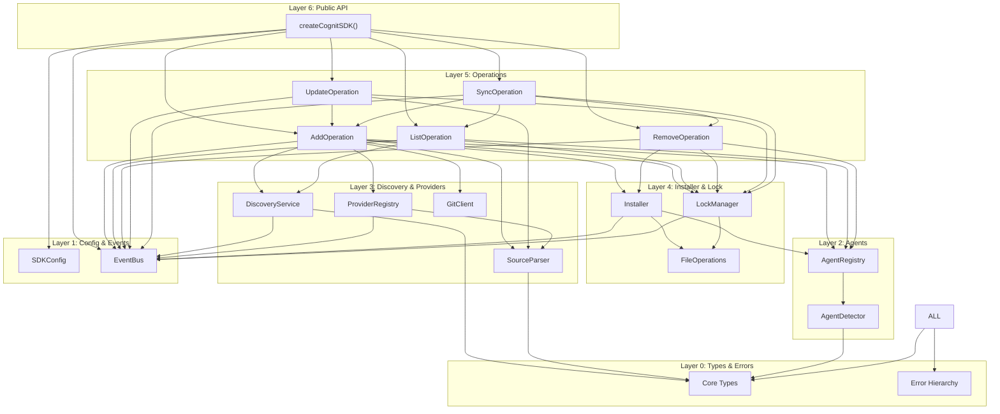
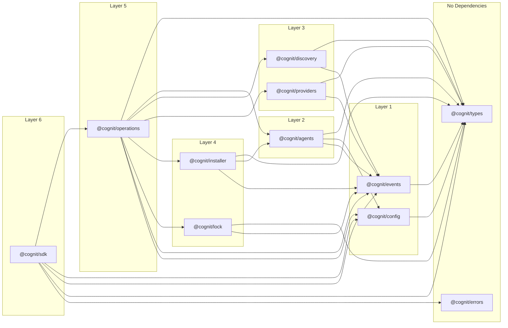
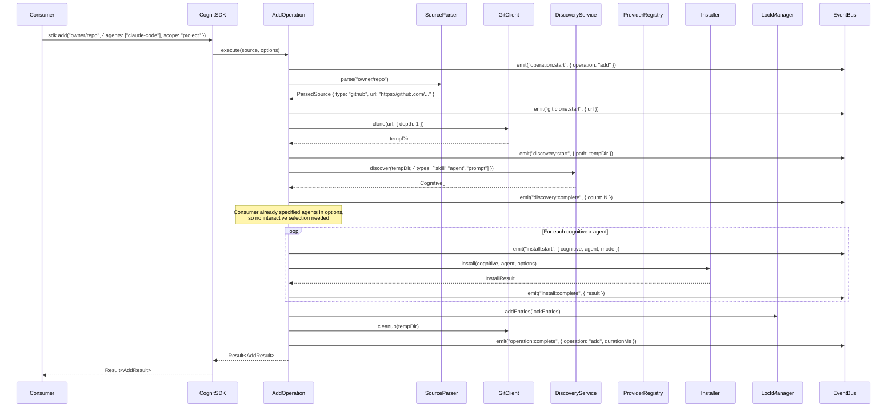

# 01 - SDK Core Architecture

**Author:** Agent A -- SDK Core Architect
**Date:** 2026-02-09
**Status:** Plan

---

## 1. Design Principles

1. **Interface-agnostic** -- The SDK never reads stdin, writes to stdout, or prompts the user. It returns data; consumers decide how to present it.
2. **Composition over singletons** -- Every service receives its dependencies through constructor injection. No module-level mutable state.
3. **Events, not console.log** -- The SDK emits typed events for observability. Zero direct I/O.
4. **Result over exceptions** -- Operations return `Result<T, E>` for expected failures. Only truly unexpected conditions throw.
5. **Strict TypeScript** -- No `any`. Minimal `unknown` (only at deserialization boundaries). Const maps instead of enums. Branded types for domain identifiers.
6. **ESM-only, Node >= 20** -- No CommonJS, no dual-build. Modern baseline.
7. **Testable by default** -- Every module depends on interfaces, not implementations. All I/O abstracted behind injectable adapters.

---

## 2. Layered Architecture

```
Layer 0: Types & Errors       (pure types, zero dependencies)
Layer 1: Config & Events       (SDK configuration, event bus)
Layer 2: Agents & Registry     (agent definitions, detection)
Layer 3: Discovery & Providers (filesystem scanning, remote fetching)
Layer 4: Lock & Installer      (lock file management, file operations)
Layer 5: Operations            (add, remove, list, update, sync)
Layer 6: Public API            (SDK facade, factory function)
```

Each layer may only import from layers below it. Never upward.

---

## 3. Component Diagram



---

## 4. Dependency Graph (strict layering)



Note: these are logical modules within a single package, not separate npm packages. The `@cognit/` prefix is notational only.

---

## 5. Composition Pattern (Dependency Injection)

The SDK uses **constructor injection** with a composition root at `createCognitSDK()`.

```typescript
// Composition root -- the ONLY place where concrete implementations are wired
export function createCognitSDK(userConfig?: Partial<SDKConfig>): CognitSDK {
  const config = resolveConfig(userConfig);
  const eventBus = new EventBusImpl();

  // Layer 2
  const agentRegistry = new AgentRegistryImpl(config, eventBus);
  const agentDetector = new AgentDetectorImpl(agentRegistry, config.fs);

  // Layer 3
  const sourceParser = new SourceParserImpl();
  const gitClient = new GitClientImpl(config, eventBus);
  const providerRegistry = new ProviderRegistryImpl(eventBus);
  registerDefaultProviders(providerRegistry, config);
  const discoveryService = new DiscoveryServiceImpl(config.fs, eventBus);

  // Layer 4
  const fileOps = new FileOperationsImpl(config.fs);
  const lockManager = new LockManagerImpl(config, fileOps, eventBus);
  const installer = new InstallerImpl(agentRegistry, fileOps, eventBus);

  // Layer 5
  const operations = {
    add: new AddOperation({ discoveryService, providerRegistry, sourceParser, gitClient, installer, lockManager, agentRegistry, agentDetector, eventBus, config }),
    list: new ListOperation({ discoveryService, agentRegistry, lockManager, eventBus, config }),
    remove: new RemoveOperation({ installer, lockManager, agentRegistry, eventBus, config }),
    update: new UpdateOperation({ lockManager, sourceParser, gitClient, discoveryService, providerRegistry, installer, agentRegistry, eventBus, config }),
    sync: new SyncOperation({ lockManager, installer, agentRegistry, agentDetector, eventBus, config }),
  };

  return new CognitSDKImpl(config, eventBus, operations, agentRegistry, providerRegistry);
}
```

### Why not singletons?

The existing cognit codebase uses a singleton `ProviderRegistryImpl` (`registry.ts:30`). This creates problems:
- Cannot run parallel SDK instances with different configs (e.g., testing)
- Cannot mock/replace for testing without module-level hacks
- Hidden dependencies -- consumers do not know what a module needs

With DI, every dependency is explicit, replaceable, and testable.

---

## 6. Error Handling Strategy

### 6.1 Error Hierarchy

All SDK errors extend a base `CognitError` class:

```
CognitError (abstract base)
  |-- ProviderError
  |     |-- ProviderFetchError
  |     |-- ProviderMatchError
  |-- InstallError
  |     |-- PathTraversalError
  |     |-- SymlinkError
  |     |-- FileWriteError
  |-- DiscoveryError
  |     |-- ParseError (frontmatter)
  |     |-- ScanError
  |-- LockError
  |     |-- LockReadError
  |     |-- LockWriteError
  |     |-- LockMigrationError
  |-- ConfigError
  |     |-- InvalidConfigError
  |-- SourceError
  |     |-- SourceParseError
  |     |-- GitCloneError
  |-- AgentError
  |     |-- AgentNotFoundError
  |     |-- AgentDetectionError
```

### 6.2 Result Pattern

For operations where failure is **expected** (e.g., fetching a remote cognitive that may not exist), we use a discriminated union:

```typescript
type Result<T, E extends CognitError = CognitError> =
  | { ok: true; value: T }
  | { ok: false; error: E };
```

For truly **unexpected** errors (programmer mistakes, impossible states), we throw.

### 6.3 Guidelines

| Scenario | Strategy |
|----------|----------|
| Remote fetch returns 404 | `Result` with `ProviderFetchError` |
| Lock file corrupted | `Result` with `LockReadError` |
| Path traversal detected | `Result` with `PathTraversalError` |
| Invalid SDK config | Throw `InvalidConfigError` at construction time |
| Module receives wrong type | Throw (programmer error) |

---

## 7. Event System

The SDK communicates progress, state changes, and diagnostics through a typed event bus. Consumers subscribe to events they care about.

### 7.1 Event Bus Interface

```typescript
interface EventBus {
  emit<K extends keyof SDKEventMap>(event: K, payload: SDKEventMap[K]): void;
  on<K extends keyof SDKEventMap>(event: K, handler: (payload: SDKEventMap[K]) => void): Unsubscribe;
  once<K extends keyof SDKEventMap>(event: K, handler: (payload: SDKEventMap[K]) => void): Unsubscribe;
}

type Unsubscribe = () => void;
```

### 7.2 Event Categories

```
sdk:initialized
sdk:error

operation:start         { operation: string, options: unknown }
operation:complete      { operation: string, result: unknown, durationMs: number }
operation:error         { operation: string, error: CognitError }

discovery:start         { path: string }
discovery:found         { cognitive: CognitiveRef, type: CognitiveType }
discovery:complete      { count: number, durationMs: number }

provider:fetch:start    { providerId: string, url: string }
provider:fetch:complete { providerId: string, url: string, found: boolean }

install:start           { cognitive: string, agent: string, mode: InstallMode }
install:symlink         { source: string, target: string }
install:copy            { source: string, target: string }
install:complete        { cognitive: string, agent: string, result: InstallResult }

lock:read               { path: string }
lock:write              { path: string, entryCount: number }
lock:migrate            { from: number, to: number }

git:clone:start         { url: string }
git:clone:complete      { url: string, path: string, durationMs: number }

agent:detect:start      { }
agent:detect:found      { agent: AgentType }
agent:detect:complete   { agents: AgentType[], durationMs: number }

progress:start          { id: string, message: string, total?: number }
progress:update         { id: string, message: string, current?: number }
progress:complete       { id: string, message: string }
```

### 7.3 Usage in a CLI consumer

```typescript
const sdk = createCognitSDK();

// Wire events to CLI spinner
sdk.on('progress:start', ({ message }) => spinner.start(message));
sdk.on('progress:update', ({ message }) => spinner.text = message);
sdk.on('progress:complete', ({ message }) => spinner.succeed(message));

// Wire events to verbose logging
sdk.on('git:clone:start', ({ url }) => log.debug(`Cloning ${url}...`));
```

---

## 8. Configuration System

### 8.1 SDKConfig Shape

```typescript
interface SDKConfig {
  /** Base directory for canonical cognitive storage. Default: '.agents' */
  agentsDir: string;

  /** Lock file name. Default: '.cognit-lock.json' */
  lockFileName: string;

  /** Working directory. Default: process.cwd() */
  cwd: string;

  /** Home directory for global installs. Default: os.homedir() */
  homeDir: string;

  /** Filesystem adapter for testability */
  fs: FileSystemAdapter;

  /** Git configuration */
  git: {
    /** Clone timeout in ms. Default: 30_000 */
    cloneTimeoutMs: number;
    /** Shallow clone depth. Default: 1 */
    depth: number;
  };

  /** Provider configuration */
  providers: {
    /** GitHub token for API calls. Auto-detected if not provided. */
    githubToken?: string;
    /** Custom provider registrations */
    custom?: HostProvider[];
  };

  /** Agent configuration */
  agents: {
    /** Path to directory containing agent YAML definitions */
    definitionsPath?: string;
    /** Additional agent configs to register at runtime */
    additional?: AgentConfig[];
  };

  /** Telemetry configuration */
  telemetry: {
    /** Enable/disable telemetry. Default: true */
    enabled: boolean;
    /** Custom telemetry endpoint */
    endpoint?: string;
  };
}
```

### 8.2 Resolution Strategy

```typescript
function resolveConfig(partial?: Partial<SDKConfig>): SDKConfig {
  return {
    agentsDir: partial?.agentsDir ?? '.agents',
    lockFileName: partial?.lockFileName ?? '.cognit-lock.json',
    cwd: partial?.cwd ?? process.cwd(),
    homeDir: partial?.homeDir ?? homedir(),
    fs: partial?.fs ?? nodeFs,     // Real Node.js fs by default
    git: {
      cloneTimeoutMs: partial?.git?.cloneTimeoutMs ?? 30_000,
      depth: partial?.git?.depth ?? 1,
    },
    providers: {
      githubToken: partial?.providers?.githubToken ?? detectGitHubToken(),
      custom: partial?.providers?.custom ?? [],
    },
    agents: {
      definitionsPath: partial?.agents?.definitionsPath,
      additional: partial?.agents?.additional ?? [],
    },
    telemetry: {
      enabled: partial?.telemetry?.enabled ?? true,
      endpoint: partial?.telemetry?.endpoint,
    },
  };
}
```

Consumers only override what they need:

```typescript
// Minimal -- all defaults
const sdk = createCognitSDK();

// Testing -- inject a fake filesystem
const sdk = createCognitSDK({
  cwd: '/tmp/test-project',
  homeDir: '/tmp/test-home',
  fs: memoryFs,
  telemetry: { enabled: false },
});
```

---

## 9. FileSystem Adapter

All filesystem I/O goes through an injectable adapter. This enables:
- Unit testing without touching the real filesystem
- Future portability (browser, Deno, etc.)

```typescript
interface FileSystemAdapter {
  readFile(path: string, encoding: 'utf-8'): Promise<string>;
  writeFile(path: string, content: string, encoding: 'utf-8'): Promise<void>;
  mkdir(path: string, options?: { recursive?: boolean }): Promise<void>;
  readdir(path: string, options?: { withFileTypes: true }): Promise<Dirent[]>;
  stat(path: string): Promise<Stats>;
  lstat(path: string): Promise<Stats>;
  symlink(target: string, path: string): Promise<void>;
  readlink(path: string): Promise<string>;
  rm(path: string, options?: { recursive?: boolean; force?: boolean }): Promise<void>;
  rename(oldPath: string, newPath: string): Promise<void>;
  exists(path: string): Promise<boolean>;
  copyDirectory(source: string, target: string): Promise<void>;
}
```

The default implementation wraps Node.js `fs/promises`. Tests use an in-memory implementation.

---

## 10. Interface-Agnostic Design

The SDK has **zero** awareness of:
- Terminals, colors, spinners
- stdin/stdout/stderr
- Interactive prompts
- CLI argument parsing
- HTTP servers or request/response cycles

### What the SDK returns vs what a CLI does

| SDK returns | CLI consumer does |
|-------------|-------------------|
| `Result<Cognitive[]>` | Renders a formatted table with picocolors |
| `AgentDetectionResult[]` | Shows a multi-select prompt |
| `InstallResult` with `symlinkFailed: true` | Prints a yellow warning |
| `progress:start` event | Starts an `ora` spinner |
| `CognitError` with structured data | Formats a human-readable error message |

The boundary is clear: the SDK produces **structured data and events**. The consumer produces **human-facing output**.

---

## 11. Public API Surface

### 11.1 Exports

```typescript
// Main entry point
export { createCognitSDK } from './sdk.js';
export type { CognitSDK } from './sdk.js';

// Types (for consumers to use in their own code)
export type {
  Cognitive, CognitiveType, Skill, Prompt, Rule, AgentCognitive,
  AgentConfig, AgentType, AgentDetectionResult,
  ParsedSource, SourceDescriptor,
  InstallMode, InstallScope, InstallResult, InstallTarget,
  LockFile, LockEntry,
  SDKConfig,
  SDKEventMap,
  Result,
  HostProvider, ProviderMatch,
} from './types/index.js';

// Errors (for consumers to catch/match)
export {
  CognitError,
  ProviderError, ProviderFetchError,
  InstallError, PathTraversalError,
  DiscoveryError, ParseError,
  LockError,
  ConfigError,
  SourceError, GitCloneError,
  AgentError,
} from './errors/index.js';

// Category types
export type { Category, CategoryMapping } from './types/category.js';
```

### 11.2 SDK Facade Interface

```typescript
interface CognitSDK {
  // -- Operations --
  add(source: string, options?: AddOptions): Promise<Result<AddResult>>;
  list(options?: ListOptions): Promise<Result<ListResult>>;
  remove(name: string, options?: RemoveOptions): Promise<Result<RemoveResult>>;
  update(options?: UpdateOptions): Promise<Result<UpdateResult>>;
  sync(options?: SyncOptions): Promise<Result<SyncResult>>;

  // -- Registry access --
  readonly agents: AgentRegistry;
  readonly providers: ProviderRegistry;

  // -- Event subscription --
  on<K extends keyof SDKEventMap>(event: K, handler: (payload: SDKEventMap[K]) => void): Unsubscribe;
  once<K extends keyof SDKEventMap>(event: K, handler: (payload: SDKEventMap[K]) => void): Unsubscribe;

  // -- Config --
  readonly config: Readonly<SDKConfig>;

  // -- Lifecycle --
  dispose(): Promise<void>;
}
```

### 11.3 Internal vs Public modules

| Module | Public | Internal |
|--------|--------|----------|
| `types/` | All type exports | -- |
| `errors/` | All error classes | -- |
| `sdk.ts` | `createCognitSDK`, `CognitSDK` | `CognitSDKImpl` |
| `config/` | `SDKConfig` type | `resolveConfig()` |
| `events/` | `SDKEventMap`, `Unsubscribe` | `EventBusImpl` |
| `agents/` | `AgentRegistry` interface | `AgentRegistryImpl`, `AgentDetectorImpl` |
| `providers/` | `HostProvider`, `ProviderRegistry` interface | Concrete providers |
| `discovery/` | -- | `DiscoveryServiceImpl` |
| `installer/` | -- | `InstallerImpl`, `FileOperationsImpl` |
| `lock/` | -- | `LockManagerImpl` |
| `operations/` | Operation option/result types | Operation implementations |

---

## 12. Data Flow: `sdk.add("owner/repo")`



---

## 13. Directory Structure (SDK Package)

```
src/
  index.ts                    # Public exports
  sdk.ts                      # createCognitSDK(), CognitSDKImpl

  types/
    index.ts                  # Barrel exports for all types
    cognitive.ts              # Cognitive, CognitiveType, Skill, Prompt, Rule, Agent
    agent.ts                  # AgentConfig, AgentType, AgentDetectionResult
    provider.ts               # HostProvider, ProviderMatch, SourceDescriptor
    installer.ts              # InstallMode, InstallScope, InstallResult, InstallTarget
    lock.ts                   # LockFile, LockEntry, LockVersion
    operations.ts             # AddOptions, ListOptions, RemoveOptions, etc.
    category.ts               # Category, CategoryMapping
    config.ts                 # SDKConfig
    events.ts                 # SDKEventMap, event payload types
    result.ts                 # Result<T, E>
    branded.ts                # AgentName, CognitiveName, branded type helpers

  errors/
    index.ts                  # Barrel exports
    base.ts                   # CognitError
    provider.ts               # ProviderError, ProviderFetchError
    install.ts                # InstallError, PathTraversalError, SymlinkError
    discovery.ts              # DiscoveryError, ParseError
    lock.ts                   # LockError, LockReadError, LockWriteError
    config.ts                 # ConfigError, InvalidConfigError
    source.ts                 # SourceError, SourceParseError, GitCloneError
    agent.ts                  # AgentError, AgentNotFoundError

  config/
    index.ts                  # resolveConfig()
    defaults.ts               # Default values
    validation.ts             # Config validation

  events/
    index.ts                  # EventBusImpl
    types.ts                  # Re-export from types/events.ts

  agents/
    index.ts                  # AgentRegistryImpl
    registry.ts               # Registry logic
    detector.ts               # AgentDetectorImpl
    __generated__/
      agents.ts               # Compiled agent configs (from YAML)
      agent-type.ts           # AgentType union
      cognitive-types.ts      # CognitiveType union + constants

  discovery/
    index.ts                  # DiscoveryServiceImpl
    scanner.ts                # Filesystem scanning logic
    parser.ts                 # Frontmatter parsing
    plugin-manifest.ts        # Claude plugin manifest support

  providers/
    index.ts                  # ProviderRegistryImpl, registerDefaultProviders
    registry.ts               # Registry implementation
    mintlify.ts               # MintlifyProvider
    huggingface.ts            # HuggingFaceProvider
    wellknown.ts              # WellKnownProvider
    direct.ts                 # DirectURLProvider
    github.ts                 # GitHubProvider (new: native GitHub API provider)

  source/
    index.ts                  # SourceParserImpl
    parser.ts                 # URL/path parsing
    git.ts                    # GitClientImpl

  installer/
    index.ts                  # InstallerImpl
    file-ops.ts               # FileOperationsImpl
    paths.ts                  # Path sanitization, canonical dirs
    symlink.ts                # Symlink creation with fallback

  lock/
    index.ts                  # LockManagerImpl
    reader.ts                 # Lock file reading + migration
    writer.ts                 # Lock file writing
    hash.ts                   # Content hashing, GitHub tree SHA

  operations/
    index.ts                  # Operation barrel
    add.ts                    # AddOperation
    list.ts                   # ListOperation
    remove.ts                 # RemoveOperation
    update.ts                 # UpdateOperation
    sync.ts                   # SyncOperation

  fs/
    index.ts                  # FileSystemAdapter, nodeFs default
    node.ts                   # Node.js fs/promises wrapper
    memory.ts                 # In-memory implementation (for tests)
```

---

## 14. Package Configuration

```jsonc
// package.json (relevant fields)
{
  "name": "@synapsync/cognit-sdk",
  "type": "module",
  "exports": {
    ".": {
      "types": "./dist/index.d.ts",
      "import": "./dist/index.js"
    }
  },
  "types": "./dist/index.d.ts",
  "files": ["dist"],
  "engines": {
    "node": ">=20"
  },
  "scripts": {
    "build": "tsc",
    "test": "vitest",
    "compile-agents": "tsx scripts/compile-agents.ts",
    "prebuild": "npm run compile-agents"
  }
}
```

```jsonc
// tsconfig.json (relevant fields)
{
  "compilerOptions": {
    "target": "ES2022",
    "module": "NodeNext",
    "moduleResolution": "NodeNext",
    "strict": true,
    "noUncheckedIndexedAccess": true,
    "exactOptionalPropertyTypes": true,
    "declaration": true,
    "declarationMap": true,
    "sourceMap": true,
    "outDir": "dist",
    "rootDir": "src"
  }
}
```

---

## 15. Testability Strategy

### 15.1 Injectable Everything

Every module depends on interfaces. Tests inject mock/stub/fake implementations:

```typescript
// Testing the AddOperation without real filesystem or git
const fakeFs = createMemoryFs({ /* seed files */ });
const fakeGit = { clone: async () => '/tmp/fake-clone' };
const fakeEventBus = createCapturingEventBus(); // records all emitted events

const addOp = new AddOperation({
  discoveryService: new DiscoveryServiceImpl(fakeFs, fakeEventBus),
  gitClient: fakeGit,
  installer: new InstallerImpl(agentRegistry, new FileOperationsImpl(fakeFs), fakeEventBus),
  // ...
});

const result = await addOp.execute('owner/repo', { agents: ['claude-code'] });
assert(result.ok);
assert.equal(fakeEventBus.events.length, 8); // verify event sequence
```

### 15.2 Test Categories

| Category | What it tests | Dependencies |
|----------|--------------|--------------|
| Unit | Individual functions, parsers, validators | None (pure functions) |
| Integration | Module interactions (e.g., Installer + FileOps) | In-memory FS |
| Contract | Provider implementations against interface | HTTP mocks |

### 15.3 No Global State

Because there are no singletons:
- Tests run in parallel safely
- No test pollution between runs
- No `beforeEach` cleanup of global registries

---

## 16. Migration Path from Existing Cognit

The existing codebase (`/Users/rperaza/joicodev/owned/SynapSync/projects/cognit`) maps to the new architecture:

| Existing module | New SDK module | Key changes |
|-----------------|----------------|-------------|
| `core/types.ts` | `types/` | Split into focused files, add branded types |
| `core/__generated__/` | `agents/__generated__/` | Same code generation, new home |
| `services/registry/` | `agents/` | Inject deps instead of singleton |
| `services/discovery/` | `discovery/` | Accept `FileSystemAdapter` |
| `services/source/` | `source/` | Extract interface, inject git |
| `services/installer/` | `installer/` | Unify 3 install functions into one |
| `services/lock/` | `lock/` | Accept `FileSystemAdapter`, inject config |
| `providers/` | `providers/` | Replace singleton with injected registry |
| `providers/registry.ts` (singleton) | `providers/registry.ts` (class) | Receives deps via constructor |
| `commands/*.ts` | `operations/` | Pure logic, no UI, returns `Result` |
| `ui/` | **Not in SDK** | Stays in CLI consumer |
| `utils/logger.ts` | **Not in SDK** | Replaced by event system |

### What gets dropped from the SDK

- All `@deprecated` aliases (`Skill`, `RemoteSkill`, etc.)
- All UI code (`ui/`, `@clack/prompts`, `ora`, `picocolors`)
- Direct `console.log` / `process.stdout` usage
- `process.argv` parsing
- Telemetry to `add-skill.vercel.sh` (replaced by configurable endpoint)
- The `find` command (depends on `skills.sh` external API -- becomes a consumer-level feature)

---

## 17. Extensibility Points

### 17.1 Custom Providers

```typescript
const sdk = createCognitSDK({
  providers: {
    custom: [myCustomProvider],
  },
});
```

### 17.2 Custom Agent Definitions

```typescript
const sdk = createCognitSDK({
  agents: {
    additional: [{
      name: 'my-internal-agent',
      displayName: 'Internal Agent',
      dirs: { skill: { local: '.internal/skills', global: undefined } },
      detectInstalled: async () => true,
    }],
  },
});
```

### 17.3 Custom Cognitive Types (Future)

The type system is designed so `CognitiveType` can be extended. The YAML-based configuration (`config/cognitive-types.yaml`) already supports this -- adding a new type is a YAML edit + rebuild.

For runtime extensibility (future), the SDK could accept additional cognitive type definitions in config:

```typescript
const sdk = createCognitSDK({
  cognitiveTypes: {
    additional: [{ name: 'workflow', subdir: 'workflows', fileName: 'WORKFLOW.md' }],
  },
});
```

This is not in the initial scope but the architecture supports it.

---

## 18. Concurrency Model

- All operations are `async` and non-blocking
- Discovery scans directories in parallel (existing pattern preserved)
- Installation of multiple cognitives across multiple agents can be parallelized
- Lock file access is serialized per SDK instance (in-memory queue)
- The `dispose()` method waits for in-flight operations before resolving

---

## 19. Security Considerations

Preserved from existing codebase:
- Path traversal prevention (`sanitizeName`, `isPathSafe`, `isContainedIn`)
- Temp directory containment
- Plugin manifest path validation
- No arbitrary code execution

Added in SDK:
- `FileSystemAdapter` can enforce sandboxing
- Config validation prevents injection of malicious paths
- Provider URLs validated before fetching
- Git clone targets validated and contained

---

## 20. Key Design Decisions

| Decision | Choice | Rationale |
|----------|--------|-----------|
| DI vs singletons | DI | Testability, parallelism, explicitness |
| Result vs exceptions | Hybrid | Result for expected failures, throw for bugs |
| Events vs callbacks | Events | Decoupled, multiple listeners, composable |
| Single package vs monorepo | Single package | Simpler, no version coordination overhead |
| ESM-only | Yes | Modern baseline, Node 20+, no CJS baggage |
| Enums vs const maps | Const maps | Better type inference, tree-shakeable, no runtime overhead |
| In-memory FS for tests | Yes | Fast, deterministic, no cleanup needed |
| Unify 3 installer functions | Yes | Existing `installCognitive`, `installRemoteCognitive`, `installWellKnown` share 80% logic |
