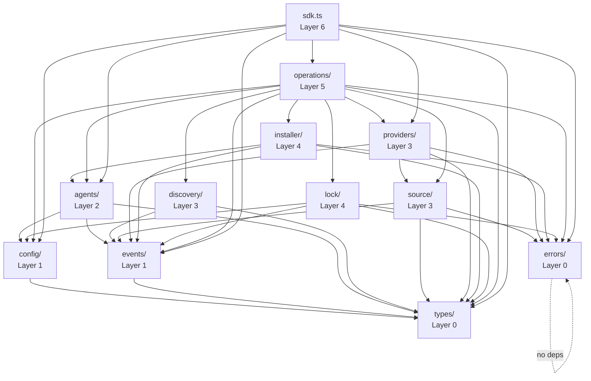

# 03 - Module Breakdown & Dependency Analysis

**Author:** Agent A -- SDK Core Architect
**Date:** 2026-02-09
**Status:** Plan

---

## 1. Module Dependency Graph



---

## 2. Module Details

### 2.1 `types/` -- Core Type Definitions

**Layer:** 0 (no dependencies)
**Responsibility:** All TypeScript type definitions, branded types, result utilities, and const maps.

#### Public API
```typescript
// Everything is exported -- this is the shared vocabulary
export type { Cognitive, CognitiveType, CognitiveRef, Skill, Prompt, Rule, AgentCognitive }
export type { RemoteCognitive, WellKnownCognitive }
export type { AgentConfig, AgentType, AgentDirConfig, AgentDetectionResult, AgentRegistry }
export type { HostProvider, ProviderMatch, ProviderRegistry, SourceDescriptor, SourceParser, GitClient }
export type { InstallMode, InstallScope, InstallTarget, InstallResult, InstallRequest, Installer }
export type { LockFile, LockEntry, LockManager }
export type { AddOptions, AddResult, ListOptions, ListResult, RemoveOptions, RemoveResult, UpdateOptions, UpdateResult, SyncOptions, SyncResult }
export type { Category, CategoryMapping }
export type { SDKConfig, FileSystemAdapter, GitConfig, ProviderConfig, AgentRegistryConfig, TelemetryConfig }
export type { SDKEventMap, EventBus, Unsubscribe }
export type { Result }
export type { AgentName, CognitiveName, SafeName, SourceIdentifier }

export { COGNITIVE_TYPE_CONFIGS, COGNITIVE_SUBDIRS, COGNITIVE_FILE_NAMES, AGENTS_DIR }
export { DEFAULT_CATEGORIES }
export { ok, err, unwrap, mapResult }
export { agentName, cognitiveName, safeName, sourceIdentifier }
```

#### Internal API
None -- all types are public.

#### Dependencies
None.

#### File Structure
```
types/
  index.ts          # Barrel re-exports
  cognitive.ts      # Cognitive, CognitiveType, RemoteCognitive, CognitiveRef
  agent.ts          # AgentConfig, AgentType, AgentDetectionResult, AgentRegistry
  provider.ts       # HostProvider, ProviderMatch, ProviderRegistry, SourceDescriptor, SourceParser, GitClient
  installer.ts      # InstallMode, InstallScope, InstallTarget, InstallResult, Installer
  lock.ts           # LockFile, LockEntry, LockManager
  operations.ts     # AddOptions, AddResult, ListOptions, etc.
  category.ts       # Category, CategoryMapping
  config.ts         # SDKConfig, FileSystemAdapter
  events.ts         # SDKEventMap, EventBus, Unsubscribe
  result.ts         # Result<T,E>, ok(), err(), unwrap()
  branded.ts        # AgentName, CognitiveName, SafeName, SourceIdentifier + constructors
```

#### Testing Strategy
- **Pure type tests**: Compile-time only -- if it compiles, the types are correct.
- **Branded type constructors**: Unit tests for validation logic (reject bad inputs).
- **Result utilities**: Unit tests for `ok`, `err`, `unwrap`, `mapResult`.

---

### 2.2 `errors/` -- Error Hierarchy

**Layer:** 0 (no dependencies beyond types)
**Responsibility:** All typed error classes.

#### Public API
```typescript
export { CognitError }
export { ProviderError, ProviderFetchError, ProviderMatchError }
export { InstallError, PathTraversalError, SymlinkError, FileWriteError }
export { DiscoveryError, ParseError, ScanError }
export { LockError, LockReadError, LockWriteError, LockMigrationError }
export { ConfigError, InvalidConfigError }
export { SourceError, SourceParseError, GitCloneError }
export { AgentError, AgentNotFoundError, AgentDetectionError }
export { ERROR_CODES, type ErrorCode }
```

#### Internal API
None -- all errors are public.

#### Dependencies
None (errors reference no other modules).

#### File Structure
```
errors/
  index.ts          # Barrel re-exports
  base.ts           # CognitError abstract class
  provider.ts       # ProviderError, ProviderFetchError, ProviderMatchError
  install.ts        # InstallError, PathTraversalError, SymlinkError, FileWriteError
  discovery.ts      # DiscoveryError, ParseError, ScanError
  lock.ts           # LockError, LockReadError, LockWriteError, LockMigrationError
  config.ts         # ConfigError, InvalidConfigError
  source.ts         # SourceError, SourceParseError, GitCloneError
  agent.ts          # AgentError, AgentNotFoundError, AgentDetectionError
  codes.ts          # ERROR_CODES const map
```

#### Testing Strategy
- Unit tests: Verify `instanceof` hierarchy, `code` and `module` properties, `toJSON()` output.
- Error matching tests: Verify a `ProviderFetchError instanceof ProviderError` and `ProviderError instanceof CognitError`.

---

### 2.3 `config/` -- SDK Configuration

**Layer:** 1
**Responsibility:** Resolve, validate, and provide the SDK configuration.

#### Public API
```typescript
export type { SDKConfig } // re-exported from types/
```

#### Internal API
```typescript
export function resolveConfig(partial?: Partial<SDKConfig>): SDKConfig;
export function validateConfig(config: SDKConfig): void; // throws InvalidConfigError
```

#### Dependencies
- `types/` (SDKConfig, FileSystemAdapter)
- `errors/` (InvalidConfigError)

#### File Structure
```
config/
  index.ts          # resolveConfig(), validateConfig()
  defaults.ts       # Default values for each config field
  validation.ts     # Validation rules
```

#### Testing Strategy
- Unit tests: `resolveConfig()` with partial inputs, verify defaults are applied.
- Unit tests: `validateConfig()` rejects invalid configs (negative cwd, non-existent paths, etc.).
- Unit tests: Config merging -- partial overrides are applied correctly.

---

### 2.4 `events/` -- Event Bus

**Layer:** 1
**Responsibility:** Typed event emission and subscription.

#### Public API
```typescript
export type { EventBus, SDKEventMap, Unsubscribe } // re-exported from types/
```

#### Internal API
```typescript
export class EventBusImpl implements EventBus {
  emit<K extends keyof SDKEventMap>(event: K, payload: SDKEventMap[K]): void;
  on<K extends keyof SDKEventMap>(event: K, handler: (payload: SDKEventMap[K]) => void): Unsubscribe;
  once<K extends keyof SDKEventMap>(event: K, handler: (payload: SDKEventMap[K]) => void): Unsubscribe;
}

/** For tests: captures all emitted events */
export function createCapturingEventBus(): EventBus & {
  readonly events: Array<{ event: string; payload: unknown }>;
};
```

#### Dependencies
- `types/` (SDKEventMap, Unsubscribe)

#### File Structure
```
events/
  index.ts          # EventBusImpl, createCapturingEventBus
```

#### Testing Strategy
- Unit tests: Subscribe, emit, verify handler called with correct payload.
- Unit tests: `once` fires exactly once.
- Unit tests: Unsubscribe removes handler.
- Unit tests: `createCapturingEventBus` captures events in order.

---

### 2.5 `agents/` -- Agent Registry & Detection

**Layer:** 2
**Responsibility:** Manage agent configurations, detect installed agents, resolve agent-specific paths.

#### Public API (via interfaces)
```typescript
export type { AgentRegistry } // interface from types/
```

#### Internal API
```typescript
export class AgentRegistryImpl implements AgentRegistry {
  constructor(config: SDKConfig, eventBus: EventBus);
  getAll(): ReadonlyMap<AgentType, AgentConfig>;
  get(type: AgentType): AgentConfig | undefined;
  getUniversalAgents(cognitiveType?: CognitiveType): AgentType[];
  getNonUniversalAgents(cognitiveType?: CognitiveType): AgentType[];
  isUniversal(type: AgentType, cognitiveType?: CognitiveType): boolean;
  getDir(type: AgentType, cognitiveType: CognitiveType, scope: 'local' | 'global'): string | undefined;
  detectInstalled(): Promise<AgentDetectionResult[]>;
  register(config: AgentConfig): void;
}
```

#### Dependencies
- `types/` (AgentConfig, AgentType, CognitiveType, AgentDetectionResult, SDKConfig)
- `config/` (SDKConfig for homeDir, agents.additional)
- `events/` (EventBus for agent:detect:* events)

#### Interfaces Consumed
- `SDKConfig` (from config)
- `EventBus` (from events)
- `FileSystemAdapter` (from config, for detection)

#### File Structure
```
agents/
  index.ts                  # AgentRegistryImpl
  registry.ts               # Core registry logic
  detector.ts               # Detection logic (filesystem checks)
  __generated__/
    agents.ts               # Compiled agent configs Record<AgentType, AgentConfig>
    agent-type.ts           # AgentType union type
    cognitive-types.ts      # CognitiveType union + COGNITIVE_* constants
```

#### Circular Dependency Prevention
- The `agents/` module imports from `types/` and `config/` only.
- It does NOT import from `installer/`, `lock/`, `discovery/`, or `operations/`.
- The `__generated__/` files are pure data -- no imports from the rest of the SDK.

#### Testing Strategy
- Unit tests: `AgentRegistryImpl.getAll()`, `.get()`, `.getUniversalAgents()`.
- Unit tests: `register()` adds agents, rejects duplicates.
- Integration tests: `detectInstalled()` with mock filesystem (seed agent directories, verify detection).
- Contract tests: Verify generated agents match expected shape.

---

### 2.6 `discovery/` -- Cognitive Discovery

**Layer:** 3
**Responsibility:** Scan filesystem directories to find cognitive files (SKILL.md, AGENT.md, PROMPT.md, RULE.md), parse their frontmatter, and return structured `Cognitive` objects.

#### Public API (via interface)
```typescript
// No direct public export -- accessed through operations
```

#### Internal API
```typescript
export interface DiscoveryService {
  discover(basePath: string, options?: DiscoverOptions): Promise<Cognitive[]>;
  discoverByType(basePath: string, type: CognitiveType, options?: DiscoverOptions): Promise<Cognitive[]>;
}

export interface DiscoverOptions {
  subpath?: string;
  types?: CognitiveType[];
  includeInternal?: boolean;
  fullDepth?: boolean;
}

export class DiscoveryServiceImpl implements DiscoveryService {
  constructor(fs: FileSystemAdapter, eventBus: EventBus);
}
```

#### Dependencies
- `types/` (Cognitive, CognitiveType, CognitiveRef, COGNITIVE_FILE_NAMES, COGNITIVE_SUBDIRS)
- `events/` (EventBus for discovery:* events)

#### Interfaces Consumed
- `FileSystemAdapter` (for readdir, readFile, stat)
- `EventBus` (for event emission)

#### External Dependencies
- `gray-matter` (YAML frontmatter parsing)

#### File Structure
```
discovery/
  index.ts              # DiscoveryServiceImpl
  scanner.ts            # Filesystem scanning logic (findCognitiveDirs, buildPrioritySearchDirs)
  parser.ts             # Frontmatter parsing (parseCognitiveMd, hasCognitiveMd)
  plugin-manifest.ts    # Claude plugin manifest support
```

#### Testing Strategy
- Unit tests: `parser.ts` -- parse valid/invalid frontmatter, verify Cognitive shape.
- Unit tests: `scanner.ts` -- with in-memory FS, seed directories, verify discovery.
- Integration tests: Full `DiscoveryServiceImpl.discover()` with realistic directory structures.
- Edge cases: Empty directories, missing frontmatter, internal=true filtering.

---

### 2.7 `providers/` -- Remote Host Providers

**Layer:** 3
**Responsibility:** Fetch cognitives from remote hosts (Mintlify, HuggingFace, well-known endpoints, direct URLs). Manage a registry of providers.

#### Public API (via interfaces)
```typescript
export type { HostProvider, ProviderRegistry, ProviderMatch } // from types/
```

#### Internal API
```typescript
export class ProviderRegistryImpl implements ProviderRegistry {
  constructor(eventBus: EventBus);
  register(provider: HostProvider): void;
  findProvider(url: string): HostProvider | null;
  getAll(): readonly HostProvider[];
}

export function registerDefaultProviders(registry: ProviderRegistry, config: SDKConfig): void;

// Concrete providers
export class MintlifyProvider implements HostProvider { /* ... */ }
export class HuggingFaceProvider implements HostProvider { /* ... */ }
export class WellKnownProvider implements HostProvider { /* ... */ }
export class DirectURLProvider implements HostProvider { /* ... */ }
```

#### Dependencies
- `types/` (HostProvider, ProviderMatch, RemoteCognitive, SourceIdentifier, CognitiveType)
- `events/` (EventBus for provider:fetch:* events)
- `errors/` (ProviderError, ProviderFetchError)
- `source/` (for URL manipulation in some providers)

#### Interfaces Consumed
- `EventBus`

#### External Dependencies
- `gray-matter` (frontmatter parsing in fetched content)

#### File Structure
```
providers/
  index.ts              # ProviderRegistryImpl, registerDefaultProviders
  registry.ts           # Registry implementation
  mintlify.ts           # MintlifyProvider
  huggingface.ts        # HuggingFaceProvider
  wellknown.ts          # WellKnownProvider
  direct.ts             # DirectURLProvider
```

#### Circular Dependency Prevention
- Providers import from `types/` and `events/` only.
- Providers do NOT import from `agents/`, `installer/`, `lock/`, or `operations/`.
- If a provider needs source parsing logic, it imports from `source/` (same layer, directional).

#### Testing Strategy
- Unit tests per provider: Mock HTTP responses, verify `match()`, `fetchCognitive()`, `toRawUrl()`.
- Unit tests: `ProviderRegistryImpl` -- register, findProvider, duplicate rejection.
- Contract tests: Verify each provider implements `HostProvider` correctly.

---

### 2.8 `source/` -- Source Parsing & Git

**Layer:** 3
**Responsibility:** Parse raw source strings (URLs, paths, shorthand) into structured `SourceDescriptor` objects. Manage git clone operations.

#### Internal API
```typescript
export class SourceParserImpl implements SourceParser {
  parse(source: string): SourceDescriptor;
  getOwnerRepo(source: SourceDescriptor): string | undefined;
}

export class GitClientImpl implements GitClient {
  constructor(config: SDKConfig, eventBus: EventBus);
  clone(url: string, options?: GitCloneOptions): Promise<string>;
  cleanup(tempDir: string): Promise<void>;
}
```

#### Dependencies
- `types/` (SourceDescriptor, ParsedSource, GitCloneOptions)
- `events/` (EventBus for git:clone:* events)
- `errors/` (SourceParseError, GitCloneError)

#### External Dependencies
- `simple-git` (git clone operations)

#### File Structure
```
source/
  index.ts          # Barrel exports
  parser.ts         # SourceParserImpl
  git.ts            # GitClientImpl
```

#### Testing Strategy
- Unit tests: `SourceParserImpl.parse()` with many input variants (GitHub URL, GitLab, local path, owner/repo shorthand, with subpath, with ref).
- Unit tests: `getOwnerRepo()` extraction.
- Integration tests: `GitClientImpl.clone()` with a mock git (or test repo).

---

### 2.9 `installer/` -- File Installation

**Layer:** 4
**Responsibility:** Install cognitives to agent directories via symlink or copy. Handle canonical directory structure, path safety, and fallback logic.

#### Internal API
```typescript
export class InstallerImpl implements Installer {
  constructor(agentRegistry: AgentRegistry, fileOps: FileOperations, eventBus: EventBus);

  install(request: InstallRequest, target: InstallTarget, options: InstallerOptions): Promise<InstallResult>;
  remove(cognitiveName: string, cognitiveType: CognitiveType, target: InstallTarget): Promise<boolean>;
}

export interface FileOperations {
  copyDirectory(source: string, target: string): Promise<void>;
  cleanAndCreateDirectory(dir: string): Promise<void>;
  createSymlink(source: string, target: string): Promise<boolean>;
  writeFile(path: string, content: string): Promise<void>;
  removeDirectory(dir: string): Promise<void>;
}

export class FileOperationsImpl implements FileOperations {
  constructor(fs: FileSystemAdapter);
}

// Path utilities
export function sanitizeName(raw: string): SafeName;
export function getCanonicalDir(cognitiveType: CognitiveType, isGlobal: boolean, cwd: string, homeDir: string): string;
export function isPathSafe(base: string, target: string): boolean;
export function isContainedIn(parent: string, child: string): boolean;
```

#### Dependencies
- `types/` (InstallRequest, InstallTarget, InstallResult, InstallMode, CognitiveType, SafeName)
- `agents/` (AgentRegistry for path resolution)
- `events/` (EventBus for install:* events)
- `errors/` (InstallError, PathTraversalError, SymlinkError)

#### Interfaces Consumed
- `AgentRegistry` (from agents)
- `FileSystemAdapter` (from config/types)
- `EventBus`

#### File Structure
```
installer/
  index.ts          # InstallerImpl
  file-ops.ts       # FileOperationsImpl
  paths.ts          # sanitizeName, getCanonicalDir, isPathSafe, isContainedIn
  symlink.ts        # Cross-platform symlink creation with fallback
```

#### Key Design Note: Unified Install Function
The existing codebase has 3 separate install functions:
- `installCognitiveForAgent()` -- local filesystem cognitive
- `installRemoteCognitiveForAgent()` -- single-file remote cognitive
- `installWellKnownCognitiveForAgent()` -- multi-file well-known cognitive

These share ~80% logic. The new SDK unifies them into a single `Installer.install()` that accepts a discriminated `InstallRequest` union:

```typescript
// Existing: 3 functions, lots of duplication
installCognitiveForAgent(cognitive, agentType, options)
installRemoteCognitiveForAgent(skill, agentType, options)
installWellKnownCognitiveForAgent(skill, agentType, options)

// New: 1 function with discriminated union input
installer.install(
  { kind: 'local', cognitive },      // or
  { kind: 'remote', cognitive },     // or
  { kind: 'wellknown', cognitive },
  target, options
)
```

#### Testing Strategy
- Unit tests: `sanitizeName()` with various inputs (spaces, slashes, dots, unicode).
- Unit tests: `isPathSafe()` with traversal attempts.
- Unit tests: `getCanonicalDir()` for project vs global.
- Integration tests: `InstallerImpl.install()` with in-memory FS:
  - Symlink mode: verify canonical dir and symlink created.
  - Copy mode: verify direct copy.
  - Symlink fallback: verify fallback to copy when symlink fails.
  - Universal agent: verify no symlink for global universal installs.
- Integration tests: `InstallerImpl.remove()` -- verify cleanup.

---

### 2.10 `lock/` -- Lock File Management

**Layer:** 4
**Responsibility:** Read, write, migrate, and query the `.cognit-lock.json` file.

#### Internal API
```typescript
export class LockManagerImpl implements LockManager {
  constructor(config: SDKConfig, fileOps: FileOperations, eventBus: EventBus);

  read(): Promise<LockFile>;
  write(lock: LockFile): Promise<void>;
  addEntry(name: string, entry: Omit<LockEntry, 'installedAt' | 'updatedAt'>): Promise<void>;
  removeEntry(name: string): Promise<boolean>;
  getEntry(name: string): Promise<LockEntry | null>;
  getAllEntries(): Promise<Readonly<Record<string, LockEntry>>>;
  getBySource(): Promise<ReadonlyMap<SourceIdentifier, { names: string[]; entry: LockEntry }>>;
  getLastSelectedAgents(): Promise<readonly string[] | undefined>;
  saveLastSelectedAgents(agents: readonly string[]): Promise<void>;
}

// Hash utilities
export function computeContentHash(content: string): string;
export function fetchCognitiveFolderHash(ownerRepo: string, cognitivePath: string, token?: string | null): Promise<string | null>;
```

#### Dependencies
- `types/` (LockFile, LockEntry, SourceIdentifier, CognitiveType)
- `config/` (SDKConfig for lock file path, homeDir)
- `events/` (EventBus for lock:* events)
- `errors/` (LockError, LockReadError, LockWriteError, LockMigrationError)

#### Interfaces Consumed
- `FileOperations` (from installer, for file I/O)
- `SDKConfig`
- `EventBus`

#### File Structure
```
lock/
  index.ts          # LockManagerImpl
  reader.ts         # Lock file reading, parsing, migration
  writer.ts         # Lock file writing
  hash.ts           # computeContentHash, fetchCognitiveFolderHash
```

#### Testing Strategy
- Unit tests: Read lock file with various versions (migration paths).
- Unit tests: Write and re-read round-trip.
- Unit tests: `addEntry()`, `removeEntry()`, `getEntry()`.
- Unit tests: `getBySource()` grouping logic.
- Unit tests: `computeContentHash()`.
- Integration tests: `fetchCognitiveFolderHash()` with mocked GitHub API.
- Edge cases: Empty lock file, corrupted JSON, old version wipe.

---

### 2.11 `operations/` -- SDK Operations

**Layer:** 5
**Responsibility:** Orchestrate the high-level operations (add, list, remove, update, sync) by composing lower-layer services.

#### Internal API
```typescript
interface OperationDeps {
  discoveryService: DiscoveryService;
  providerRegistry: ProviderRegistry;
  sourceParser: SourceParser;
  gitClient: GitClient;
  installer: Installer;
  lockManager: LockManager;
  agentRegistry: AgentRegistry;
  eventBus: EventBus;
  config: SDKConfig;
}

export class AddOperation {
  constructor(deps: OperationDeps);
  execute(source: string, options?: AddOptions): Promise<Result<AddResult>>;
}

export class ListOperation {
  constructor(deps: Pick<OperationDeps, 'discoveryService' | 'agentRegistry' | 'lockManager' | 'eventBus' | 'config'>);
  execute(options?: ListOptions): Promise<Result<ListResult>>;
}

export class RemoveOperation {
  constructor(deps: Pick<OperationDeps, 'installer' | 'lockManager' | 'agentRegistry' | 'eventBus' | 'config'>);
  execute(name: string, options?: RemoveOptions): Promise<Result<RemoveResult>>;
}

export class UpdateOperation {
  constructor(deps: OperationDeps);
  execute(options?: UpdateOptions): Promise<Result<UpdateResult>>;
}

export class SyncOperation {
  constructor(deps: Pick<OperationDeps, 'lockManager' | 'installer' | 'agentRegistry' | 'eventBus' | 'config'>);
  execute(options?: SyncOptions): Promise<Result<SyncResult>>;
}
```

#### Dependencies
- All lower layers (types, errors, config, events, agents, discovery, providers, source, installer, lock)

#### File Structure
```
operations/
  index.ts          # Barrel exports
  add.ts            # AddOperation
  list.ts           # ListOperation
  remove.ts         # RemoveOperation
  update.ts         # UpdateOperation
  sync.ts           # SyncOperation
```

#### Key Design Note: Operations are NOT CLI commands
The existing `commands/add.ts` (1,244 lines) mixes logic with UI. In the new SDK:
- `AddOperation` handles ONLY the logic (parse source, clone, discover, install, lock).
- It returns `Result<AddResult>` -- a data structure.
- It does NOT prompt the user, show spinners, or format output.
- If the consumer needs to select agents or cognitives interactively, they read the `discovered` field from an intermediate step and call back into the SDK.

#### Testing Strategy
- Unit tests per operation: Inject mocks for all dependencies, verify correct orchestration.
- Integration tests: Wire real implementations with in-memory FS, verify end-to-end.
- Error handling tests: Verify operations return `err(...)` for expected failures.
- Event verification: Ensure correct events are emitted in correct order.

---

### 2.12 `fs/` -- Filesystem Adapter

**Layer:** 0 (implementations at Layer 1)
**Responsibility:** Provide a `FileSystemAdapter` interface and implementations.

#### Public API
```typescript
export type { FileSystemAdapter, FsStats, Dirent } // from types/
```

#### Internal API
```typescript
export const nodeFs: FileSystemAdapter;  // Real Node.js fs/promises wrapper
export function createMemoryFs(seed?: Record<string, string>): FileSystemAdapter;
```

#### Dependencies
- `types/` (FileSystemAdapter interface)

#### File Structure
```
fs/
  index.ts          # Barrel exports
  node.ts           # Node.js fs/promises implementation
  memory.ts         # In-memory implementation for tests
```

#### Testing Strategy
- `node.ts`: Minimal -- wraps standard library.
- `memory.ts`: Unit tests verifying correct behavior (mkdir -p, readdir with types, symlink, etc.).

---

## 3. Cross-Cutting Concerns

### 3.1 Circular Dependency Prevention

The strict layering prevents cycles:

| Rule | Enforcement |
|------|-------------|
| Layer N imports only from layers < N | Code review + import linting |
| No lateral imports within the same layer (except `providers` -> `source`) | ESLint `no-restricted-imports` rules |
| `__generated__/` files import NOTHING from the SDK | Code generation script enforces this |
| `types/` and `errors/` have zero intra-SDK imports | Barrel structure prevents it |

ESLint configuration to enforce:

```json
{
  "rules": {
    "no-restricted-imports": ["error", {
      "patterns": [
        { "group": ["../operations/*"], "message": "Lower layers cannot import from operations/" },
        { "group": ["../sdk"], "message": "Only index.ts may import from sdk.ts" }
      ]
    }]
  }
}
```

### 3.2 Barrel Exports Pattern

Every module has an `index.ts` that controls its public surface:

```typescript
// agents/index.ts
export { AgentRegistryImpl } from './registry.js';
export type { AgentRegistry } from '../types/agent.js';
// Internal details (detector.ts internals) are NOT exported
```

### 3.3 Generated Code Management

```
Build-time pipeline:
  agents/*.yaml  ─┐
  config/cognitive-types.yaml ─┤──→  scripts/compile-agents.ts  ──→  agents/__generated__/
                               │                                       ├── agents.ts
                               │                                       ├── agent-type.ts
                                                                       └── cognitive-types.ts
```

Generated files:
- Are committed to the repository (for IDE support)
- Have a `// AUTO-GENERATED -- DO NOT EDIT` header
- Import nothing from the SDK
- Are regenerated by `npm run compile-agents`

---

## 4. How Modules Compose

### 4.1 Add Operation Flow

```
AddOperation
  ├── uses SourceParser.parse() to understand the source
  ├── uses GitClient.clone() for git sources
  ├── uses DiscoveryService.discover() to find cognitives in the cloned/local dir
  ├── uses ProviderRegistry.findProvider() for URL-based sources
  ├── uses Installer.install() for each cognitive x agent pair
  ├── uses LockManager.addEntry() to record the installation
  └── emits events via EventBus at each step
```

### 4.2 List Operation Flow

```
ListOperation
  ├── uses AgentRegistry.detectInstalled() to find active agents
  ├── uses DiscoveryService.discover() to scan agent directories
  ├── uses LockManager.getAllEntries() for metadata
  └── composes results into ListResult
```

### 4.3 Remove Operation Flow

```
RemoveOperation
  ├── uses LockManager.getEntry() to find the cognitive's metadata
  ├── uses AgentRegistry to resolve agent-specific paths
  ├── uses Installer.remove() to delete files/symlinks
  └── uses LockManager.removeEntry() to clean up the lock file
```

### 4.4 Update Operation Flow

```
UpdateOperation
  ├── uses LockManager.getAllEntries() to find installed cognitives
  ├── for each: uses fetchCognitiveFolderHash() to check for updates
  ├── for those with updates: re-runs the Add flow with updated source
  └── records new hashes in lock file
```

### 4.5 Sync Operation Flow

```
SyncOperation
  ├── uses LockManager.getAllEntries() to get what should be installed
  ├── uses AgentRegistry.detectInstalled() to find current agents
  ├── compares expected state vs actual state
  ├── uses Installer.install() to re-create missing symlinks/copies
  └── reports orphaned entries
```

---

## 5. Module Dependency Summary Table

| Module | Depends On | Depended On By |
|--------|-----------|---------------|
| `types/` | -- | Everything |
| `errors/` | -- | Everything except types |
| `config/` | types | agents, lock, operations, sdk |
| `events/` | types | agents, discovery, providers, source, installer, lock, operations, sdk |
| `fs/` | types | config (via adapter), discovery, installer, lock |
| `agents/` | types, config, events | installer, operations, sdk |
| `discovery/` | types, events, fs | operations |
| `providers/` | types, events, errors, source | operations, sdk |
| `source/` | types, events, errors | providers, operations |
| `installer/` | types, agents, events, errors, fs | operations |
| `lock/` | types, config, events, errors, fs | operations |
| `operations/` | everything above | sdk |
| `sdk.ts` | operations, config, events, types, errors, agents, providers | Consumer (public API) |

---

## 6. File Count Estimate

| Module | Files | Estimated LOC |
|--------|-------|---------------|
| `types/` | 12 | ~600 |
| `errors/` | 9 | ~250 |
| `config/` | 3 | ~120 |
| `events/` | 1 | ~80 |
| `fs/` | 3 | ~200 |
| `agents/` | 4 + 3 generated | ~300 + ~600 generated |
| `discovery/` | 4 | ~350 |
| `providers/` | 6 | ~800 |
| `source/` | 3 | ~350 |
| `installer/` | 4 | ~400 |
| `lock/` | 4 | ~350 |
| `operations/` | 6 | ~700 |
| `sdk.ts` + `index.ts` | 2 | ~150 |
| **Total** | **~64** | **~5,250** |

This is a significant reduction from the existing ~9,200 LOC because:
- No UI code (saves ~700 LOC)
- No CLI argument parsing (saves ~500 LOC)
- Unified install function (saves ~300 LOC)
- No deprecated aliases (saves ~200 LOC)
- No telemetry endpoint code (saves ~100 LOC)

---

## 7. Module Initialization Order

When `createCognitSDK()` is called:

```
1. resolveConfig()         → SDKConfig
2. new EventBusImpl()      → EventBus
3. new AgentRegistryImpl() → AgentRegistry (loads generated agents + config.agents.additional)
4. new SourceParserImpl()  → SourceParser
5. new GitClientImpl()     → GitClient
6. new ProviderRegistryImpl() + registerDefaultProviders() → ProviderRegistry
7. new DiscoveryServiceImpl() → DiscoveryService
8. new FileOperationsImpl() → FileOperations
9. new LockManagerImpl()   → LockManager
10. new InstallerImpl()    → Installer
11. Construct all operations → Operations
12. new CognitSDKImpl()    → CognitSDK
13. eventBus.emit('sdk:initialized')
```

No module needs async initialization. Everything is synchronous at construction time. Async detection (e.g., `detectInstalled()`) happens on demand.
