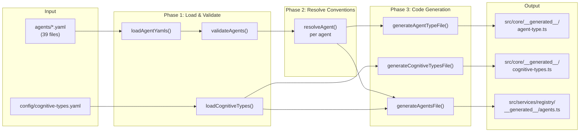
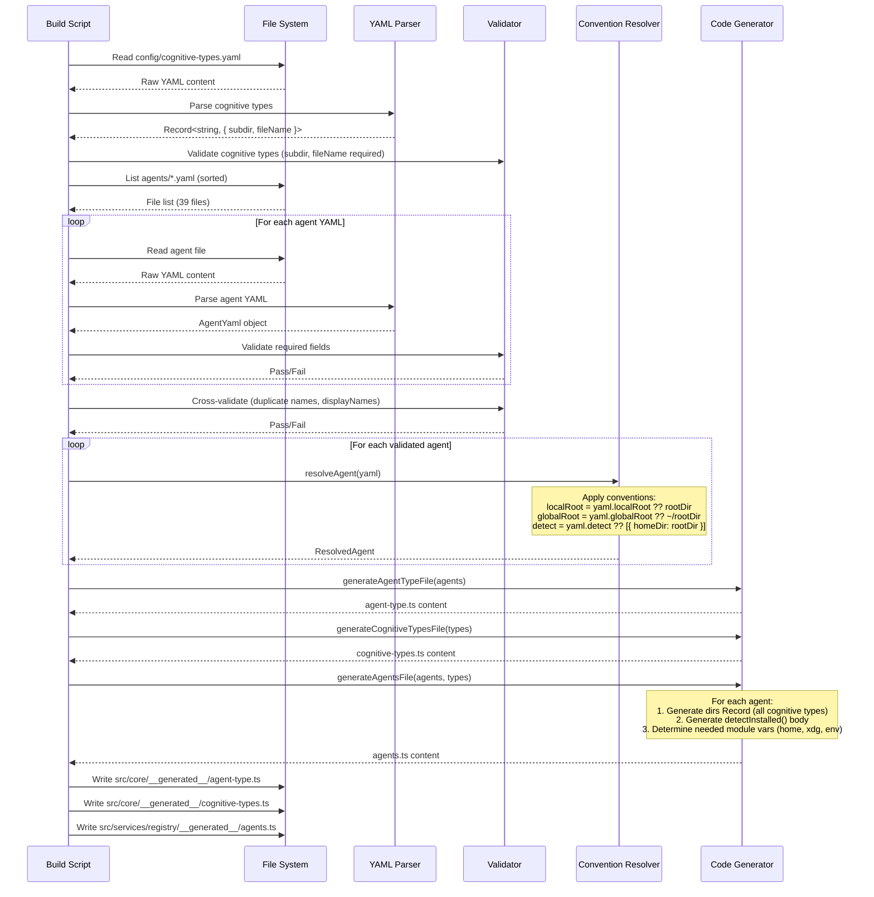

# 04 - Agent Configuration System

## 1. Overview

The agent configuration system is the bridge between the universal cognit SDK and the 39+ AI coding agents it targets. Each agent has unique directory conventions, detection methods, and platform behaviors. The system uses YAML files as the single source of truth, compiled to TypeScript at build time for zero-runtime parsing cost and full type safety.

---

## 2. YAML Schema Definition

### 2.1 Complete Field Reference

```yaml
# ── Required Fields ──────────────────────────────────────────────────────

name: string
# Unique machine identifier. Must match filename (e.g., claude-code.yaml -> name: claude-code).
# Pattern: /^[a-z0-9]([a-z0-9-]*[a-z0-9])?$/
# Used as the key in the generated agents Record<AgentType, AgentConfig>.

displayName: string
# Human-readable name shown in prompts, logs, and UI.
# Must be unique (case-insensitive) across all agents.
# Examples: "Claude Code", "GitHub Copilot", "OpenCode"

# ── Directory Resolution (one of rootDir or localRoot is required) ───────

rootDir: string?
# Shorthand: sets localRoot, globalRoot, and detect simultaneously via convention.
# - localRoot defaults to rootDir (e.g., ".cursor")
# - globalRoot defaults to "~/{rootDir}" (e.g., "~/.cursor")
# - detect defaults to [{ homeDir: rootDir }]
# Use rootDir for simple agents that follow the standard pattern.

localRoot: string?
# Explicit local (project-scoped) root directory.
# Relative to project root (cwd).
# Examples: ".cursor", ".agents", ".claude"
# If empty string "", cognitive subdirs are placed directly under cwd.

globalRoot: string | { firstExists: string[] }?
# Explicit global root directory. Supports:
# - Simple path:      "~/.cursor"
# - Env var:          "${XDG_CONFIG_HOME}/opencode"
# - Env with fallback: "${CODEX_HOME:~/.codex}"
# - First-exists:     { firstExists: ["${CLAUDE_CONFIG_DIR:~/.claude}", "~/.claude"] }
#
# Path variable substitution:
#   ~/             -> join(homedir(), ...)
#   ${XDG_CONFIG_HOME}/  -> join(xdgConfig ?? ~/.config, ...)
#   ${CODEX_HOME:fallback} -> process.env.CODEX_HOME?.trim() || fallback
#   ${CLAUDE_CONFIG_DIR:fallback} -> process.env.CLAUDE_CONFIG_DIR?.trim() || fallback

# ── Detection Rules ──────────────────────────────────────────────────────

detect: DetectRule[]?
# Array of detection rules. Agent is "installed" if ANY rule matches (OR logic).
# If omitted, defaults to [{ homeDir: rootDir }].
# Each rule checks for the existence of a path or environment variable.

# DetectRule is one of:
#   homeDir: string       -> existsSync(join(homedir(), value))
#   xdgConfig: string     -> existsSync(join(xdgConfig, value))
#   cwdDir: string        -> existsSync(join(cwd, value))
#   absolutePath: string  -> existsSync(value)
#   envVar: string        -> process.env[value] exists and path exists
#   envResolved: string   -> existsSync(resolvedEnvVar)  (e.g., "codexHome", "claudeHome")
#   envResolvedPath:      -> existsSync(join(resolvedVar, subpath))
#     var: string
#     subpath: string

# ── Optional Flags ───────────────────────────────────────────────────────

showInUniversalList: boolean?
# Whether this agent appears in the "universal agents" list.
# Default: true (omit to include).
# Set to false for agents that share .agents/ but shouldn't be auto-selected
# (e.g., replit, which uses .agents/ but is cloud-only).
```

### 2.2 Convention-Over-Configuration Defaults

When only `rootDir` is provided, the compiler applies these conventions:

| Field | Convention | Example (rootDir: `.cursor`) |
|---|---|---|
| `localRoot` | `= rootDir` | `.cursor` |
| `globalRoot` | `= ~/{rootDir}` | `~/.cursor` |
| `detect` | `= [{ homeDir: rootDir }]` | `[{ homeDir: ".cursor" }]` |
| `showInUniversalList` | `= true` (omitted) | `true` |

This means the simplest agent definition is just 3 lines:

```yaml
name: cursor
displayName: Cursor
rootDir: .cursor
```

---

## 3. Real Agent Examples

### 3.1 Minimal Agent (Convention-Driven)

```yaml
# agents/cursor.yaml
name: cursor
displayName: Cursor
rootDir: .cursor
```

**Resolved to:**
- localRoot: `.cursor`
- globalRoot: `~/.cursor`
- detect: `[{ homeDir: ".cursor" }]`
- dirs.skill: `{ local: ".cursor/skills", global: "~/.cursor/skills" }`

### 3.2 Environment Variable Agent

```yaml
# agents/claude-code.yaml
name: claude-code
displayName: Claude Code
rootDir: .claude
globalRoot: ${CLAUDE_CONFIG_DIR:~/.claude}
detect:
  - envResolved: claudeHome
```

**Key difference:** `globalRoot` uses an environment variable with a fallback. Detection checks the resolved `claudeHome` variable rather than a simple directory.

### 3.3 XDG-Compliant Agent

```yaml
# agents/opencode.yaml
name: opencode
displayName: OpenCode
localRoot: .agents
globalRoot: ${XDG_CONFIG_HOME}/opencode
detect:
  - xdgConfig: opencode
  - envResolvedPath:
      var: claudeHome
      subpath: skills
```

**Key differences:**
- Uses `.agents` as localRoot (shared with other agents).
- Global root follows XDG Base Directory spec.
- Two detection rules (OR): checks XDG config OR Claude's skills dir (because OpenCode can read Claude's skills).

### 3.4 Multi-Source Detection Agent

```yaml
# agents/codex.yaml
name: codex
displayName: Codex
localRoot: .agents
globalRoot: ${CODEX_HOME:~/.codex}
detect:
  - envResolved: codexHome
  - absolutePath: /etc/codex
```

**Key difference:** Detects via environment variable OR a system-wide absolute path (`/etc/codex`).

### 3.5 Non-Standard Global Path Agent

```yaml
# agents/windsurf.yaml
name: windsurf
displayName: Windsurf
rootDir: .windsurf
globalRoot: ~/.codeium/windsurf
detect:
  - homeDir: .codeium/windsurf
```

**Key difference:** Global root is NOT `~/.windsurf` -- it's `~/.codeium/windsurf`. Detection matches the actual global path, not the local rootDir.

### 3.6 Hidden-From-Universal Agent

```yaml
# agents/replit.yaml
name: replit
displayName: Replit
localRoot: .agents
globalRoot: ${XDG_CONFIG_HOME}/agents
showInUniversalList: false
detect:
  - cwdDir: .agents
```

**Key difference:** `showInUniversalList: false` means this agent won't be auto-selected when installing to "universal agents". Uses `cwdDir` detection (checks current working directory, not home).

### 3.7 Simple Home-Based Agent

```yaml
# agents/gemini-cli.yaml
name: gemini-cli
displayName: Gemini CLI
rootDir: .gemini
globalRoot: ~/.gemini
detect:
  - homeDir: .gemini
```

**Key difference:** Explicitly specifies `globalRoot` and `detect` even though they match conventions. This is valid and results in the same output.

---

## 4. Cognitive Type Subdirectories

### 4.1 Type Definition

Cognitive types are defined in `config/cognitive-types.yaml`:

```yaml
skill:
  subdir: skills
  fileName: SKILL.md

agent:
  subdir: agents
  fileName: AGENT.md

prompt:
  subdir: prompts
  fileName: PROMPT.md
```

### 4.2 Directory Structure Per Agent

For each agent, the compiler generates a `dirs` record that maps every cognitive type to local and global paths:

```
dirs: {
  skill:  { local: "{localRoot}/skills",  global: "{globalRoot}/skills"  },
  agent:  { local: "{localRoot}/agents",  global: "{globalRoot}/agents"  },
  prompt: { local: "{localRoot}/prompts", global: "{globalRoot}/prompts" },
}
```

**Example for `claude-code`:**

```
dirs: {
  skill:  { local: ".claude/skills",  global: join(claudeHome, "skills")  },
  agent:  { local: ".claude/agents",  global: join(claudeHome, "agents")  },
  prompt: { local: ".claude/prompts", global: join(claudeHome, "prompts") },
}
```

**Example for `opencode` (shared .agents):**

```
dirs: {
  skill:  { local: ".agents/skills",  global: join(configHome, "opencode/skills")  },
  agent:  { local: ".agents/agents",  global: join(configHome, "opencode/agents")  },
  prompt: { local: ".agents/prompts", global: join(configHome, "opencode/prompts") },
}
```

### 4.3 Adding a New Cognitive Type

To add a new type (e.g., `rule`):

1. Add to `config/cognitive-types.yaml`:
   ```yaml
   rule:
     subdir: rules
     fileName: RULE.md
   ```
2. Run the compile script. Every agent automatically gets `dirs.rule`.
3. No agent YAML files need modification.

---

## 5. Agent Detection

### 5.1 How Detection Works

Detection determines which AI coding agents are currently installed on the user's system. The SDK calls `detectInstalledAgents()` which runs all agent detection functions in parallel and returns the list of detected agents.

```typescript
async function detectInstalledAgents(): Promise<AgentType[]> {
  const results = await Promise.all(
    Object.entries(agents).map(async ([type, config]) => ({
      type: type as AgentType,
      installed: await config.detectInstalled(),
    }))
  );
  return results.filter((r) => r.installed).map((r) => r.type);
}
```

### 5.2 Detection Rules Reference

| Rule Type | What It Checks | Example |
|---|---|---|
| `homeDir` | `existsSync(join(homedir(), value))` | `homeDir: ".cursor"` checks `~/.cursor` |
| `xdgConfig` | `existsSync(join(xdgConfig, value))` | `xdgConfig: "opencode"` checks `~/.config/opencode` |
| `cwdDir` | `existsSync(join(cwd, value))` | `cwdDir: ".agents"` checks `./.agents` |
| `absolutePath` | `existsSync(value)` | `absolutePath: "/etc/codex"` |
| `envVar` | `process.env[value] ? existsSync(process.env[value]) : false` | `envVar: "CURSOR_HOME"` |
| `envResolved` | `existsSync(resolvedVar)` | `envResolved: "codexHome"` checks `$CODEX_HOME` or `~/.codex` |
| `envResolvedPath` | `existsSync(join(resolvedVar, subpath))` | Checks `join(claudeHome, "skills")` |

### 5.3 Detection Precedence

Multiple rules use OR logic: if ANY rule matches, the agent is detected as installed. This handles cases where agents can be installed in multiple locations (e.g., Codex via env var OR `/etc/codex`).

---

## 6. Compatibility Groups

### 6.1 Shared Directory Agents

Several agents share the `.agents/` local directory:

| localRoot | Agents |
|---|---|
| `.agents` | codex, opencode, github-copilot, amp, replit, mcpjam, kode, crush, pochi, qoder, ... |
| `.cursor` | cursor |
| `.claude` | claude-code |
| `.windsurf` | windsurf |
| `.roo` | roo |
| `.goose` | goose |
| `.gemini` | gemini-cli |

### 6.2 Universal Agents

Agents using `.agents` as their localRoot are "universal agents" -- they read from the same canonical location. When installing in symlink mode:

- The cognitive is written ONCE to `.agents/cognit/skills/<name>/`
- For universal agents, this IS the agent directory (no symlink needed)
- For non-universal agents (e.g., cursor), a symlink is created from `.cursor/skills/<name>` to the canonical location

### 6.3 Implications for the SDK

The SDK must track which agents share directories to:
1. Avoid duplicate installations (writing the same file twice to `.agents/skills/`)
2. Correctly determine "universal" agents for symlink optimization
3. Handle removal correctly (don't remove a shared cognitive if other agents still use it)

---

## 7. Compile Pipeline

### 7.1 Pipeline Overview



### 7.2 Phase 1: Load and Validate

**Step 1a: Load YAML files**
```
- Read all *.yaml files from agents/ directory
- Parse each with YAML parser
- For each file:
  - Verify "name" field exists
  - Verify "displayName" field exists
  - Verify name matches filename (claude-code.yaml must have name: claude-code)
  - Verify either "rootDir" or "localRoot" is specified
```

**Step 1b: Cross-Validate**
```
- Check for duplicate names
- Check for duplicate displayNames (case-insensitive)
- Fail build if any validation errors
```

**Step 1c: Load Cognitive Types**
```
- Read config/cognitive-types.yaml
- Validate each entry has "subdir" and "fileName"
- Return as Record<string, { subdir: string; fileName: string }>
```

### 7.3 Phase 2: Resolve Conventions

For each agent YAML, apply convention-over-configuration:

```
Input:  { name: "cursor", displayName: "Cursor", rootDir: ".cursor" }

Resolve:
  localRoot  = yaml.localRoot ?? yaml.rootDir        -> ".cursor"
  globalRoot = yaml.globalRoot ?? "~/" + yaml.rootDir -> "~/.cursor"
  detect     = yaml.detect ?? [{ homeDir: rootDir }]  -> [{ homeDir: ".cursor" }]

Output: ResolvedAgent {
  name: "cursor",
  displayName: "Cursor",
  localRoot: ".cursor",
  globalRoot: "~/.cursor",
  detect: [{ homeDir: ".cursor" }]
}
```

### 7.4 Phase 3: Code Generation

#### Output 1: `agent-type.ts`

```typescript
// AUTO-GENERATED by scripts/compile-agents.ts -- DO NOT EDIT
// Source: agents/*.yaml

export type AgentType =
  | 'amp'
  | 'claude-code'
  | 'codex'
  | 'cursor'
  // ... 35 more
  | 'zencoder';
```

#### Output 2: `cognitive-types.ts`

```typescript
// AUTO-GENERATED by scripts/compile-agents.ts -- DO NOT EDIT
// Source: config/cognitive-types.yaml

export type CognitiveType = 'skill' | 'agent' | 'prompt';

export const COGNITIVE_SUBDIRS: Record<CognitiveType, string> = {
  skill: 'skills',
  agent: 'agents',
  prompt: 'prompts',
};

export const COGNITIVE_FILE_NAMES: Record<CognitiveType, string> = {
  skill: 'SKILL.md',
  agent: 'AGENT.md',
  prompt: 'PROMPT.md',
};

export const AGENTS_DIR = '.agents';
```

#### Output 3: `agents.ts`

```typescript
// AUTO-GENERATED by scripts/compile-agents.ts -- DO NOT EDIT
// Source: agents/*.yaml

import { homedir } from 'os';
import { join } from 'path';
import { existsSync } from 'fs';
import { xdgConfig } from 'xdg-basedir';
import type { AgentConfig, AgentType } from '../../../core/types.ts';

const home = homedir();
const configHome = xdgConfig ?? join(home, '.config');
const codexHome = process.env.CODEX_HOME?.trim() || join(home, '.codex');
const claudeHome = process.env.CLAUDE_CONFIG_DIR?.trim() || join(home, '.claude');

export const agents: Record<AgentType, AgentConfig> = {
  'cursor': {
    name: 'cursor',
    displayName: 'Cursor',
    dirs: {
      skill: { local: '.cursor/skills', global: join(home, '.cursor/skills') },
      agent: { local: '.cursor/agents', global: join(home, '.cursor/agents') },
      prompt: { local: '.cursor/prompts', global: join(home, '.cursor/prompts') },
    },
    detectInstalled: async () => {
      return existsSync(join(home, '.cursor'));
    },
  },
  'claude-code': {
    name: 'claude-code',
    displayName: 'Claude Code',
    dirs: {
      skill: { local: '.claude/skills', global: join(claudeHome, 'skills') },
      agent: { local: '.claude/agents', global: join(claudeHome, 'agents') },
      prompt: { local: '.claude/prompts', global: join(claudeHome, 'prompts') },
    },
    detectInstalled: async () => {
      return existsSync(claudeHome);
    },
  },
  // ... 37 more agents
};
```

### 7.5 Detailed Code Generation Rules

**Global root expression generation:**

| YAML Pattern | Generated Code |
|---|---|
| `~/.cursor` | `join(home, '.cursor')` |
| `${XDG_CONFIG_HOME}/opencode` | `join(configHome, 'opencode')` |
| `${CODEX_HOME:~/.codex}` | `codexHome` (pre-resolved module var) |
| `${CLAUDE_CONFIG_DIR:~/.claude}` | `claudeHome` (pre-resolved module var) |
| `~/.codeium/windsurf` | `join(home, '.codeium/windsurf')` |
| `{ firstExists: [...] }` | `existsSync(p1) ? p1 : existsSync(p2) ? p2 : p3` |

**Detection body generation:**

| YAML Rule | Generated Code |
|---|---|
| `homeDir: ".cursor"` | `existsSync(join(home, '.cursor'))` |
| `xdgConfig: "opencode"` | `existsSync(join(configHome, 'opencode'))` |
| `cwdDir: ".agents"` | `existsSync(join(process.cwd(), '.agents'))` |
| `absolutePath: "/etc/codex"` | `existsSync('/etc/codex')` |
| `envResolved: "codexHome"` | `existsSync(codexHome)` |
| `envResolvedPath: { var: "claudeHome", subpath: "skills" }` | `existsSync(join(claudeHome, 'skills'))` |

---

## 8. Platform Handling

### 8.1 XDG Paths

The SDK uses `xdg-basedir` for cross-platform XDG support:

| Platform | `XDG_CONFIG_HOME` Default | Example |
|---|---|---|
| macOS | `~/.config` | `/Users/bob/.config` |
| Linux | `~/.config` | `/home/bob/.config` |
| Windows | `%APPDATA%` (via xdg-basedir) | `C:\Users\bob\AppData\Roaming` |

### 8.2 Environment Variables

Resolved at module load time (not compile time):

| Variable | Resolution |
|---|---|
| `CODEX_HOME` | `process.env.CODEX_HOME?.trim() \|\| join(home, '.codex')` |
| `CLAUDE_CONFIG_DIR` | `process.env.CLAUDE_CONFIG_DIR?.trim() \|\| join(home, '.claude')` |
| `XDG_CONFIG_HOME` | Via `xdg-basedir` package |

### 8.3 Path Separators

All YAML paths use forward slashes. The `join()` function in the generated code handles platform-specific separators at runtime.

### 8.4 Windows Symlink Support

Windows requires Developer Mode for symlinks. The installer detects symlink failure and falls back to copy mode transparently.

---

## 9. Validation Rules

### 9.1 Build-Time Validation

| Rule | Error Message |
|---|---|
| Missing `name` | `{file}: missing required field "name"` |
| Missing `displayName` | `{file}: missing required field "displayName"` |
| Name/filename mismatch | `{file}: name "{name}" does not match filename "{expected}"` |
| Missing rootDir and localRoot | `{file}: must specify either "rootDir" or "localRoot"` |
| Duplicate `name` | `Duplicate agent name: "{name}"` |
| Duplicate `displayName` (case-insensitive) | `Duplicate displayName "{name}" found in agents: {list}` |
| Unknown detect rule type | `Unknown detect rule: {json}` |

### 9.2 Name Format

Agent names must:
- Be lowercase alphanumeric with hyphens
- Match the YAML filename (without extension)
- Be unique across all agents

### 9.3 Cognitive Type Validation

Each cognitive type entry must have:
- `subdir`: non-empty string
- `fileName`: non-empty string

---

## 10. Adding a New Agent: Step-by-Step Guide

### Step 1: Create the YAML File

Create `agents/<agent-name>.yaml`:

```yaml
name: my-agent
displayName: My Agent
rootDir: .my-agent
```

### Step 2: Choose the Configuration Pattern

**Pattern A: Simple agent with own directory**
```yaml
name: my-agent
displayName: My Agent
rootDir: .my-agent
```

**Pattern B: Agent using shared .agents directory**
```yaml
name: my-agent
displayName: My Agent
localRoot: .agents
globalRoot: ${XDG_CONFIG_HOME}/my-agent
detect:
  - xdgConfig: my-agent
```

**Pattern C: Agent with environment variable**
```yaml
name: my-agent
displayName: My Agent
rootDir: .my-agent
globalRoot: ${MY_AGENT_HOME:~/.my-agent}
detect:
  - envVar: MY_AGENT_HOME
  - homeDir: .my-agent
```

### Step 3: Run the Compiler

```bash
npx tsx scripts/compile-agents.ts
```

This generates:
- Updated `AgentType` union including `'my-agent'`
- Updated `agents` Record with full config for `my-agent`
- All cognitive type directories auto-generated

### Step 4: Verify

```bash
npx tsx scripts/validate-agents.ts
```

### Step 5: Test Detection

The new agent is automatically included in `detectInstalledAgents()`. No code changes needed.

---

## 11. SDK Agent System Interfaces

### 11.1 Core Types

```typescript
/** Union of all known agent identifiers. Auto-generated. */
type AgentType = 'amp' | 'claude-code' | 'codex' | /* ... */ 'zencoder';

/** Union of all cognitive types. Auto-generated. */
type CognitiveType = 'skill' | 'agent' | 'prompt';

/** Runtime configuration for a single agent. */
interface AgentConfig {
  /** Machine identifier (matches AgentType) */
  name: string;
  /** Human-readable display name */
  displayName: string;
  /** Directory mappings per cognitive type */
  dirs: Record<CognitiveType, {
    /** Project-local directory (relative to cwd) */
    local: string;
    /** Global directory (absolute path, undefined if not supported) */
    global: string | undefined;
  }>;
  /** Async detection function: returns true if agent is installed */
  detectInstalled: () => Promise<boolean>;
  /** Whether to include in universal agents list */
  showInUniversalList?: boolean;
}
```

### 11.2 SDK Agent Registry Service

```typescript
interface AgentRegistryService {
  /** Get all registered agents */
  getAll(): Record<AgentType, AgentConfig>;

  /** Get a specific agent config */
  get(agentType: AgentType): AgentConfig;

  /** Detect which agents are installed on the system */
  detectInstalled(): Promise<AgentType[]>;

  /** Get agents that use the universal .agents directory */
  getUniversalAgents(): AgentType[];

  /** Check if an agent uses the universal directory for a given type */
  isUniversalForType(agentType: AgentType, cognitiveType: CognitiveType): boolean;

  /** Resolve the cognitive directory for an agent */
  getCognitiveDir(
    agentType: AgentType,
    cognitiveType: CognitiveType,
    scope: 'local' | 'global'
  ): string | undefined;
}
```

---

## 12. Compile Pipeline Diagram (Detailed)



---

## 13. Future Considerations

### 13.1 Runtime Agent Registration

The current system is fully compile-time. A future enhancement could allow runtime registration of custom agents:

```typescript
sdk.agents.register({
  name: 'my-custom-agent',
  displayName: 'My Custom Agent',
  dirs: { /* ... */ },
  detectInstalled: async () => existsSync('~/.my-agent'),
});
```

### 13.2 Agent Capability Metadata

Future YAML fields could describe agent capabilities:

```yaml
capabilities:
  supportsSkills: true
  supportsAgents: false
  supportsPrompts: true
  maxFileSize: 100000  # bytes
  symlinkSupport: true
```

### 13.3 Agent Versioning

Track which agent versions are compatible with which cognitive features:

```yaml
minimumVersion: "1.5.0"
features:
  multiFile: true       # since version X
  frontmatter: true     # since version Y
```
