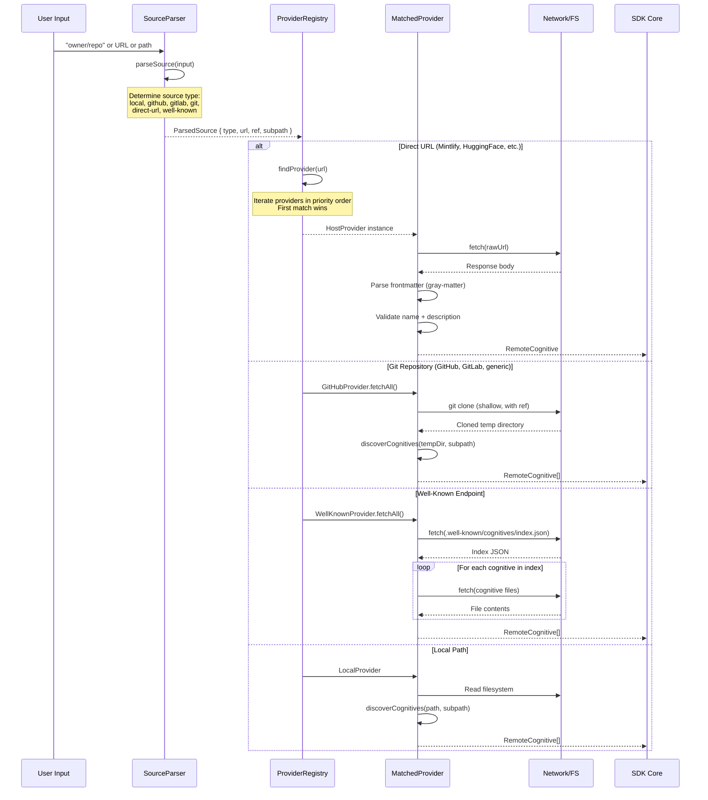
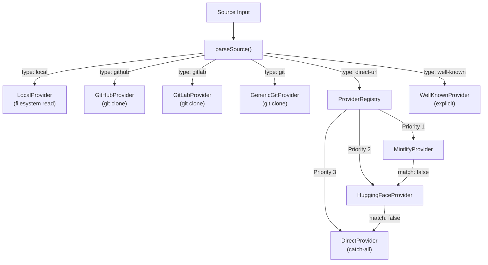
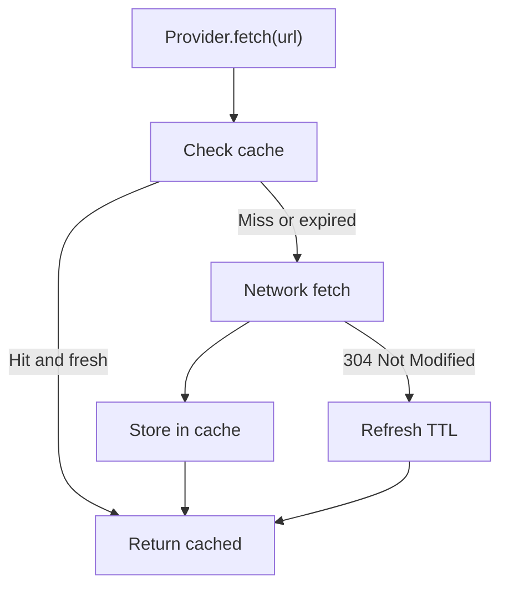
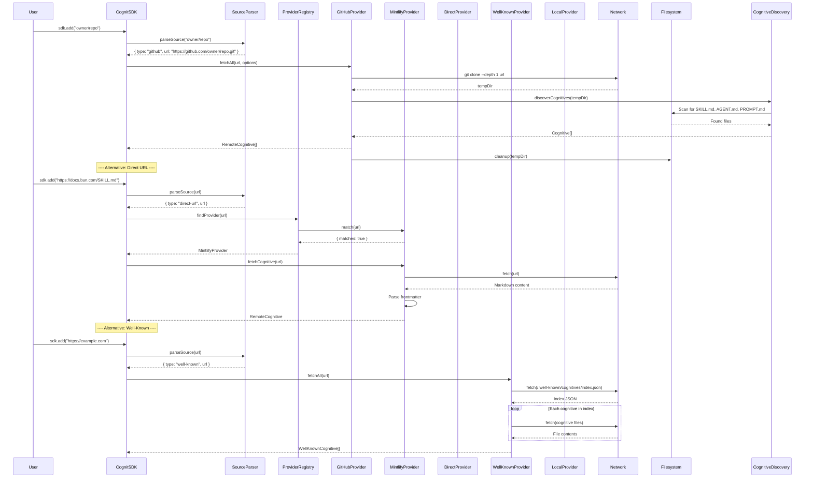

# 05 - Provider System

## 1. Overview

The provider system is the abstraction layer that resolves arbitrary source inputs (URLs, paths, shorthand identifiers) into concrete cognitives. It decouples the SDK from any specific hosting platform, making it trivial to add new sources without modifying the core installation logic.

The lifecycle is: **parse source -> match provider -> resolve/fetch -> return cognitives**.

---

## 2. HostProvider Interface

### 2.1 Full Contract

```typescript
/**
 * Interface for remote cognitive host providers.
 *
 * Each provider knows how to:
 * 1. Detect if a source input belongs to it (match)
 * 2. Fetch and parse cognitive files from the source (fetchCognitive/fetchAll)
 * 3. Convert user-facing URLs to raw content URLs (toRawUrl)
 * 4. Provide stable source identifiers for lock/telemetry (getSourceIdentifier)
 *
 * Providers are stateless. All state (caching, etc.) lives in the SDK services layer.
 */
interface HostProvider {
  /** Unique machine identifier (e.g., "github", "mintlify", "huggingface") */
  readonly id: string;

  /** Human-readable display name (e.g., "GitHub", "Mintlify", "HuggingFace") */
  readonly displayName: string;

  /**
   * Check if a source string matches this provider.
   *
   * Called during source resolution. The first provider to return
   * matches: true wins (priority order matters).
   *
   * @param source - Raw source string (URL, path, shorthand)
   * @returns Match result with optional source identifier
   */
  match(source: string): ProviderMatch;

  /**
   * Fetch a single cognitive from the source.
   *
   * For sources pointing to a single cognitive file (e.g., a direct URL to SKILL.md),
   * this returns that cognitive. For multi-cognitive sources, returns null and
   * the caller should use fetchAll().
   *
   * @param source - The source URL/path
   * @param options - Fetch options (cognitive type filter, etc.)
   * @returns The parsed cognitive, or null if not found/invalid
   */
  fetchCognitive(
    source: string,
    options?: ProviderFetchOptions
  ): Promise<RemoteCognitive | null>;

  /**
   * Fetch all cognitives from a source.
   *
   * For sources that contain multiple cognitives (e.g., a Git repo, a
   * well-known endpoint index), this returns all discovered cognitives.
   *
   * @param source - The source URL/path
   * @param options - Fetch options (type filter, subpath, etc.)
   * @returns Array of discovered cognitives (empty if none found)
   */
  fetchAll(
    source: string,
    options?: ProviderFetchOptions
  ): Promise<RemoteCognitive[]>;

  /**
   * Convert a user-facing URL to a raw content URL.
   *
   * Examples:
   * - GitHub blob URL -> raw.githubusercontent.com URL
   * - HuggingFace blob URL -> raw URL
   * - Mintlify URL -> same (already raw)
   *
   * @param url - The user-facing URL
   * @returns The raw content URL
   */
  toRawUrl(url: string): string;

  /**
   * Get a stable source identifier for lock file and telemetry.
   *
   * Must be deterministic: same input always produces same output.
   * Used as the key to group cognitives from the same source.
   *
   * @param source - The source URL/path
   * @returns Stable identifier (e.g., "owner/repo", "mintlify/com", "wellknown/example.com")
   */
  getSourceIdentifier(source: string): string;
}
```

### 2.2 Supporting Types

```typescript
/** Result of a provider match attempt. */
interface ProviderMatch {
  /** Whether this provider can handle the source */
  matches: boolean;
  /** Pre-computed source identifier (optimization to avoid re-parsing) */
  sourceIdentifier?: string;
}

/** Options passed to fetch methods. */
interface ProviderFetchOptions {
  /** Filter by cognitive type */
  cognitiveType?: CognitiveType;
  /** Subpath within the source (e.g., "skills/react-best-practices") */
  subpath?: string;
  /** Git ref (branch, tag, commit) */
  ref?: string;
  /** Specific cognitive name filter */
  nameFilter?: string;
  /** Timeout in milliseconds */
  timeout?: number;
  /** Signal for cancellation */
  signal?: AbortSignal;
}

/** A cognitive fetched from a remote source. */
interface RemoteCognitive {
  /** Display name (from frontmatter) */
  name: string;
  /** Description (from frontmatter) */
  description: string;
  /** Full markdown content including frontmatter */
  content: string;
  /** Directory name for installation */
  installName: string;
  /** Original source URL */
  sourceUrl: string;
  /** Provider that fetched this cognitive */
  providerId: string;
  /** Stable source identifier */
  sourceIdentifier: string;
  /** Frontmatter metadata */
  metadata?: Record<string, unknown>;
  /** Detected cognitive type */
  cognitiveType?: CognitiveType;
  /** Additional files (for multi-file cognitives) */
  files?: Map<string, string>;
}
```

---

## 3. Provider Lifecycle



---

## 4. Built-In Providers

### 4.1 GitHubProvider

**Purpose:** Handles GitHub repositories -- the most common source type.

```typescript
class GitHubProvider implements HostProvider {
  readonly id = 'github';
  readonly displayName = 'GitHub';

  /**
   * Matches:
   * - "owner/repo"                    (shorthand)
   * - "owner/repo/path/to/skill"      (shorthand with subpath)
   * - "owner/repo@skill-name"         (shorthand with name filter)
   * - "https://github.com/owner/repo" (full URL)
   * - "https://github.com/owner/repo/tree/branch"
   * - "https://github.com/owner/repo/tree/branch/path"
   * - "https://github.com/owner/repo.git" (git URL)
   */
  match(source: string): ProviderMatch;

  /**
   * Clones the repository (shallow), discovers cognitives,
   * and returns the matching ones.
   *
   * Clone strategy:
   * - Shallow clone (depth=1) for speed
   * - If ref is specified, clone that specific ref
   * - If subpath is specified, only discover within that path
   * - Cleanup temp directory after operation
   */
  async fetchAll(source: string, options?: ProviderFetchOptions): Promise<RemoteCognitive[]>;

  /**
   * For single-file GitHub URLs (blob URLs ending in SKILL.md),
   * fetches via raw.githubusercontent.com without cloning.
   */
  async fetchCognitive(source: string, options?: ProviderFetchOptions): Promise<RemoteCognitive | null>;

  /**
   * Converts GitHub URLs to raw content URLs:
   * github.com/o/r/blob/main/SKILL.md -> raw.githubusercontent.com/o/r/main/SKILL.md
   */
  toRawUrl(url: string): string;

  /**
   * Returns "owner/repo" for the source identifier.
   */
  getSourceIdentifier(source: string): string;
}
```

**Source Parsing Patterns:**

| Input | Parsed As |
|---|---|
| `owner/repo` | `{ url: "https://github.com/owner/repo.git" }` |
| `owner/repo/skills/react` | `{ url: "https://github.com/owner/repo.git", subpath: "skills/react" }` |
| `owner/repo@skill-name` | `{ url: "https://github.com/owner/repo.git", nameFilter: "skill-name" }` |
| `https://github.com/o/r` | `{ url: "https://github.com/o/r.git" }` |
| `https://github.com/o/r/tree/main` | `{ url: "https://github.com/o/r.git", ref: "main" }` |
| `https://github.com/o/r/tree/main/skills` | `{ url: "https://github.com/o/r.git", ref: "main", subpath: "skills" }` |

### 4.2 LocalProvider

**Purpose:** Handles local filesystem paths for development and testing.

```typescript
class LocalProvider implements HostProvider {
  readonly id = 'local';
  readonly displayName = 'Local';

  /**
   * Matches:
   * - Absolute paths: "/Users/bob/skills"
   * - Relative paths: "./my-skills", "../shared-skills"
   * - Current directory: "."
   * - Windows paths: "C:\Users\bob\skills"
   */
  match(source: string): ProviderMatch;

  /**
   * Discovers cognitives from the local filesystem.
   * No cloning needed -- reads directly from the path.
   */
  async fetchAll(source: string, options?: ProviderFetchOptions): Promise<RemoteCognitive[]>;

  /**
   * Reads a single cognitive file from the filesystem.
   */
  async fetchCognitive(source: string, options?: ProviderFetchOptions): Promise<RemoteCognitive | null>;

  /** Local paths are already "raw" */
  toRawUrl(url: string): string;

  /** Returns the resolved absolute path */
  getSourceIdentifier(source: string): string;
}
```

**Path Resolution:**

| Input | Resolved Path |
|---|---|
| `/Users/bob/skills` | `/Users/bob/skills` |
| `./my-skills` | `{cwd}/my-skills` |
| `../shared` | `{cwd}/../shared` (resolved) |
| `.` | `{cwd}` |
| `C:\Users\bob` | `C:\Users\bob` |

### 4.3 RegistryProvider (Future)

**Purpose:** Fetch cognitives from a custom registry API (e.g., a company's internal registry).

```typescript
class RegistryProvider implements HostProvider {
  readonly id = 'registry';
  readonly displayName = 'Registry';

  constructor(private config: RegistryConfig) {}

  /**
   * Matches:
   * - "registry:package-name"
   * - "registry:@scope/package-name"
   * - Custom registry URLs configured in .cognitrc
   */
  match(source: string): ProviderMatch;

  /**
   * Fetches cognitive metadata and files from the registry API.
   *
   * API Contract (proposed):
   *
   * GET /api/v1/cognitives/:name
   * Response: {
   *   name: string,
   *   version: string,
   *   description: string,
   *   cognitiveType: CognitiveType,
   *   files: Record<string, string>,
   *   metadata: Record<string, unknown>
   * }
   *
   * GET /api/v1/cognitives?q=search-term&type=skill
   * Response: {
   *   results: Array<{
   *     name: string,
   *     description: string,
   *     version: string,
   *     downloads: number,
   *     author: string
   *   }>
   * }
   */
  async fetchCognitive(source: string, options?: ProviderFetchOptions): Promise<RemoteCognitive | null>;
  async fetchAll(source: string, options?: ProviderFetchOptions): Promise<RemoteCognitive[]>;

  toRawUrl(url: string): string;
  getSourceIdentifier(source: string): string;
}

interface RegistryConfig {
  /** Base URL of the registry API */
  url: string;
  /** Authentication token (optional) */
  token?: string;
  /** Registry name for display */
  name?: string;
}
```

### 4.4 WellKnownProvider

**Purpose:** Discovers cognitives via RFC 8615 well-known URIs at `/.well-known/cognitives/`.

```typescript
class WellKnownProvider implements HostProvider {
  readonly id = 'well-known';
  readonly displayName = 'Well-Known Cognitives';

  /**
   * Matches any HTTP(S) URL that is NOT a known git host
   * and does NOT end with a cognitive file name.
   *
   * Excluded hosts: github.com, gitlab.com, huggingface.co
   */
  match(url: string): ProviderMatch;

  /**
   * Discovery flow:
   * 1. Fetch {baseUrl}/.well-known/cognitives/index.json
   * 2. Fallback: {baseUrl}/.well-known/skills/index.json (legacy)
   * 3. Parse index to get cognitive entries
   * 4. Fetch each cognitive's files
   *
   * Index JSON format:
   * {
   *   "cognitives": [
   *     {
   *       "name": "my-skill",
   *       "description": "Does something useful",
   *       "files": ["SKILL.md", "helpers.md"]
   *     }
   *   ]
   * }
   */
  async fetchAll(source: string, options?: ProviderFetchOptions): Promise<WellKnownCognitive[]>;

  /**
   * Fetches a specific cognitive by name from the index.
   * If URL specifies a cognitive path, uses that.
   * If index has only one cognitive, returns that one.
   * Otherwise returns null (caller should use fetchAll).
   */
  async fetchCognitive(source: string, options?: ProviderFetchOptions): Promise<WellKnownCognitive | null>;

  /** Fetches the index and returns it, or null if not found */
  async fetchIndex(baseUrl: string): Promise<{ index: WellKnownIndex; resolvedBaseUrl: string } | null>;

  toRawUrl(url: string): string;

  /** Returns "wellknown/{hostname}" or "{sld}/{tld}" */
  getSourceIdentifier(url: string): string;
}

interface WellKnownCognitive extends RemoteCognitive {
  /** All files in the cognitive, keyed by relative path */
  files: Map<string, string>;
  /** The entry from the index.json */
  indexEntry: WellKnownCognitiveEntry;
}
```

**URL Resolution Strategy:**

| Input URL | Tried Endpoints (in order) |
|---|---|
| `https://example.com` | `https://example.com/.well-known/cognitives/index.json` |
| `https://example.com/docs` | `https://example.com/docs/.well-known/cognitives/index.json` then `https://example.com/.well-known/cognitives/index.json` |
| `https://example.com/.well-known/cognitives/my-skill` | Direct cognitive fetch |

### 4.5 DirectProvider

**Purpose:** Catch-all provider for direct URLs pointing to cognitive files.

```typescript
class DirectProvider implements HostProvider {
  readonly id = 'direct-url';
  readonly displayName = 'Direct URL';

  /**
   * Matches any HTTP(S) URL ending in a known cognitive file name
   * (SKILL.md, AGENT.md, PROMPT.md -- case insensitive).
   *
   * This is registered LAST so host-specific providers get priority.
   */
  match(url: string): ProviderMatch;

  /**
   * Fetches the URL directly, parses frontmatter.
   * Handles URL transformations:
   * - GitHub blob URLs -> raw.githubusercontent.com
   * - GitLab blob URLs -> raw URLs
   * - Other URLs -> as-is
   */
  async fetchCognitive(source: string, options?: ProviderFetchOptions): Promise<RemoteCognitive | null>;

  /** fetchAll returns single-item array if fetchCognitive succeeds */
  async fetchAll(source: string, options?: ProviderFetchOptions): Promise<RemoteCognitive[]>;

  toRawUrl(url: string): string;

  /** Returns "github/owner/repo", "gitlab/owner/repo", or hostname */
  getSourceIdentifier(url: string): string;
}
```

### 4.6 MintlifyProvider

**Purpose:** Handles Mintlify-hosted documentation sites with cognitive files.

```typescript
class MintlifyProvider implements HostProvider {
  readonly id = 'mintlify';
  readonly displayName = 'Mintlify';

  /**
   * Matches HTTP(S) URLs ending in a cognitive file name,
   * EXCLUDING github.com, gitlab.com, and huggingface.co.
   *
   * The actual Mintlify validation happens during fetch:
   * the frontmatter must contain `metadata.mintlify-proj`.
   * If absent, returns null and DirectProvider can handle it instead.
   */
  match(url: string): ProviderMatch;

  /**
   * Fetches the URL, validates Mintlify-specific frontmatter.
   * Uses `metadata.mintlify-proj` as the install name.
   */
  async fetchCognitive(source: string, options?: ProviderFetchOptions): Promise<RemoteCognitive | null>;

  async fetchAll(source: string, options?: ProviderFetchOptions): Promise<RemoteCognitive[]>;

  /** Mintlify URLs are already direct content URLs */
  toRawUrl(url: string): string;

  /** Returns "mintlify/com" (groups all Mintlify skills together) */
  getSourceIdentifier(url: string): string;
}
```

### 4.7 HuggingFaceProvider

**Purpose:** Handles HuggingFace Spaces repositories.

```typescript
class HuggingFaceProvider implements HostProvider {
  readonly id = 'huggingface';
  readonly displayName = 'HuggingFace';

  /**
   * Matches huggingface.co URLs with /spaces/ path
   * ending in a cognitive file name.
   */
  match(url: string): ProviderMatch;

  /**
   * Converts blob URLs to raw URLs, fetches content,
   * parses frontmatter. Install name comes from
   * `metadata.install-name` or the repo name.
   */
  async fetchCognitive(source: string, options?: ProviderFetchOptions): Promise<RemoteCognitive | null>;

  async fetchAll(source: string, options?: ProviderFetchOptions): Promise<RemoteCognitive[]>;

  /** /blob/ -> /raw/ */
  toRawUrl(url: string): string;

  /** Returns "huggingface/owner/repo" */
  getSourceIdentifier(url: string): string;
}
```

---

## 5. Provider Registry

### 5.1 Registration and Priority

Providers are registered in a specific order. The first provider whose `match()` returns `true` wins.

```typescript
class ProviderRegistryImpl implements ProviderRegistry {
  private providers: HostProvider[] = [];

  register(provider: HostProvider): void {
    if (this.providers.some(p => p.id === provider.id)) {
      throw new Error(`Provider with id "${provider.id}" already registered`);
    }
    this.providers.push(provider);
  }

  findProvider(source: string): HostProvider | null {
    for (const provider of this.providers) {
      const match = provider.match(source);
      if (match.matches) return provider;
    }
    return null;
  }

  getProviders(): HostProvider[] {
    return [...this.providers];
  }
}
```

### 5.2 Default Registration Order

```typescript
// Priority order (first match wins):
registry.register(mintlifyProvider);      // 1. Mintlify (specific host)
registry.register(huggingFaceProvider);   // 2. HuggingFace (specific host)
registry.register(directUrlProvider);     // 3. Direct URL (catch-all for **/SKILL.md URLs)
// Note: wellKnownProvider is NOT auto-registered.
// It's used explicitly when parseSource returns type: "well-known".
// Note: GitHubProvider and LocalProvider are handled by the source parser,
// not the provider registry (they need clone/filesystem operations).
```

### 5.3 Registration Priority Diagram



---

## 6. Source Parsing

### 6.1 ParsedSource Type

```typescript
interface ParsedSource {
  type: 'github' | 'gitlab' | 'git' | 'local' | 'direct-url' | 'well-known';
  url: string;
  subpath?: string;
  localPath?: string;
  ref?: string;
  nameFilter?: string;
  cognitiveFilter?: CognitiveType;
}
```

### 6.2 Resolution Rules (in order)

```
1. isLocalPath(input)?           -> type: "local"
   (absolute, ./, ../, ., .., C:\)

2. isDirectCognitiveUrl(input)?  -> type: "direct-url"
   (http(s) + ends in SKILL.md/AGENT.md/PROMPT.md, not github.com/gitlab.com repo URLs)

3. githubTreeWithPath match?     -> type: "github" (with ref + subpath)
   github.com/owner/repo/tree/branch/path

4. githubTree match?             -> type: "github" (with ref)
   github.com/owner/repo/tree/branch

5. githubRepo match?             -> type: "github"
   github.com/owner/repo

6. gitlabTreeWithPath match?     -> type: "gitlab" (with ref + subpath)
   gitlab.com/group/repo/-/tree/branch/path

7. gitlabTree match?             -> type: "gitlab" (with ref)
   gitlab.com/group/repo/-/tree/branch

8. gitlabRepo match?             -> type: "gitlab"
   gitlab.com/group/repo

9. owner/repo@name match?        -> type: "github" (with nameFilter)
   (no : prefix, no ./ prefix)

10. owner/repo(/path)? match?    -> type: "github" (shorthand)
    (no : prefix, no ./ prefix)

11. isWellKnownUrl(input)?       -> type: "well-known"
    (http(s), not git hosts, not cognitive file, not .git)

12. fallback                     -> type: "git" (generic git URL)
```

### 6.3 Examples

| Input | Parsed Type | URL | Extras |
|---|---|---|---|
| `vercel-labs/skills` | `github` | `https://github.com/vercel-labs/skills.git` | |
| `vercel-labs/skills/react` | `github` | `https://github.com/vercel-labs/skills.git` | subpath: `react` |
| `vercel-labs/skills@find-skills` | `github` | `https://github.com/vercel-labs/skills.git` | nameFilter: `find-skills` |
| `./my-skills` | `local` | `/abs/path/my-skills` | localPath set |
| `https://docs.bun.com/docs/SKILL.md` | `direct-url` | (same) | |
| `https://example.com` | `well-known` | (same) | |
| `git@github.com:owner/repo.git` | `git` | (same) | |

---

## 7. Caching Strategy

### 7.1 Clone Cache

For Git-based providers, avoid re-cloning the same repo:

```typescript
interface CloneCache {
  /** Cache directory location */
  dir: string;  // e.g., ~/.cache/cognit/clones/

  /**
   * Get or clone a repository.
   * Key: normalized git URL + ref.
   * TTL: configurable (default: 1 hour for CLI, 0 for SDK)
   */
  getOrClone(url: string, ref?: string): Promise<string>;

  /** Invalidate a specific cache entry */
  invalidate(url: string, ref?: string): Promise<void>;

  /** Clear all cached clones */
  clear(): Promise<void>;
}
```

**Cache key:** SHA256 of `{normalized_url}#{ref || 'HEAD'}`
**Cache location:** `~/.cache/cognit/clones/{hash}/`
**TTL:** Configurable per operation (e.g., `add` uses 0 = always fresh; `check` uses 1h)

### 7.2 Fetch Cache

For HTTP-based providers, cache fetch responses:

```typescript
interface FetchCache {
  /** Cache location */
  dir: string;  // e.g., ~/.cache/cognit/fetch/

  /**
   * Get or fetch a URL.
   * Uses ETag/Last-Modified for conditional requests when possible.
   */
  getOrFetch(url: string, options?: { ttl?: number }): Promise<Response>;

  /** Clear fetch cache */
  clear(): Promise<void>;
}
```

**Cache location:** `~/.cache/cognit/fetch/{hash}.json` (content + headers)
**TTL:** 15 minutes default for well-known/registry, 0 for direct URLs

### 7.3 Cache Flow



---

## 8. Error Handling

### 8.1 Error Types Per Provider

```typescript
/** Base error for all provider failures */
class ProviderError extends Error {
  constructor(
    message: string,
    readonly providerId: string,
    readonly source: string,
    readonly cause?: Error
  ) {
    super(message);
    this.name = 'ProviderError';
  }
}

/** Git clone failed (network, auth, repo not found) */
class GitCloneError extends ProviderError {
  constructor(source: string, cause?: Error) {
    super(`Failed to clone repository: ${source}`, 'github', source, cause);
    this.name = 'GitCloneError';
  }
}

/** HTTP fetch failed */
class FetchError extends ProviderError {
  constructor(
    source: string,
    providerId: string,
    readonly status?: number,
    cause?: Error
  ) {
    super(`Failed to fetch: ${source} (status: ${status})`, providerId, source, cause);
    this.name = 'FetchError';
  }
}

/** Cognitive file has invalid or missing frontmatter */
class InvalidCognitiveError extends ProviderError {
  constructor(source: string, providerId: string, reason: string) {
    super(`Invalid cognitive at ${source}: ${reason}`, providerId, source);
    this.name = 'InvalidCognitiveError';
  }
}

/** No cognitives found at source */
class NoCognitivesFoundError extends ProviderError {
  constructor(source: string, providerId: string) {
    super(`No cognitives found at: ${source}`, providerId, source);
    this.name = 'NoCognitivesFoundError';
  }
}
```

### 8.2 Error Handling Per Provider

| Provider | Possible Errors | Recovery |
|---|---|---|
| **GitHub** | Clone timeout, auth required, repo not found, branch not found | Retry once, then fail with message |
| **Local** | Path not found, permission denied | Fail immediately with clear path |
| **Mintlify** | Fetch timeout, invalid frontmatter, missing mintlify-proj | Return null (fall through to DirectProvider) |
| **HuggingFace** | Fetch timeout, not a Spaces URL, invalid frontmatter | Return null |
| **WellKnown** | No index.json, invalid index format, individual file fetch failure | Try legacy path, skip individual failures |
| **Direct** | Fetch timeout, invalid frontmatter | Return null |
| **Registry** | Auth failure, API error, package not found | Fail with specific error |

---

## 9. Creating Custom Providers

### 9.1 Extension Point

```typescript
import { CognitSDK } from '@synapsync/cognit-sdk';

// Create a custom provider
const myCompanyProvider: HostProvider = {
  id: 'my-company',
  displayName: 'My Company Registry',

  match(source: string): ProviderMatch {
    if (source.startsWith('company://')) {
      return { matches: true, sourceIdentifier: `company/${source.slice(10)}` };
    }
    return { matches: false };
  },

  async fetchCognitive(source: string): Promise<RemoteCognitive | null> {
    const name = source.replace('company://', '');
    const response = await fetch(`https://internal-api.company.com/cognitives/${name}`);
    if (!response.ok) return null;
    const data = await response.json();
    return {
      name: data.name,
      description: data.description,
      content: data.content,
      installName: data.name,
      sourceUrl: source,
      providerId: 'my-company',
      sourceIdentifier: `company/${name}`,
      cognitiveType: data.type,
    };
  },

  async fetchAll(source: string): Promise<RemoteCognitive[]> {
    const cognitive = await this.fetchCognitive(source);
    return cognitive ? [cognitive] : [];
  },

  toRawUrl(url: string): string { return url; },
  getSourceIdentifier(source: string): string { return `company/${source.replace('company://', '')}`; },
};

// Register it
const sdk = new CognitSDK();
sdk.providers.register(myCompanyProvider);

// Now "company://my-skill" works as a source
await sdk.operations.add('company://my-skill', { agent: ['claude-code'] });
```

### 9.2 Provider Plugin Package Convention

```typescript
// @my-company/cognit-provider-internal
export function createInternalProvider(config: { apiUrl: string; token: string }): HostProvider {
  return {
    id: 'internal',
    displayName: 'Internal Registry',
    // ... implementation
  };
}
```

---

## 10. Full Provider Resolution Flow



---

## 11. Provider System in the SDK Architecture

```typescript
/** Provider system exposed by the SDK */
interface ProviderSystemService {
  /** Register a custom provider (prepend = add before built-ins) */
  register(provider: HostProvider, options?: { prepend?: boolean }): void;

  /** Find the provider for a source */
  findProvider(source: string): HostProvider | null;

  /** Get all registered providers */
  getProviders(): HostProvider[];

  /** Parse a raw source string into structured form */
  parseSource(input: string): ParsedSource;

  /** Resolve a source to cognitives (combines parse + provider.fetch) */
  resolve(
    source: string,
    options?: ProviderFetchOptions
  ): Promise<ResolvedSource>;
}

/** Result of resolving a source */
interface ResolvedSource {
  /** The matched provider */
  provider: HostProvider;
  /** The parsed source */
  parsed: ParsedSource;
  /** Discovered cognitives */
  cognitives: RemoteCognitive[];
  /** Source identifier for lock/telemetry */
  sourceIdentifier: string;
  /** Temp directory to clean up (if git clone) */
  tempDir?: string;
}
```
