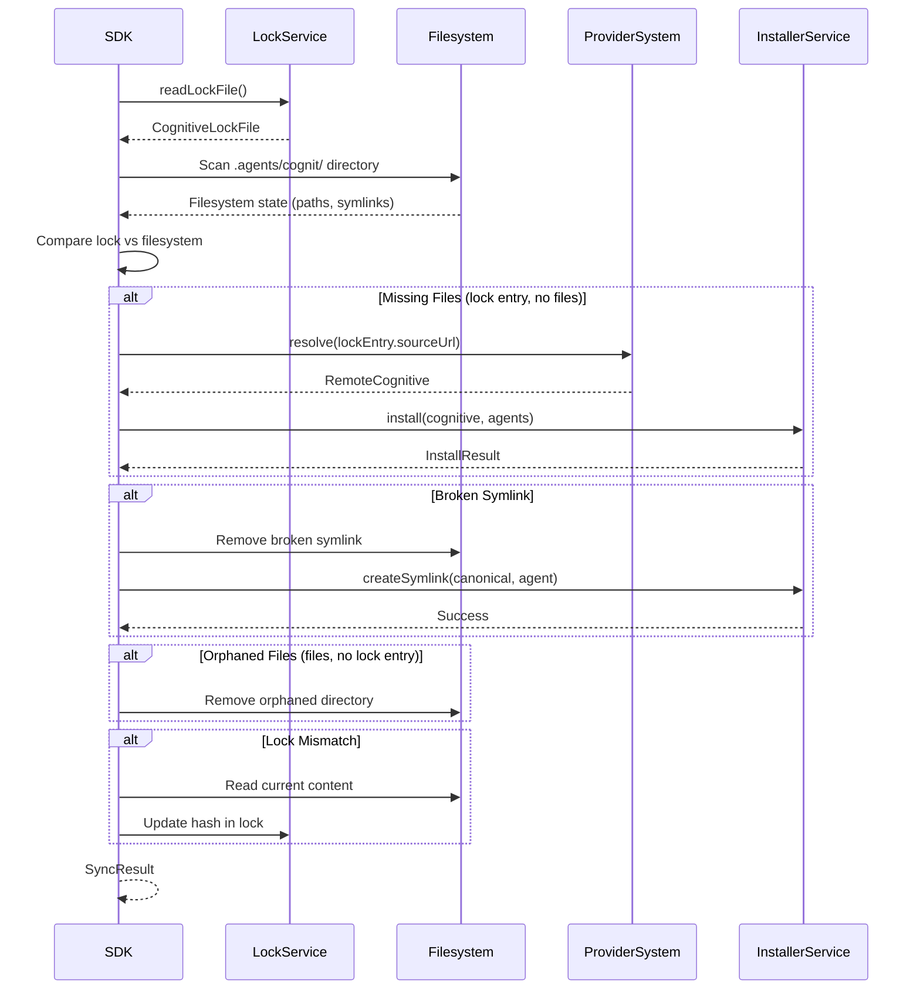
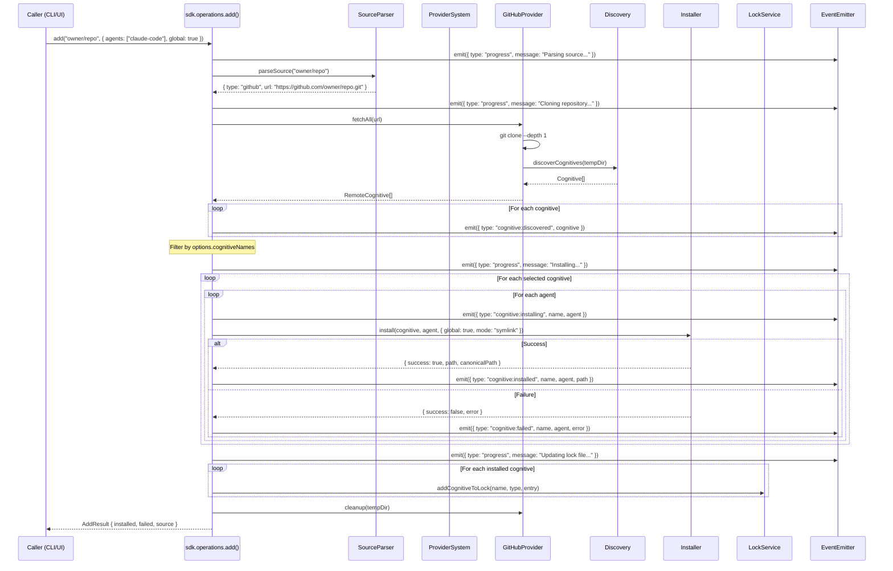
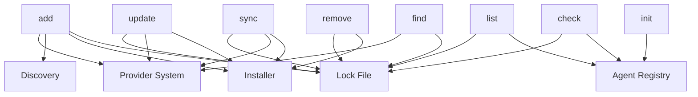

# 06 - SDK Operations

## 1. Overview

Operations are the public action layer of the SDK. Each operation is a composable, interface-agnostic function that uses SDK services (providers, agents, installer, lock, discovery) to perform a user action. Operations return structured data and emit events -- they never print to the console or prompt the user directly.

All operations follow a consistent pattern:
- Accept an options interface
- Return a typed result interface
- Emit events for progress tracking
- Throw typed errors for failure cases
- Are fully independent of CLI/UI concerns

---

## 2. Operation Architecture

```typescript
/**
 * All operations receive the SDK context, which provides access to services.
 * This is injected via the SDK instance, not imported globally.
 */
interface OperationContext {
  agents: AgentRegistryService;
  providers: ProviderSystemService;
  installer: InstallerService;
  lock: LockService;
  discovery: DiscoveryService;
  cache: CacheService;
  events: EventEmitter;
}

/**
 * Base result type for all operations.
 * Every operation extends this with specific fields.
 */
interface OperationResult {
  /** Whether the operation succeeded overall */
  success: boolean;
  /** Human-readable summary message */
  message: string;
}

/**
 * Event types emitted by operations.
 * UI consumers listen to these for progress display.
 */
type OperationEvent =
  | { type: 'progress'; message: string; phase: string }
  | { type: 'warning'; message: string }
  | { type: 'cognitive:discovered'; cognitive: RemoteCognitive }
  | { type: 'cognitive:installing'; name: string; agent: string }
  | { type: 'cognitive:installed'; name: string; agent: string; path: string }
  | { type: 'cognitive:failed'; name: string; agent: string; error: string }
  | { type: 'cognitive:removed'; name: string; agent: string }
  | { type: 'cognitive:updated'; name: string; oldHash: string; newHash: string }
  | { type: 'sync:drift'; name: string; issue: string }
  | { type: 'sync:fixed'; name: string; action: string };
```

---

## 3. Operations

### 3.1 add

**Purpose:** Fetch cognitives from a source and install them to target agents.

#### Input

```typescript
interface AddOptions {
  /** Source string (owner/repo, URL, path) */
  source: string;
  /** Target agents (if empty, SDK returns available agents for caller to choose) */
  agents?: AgentType[];
  /** Install globally (home dir) vs locally (project dir) */
  global?: boolean;
  /** Installation method */
  mode?: 'symlink' | 'copy';
  /** Filter specific cognitives by name */
  cognitiveNames?: string[];
  /** Filter by cognitive type */
  cognitiveType?: CognitiveType;
  /** Subpath within source */
  subpath?: string;
  /** Git ref (branch, tag, commit) */
  ref?: string;
  /** Skip confirmation (for non-interactive use) */
  confirmed?: boolean;
  /** Include internal/hidden cognitives */
  includeInternal?: boolean;
  /** Full depth scan (not just priority dirs) */
  fullDepth?: boolean;
}
```

#### Output

```typescript
interface AddResult extends OperationResult {
  /** Successfully installed cognitives */
  installed: InstalledCognitiveInfo[];
  /** Failed installations */
  failed: FailedInstallInfo[];
  /** Source information */
  source: {
    type: string;
    identifier: string;
    url: string;
    provider: string;
  };
  /** Cognitives that were available but not selected (for interactive flows) */
  available?: CognitiveInfo[];
}

interface InstalledCognitiveInfo {
  name: string;
  cognitiveType: CognitiveType;
  /** Per-agent installation results */
  agents: Array<{
    agent: AgentType;
    path: string;
    canonicalPath?: string;
    mode: 'symlink' | 'copy';
    symlinkFailed?: boolean;
  }>;
}

interface FailedInstallInfo {
  name: string;
  agent: AgentType;
  error: string;
}

interface CognitiveInfo {
  name: string;
  description: string;
  cognitiveType: CognitiveType;
  installName: string;
}
```

#### Algorithm

```
1. PARSE source string via SourceParser
   -> ParsedSource { type, url, ref, subpath, nameFilter }

2. RESOLVE source via Provider system
   IF type == "local":
     - Validate path exists
     - sourceDir = localPath
   IF type == "github" | "gitlab" | "git":
     - Clone repository (shallow, with ref if specified)
     - sourceDir = tempDir
   IF type == "direct-url":
     - Find matching provider in registry
     - Fetch cognitive via provider.fetchCognitive(url)
     - GOTO step 5 (skip discovery)
   IF type == "well-known":
     - Fetch all cognitives via WellKnownProvider.fetchAll(url)
     - GOTO step 4 (skip filesystem discovery)

3. DISCOVER cognitives in source directory
   - Scan for SKILL.md, AGENT.md, PROMPT.md files
   - Apply subpath filter
   - Apply type filter
   - Parse frontmatter for name + description
   -> Cognitive[]

4. FILTER cognitives
   - Apply cognitiveNames filter (if specified)
   - Apply nameFilter from @name syntax
   - Apply cognitiveType filter
   IF no cognitives match: THROW NoCognitivesFoundError
   IF multiple cognitives AND no filter AND not confirmed:
     Return result with available[] set (caller must choose)

5. PREPARE installation
   FOR each selected cognitive:
     FOR each target agent:
       - Resolve canonical path: .agents/cognit/{type}/{name}/
       - Resolve agent-specific path: {agentDir}/{type}/{name}/
       - Check for existing installation (overwrite detection)
   -> PreparedInstallation { items, targetAgents, paths }

6. EXECUTE installation
   FOR each cognitive:
     - Write to canonical location
     FOR each agent:
       IF mode == "symlink" AND agent is universal:
         - Skip (canonical IS the agent path)
       IF mode == "symlink":
         - Create symlink: agentPath -> canonicalPath
         - On failure: fall back to copy
       IF mode == "copy":
         - Copy files to agentPath

7. UPDATE lock file
   FOR each successfully installed cognitive:
     - Compute/fetch content hash
     - Write lock entry with source, type, hash, timestamp

8. CLEANUP
   - Remove temp directory (if git clone)
   -> AddResult
```

#### Events Emitted

| Event | When |
|---|---|
| `progress: "Parsing source..."` | Step 1 |
| `progress: "Cloning repository..."` | Step 2 (git) |
| `progress: "Discovering cognitives..."` | Step 3 |
| `cognitive:discovered` | Each cognitive found |
| `progress: "Installing..."` | Step 6 start |
| `cognitive:installing` | Before each agent install |
| `cognitive:installed` | After successful install |
| `cognitive:failed` | After failed install |

#### Error Cases

| Error | Condition |
|---|---|
| `ProviderError` | Source cannot be resolved |
| `GitCloneError` | Git clone fails |
| `NoCognitivesFoundError` | No cognitives at source |
| `InvalidCognitiveError` | Missing frontmatter fields |
| `PathTraversalError` | Cognitive name would escape directory |

---

### 3.2 list

**Purpose:** List installed cognitives from lock file and filesystem.

#### Input

```typescript
interface ListOptions {
  /** Scope to list from */
  scope?: 'global' | 'local' | 'all';
  /** Filter by cognitive type */
  cognitiveType?: CognitiveType;
  /** Filter by agent */
  agent?: AgentType;
  /** Include detailed info (paths, hashes, etc.) */
  detailed?: boolean;
}
```

#### Output

```typescript
interface ListResult extends OperationResult {
  /** Installed cognitives */
  cognitives: InstalledCognitiveEntry[];
  /** Total count */
  count: number;
}

interface InstalledCognitiveEntry {
  /** Cognitive name */
  name: string;
  /** Cognitive type */
  cognitiveType: CognitiveType;
  /** Source information from lock */
  source: {
    identifier: string;
    type: string;
    url: string;
  };
  /** Installation timestamps */
  installedAt: string;
  updatedAt: string;
  /** Canonical path (.agents/cognit/...) */
  canonicalPath: string;
  /** Agents this cognitive is installed for */
  agents: Array<{
    agent: AgentType;
    path: string;
    isSymlink: boolean;
    exists: boolean;
  }>;
  /** Content hash for update detection */
  contentHash: string;
}
```

#### Algorithm

```
1. READ lock file
   -> CognitiveLockFile { cognitives: Record<string, CognitiveLockEntry> }

2. FOR each locked cognitive:
   a. Resolve canonical path
   b. Check if canonical path exists on filesystem
   c. FOR each installed agent:
      - Resolve agent-specific path
      - Check if path exists
      - Check if it's a symlink
   d. Apply filters (scope, type, agent)

3. MERGE filesystem state with lock entries
   - Flag missing files (lock entry exists but files don't)
   - Flag orphaned files (files exist but no lock entry)

4. SORT by name

5. RETURN ListResult
```

#### Events Emitted

| Event | When |
|---|---|
| `progress: "Reading lock file..."` | Step 1 |
| `progress: "Scanning filesystem..."` | Step 2 |
| `warning: "Cognitive X is in lock but files missing"` | Step 3 |

---

### 3.3 remove

**Purpose:** Remove installed cognitives from agents and lock file.

#### Input

```typescript
interface RemoveOptions {
  /** Cognitive names to remove */
  names: string[];
  /** Only remove from specific agents */
  agents?: AgentType[];
  /** Remove globally installed */
  global?: boolean;
  /** Skip confirmation */
  confirmed?: boolean;
}
```

#### Output

```typescript
interface RemoveResult extends OperationResult {
  /** Successfully removed */
  removed: Array<{
    name: string;
    agents: Array<{
      agent: AgentType;
      path: string;
    }>;
  }>;
  /** Not found */
  notFound: string[];
}
```

#### Algorithm

```
1. FOR each name in names:
   a. Look up in lock file
   b. IF not found: add to notFound[]
   c. IF found:
      - Determine affected agents (options.agents or all)
      - Determine paths to remove

2. IF not confirmed:
   Return result with removal plan (caller confirms)

3. EXECUTE removal:
   FOR each cognitive:
     FOR each agent:
       a. Remove agent-specific symlink/directory
     b. Remove canonical directory (.agents/cognit/{type}/{name}/)
     c. Remove from lock file

4. RETURN RemoveResult
```

#### Events Emitted

| Event | When |
|---|---|
| `cognitive:removed` | After each agent removal |
| `progress: "Updating lock file..."` | Step 3c |

#### Error Cases

| Error | Condition |
|---|---|
| `CognitiveNotFoundError` | Name not in lock file |
| `PermissionError` | Cannot delete files |

---

### 3.4 update

**Purpose:** Check for and apply updates to installed cognitives.

#### Input

```typescript
interface UpdateOptions {
  /** Specific cognitives to update (empty = all) */
  names?: string[];
  /** Only check, don't apply */
  checkOnly?: boolean;
  /** Skip confirmation */
  confirmed?: boolean;
}
```

#### Output

```typescript
interface UpdateResult extends OperationResult {
  /** Cognitives with available updates */
  updates: Array<{
    name: string;
    source: string;
    currentHash: string;
    newHash: string;
    applied: boolean;
  }>;
  /** Cognitives already up-to-date */
  upToDate: string[];
  /** Cognitives that couldn't be checked */
  errors: Array<{
    name: string;
    error: string;
  }>;
}
```

#### Algorithm

```
1. READ lock file
   - Get all locked cognitives (or filter by names)

2. FOR each cognitive:
   a. Fetch current hash from remote source
      - GitHub: use Trees API to get folder SHA
      - Others: re-fetch and compute content hash
   b. Compare with stored cognitiveFolderHash
   c. IF different: mark as updateAvailable

3. IF checkOnly: return results without applying

4. IF not confirmed:
   Return result with available updates (caller confirms)

5. APPLY updates:
   FOR each cognitive with update:
     a. Re-fetch cognitive from original source
     b. Re-install (same agents, same mode)
     c. Update lock file with new hash and timestamp

6. RETURN UpdateResult
```

#### Events Emitted

| Event | When |
|---|---|
| `progress: "Checking {name}..."` | Step 2 |
| `cognitive:updated` | Step 5 per cognitive |

---

### 3.5 sync

**Purpose:** Reconcile lock file with actual filesystem state, fixing drift.

#### Input

```typescript
interface SyncOptions {
  /** Scope to sync */
  scope?: 'global' | 'local' | 'all';
  /** Only report drift, don't fix */
  dryRun?: boolean;
  /** Skip confirmation */
  confirmed?: boolean;
}
```

#### Output

```typescript
interface SyncResult extends OperationResult {
  /** Issues found and their resolution */
  issues: SyncIssue[];
  /** Number of issues fixed */
  fixed: number;
  /** Number of issues remaining (dry-run or unfixable) */
  remaining: number;
}

interface SyncIssue {
  /** The cognitive affected */
  name: string;
  /** Type of drift */
  type: 'missing_files' | 'broken_symlink' | 'orphaned_files' | 'lock_mismatch' | 'missing_lock';
  /** Human-readable description */
  description: string;
  /** The action taken (or would be taken in dry-run) */
  action: string;
  /** Whether it was fixed */
  fixed: boolean;
}
```

#### Algorithm

```
1. READ lock file
2. SCAN filesystem (canonical .agents/cognit/ directory)

3. DETECT drift:
   a. Lock entry exists, files missing:
      type: "missing_files"
      action: "Re-fetch from source and reinstall"
   b. Symlink exists but target missing:
      type: "broken_symlink"
      action: "Remove broken symlink and reinstall"
   c. Files exist but no lock entry:
      type: "orphaned_files"
      action: "Remove orphaned files or add to lock"
   d. Lock hash doesn't match file content:
      type: "lock_mismatch"
      action: "Update lock hash from current files"
   e. Agent-specific path exists but no canonical path:
      type: "missing_lock"
      action: "Create lock entry from filesystem state"

4. IF dryRun: return issues without fixing

5. IF not confirmed:
   Return issues (caller confirms)

6. FIX drift:
   FOR each issue:
     CASE "missing_files": re-fetch from lock source and reinstall
     CASE "broken_symlink": recreate symlink
     CASE "orphaned_files": remove files
     CASE "lock_mismatch": recompute hash and update lock
     CASE "missing_lock": create lock entry

7. RETURN SyncResult
```

#### Sync Flow Diagram



#### Events Emitted

| Event | When |
|---|---|
| `sync:drift` | Each issue detected |
| `sync:fixed` | Each issue resolved |
| `progress: "Scanning..."` | Step 2 |
| `progress: "Fixing drift..."` | Step 6 |

---

### 3.6 init

**Purpose:** Scaffold a new cognitive (generate template SKILL.md, AGENT.md, etc.).

#### Input

```typescript
interface InitOptions {
  /** Cognitive type to create */
  cognitiveType: CognitiveType;
  /** Name for the cognitive */
  name: string;
  /** Description */
  description?: string;
  /** Output directory (default: cwd) */
  outputDir?: string;
  /** Author name */
  author?: string;
}
```

#### Output

```typescript
interface InitResult extends OperationResult {
  /** Path to the created cognitive */
  path: string;
  /** Files created */
  files: string[];
  /** The cognitive type */
  cognitiveType: CognitiveType;
}
```

#### Algorithm

```
1. VALIDATE name (lowercase alphanumeric + hyphens)
2. DETERMINE output directory
   - Default: {cwd}/{name}/
   - Or: {outputDir}/{name}/
3. CHECK if directory already exists
4. CREATE directory
5. GENERATE template file:
   - SKILL.md / AGENT.md / PROMPT.md with frontmatter:
     ---
     name: {name}
     description: {description || "TODO: Add description"}
     ---
     # {name}
     TODO: Add content here.
6. RETURN InitResult
```

#### Error Cases

| Error | Condition |
|---|---|
| `DirectoryExistsError` | Output directory already exists |
| `InvalidNameError` | Name doesn't match pattern |

---

### 3.7 check

**Purpose:** Verify integrity of installed cognitives.

#### Input

```typescript
interface CheckOptions {
  /** Specific cognitives to check (empty = all) */
  names?: string[];
  /** Scope to check */
  scope?: 'global' | 'local' | 'all';
}
```

#### Output

```typescript
interface CheckResult extends OperationResult {
  /** Healthy cognitives */
  healthy: string[];
  /** Issues found */
  issues: CheckIssue[];
}

interface CheckIssue {
  name: string;
  type: 'broken_symlink' | 'missing_canonical' | 'missing_agent_dir' |
        'lock_orphan' | 'filesystem_orphan' | 'hash_mismatch';
  description: string;
  severity: 'error' | 'warning';
}
```

#### Algorithm

```
1. READ lock file
2. FOR each cognitive:
   a. Check canonical path exists
   b. Check all agent symlinks are valid
   c. Verify content hash matches lock
   d. Check lock entry integrity (required fields)
3. SCAN filesystem for orphaned directories
4. RETURN CheckResult
```

---

### 3.8 find / search

**Purpose:** Discover cognitives from remote sources without installing.

#### Input

```typescript
interface FindOptions {
  /** Search query */
  query?: string;
  /** Source to search (default: all configured sources) */
  source?: string;
  /** Filter by cognitive type */
  cognitiveType?: CognitiveType;
  /** Maximum results */
  limit?: number;
}
```

#### Output

```typescript
interface FindResult extends OperationResult {
  /** Discovered cognitives */
  results: DiscoveredCognitive[];
  /** Total available (may be more than limit) */
  total: number;
  /** The source that was searched */
  source: string;
}

interface DiscoveredCognitive {
  name: string;
  description: string;
  cognitiveType: CognitiveType;
  source: string;
  sourceUrl: string;
  /** Whether already installed */
  installed: boolean;
}
```

#### Algorithm

```
1. DETERMINE search source:
   - If source specified: use that source
   - If query specified and no source: search configured search API
   - If neither: error

2. RESOLVE source via provider system
   -> RemoteCognitive[]

3. CROSS-REFERENCE with lock file
   - Mark already-installed cognitives

4. APPLY filters (type, query matching)

5. SORT by relevance (name match, then description match)

6. APPLY limit

7. RETURN FindResult
```

---

## 4. Add Operation Sequence Diagram (Detailed)



---

## 5. How Operations Compose Internally

### 5.1 Shared Services

All operations share the same service instances through the `OperationContext`:

```
                     OperationContext
                          |
          +-------+-------+--------+--------+
          |       |       |        |        |
       Agents  Providers  Installer  Lock  Discovery
          |       |       |        |        |
          v       v       v        v        v
     [AgentConfig]  [HostProvider]  [fs ops]  [lock CRUD]  [scanner]
```

### 5.2 Operation Dependencies



### 5.3 Internal Composition Examples

**update reuses add internally:**
```typescript
async function update(options: UpdateOptions): Promise<UpdateResult> {
  // 1. Check for updates (uses lock + providers)
  const updates = await checkForUpdates(options);

  // 2. For each update, delegate to add operation
  for (const update of updates) {
    const addResult = await add({
      source: update.sourceUrl,
      agents: update.agents,
      global: update.isGlobal,
      mode: update.mode,
      confirmed: true,  // Already confirmed by update flow
    });
  }
}
```

**sync reuses add and remove:**
```typescript
async function sync(options: SyncOptions): Promise<SyncResult> {
  const issues = detectDrift();

  for (const issue of issues) {
    switch (issue.type) {
      case 'missing_files':
        // Re-install = add with same source
        await add({ source: issue.sourceUrl, confirmed: true });
        break;
      case 'orphaned_files':
        // Clean up = remove
        await remove({ names: [issue.name], confirmed: true });
        break;
    }
  }
}
```

---

## 6. SDK Public API

All operations are exposed through the SDK instance:

```typescript
class CognitSDK {
  readonly operations: {
    add(options: AddOptions): Promise<AddResult>;
    list(options?: ListOptions): Promise<ListResult>;
    remove(options: RemoveOptions): Promise<RemoveResult>;
    update(options?: UpdateOptions): Promise<UpdateResult>;
    sync(options?: SyncOptions): Promise<SyncResult>;
    init(options: InitOptions): Promise<InitResult>;
    check(options?: CheckOptions): Promise<CheckResult>;
    find(options: FindOptions): Promise<FindResult>;
  };

  readonly agents: AgentRegistryService;
  readonly providers: ProviderSystemService;
  readonly events: TypedEventEmitter<OperationEvent>;
}

// Usage from a CLI:
const sdk = new CognitSDK();

sdk.events.on('progress', (e) => spinner.text = e.message);
sdk.events.on('cognitive:installed', (e) => console.log(`Installed ${e.name} to ${e.agent}`));

const result = await sdk.operations.add({
  source: 'vercel-labs/skills',
  agents: ['claude-code', 'cursor'],
  global: true,
  mode: 'symlink',
  confirmed: true,
});

if (result.success) {
  console.log(`Installed ${result.installed.length} cognitives`);
}

// Usage from a web UI:
const sdk = new CognitSDK();

const result = await sdk.operations.add({
  source: 'owner/repo',
  // No agents specified -> result.available will be populated
});

if (result.available) {
  // Show selection UI
  const selected = await showSelectionDialog(result.available);
  // Re-run with selection
  const finalResult = await sdk.operations.add({
    source: 'owner/repo',
    cognitiveNames: selected.map(s => s.name),
    agents: selectedAgents,
    confirmed: true,
  });
}
```

---

## 7. Event System

### 7.1 Typed Event Emitter

```typescript
interface TypedEventEmitter<T extends { type: string }> {
  on<K extends T['type']>(
    type: K,
    handler: (event: Extract<T, { type: K }>) => void
  ): void;

  off<K extends T['type']>(
    type: K,
    handler: (event: Extract<T, { type: K }>) => void
  ): void;

  emit(event: T): void;
}
```

### 7.2 Event Flow Example (add)

```
1. { type: "progress", message: "Parsing source...", phase: "parse" }
2. { type: "progress", message: "Cloning repository...", phase: "fetch" }
3. { type: "progress", message: "Discovering cognitives...", phase: "discover" }
4. { type: "cognitive:discovered", cognitive: { name: "react-best-practices", ... } }
5. { type: "cognitive:discovered", cognitive: { name: "typescript-patterns", ... } }
6. { type: "progress", message: "Installing...", phase: "install" }
7. { type: "cognitive:installing", name: "react-best-practices", agent: "claude-code" }
8. { type: "cognitive:installed", name: "react-best-practices", agent: "claude-code", path: "..." }
9. { type: "cognitive:installing", name: "react-best-practices", agent: "cursor" }
10. { type: "cognitive:installed", name: "react-best-practices", agent: "cursor", path: "..." }
11. { type: "progress", message: "Updating lock file...", phase: "lock" }
```

---

## 8. Error Hierarchy

```typescript
/** Base SDK error */
class CognitError extends Error {
  constructor(
    message: string,
    readonly code: string,
    readonly cause?: Error
  ) {
    super(message);
    this.name = 'CognitError';
  }
}

/** Source parsing failed */
class SourceParseError extends CognitError {
  constructor(source: string, reason: string) {
    super(`Cannot parse source "${source}": ${reason}`, 'SOURCE_PARSE_ERROR');
  }
}

/** Provider failed to fetch */
class ProviderError extends CognitError {
  constructor(message: string, readonly providerId: string, readonly source: string) {
    super(message, 'PROVIDER_ERROR');
  }
}

/** Git clone failure */
class GitCloneError extends ProviderError {
  constructor(url: string, cause?: Error) {
    super(`Failed to clone: ${url}`, 'github', url);
    this.code = 'GIT_CLONE_ERROR';
  }
}

/** No cognitives found */
class NoCognitivesFoundError extends CognitError {
  constructor(source: string) {
    super(`No cognitives found at: ${source}`, 'NO_COGNITIVES_FOUND');
  }
}

/** Invalid cognitive (bad frontmatter) */
class InvalidCognitiveError extends CognitError {
  constructor(path: string, reason: string) {
    super(`Invalid cognitive at ${path}: ${reason}`, 'INVALID_COGNITIVE');
  }
}

/** Path traversal attempt */
class PathTraversalError extends CognitError {
  constructor(name: string) {
    super(`Potential path traversal in cognitive name: ${name}`, 'PATH_TRAVERSAL');
  }
}

/** Cognitive not found in lock */
class CognitiveNotFoundError extends CognitError {
  constructor(name: string) {
    super(`Cognitive "${name}" not found in lock file`, 'COGNITIVE_NOT_FOUND');
  }
}
```

---

## 9. Non-Interactive Design

All operations are designed for non-interactive use. The SDK NEVER:
- Reads from stdin
- Writes to stdout/stderr
- Calls `process.exit()`
- Uses interactive prompts

Instead, when user input is needed:
1. The operation returns a result indicating what choices are available
2. The caller (CLI/UI) presents the choices
3. The caller calls the operation again with the selection

This two-phase pattern keeps the SDK completely decoupled from any UI framework.

```typescript
// Phase 1: Discovery (no agents specified)
const discovery = await sdk.operations.add({
  source: 'owner/repo',
});
// discovery.available = [{ name: "skill-a", ... }, { name: "skill-b", ... }]
// discovery.success = false (incomplete - needs user input)

// Phase 2: Installation (with user selections)
const result = await sdk.operations.add({
  source: 'owner/repo',
  cognitiveNames: ['skill-a'],
  agents: ['claude-code'],
  global: true,
  confirmed: true,
});
// result.success = true
// result.installed = [{ name: "skill-a", agents: [...] }]
```
