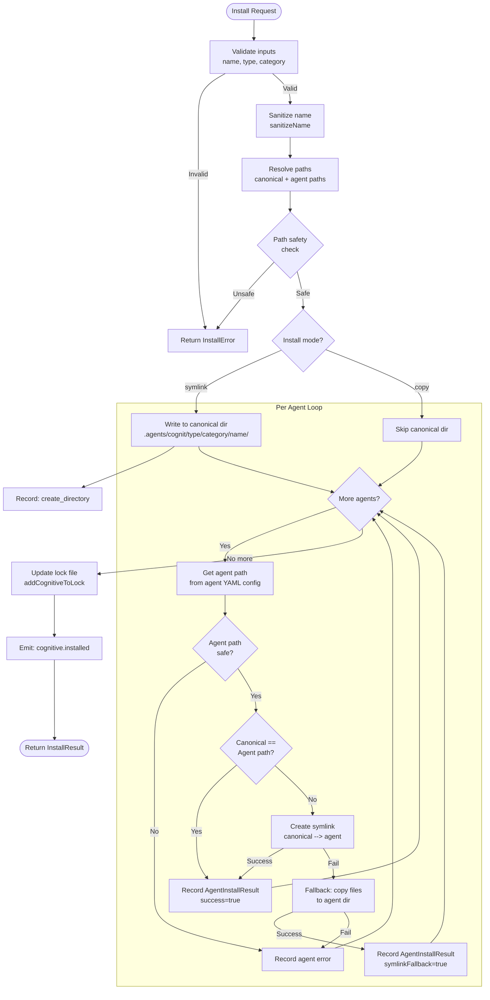

# 07 -- Installer System

## 1. Overview

The Installer is the core module responsible for placing cognitives onto the filesystem. It handles two installation modes (symlink, copy), two installation scopes (project, global), security validation, atomic operations, rollback on failure, and cross-platform differences. The Installer is interface-agnostic -- it exposes a programmatic API consumed by operations (add, update, sync), not by CLI code directly.

---

## 2. Installation Modes

### 2.1 Symlink (Default)

Files are written once to the **central canonical location** and symlinked into each agent's directory. This is the recommended mode because:

- Single source of truth -- updating the canonical file updates all agents
- Disk-efficient -- no file duplication
- Enables the `sync` operation to detect drift

### 2.2 Copy

Files are copied directly to each agent's directory. Used when:

- The filesystem does not support symlinks (Windows without Developer Mode)
- The user explicitly requests it (`--copy` flag)
- Symlink creation fails (automatic fallback)

---

## 3. Installation Scopes

### 3.1 Project-Level (Default)

Installs to the current project directory. Central storage lives at:

```
<project-root>/.agents/cognit/<type>/<category>/<name>/
```

Agent-specific symlinks point from:

```
<project-root>/.<agent>/<type>/<name>/  -->  ../../.agents/cognit/<type>/<category>/<name>/
```

### 3.2 Global-Level

Installs to the user's home directory. Central storage lives at:

```
~/.agents/cognit/<type>/<category>/<name>/
```

Agent-specific symlinks point from:

```
~/<agent-global-dir>/<type>/<name>/  -->  ../.agents/cognit/<type>/<category>/<name>/
```

Global paths follow XDG conventions on Linux/macOS and `%APPDATA%` on Windows (see Section 8).

---

## 4. Canonical Storage Pattern

### 4.1 Central Directory (Source of Truth)

All cognitives are stored centrally, organized by type and category:

```
.agents/cognit/
  skills/
    frontend/
      react-19/
        SKILL.md
        assets/
          diagram.png
      next-app-router/
        SKILL.md
    planning/
      task-decomposition/
        SKILL.md
  prompts/
    backend/
      api-design/
        PROMPT.md
  agents/
    devops/
      ci-pipeline/
        AGENT.md
  rules/
    security/
      owasp-top-10/
        RULE.md
```

### 4.2 Agent Directory (Symlinks, Flattened)

Agent directories flatten the category level since most agents do not support categories:

```
.claude/skills/
  react-19/  -->  ../../.agents/cognit/skills/frontend/react-19/
  next-app-router/  -->  ../../.agents/cognit/skills/frontend/next-app-router/
  task-decomposition/  -->  ../../.agents/cognit/skills/planning/task-decomposition/

.cursor/skills/
  react-19/  -->  ../../.agents/cognit/skills/frontend/react-19/
```

Key principle: **central has categories, agent dirs flatten**. The SDK manages this mapping transparently.

### 4.3 Why This Pattern

1. **One canonical file** -- updates propagate to all agents via symlinks
2. **Categories for organization** -- humans and tooling can browse by department
3. **Agent compatibility** -- agents see a flat list, unaware of categories
4. **Lock file alignment** -- the lock file references canonical paths

---

## 5. TypeScript Interfaces

```typescript
// ── Installation Mode ──────────────────────────────────

/** How files are placed in agent directories */
type InstallMode = 'symlink' | 'copy';

/** Where the cognitive is installed */
type InstallScope = 'project' | 'global';

// ── Install Options ────────────────────────────────────

interface InstallOptions {
  /** Installation mode. Defaults to 'symlink'. */
  mode: InstallMode;

  /** Installation scope. Defaults to 'project'. */
  scope: InstallScope;

  /** Project root for project-scope installs. Defaults to process.cwd(). */
  projectRoot: string;

  /** Target agents. If empty, installs to all detected agents. */
  agents: AgentType[];

  /** Category for the cognitive. Defaults to 'general'. */
  category: string;

  /** The cognitive type (skill, prompt, rule, agent). */
  cognitiveType: CognitiveType;

  /** Force overwrite if already installed. */
  force: boolean;

  /** Dry run -- report actions without executing. */
  dryRun: boolean;
}

// ── Install Result ─────────────────────────────────────

interface InstallResult {
  /** Whether the installation succeeded */
  success: boolean;

  /** The canonical path where the cognitive was stored */
  canonicalPath: string;

  /** Per-agent installation results */
  agentResults: AgentInstallResult[];

  /** Overall install mode used */
  mode: InstallMode;

  /** Errors encountered during installation */
  errors: InstallError[];

  /** Actions taken (for reporting / undo) */
  actions: InstallAction[];
}

interface AgentInstallResult {
  /** The agent this result is for */
  agent: AgentType;

  /** Whether installation to this agent succeeded */
  success: boolean;

  /** The path in the agent's directory */
  agentPath: string;

  /** The mode actually used (may differ from requested if symlink fell back to copy) */
  actualMode: InstallMode;

  /** Whether symlink creation failed and fell back to copy */
  symlinkFallback: boolean;

  /** Error message if failed */
  error?: string;
}

// ── Install Action (for rollback) ──────────────────────

type InstallActionType =
  | 'create_directory'
  | 'write_file'
  | 'create_symlink'
  | 'copy_file'
  | 'copy_directory'
  | 'remove_existing';

interface InstallAction {
  type: InstallActionType;
  path: string;
  /** For symlinks, the target of the link */
  target?: string;
  /** Backup path if we removed an existing file/dir */
  backupPath?: string;
}

// ── Install Error ──────────────────────────────────────

type InstallErrorCode =
  | 'PATH_TRAVERSAL'
  | 'ELOOP'
  | 'PERMISSION_DENIED'
  | 'DISK_FULL'
  | 'AGENT_UNSUPPORTED'
  | 'NAME_CONFLICT'
  | 'ATOMIC_WRITE_FAILED'
  | 'ROLLBACK_FAILED'
  | 'UNKNOWN';

interface InstallError {
  code: InstallErrorCode;
  message: string;
  path?: string;
  agent?: AgentType;
  cause?: Error;
}

// ── Installer Interface ────────────────────────────────

interface Installer {
  /**
   * Install a cognitive from a local directory source.
   * Copies files to canonical location, then symlinks to agents.
   */
  installFromDirectory(
    sourcePath: string,
    name: string,
    options: Partial<InstallOptions>
  ): Promise<InstallResult>;

  /**
   * Install a cognitive from raw content (e.g., fetched from a provider).
   * Writes content to canonical location, then symlinks to agents.
   */
  installFromContent(
    content: string,
    name: string,
    options: Partial<InstallOptions>
  ): Promise<InstallResult>;

  /**
   * Install a cognitive with multiple files (e.g., well-known provider).
   * Writes all files to canonical location, then symlinks to agents.
   */
  installFromFiles(
    files: Map<string, string>,
    name: string,
    options: Partial<InstallOptions>
  ): Promise<InstallResult>;

  /**
   * Uninstall a cognitive: remove agent symlinks and canonical directory.
   */
  uninstall(
    name: string,
    cognitiveType: CognitiveType,
    options: { scope: InstallScope; projectRoot?: string }
  ): Promise<UninstallResult>;

  /**
   * Check if a cognitive is installed for a specific agent.
   */
  isInstalled(
    name: string,
    agent: AgentType,
    cognitiveType: CognitiveType,
    options: { scope: InstallScope; projectRoot?: string }
  ): Promise<boolean>;
}

interface UninstallResult {
  success: boolean;
  removedPaths: string[];
  errors: InstallError[];
}
```

---

## 6. Path Resolution

### 6.1 Project Root Detection

The SDK walks up from `cwd` looking for markers in order:

1. `.agents/cognit/` directory (SDK-managed project)
2. `.git/` directory (git repository root)
3. `package.json` (Node project root)

If none found, `cwd` is used as project root.

```typescript
async function findProjectRoot(startDir: string): Promise<string> {
  let dir = resolve(startDir);
  const root = parse(dir).root;

  while (dir !== root) {
    // Check for SDK marker first
    if (await exists(join(dir, '.agents', 'cognit'))) return dir;
    // Then git root
    if (await exists(join(dir, '.git'))) return dir;
    // Then package.json
    if (await exists(join(dir, 'package.json'))) return dir;

    dir = dirname(dir);
  }

  return startDir;
}
```

### 6.2 Global Paths

| Platform | Base Path | Full Path |
|----------|-----------|-----------|
| macOS | `~/.agents/cognit/` | `/Users/<user>/.agents/cognit/skills/frontend/react-19/` |
| Linux | `${XDG_DATA_HOME}/cognit/` or `~/.local/share/cognit/` | `~/.local/share/cognit/skills/frontend/react-19/` |
| Windows | `%APPDATA%\cognit\` | `C:\Users\<user>\AppData\Roaming\cognit\skills\frontend\react-19\` |

The SDK uses a `getGlobalBase()` function that respects XDG on Linux:

```typescript
function getGlobalBase(): string {
  if (process.platform === 'win32') {
    return join(process.env.APPDATA || join(homedir(), 'AppData', 'Roaming'), 'cognit');
  }
  if (process.platform === 'linux') {
    const xdgData = process.env.XDG_DATA_HOME || join(homedir(), '.local', 'share');
    return join(xdgData, 'cognit');
  }
  // macOS and others
  return join(homedir(), '.agents', 'cognit');
}
```

### 6.3 Canonical Path Construction

```typescript
function getCanonicalPath(
  cognitiveType: CognitiveType,
  category: string,
  name: string,
  scope: InstallScope,
  projectRoot?: string
): string {
  const base = scope === 'global'
    ? getGlobalBase()
    : join(projectRoot || process.cwd(), '.agents', 'cognit');

  const typeSubdir = COGNITIVE_SUBDIRS[cognitiveType]; // e.g., 'skills'
  const safeName = sanitizeName(name);
  const safeCategory = sanitizeName(category);

  return join(base, typeSubdir, safeCategory, safeName);
}
```

### 6.4 Agent Path Construction

```typescript
function getAgentPath(
  agent: AgentType,
  cognitiveType: CognitiveType,
  name: string,
  scope: InstallScope,
  projectRoot?: string
): string {
  const agentConfig = agents[agent];
  const dirs = agentConfig.dirs[cognitiveType];

  const base = scope === 'global'
    ? dirs.global    // e.g., '~/.cursor/skills'
    : join(projectRoot || process.cwd(), dirs.local);  // e.g., '.cursor/skills'

  return join(base, sanitizeName(name));
}
```

---

## 7. Security

### 7.1 Path Traversal Prevention

Every path is validated before use:

```typescript
function isPathSafe(basePath: string, targetPath: string): boolean {
  const normalizedBase = normalize(resolve(basePath));
  const normalizedTarget = normalize(resolve(targetPath));
  return (
    normalizedTarget.startsWith(normalizedBase + sep) ||
    normalizedTarget === normalizedBase
  );
}
```

This is called:
- Before creating canonical directories
- Before creating agent symlinks
- Before writing any files (well-known provider files especially)
- Before removing directories during uninstall

### 7.2 Name Sanitization

```typescript
function sanitizeName(name: string): string {
  return name
    .toLowerCase()
    .replace(/[^a-z0-9._]+/g, '-')     // Replace unsafe chars with hyphens
    .replace(/^[.\-]+|[.\-]+$/g, '')    // Strip leading/trailing dots and hyphens
    .substring(0, 255)                   // Filesystem name limit
    || 'unnamed-cognitive';              // Fallback if empty
}
```

### 7.3 ELOOP Detection

Circular symlinks (ELOOP) are detected when:
- The canonical path resolves to the same location as the agent path (because the agent dir is itself a symlink to `.agents/`)
- A previous install left a broken circular symlink

Handling:
1. Before creating a symlink, resolve both source and target through `realpath()`
2. If they resolve to the same location, skip symlink creation (return success)
3. If ELOOP is caught during `lstat()`, force-remove the broken link and retry

### 7.4 Temp Containment

When files are fetched from remote sources, they are written to `os.tmpdir()` first. The SDK validates:
- Temp paths are within `os.tmpdir()`
- Temp directories are cleaned up after installation (even on failure)
- No symlinks escape the temp directory

### 7.5 Permissions

- Directories are created with default permissions (0o755 on Unix)
- Files are written with default permissions (0o644 on Unix)
- Symlinks inherit source permissions
- The SDK never changes file permissions post-creation

---

## 8. Rollback and Partial Failure

### 8.1 Action Tracking

Every filesystem operation is recorded as an `InstallAction`. If the install fails partway through, the rollback engine reverses the actions in LIFO order:

```typescript
async function rollback(actions: InstallAction[]): Promise<void> {
  // Reverse order: undo last action first
  for (const action of actions.reverse()) {
    try {
      switch (action.type) {
        case 'create_directory':
        case 'copy_directory':
          await rm(action.path, { recursive: true, force: true });
          break;
        case 'write_file':
        case 'copy_file':
        case 'create_symlink':
          await rm(action.path, { force: true });
          break;
        case 'remove_existing':
          // Restore from backup if available
          if (action.backupPath) {
            await rename(action.backupPath, action.path);
          }
          break;
      }
    } catch {
      // Log but continue -- best effort rollback
    }
  }
}
```

### 8.2 Partial Success Strategy

When installing to multiple agents:

1. Write to canonical directory first (single operation)
2. Create symlinks to each agent sequentially
3. If any agent symlink fails:
   - Record the failure in `AgentInstallResult`
   - Continue to the next agent (do NOT rollback successful agents)
   - Report partial success in `InstallResult`

The lock file is only updated after the canonical directory is written successfully. Agent symlink failures are recorded but do not block the lock file update.

### 8.3 Atomic Writes

File writes use the temp-file-then-rename pattern:

```typescript
async function atomicWriteFile(targetPath: string, content: string): Promise<void> {
  const tempPath = targetPath + '.tmp.' + process.pid;
  await writeFile(tempPath, content, 'utf-8');
  await rename(tempPath, targetPath);
}
```

This ensures that the target file is never in a partially-written state. If the process crashes during write, only the `.tmp` file is left (and cleaned up on next run).

---

## 9. File Operations

### 9.1 Directory Copy

```typescript
async function copyDirectory(src: string, dest: string): Promise<void> {
  await mkdir(dest, { recursive: true });
  const entries = await readdir(src, { withFileTypes: true });

  await Promise.all(
    entries
      .filter(entry => !isExcluded(entry.name, entry.isDirectory()))
      .map(async entry => {
        const srcPath = join(src, entry.name);
        const destPath = join(dest, entry.name);

        if (entry.isDirectory()) {
          await copyDirectory(srcPath, destPath);
        } else {
          await cp(srcPath, destPath, { dereference: true });
        }
      })
  );
}
```

Excluded files: `README.md`, `metadata.json`, `.git/`, files starting with `_`.

### 9.2 Symlink Creation

```typescript
async function createSymlink(target: string, linkPath: string): Promise<boolean> {
  const resolvedTarget = resolve(target);
  const resolvedLinkPath = resolve(linkPath);

  // Skip if paths resolve to the same location
  if (resolvedTarget === resolvedLinkPath) return true;

  // Check with parent symlinks resolved
  const realTarget = await resolveParentSymlinks(target);
  const realLinkPath = await resolveParentSymlinks(linkPath);
  if (realTarget === realLinkPath) return true;

  // Handle existing entry at link path
  try {
    const stats = await lstat(linkPath);
    if (stats.isSymbolicLink()) {
      const existingTarget = await readlink(linkPath);
      if (resolve(dirname(linkPath), existingTarget) === resolvedTarget) return true;
      await rm(linkPath);
    } else {
      await rm(linkPath, { recursive: true });
    }
  } catch (err: unknown) {
    if (isErrnoException(err) && err.code === 'ELOOP') {
      await rm(linkPath, { force: true });
    }
    // ENOENT is expected -- link doesn't exist yet
  }

  // Create parent directory
  await mkdir(dirname(linkPath), { recursive: true });

  // Compute relative symlink path
  const realLinkDir = await resolveParentSymlinks(dirname(linkPath));
  const relativePath = relative(realLinkDir, target);
  const symlinkType = platform() === 'win32' ? 'junction' : undefined;

  await symlink(relativePath, linkPath, symlinkType);
  return true;
}
```

### 9.3 Clean and Create

Before writing to a directory, it is cleaned (removed and recreated):

```typescript
async function cleanAndCreateDirectory(path: string): Promise<void> {
  try {
    await rm(path, { recursive: true, force: true });
  } catch {
    // Ignore cleanup errors
  }
  await mkdir(path, { recursive: true });
}
```

---

## 10. Windows Support

### 10.1 Junction vs Symlink

On Windows:
- **Symlinks** require admin privileges or Developer Mode enabled
- **Junctions** work without elevation but only for directories

The SDK uses junctions on Windows by passing `'junction'` to `fs.symlink()`:

```typescript
const symlinkType = process.platform === 'win32' ? 'junction' : undefined;
await symlink(relativePath, linkPath, symlinkType);
```

### 10.2 Symlink Support Detection

Before the first symlink operation, the SDK tests if symlinks are supported:

```typescript
async function checkSymlinkSupport(testDir: string): Promise<boolean> {
  if (process.platform !== 'win32') return true;

  const testTarget = join(testDir, '.symlink-test-target');
  const testLink = join(testDir, '.symlink-test');

  try {
    await writeFile(testTarget, 'test', 'utf-8');
    await symlink(testTarget, testLink);
    await rm(testLink);
    await rm(testTarget);
    return true;
  } catch {
    // Clean up on failure
    try { await rm(testLink, { force: true }); } catch {}
    try { await rm(testTarget, { force: true }); } catch {}
    return false;
  }
}
```

If symlinks are not supported, the SDK falls back to copy mode with a warning.

### 10.3 Path Separator Normalization

All paths stored in the lock file and used for symlink targets use forward slashes. The SDK normalizes at the boundary:

```typescript
function normalizeForStorage(p: string): string {
  return p.replace(/\\/g, '/');
}
```

---

## 11. Install Flow Diagram



---

## 12. Existing Code Reference

The current cognit codebase implements this pattern across:

| File | Purpose | LOC |
|------|---------|-----|
| `src/services/installer/orchestrator.ts` | 3 install variants (directory, remote, well-known) | 423 |
| `src/services/installer/file-ops.ts` | copyDirectory, createSymlink, cleanAndCreateDirectory | 149 |
| `src/services/installer/paths.ts` | sanitizeName, isPathSafe, getCanonicalDir | 109 |
| `src/services/installer/listing.ts` | listInstalledCognitives, isCognitiveInstalled | 312 |

The SDK redesign unifies the 3 install variants into a single `Installer` interface with `installFromDirectory`, `installFromContent`, and `installFromFiles` methods. It also adds:

- Category-aware canonical paths (`.agents/cognit/<type>/<category>/<name>/`)
- Action tracking for rollback
- Structured error types
- Dry-run support at the installer level
- Event emission for observability

---

## 13. Edge Cases

| Scenario | Handling |
|----------|----------|
| Agent dir is symlink to `.agents/` | resolveParentSymlinks detects this, skips symlink creation |
| Cognitive name contains `../` | sanitizeName strips it; isPathSafe rejects the result |
| Two cognitives with same name, different categories | Lock file keys by `type:category:name`; agent dir uses name only (last one wins with warning) |
| Install interrupted mid-write | Rollback engine removes partial files; next run cleans `.tmp` files |
| Disk full during write | atomicWriteFile leaves only `.tmp` file; rollback cleans up |
| Symlink target deleted after install | Lock file still has entry; `sync` or `doctor` detects broken link |
| Global install on agent without global support | Returns `AgentInstallResult` with `success: false` and `AGENT_UNSUPPORTED` error |
| Concurrent installs | File-level atomic writes via rename; lock file uses read-modify-write with temp file |
