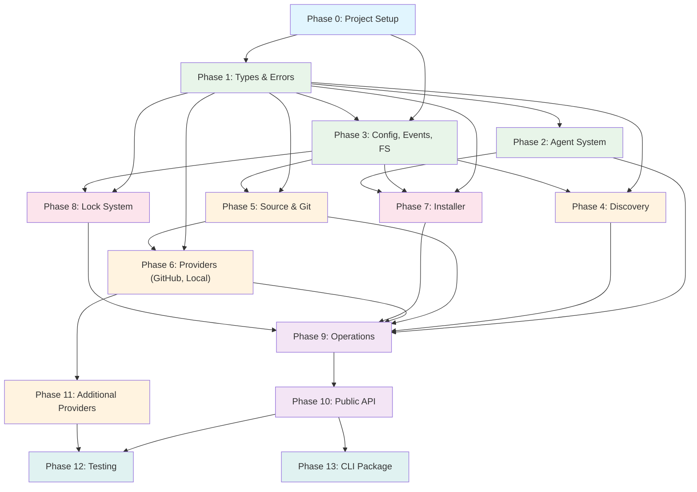

# 11 - Implementation Roadmap

**Author:** Agent D -- Implementation Planner
**Date:** 2026-02-09
**Status:** Plan

---

## Overview

This roadmap decomposes the complete SDK into 12 implementation phases. Each phase is designed to be executed by a Claude agent with full context. Phases are ordered by dependency -- each phase only depends on phases that came before it. Every phase includes specific files to create, interfaces to implement, tests to write, and acceptance criteria.

The monorepo structure follows the directory plan from `09-directory-structure.md`. The SDK package lives at `packages/cognit-core/` and the CLI at `packages/cognit-cli/`.

---

## Phase 0: Project Setup

**Goal:** Create the monorepo skeleton with all build tooling, configuration, and CI.

**Dependencies:** None (this is the starting point).

### Files to Create

```
cognit-cli/                              # Repository root
  package.json                           # pnpm workspace root config
  pnpm-workspace.yaml                   # { packages: ["packages/*"] }
  tsconfig.json                          # Root TS config with references
  .gitignore
  .eslintrc.json                         # ESLint with no-restricted-imports rules
  .prettierrc
  LICENSE

  packages/
    cognit-core/
      package.json                       # @synapsync/cognit-core
      tsconfig.json                      # Extends root, composite: true
      tsup.config.ts                     # ESM output, dts: true
      vitest.config.ts                   # Test runner config

    cognit-cli/
      package.json                       # cognit (CLI binary name)
      tsconfig.json                      # Extends root, references cognit-core
      tsup.config.ts                     # Bundle CLI
      bin/
        cli.js                           # #!/usr/bin/env node shebang wrapper
```

### Configuration Details

**Root `package.json`:**
- `"private": true`
- `"type": "module"`
- `"packageManager": "pnpm@9.x"`
- Scripts: `build`, `test`, `lint`, `compile-agents`, `clean`

**Root `tsconfig.json`:**
- `target: "ES2022"`, `module: "ESNext"`, `moduleResolution: "bundler"`
- `strict: true`, `exactOptionalPropertyTypes: true`, `noUncheckedIndexedAccess: true`
- `declaration: true`, `declarationMap: true`, `sourceMap: true`
- References to both packages

**`cognit-core/package.json`:**
- `name: "@synapsync/cognit-core"`
- `type: "module"`
- `exports: { ".": { import, types } }`
- `engines: { node: ">=20" }`
- Dependencies: `gray-matter`, `simple-git`, `xdg-basedir`
- Dev dependencies: `vitest`, `tsup`, `typescript`, `tsx`

**`cognit-core/vitest.config.ts`:**
- Test files: `tests/**/*.test.ts`
- Coverage provider: v8
- Coverage thresholds: statements 80%, branches 75%, functions 80%

**`pnpm-workspace.yaml`:**
```yaml
packages:
  - "packages/*"
```

### Definition of Done

- [ ] `pnpm install` succeeds
- [ ] `pnpm run build` compiles both packages (empty index.ts files for now)
- [ ] `pnpm run test` runs vitest (no tests yet, but exits 0)
- [ ] `pnpm run lint` runs eslint with no errors
- [ ] TypeScript strict mode is enforced across both packages
- [ ] `.gitignore` excludes `node_modules/`, `dist/`, `coverage/`, `__generated__/`
- [ ] Root tsconfig references both packages correctly

### Instructions for Implementing Agent

1. Create the root directory and all config files first.
2. Create both package directories with their own configs.
3. Create placeholder `src/index.ts` files in both packages (empty exports).
4. Verify the full build pipeline works end-to-end.
5. Do NOT add any source code beyond placeholder files.

---

## Phase 1: Type System & Core Types

**Goal:** Implement all types, branded types, result utilities, error hierarchy, and event types. These are the foundation every other module depends on.

**Dependencies:** Phase 0 (project setup).

### Files to Create

```
packages/cognit-core/src/
  types/
    index.ts                    # Barrel re-exports for all types
    branded.ts                  # AgentName, CognitiveName, SafeName, SourceIdentifier + constructors
    result.ts                   # Result<T,E>, ok(), err(), unwrap(), mapResult()
    cognitive.ts                # Cognitive, CognitiveType, CognitiveRef, Skill, Prompt, Rule, AgentCognitive, RemoteCognitive, COGNITIVE_TYPE_CONFIGS, COGNITIVE_SUBDIRS, COGNITIVE_FILE_NAMES, AGENTS_DIR
    agent.ts                    # AgentConfig, AgentType (placeholder), AgentDirConfig, AgentDetectionResult, AgentRegistry interface
    provider.ts                 # HostProvider, ProviderMatch, ProviderRegistry, SourceDescriptor, SourceParser, GitClient, GitCloneOptions, ProviderFetchOptions
    installer.ts                # InstallMode, InstallScope, InstallTarget, InstallResult, InstallRequest, WellKnownCognitive, Installer, InstallerOptions
    lock.ts                     # LockFile, LockEntry, LockManager, LOCK_VERSION
    operations.ts               # AddOptions, AddResult, ListOptions, ListResult, RemoveOptions, RemoveResult, UpdateOptions, UpdateResult, SyncOptions, SyncResult, InstallResultEntry, InstalledCognitive, UpdateCheckEntry
    category.ts                 # Category, CategoryMapping, DEFAULT_CATEGORIES
    config.ts                   # SDKConfig, FileSystemAdapter, FsStats, Dirent, GitConfig, ProviderConfig, AgentRegistryConfig, TelemetryConfig
    events.ts                   # SDKEventMap, Unsubscribe, EventBus interface

  errors/
    index.ts                    # Barrel re-exports
    base.ts                     # CognitError abstract class
    provider.ts                 # ProviderError, ProviderFetchError, ProviderMatchError
    install.ts                  # InstallError, PathTraversalError, SymlinkError, FileWriteError
    discovery.ts                # DiscoveryError, ParseError, ScanError
    lock.ts                     # LockError, LockReadError, LockWriteError, LockMigrationError
    config.ts                   # ConfigError, InvalidConfigError
    source.ts                   # SourceError, SourceParseError, GitCloneError
    agent.ts                    # AgentError, AgentNotFoundError, AgentDetectionError
    codes.ts                    # ERROR_CODES const map, ErrorCode type
```

### Interfaces to Implement (from `02-type-system.md`)

- All branded type constructors with validation (`agentName`, `cognitiveName`, `safeName`, `sourceIdentifier`)
- `Result<T, E>` discriminated union with `ok()`, `err()`, `unwrap()`, `mapResult()` helpers
- `CognitError` abstract base class with `code`, `module`, `toJSON()`
- All error subclasses (see 02-type-system.md Section 12)
- `ERROR_CODES` const map
- All `const maps` for cognitive types (`COGNITIVE_TYPE_CONFIGS`, `COGNITIVE_SUBDIRS`, etc.)
- `DEFAULT_CATEGORIES` const map

### Tests to Write

```
packages/cognit-core/tests/
  types/
    branded.test.ts             # agentName validation, cognitiveName rejects slashes, safeName rejects dots
    result.test.ts              # ok/err creation, unwrap success/throw, mapResult
  errors/
    hierarchy.test.ts           # instanceof chains (ProviderFetchError instanceof ProviderError instanceof CognitError)
    codes.test.ts               # All error classes have matching ERROR_CODES entries
    serialization.test.ts       # toJSON() produces expected shape
```

### Definition of Done

- [ ] All type files compile with zero errors under `strict: true`
- [ ] Branded type constructors reject invalid inputs and throw
- [ ] `Result<T, E>` works with generic types
- [ ] All error classes form correct `instanceof` chains
- [ ] Every error has a `code` and `module` property
- [ ] `ERROR_CODES` map covers every error class
- [ ] `toJSON()` on errors produces a plain object with name, code, module, message, cause
- [ ] All tests pass
- [ ] `packages/cognit-core/src/index.ts` re-exports all public types and errors

---

## Phase 2: Agent System (YAML Definitions + Compile Script + Registry)

**Goal:** Implement the YAML-based agent definition system, the compile-to-TypeScript pipeline, and the agent registry.

**Dependencies:** Phase 1 (types and errors).

### Files to Create

```
packages/cognit-core/
  agents/                               # YAML agent definitions (39+ files)
    claude-code.yaml
    cursor.yaml
    codex.yaml
    opencode.yaml
    windsurf.yaml
    gemini-cli.yaml
    github-copilot.yaml
    goose.yaml
    roo.yaml
    amp.yaml
    ... (all 39+ agents)

  config/
    cognitive-types.yaml                # skill, agent, prompt, rule definitions
    categories.yaml                     # Default category definitions

  scripts/
    compile-agents.ts                   # YAML -> TypeScript compile pipeline
    validate-agents.ts                  # Agent YAML validation script

  src/
    agents/
      index.ts                          # AgentRegistryImpl exports
      registry.ts                       # AgentRegistryImpl class
      detector.ts                       # AgentDetectorImpl (detection logic)
      __generated__/
        agents.ts                       # Compiled agent configs Record<AgentType, AgentConfig>
        agent-type.ts                   # AgentType union type
        cognitive-types.ts              # CognitiveType union + COGNITIVE_* constants
```

### Interfaces to Implement (from `04-agent-system.md`)

- `AgentRegistryImpl` implementing `AgentRegistry` interface:
  - `getAll()`, `get()`, `getUniversalAgents()`, `getNonUniversalAgents()`
  - `isUniversal()`, `getDir()`, `detectInstalled()`, `register()`
- `AgentDetectorImpl` using filesystem checks per YAML detect rules
- Compile script phases: Load YAML -> Validate -> Resolve conventions -> Generate TypeScript

### Compile Pipeline (from `04-agent-system.md` Section 7)

The compile script must:
1. Read all `agents/*.yaml` files
2. Read `config/cognitive-types.yaml`
3. Validate required fields (name, displayName, rootDir/localRoot)
4. Cross-validate (no duplicate names/displayNames)
5. Resolve conventions (rootDir -> localRoot, globalRoot, detect)
6. Generate `agent-type.ts` (AgentType union)
7. Generate `cognitive-types.ts` (CognitiveType union + const maps)
8. Generate `agents.ts` (full Record<AgentType, AgentConfig> with detectInstalled functions)
9. Write all files with `// AUTO-GENERATED -- DO NOT EDIT` header

### Tests to Write

```
packages/cognit-core/tests/
  agents/
    registry.test.ts            # getAll, get, getUniversalAgents, getNonUniversalAgents, isUniversal, getDir, register
    detector.test.ts            # detectInstalled with mock filesystem (seed agent directories)
    generated.test.ts           # Verify generated agents match expected shape and count
  scripts/
    compile-agents.test.ts      # End-to-end compile: given test YAML, verify output TS
```

### Definition of Done

- [ ] `pnpm run compile-agents` generates all 3 output files without errors
- [ ] Generated `AgentType` union includes all 39+ agents
- [ ] Generated `agents.ts` contains full config for every agent
- [ ] `AgentRegistryImpl` loads generated agents and responds to all queries
- [ ] `detectInstalled()` works with injected filesystem adapter
- [ ] `register()` adds runtime agents
- [ ] Convention-over-configuration: a 3-line YAML (name, displayName, rootDir) produces correct full config
- [ ] All tests pass
- [ ] Build pipeline runs `compile-agents` before TypeScript compilation

---

## Phase 3: Config, Events, and Filesystem Adapter

**Goal:** Implement SDK configuration resolution, the event bus, and the filesystem abstraction layer.

**Dependencies:** Phase 1 (types and errors).

### Files to Create

```
packages/cognit-core/src/
  config/
    index.ts                    # resolveConfig(), validateConfig()
    defaults.ts                 # Default config values
    validation.ts               # Config validation rules

  events/
    index.ts                    # EventBusImpl, createCapturingEventBus

  fs/
    index.ts                    # Barrel exports
    node.ts                     # Node.js fs/promises wrapper implementing FileSystemAdapter
    memory.ts                   # In-memory FS implementation (for tests)
```

### Interfaces to Implement (from `01-architecture.md`)

- `resolveConfig(partial?)` -- merge user config with defaults
- `validateConfig()` -- throw `InvalidConfigError` for invalid configs
- `EventBusImpl` implementing `EventBus` -- `emit()`, `on()`, `once()`
- `createCapturingEventBus()` -- test utility that records all events
- `nodeFs` -- real Node.js filesystem adapter
- `createMemoryFs(seed?)` -- in-memory filesystem for tests

### Tests to Write

```
packages/cognit-core/tests/
  config/
    resolve.test.ts             # resolveConfig with partial inputs, verify defaults
    validation.test.ts          # validateConfig rejects bad configs
  events/
    event-bus.test.ts           # subscribe, emit, verify handler; once fires once; unsubscribe works; capturing bus records events
  fs/
    memory.test.ts              # mkdir -p, readdir with types, readFile/writeFile round-trip, symlink, exists, rm
```

### Definition of Done

- [ ] `resolveConfig()` fills all defaults when called with no arguments
- [ ] `resolveConfig()` correctly merges partial overrides
- [ ] `validateConfig()` rejects empty `cwd`, negative timeouts, etc.
- [ ] `EventBusImpl.on()` delivers typed payloads to handlers
- [ ] `EventBusImpl.once()` fires exactly once
- [ ] Unsubscribe removes the handler
- [ ] `createCapturingEventBus()` records events in order
- [ ] `nodeFs` wraps all required `fs/promises` operations
- [ ] `createMemoryFs()` implements all `FileSystemAdapter` methods
- [ ] In-memory FS supports recursive mkdir, symlink, readdir with file types
- [ ] All tests pass

---

## Phase 4: Discovery Engine

**Goal:** Implement the filesystem scanning and frontmatter parsing system that discovers cognitive files.

**Dependencies:** Phase 1 (types), Phase 3 (events, filesystem adapter).

### Files to Create

```
packages/cognit-core/src/
  discovery/
    index.ts                    # DiscoveryServiceImpl exports
    scanner.ts                  # Filesystem scanning (findCognitiveDirs, buildPrioritySearchDirs)
    parser.ts                   # Frontmatter parsing (parseCognitiveMd, hasCognitiveMd)
    plugin-manifest.ts          # Claude plugin manifest support (plugin-manifest.json)
```

### Interfaces to Implement (from `03-modules.md` Section 2.6)

- `DiscoveryServiceImpl` implementing `DiscoveryService`:
  - `discover(basePath, options?)` -- scan a directory tree for cognitive files
  - `discoverByType(basePath, type, options?)` -- scan for a specific type
- `scanner.ts`:
  - `findCognitiveDirs(fs, basePath, types?)` -- walk directory tree looking for SKILL.md/AGENT.md/PROMPT.md/RULE.md
  - `buildPrioritySearchDirs(basePath)` -- generate priority-ordered directories to scan
- `parser.ts`:
  - `parseCognitiveMd(content, filePath)` -- parse frontmatter with `gray-matter`, validate required fields (name, description), return `Cognitive`
  - `hasCognitiveMd(fs, dirPath, type)` -- check if a directory contains a cognitive file
- `plugin-manifest.ts`:
  - `parsePluginManifest(manifestPath)` -- parse Claude's `plugin-manifest.json` format

### External Dependencies

- `gray-matter` (YAML frontmatter parsing)

### Tests to Write

```
packages/cognit-core/tests/
  discovery/
    parser.test.ts              # Valid frontmatter, missing fields, empty file, invalid YAML, various metadata
    scanner.test.ts             # In-memory FS with seeded directory structures, verify discovery
    discovery.test.ts           # Full DiscoveryServiceImpl with realistic dirs, type filtering, subpath, internal filtering
    plugin-manifest.test.ts     # Claude plugin manifest parsing
```

### Definition of Done

- [ ] `parseCognitiveMd()` correctly extracts name, description, type, and all metadata from frontmatter
- [ ] Parser returns `ParseError` for files missing required frontmatter fields
- [ ] Scanner finds all cognitive files in nested directory structures
- [ ] `DiscoveryServiceImpl.discover()` returns correct `Cognitive[]` for a seeded in-memory FS
- [ ] Type filtering works (only discover skills, only discover prompts, etc.)
- [ ] Subpath filtering works (only discover within a specific subdirectory)
- [ ] `internal: true` filtering works (skip internal cognitives)
- [ ] Events are emitted: `discovery:start`, `discovery:found`, `discovery:complete`
- [ ] All tests pass

---

## Phase 5: Source Parser & Git Client

**Goal:** Implement source string parsing and git clone operations.

**Dependencies:** Phase 1 (types), Phase 3 (events, config).

### Files to Create

```
packages/cognit-core/src/
  source/
    index.ts                    # Barrel exports
    parser.ts                   # SourceParserImpl
    git.ts                      # GitClientImpl
```

### Interfaces to Implement (from `05-provider-system.md` Section 6)

- `SourceParserImpl` implementing `SourceParser`:
  - `parse(source)` -- detect source type from raw string (GitHub URL, local path, shorthand, etc.)
  - `getOwnerRepo(source)` -- extract `owner/repo` from git sources
- `GitClientImpl` implementing `GitClient`:
  - `clone(url, options?)` -- shallow clone to temp directory
  - `cleanup(tempDir)` -- remove temp directory

### Source Parsing Rules (from `05-provider-system.md` Section 6.2)

Priority order:
1. `isLocalPath(input)` -> `local`
2. `isDirectCognitiveUrl(input)` -> `direct-url`
3. GitHub tree with path -> `github` with ref + subpath
4. GitHub repo URL -> `github`
5. GitLab patterns -> `gitlab`
6. `owner/repo@name` -> `github` with nameFilter
7. `owner/repo(/path)?` -> `github` (shorthand)
8. Well-known URL -> `well-known`
9. Fallback -> `git`

### External Dependencies

- `simple-git` (git clone operations)

### Tests to Write

```
packages/cognit-core/tests/
  source/
    parser.test.ts              # Exhaustive input variants: owner/repo, owner/repo/path, owner/repo@name, GitHub URLs (tree, blob, plain), GitLab URLs, local paths (absolute, relative, .), direct URLs, well-known URLs, generic git URLs
    git.test.ts                 # Clone with mock git (or integration test with real small repo)
```

### Definition of Done

- [ ] `SourceParserImpl.parse()` correctly identifies all source types
- [ ] Shorthand `owner/repo` resolves to GitHub URL
- [ ] Subpath extraction works for `owner/repo/path/to/skill`
- [ ] Name filter extraction works for `owner/repo@skill-name`
- [ ] Ref extraction works for `github.com/o/r/tree/branch`
- [ ] Local paths (absolute, relative, `.`) are detected correctly
- [ ] Direct cognitive URLs (ending in SKILL.md) are detected
- [ ] `GitClientImpl.clone()` creates a temp directory with cloned content
- [ ] `GitClientImpl.cleanup()` removes the temp directory
- [ ] Events emitted: `git:clone:start`, `git:clone:complete`, `git:clone:error`
- [ ] All tests pass

---

## Phase 6: Provider System

**Goal:** Implement the provider registry and initial providers (GitHub, Local). Additional providers (Mintlify, HuggingFace, etc.) are deferred to Phase 9.

**Dependencies:** Phase 1 (types), Phase 3 (events), Phase 5 (source parser).

### Files to Create

```
packages/cognit-core/src/
  providers/
    index.ts                    # ProviderRegistryImpl, registerDefaultProviders
    registry.ts                 # Registry implementation
    github.ts                   # GitHubProvider (native GitHub API, not git clone)
    local.ts                    # LocalProvider (filesystem read)
```

### Interfaces to Implement (from `05-provider-system.md`)

- `ProviderRegistryImpl` implementing `ProviderRegistry`:
  - `register(provider)` -- add a provider (reject duplicates)
  - `findProvider(source)` -- first-match wins
  - `getAll()` -- list all providers
- `registerDefaultProviders(registry, config)` -- register built-in providers in priority order
- `GitHubProvider` implementing `HostProvider`:
  - `match()`, `fetchCognitive()`, `fetchAll()`, `toRawUrl()`, `getSourceIdentifier()`
- `LocalProvider` implementing `HostProvider`:
  - `match()`, `fetchCognitive()`, `fetchAll()`, `toRawUrl()`, `getSourceIdentifier()`

### Tests to Write

```
packages/cognit-core/tests/
  providers/
    registry.test.ts            # Register, findProvider, duplicate rejection, priority ordering
    github.test.ts              # match() with various URL patterns, toRawUrl conversion, getSourceIdentifier
    local.test.ts               # match() with path patterns, fetchCognitive from in-memory FS
```

### Definition of Done

- [ ] `ProviderRegistryImpl` registers providers and finds them by URL
- [ ] Duplicate provider IDs are rejected
- [ ] First-match-wins priority works correctly
- [ ] `GitHubProvider.match()` matches GitHub URLs and shorthand
- [ ] `GitHubProvider.toRawUrl()` converts blob URLs to raw.githubusercontent.com
- [ ] `LocalProvider.match()` matches absolute and relative paths
- [ ] `LocalProvider.fetchCognitive()` reads from in-memory FS
- [ ] Events emitted: `provider:fetch:start`, `provider:fetch:complete`, `provider:fetch:error`
- [ ] All tests pass

---

## Phase 7: Installer

**Goal:** Implement the unified installer that writes cognitives to canonical directories and creates symlinks/copies to agent directories.

**Dependencies:** Phase 1 (types), Phase 2 (agents), Phase 3 (events, filesystem adapter).

### Files to Create

```
packages/cognit-core/src/
  installer/
    index.ts                    # InstallerImpl exports
    installer.ts                # InstallerImpl class (unified install function)
    file-ops.ts                 # FileOperationsImpl (copyDirectory, createSymlink, cleanAndCreate, atomicWrite)
    paths.ts                    # sanitizeName, getCanonicalDir, getAgentPath, isPathSafe, isContainedIn, findProjectRoot
    symlink.ts                  # Cross-platform symlink creation with ELOOP detection, fallback to copy
```

### Interfaces to Implement (from `07-installer.md`)

- `InstallerImpl` implementing `Installer`:
  - `install(request: InstallRequest, target: InstallTarget, options: InstallerOptions)` -- unified install handling local, remote, and well-known cognitives
  - `remove(cognitiveName, cognitiveType, target)` -- remove from agent directory
- `FileOperationsImpl` implementing `FileOperations`:
  - `copyDirectory(source, target)` -- recursive copy with exclusions
  - `cleanAndCreateDirectory(dir)` -- remove and recreate
  - `createSymlink(source, target)` -- with ELOOP detection, relative paths, Windows junction support
  - `writeFile(path, content)` -- atomic write (temp + rename)
  - `removeDirectory(dir)` -- recursive remove
- Path utilities:
  - `sanitizeName(raw)` -- lowercase, replace unsafe chars, strip dots, limit length
  - `getCanonicalDir(type, category, name, scope, cwd, homeDir)` -- `.agents/cognit/<type>/<category>/<name>/`
  - `getAgentPath(agent, type, name, scope, cwd)` -- `.<agent>/<type>/<name>/` (flattened, no category)
  - `isPathSafe(base, target)` -- path traversal prevention
  - `isContainedIn(parent, child)` -- containment check

### Key Design (from `07-installer.md` Section 4)

- Central canonical path: `.agents/cognit/<type>/<category>/<name>/`
- Agent path (flattened): `.<agent>/<type>/<name>/`
- Symlink direction: agent dir -> canonical dir
- Universal agents (using `.agents/`) skip symlink creation

### Tests to Write

```
packages/cognit-core/tests/
  installer/
    paths.test.ts               # sanitizeName (spaces, slashes, dots, unicode, empty), isPathSafe (traversal), getCanonicalDir, getAgentPath
    file-ops.test.ts            # copyDirectory, createSymlink (success, ELOOP, fallback), atomicWrite, cleanAndCreate -- all with in-memory FS
    installer.test.ts           # Full InstallerImpl with in-memory FS:
                                #   - Symlink mode: canonical dir + symlink created
                                #   - Copy mode: direct copy
                                #   - Symlink fallback to copy on failure
                                #   - Universal agent: no symlink needed
                                #   - Remote cognitive: content written to canonical
                                #   - WellKnown cognitive: multiple files written
    symlink.test.ts             # resolveParentSymlinks, ELOOP detection, relative path computation
```

### Definition of Done

- [ ] `sanitizeName()` produces safe filesystem names for all edge cases
- [ ] `isPathSafe()` rejects `../` traversal attempts
- [ ] `InstallerImpl.install()` writes to canonical dir and creates symlinks for non-universal agents
- [ ] Universal agents (`.agents/` localRoot) skip symlink creation
- [ ] Copy mode writes directly to agent directory
- [ ] Symlink failure falls back to copy with `symlinkFailed: true` in result
- [ ] ELOOP detection works (circular symlinks handled)
- [ ] Category is included in canonical path but flattened in agent path
- [ ] `InstallerImpl.remove()` cleans up symlinks and canonical dirs
- [ ] Events emitted: `install:start`, `install:symlink`, `install:copy`, `install:complete`
- [ ] All tests pass

---

## Phase 8: Lock File System

**Goal:** Implement lock file reading, writing, migration, and CRUD operations.

**Dependencies:** Phase 1 (types), Phase 3 (config, events, filesystem adapter).

### Files to Create

```
packages/cognit-core/src/
  lock/
    index.ts                    # LockManagerImpl exports
    manager.ts                  # LockManagerImpl class
    reader.ts                   # Lock file reading, JSON parsing, version detection, migration
    writer.ts                   # Lock file writing (atomic: temp + rename)
    hash.ts                     # computeContentHash (SHA-256), fetchCognitiveFolderHash (GitHub Trees API)
    migration.ts                # migrateFromV3, migrateFromV4 -> v5
```

### Interfaces to Implement (from `08-lock-system.md`)

- `LockManagerImpl` implementing `LockManager`:
  - `read()` -- read lock file, migrate if needed, return empty if not found
  - `write(lock)` -- atomic write
  - `addEntry(name, entry)` -- add/update with automatic timestamps
  - `removeEntry(name)` -- remove, return true if existed
  - `getEntry(name)` -- get single entry
  - `getAllEntries()` -- get all entries
  - `getBySource()` -- group entries by source identifier
  - `getLastSelectedAgents()` / `saveLastSelectedAgents(agents)` -- preference persistence
- Hash utilities:
  - `computeContentHash(content)` -- SHA-256 hex digest
  - `fetchCognitiveFolderHash(ownerRepo, cognitivePath, token?)` -- GitHub Trees API

### Lock File Schema (from `08-lock-system.md` Section 3)

Version 5 with composite keys `{type}:{category}:{name}`, metadata block with timestamps and SDK version, per-entry fields for source, hashes, install state, timestamps.

### Tests to Write

```
packages/cognit-core/tests/
  lock/
    manager.test.ts             # Full CRUD: read empty, addEntry, getEntry, removeEntry, getAllEntries, getBySource
    reader.test.ts              # Read valid v5, read v4 (migration), read v3 (migration), read corrupted JSON (graceful), read missing file (empty)
    writer.test.ts              # Write and re-read round-trip, atomic write (verify no partial state)
    hash.test.ts                # computeContentHash deterministic, known SHA-256 values
    migration.test.ts           # v4 -> v5 migration (cognitives -> entries, add category, add metadata)
```

### Definition of Done

- [ ] `LockManagerImpl.read()` returns empty lock file when file doesn't exist
- [ ] `LockManagerImpl.read()` parses valid v5 lock files
- [ ] Old versions (v3, v4) are migrated to v5 on read
- [ ] Corrupted JSON returns empty lock file (not crash)
- [ ] `addEntry()` sets `installedAt` on new entries, `updatedAt` on existing
- [ ] `removeEntry()` returns true if entry existed, false otherwise
- [ ] `getBySource()` groups entries correctly
- [ ] `write()` uses atomic temp-file-then-rename pattern
- [ ] `computeContentHash()` produces deterministic SHA-256 hex
- [ ] Events emitted: `lock:read`, `lock:write`, `lock:migrate`
- [ ] All tests pass

---

## Phase 9: Operations

**Goal:** Implement all SDK operations: add, list, remove, update, sync, check, init, find.

**Dependencies:** Phase 2 (agents), Phase 3 (config, events), Phase 4 (discovery), Phase 5 (source), Phase 6 (providers), Phase 7 (installer), Phase 8 (lock).

### Files to Create

```
packages/cognit-core/src/
  operations/
    index.ts                    # Barrel exports
    add.ts                      # AddOperation
    list.ts                     # ListOperation
    remove.ts                   # RemoveOperation
    update.ts                   # UpdateOperation
    sync.ts                     # SyncOperation
    check.ts                    # CheckOperation (integrity verification)
    init.ts                     # InitOperation (scaffold new cognitive)
    find.ts                     # FindOperation (discover remote cognitives without installing)
```

### Interfaces to Implement (from `06-operations.md`)

Each operation class receives dependencies via constructor injection:

- **AddOperation**: Parse source -> resolve provider -> clone/fetch -> discover cognitives -> filter -> install -> update lock
- **ListOperation**: Read lock file -> scan filesystem -> merge state -> filter -> return
- **RemoveOperation**: Lookup in lock -> resolve paths -> remove files/symlinks -> remove lock entry
- **UpdateOperation**: Read lock -> fetch remote hashes -> compare -> re-install updated -> update lock
- **SyncOperation**: Read lock -> scan filesystem -> detect drift (missing files, broken symlinks, orphans) -> fix
- **CheckOperation**: Read lock -> verify canonical paths exist -> verify symlinks valid -> verify hashes
- **InitOperation**: Validate name -> create directory -> generate template file with frontmatter
- **FindOperation**: Parse source -> resolve provider -> fetch cognitives -> cross-reference with lock -> filter

### Non-Interactive Design (from `06-operations.md` Section 9)

Operations return data, not prompts. When user input is needed (e.g., agent selection, cognitive selection), the operation returns an intermediate result with `available` options. The consumer (CLI) presents choices and calls again with selections.

### Tests to Write

```
packages/cognit-core/tests/
  operations/
    add.test.ts                 # Full add flow with mocked deps: parse -> discover -> install -> lock
    list.test.ts                # List with filters (type, agent, scope), include lock data
    remove.test.ts              # Remove from all agents, remove from specific agent, not found case
    update.test.ts              # Check-only mode, update with changed hash, up-to-date case
    sync.test.ts                # Detect missing files, broken symlinks, orphans; verify fixes
    check.test.ts               # Healthy state, broken symlink, missing canonical, hash mismatch
    init.test.ts                # Create skill template, create prompt template, directory exists error
    find.test.ts                # Discover from source, cross-reference installed status
```

### Definition of Done

- [ ] `AddOperation.execute()` completes the full parse -> discover -> install -> lock flow
- [ ] Add returns `available` cognitives when multiple found and no filter specified
- [ ] `ListOperation.execute()` returns installed cognitives with agent and lock data
- [ ] `RemoveOperation.execute()` removes files, symlinks, and lock entries
- [ ] `UpdateOperation.execute()` detects hash changes and re-installs
- [ ] `SyncOperation.execute()` fixes broken symlinks, missing files, and orphaned entries
- [ ] `CheckOperation.execute()` reports healthy/issues for all installed cognitives
- [ ] `InitOperation.execute()` creates a cognitive directory with template file
- [ ] All operations emit correct events via EventBus
- [ ] All operations return `Result<T, E>` for expected failures
- [ ] No operation reads stdin, writes stdout, or calls process.exit
- [ ] All tests pass

---

## Phase 10: Public API Surface

**Goal:** Create the SDK facade, the composition root (`createCognitSDK()`), and the public `index.ts` barrel export.

**Dependencies:** All previous phases (0-9).

### Files to Create

```
packages/cognit-core/src/
  sdk.ts                        # createCognitSDK() factory, CognitSDKImpl class
  index.ts                      # Update with all public exports
```

### Interfaces to Implement (from `01-architecture.md` Section 5, 11)

- `createCognitSDK(userConfig?)` -- composition root that wires all dependencies:
  1. `resolveConfig()`
  2. `new EventBusImpl()`
  3. `new AgentRegistryImpl()`
  4. `new SourceParserImpl()`
  5. `new GitClientImpl()`
  6. `new ProviderRegistryImpl()` + `registerDefaultProviders()`
  7. `new DiscoveryServiceImpl()`
  8. `new FileOperationsImpl()`
  9. `new LockManagerImpl()`
  10. `new InstallerImpl()`
  11. Construct all operations
  12. `new CognitSDKImpl()`
  13. Emit `sdk:initialized`

- `CognitSDKImpl` implementing `CognitSDK`:
  - `add(source, options?)`, `list(options?)`, `remove(name, options?)`, `update(options?)`, `sync(options?)`
  - `readonly agents: AgentRegistry`
  - `readonly providers: ProviderRegistry`
  - `on()`, `once()` -- event subscription
  - `readonly config: Readonly<SDKConfig>`
  - `dispose()` -- cleanup

### Public Exports (from `01-architecture.md` Section 11.1)

```typescript
// Main entry
export { createCognitSDK } from './sdk.js';
export type { CognitSDK } from './sdk.js';

// All types
export type { Cognitive, CognitiveType, Skill, Prompt, Rule, AgentCognitive, ... } from './types/index.js';

// All errors
export { CognitError, ProviderError, InstallError, ... } from './errors/index.js';

// Categories
export type { Category, CategoryMapping } from './types/category.js';
```

### Tests to Write

```
packages/cognit-core/tests/
  sdk.test.ts                   # createCognitSDK() with defaults, with custom config, with memory FS
  integration/
    add-flow.test.ts            # Full add flow through SDK facade with in-memory FS
    list-flow.test.ts           # Full list flow through SDK facade
    remove-flow.test.ts         # Full remove flow through SDK facade
```

### Definition of Done

- [ ] `createCognitSDK()` works with zero arguments (all defaults)
- [ ] `createCognitSDK({ fs: memoryFs })` works for testing
- [ ] `sdk.add()`, `sdk.list()`, `sdk.remove()`, `sdk.update()`, `sdk.sync()` all delegate to operations
- [ ] `sdk.on()` and `sdk.once()` subscribe to events
- [ ] `sdk.agents` exposes `AgentRegistry`
- [ ] `sdk.providers` exposes `ProviderRegistry`
- [ ] `sdk.config` is readonly
- [ ] `sdk.dispose()` cleans up resources
- [ ] `import { createCognitSDK, CognitError } from '@synapsync/cognit-core'` works
- [ ] All integration tests pass
- [ ] Package builds and produces valid `dist/index.mjs` + `dist/index.d.mts`

---

## Phase 11: Additional Providers

**Goal:** Implement remaining providers: Mintlify, HuggingFace, WellKnown, Direct URL.

**Dependencies:** Phase 6 (provider system base).

### Files to Create

```
packages/cognit-core/src/
  providers/
    mintlify.ts                 # MintlifyProvider
    huggingface.ts              # HuggingFaceProvider
    wellknown.ts                # WellKnownProvider (RFC 8615)
    direct.ts                   # DirectURLProvider (catch-all)
```

### Interfaces to Implement (from `05-provider-system.md` Sections 4.4-4.7)

- **MintlifyProvider**: Match HTTP(S) URLs with cognitive file names (excluding git hosts), validate `metadata.mintlify-proj` in frontmatter
- **HuggingFaceProvider**: Match `huggingface.co/spaces/` URLs, convert blob -> raw URLs
- **WellKnownProvider**: Fetch `/.well-known/cognitives/index.json`, parse index, fetch individual files
- **DirectURLProvider**: Catch-all for any HTTP(S) URL ending in a cognitive file name, registered LAST in priority

### Provider Registration Order (from `05-provider-system.md` Section 5.2)

1. MintlifyProvider (specific host)
2. HuggingFaceProvider (specific host)
3. DirectURLProvider (catch-all)
4. WellKnownProvider used explicitly (not via registry)

### Tests to Write

```
packages/cognit-core/tests/
  providers/
    mintlify.test.ts            # match patterns, toRawUrl, fetchCognitive with mocked HTTP
    huggingface.test.ts         # match patterns, blob-to-raw conversion, fetchCognitive with mocked HTTP
    wellknown.test.ts           # match patterns, index.json parsing, individual file fetching
    direct.test.ts              # match patterns (ends in SKILL.md), toRawUrl (GitHub blob conversion)
```

### Definition of Done

- [ ] Each provider correctly implements `match()`, `fetchCognitive()`, `toRawUrl()`, `getSourceIdentifier()`
- [ ] Provider priority order is correct (Mintlify before HuggingFace before Direct)
- [ ] WellKnownProvider falls back to legacy `.well-known/skills/` path
- [ ] DirectURLProvider converts GitHub blob URLs to raw.githubusercontent.com
- [ ] MintlifyProvider returns null (falls through to Direct) when `mintlify-proj` missing
- [ ] All providers emit `provider:fetch:start/complete/error` events
- [ ] All tests pass with mocked HTTP responses

---

## Phase 12: Testing & Quality

**Goal:** Comprehensive testing pass, coverage targets, and quality gates.

**Dependencies:** All previous phases (0-11).

### Test Categories

**Unit Tests (per module):**
- Already written in previous phases
- Verify complete coverage

**Integration Tests:**
```
packages/cognit-core/tests/
  integration/
    full-lifecycle.test.ts      # add -> list -> update -> remove flow
    multi-agent.test.ts         # Install to multiple agents, verify symlinks
    global-install.test.ts      # Global scope installation
    sync-drift.test.ts          # Create drift (delete file, break symlink) -> sync -> verify fixed
    lock-migration.test.ts      # Start with v4 lock, run operations, verify v5 migration
    category-flow.test.ts       # Install with category, list by category, move category
```

**E2E Tests:**
```
packages/cognit-core/tests/
  e2e/
    add-from-local.test.ts      # Create temp dir with SKILL.md, add from local path, verify installed
    add-from-github.test.ts     # Add from a known public repo (requires network)
    init-and-add.test.ts        # Init a new cognitive, add it to agents, verify lock
```

### Files to Create

```
packages/cognit-core/tests/
  fixtures/
    skills/
      valid-skill/SKILL.md      # Valid skill with full frontmatter
      minimal-skill/SKILL.md    # Skill with only name + description
      no-frontmatter/SKILL.md   # Skill without frontmatter (should fail)
    prompts/
      valid-prompt/PROMPT.md    # Valid prompt with variables
    rules/
      valid-rule/RULE.md        # Valid rule with severity
    agents/
      valid-agent/AGENT.md      # Valid agent with capabilities
    lock/
      v4-lock.json              # Version 4 lock file for migration testing
      v5-lock.json              # Version 5 lock file (current)
      corrupted-lock.json       # Invalid JSON for error handling
    agent-yamls/
      minimal.yaml              # 3-line agent YAML (convention test)
      complex.yaml              # Full-featured agent YAML
```

### Coverage Targets

| Module | Statements | Branches | Functions |
|--------|-----------|----------|-----------|
| types/ | 95% | 90% | 95% |
| errors/ | 90% | 85% | 90% |
| config/ | 90% | 85% | 90% |
| events/ | 95% | 90% | 95% |
| agents/ | 85% | 80% | 85% |
| discovery/ | 85% | 80% | 85% |
| providers/ | 80% | 75% | 80% |
| source/ | 85% | 80% | 85% |
| installer/ | 85% | 80% | 85% |
| lock/ | 90% | 85% | 90% |
| operations/ | 80% | 75% | 80% |
| **Overall** | **85%** | **80%** | **85%** |

### Definition of Done

- [ ] All unit tests pass
- [ ] All integration tests pass
- [ ] E2E tests pass (local path tests, network tests skipped in CI if no network)
- [ ] Coverage meets targets per module
- [ ] No TypeScript errors (`tsc --noEmit`)
- [ ] No ESLint errors
- [ ] Package builds successfully (`tsup`)
- [ ] Package can be imported: `import { createCognitSDK } from '@synapsync/cognit-core'`

---

## Phase 13: CLI Package

**Goal:** Build the CLI package that consumes the SDK. This is a thin wrapper -- all logic lives in the SDK.

**Dependencies:** Phase 10 (public API surface).

### Files to Create

```
packages/cognit-cli/
  src/
    index.ts                    # Entry point, command routing
    commands/
      add.ts                    # cognit add <source>
      remove.ts                 # cognit remove <name>
      list.ts                   # cognit list [options]
      update.ts                 # cognit update [names...]
      sync.ts                   # cognit sync
      check.ts                  # cognit check
      init.ts                   # cognit init <type> <name>
      find.ts                   # cognit find <query>
      doctor.ts                 # cognit doctor
    ui/
      banner.ts                 # ASCII banner / version display
      formatters.ts             # Table formatting, color output (picocolors)
      prompts.ts                # Interactive prompts (@clack/prompts) -- agent selection, cognitive selection, confirmation
      search-multiselect.ts     # Searchable multi-select component
    utils/
      logger.ts                 # Centralized logger (picocolors + ora spinner)
```

### CLI Dependencies

- `@clack/prompts` -- interactive prompts
- `picocolors` -- terminal colors
- `ora` -- spinner
- `@synapsync/cognit-core` -- the SDK

### Command Pattern

Each command file follows this pattern:
1. Parse CLI arguments
2. Create SDK instance: `const sdk = createCognitSDK()`
3. Wire events to UI: `sdk.on('progress:start', ...)` -> spinner
4. Call SDK operation: `const result = await sdk.add(source, options)`
5. If result needs user input: show prompt, call again with selections
6. Format and display result

### Definition of Done

- [ ] `cognit add <source>` installs cognitives with interactive agent selection
- [ ] `cognit list` displays installed cognitives in a formatted table
- [ ] `cognit remove <name>` removes with confirmation prompt
- [ ] `cognit update` checks and applies updates
- [ ] `cognit sync` detects and fixes drift
- [ ] `cognit check` reports integrity status
- [ ] `cognit init <type> <name>` scaffolds a new cognitive
- [ ] `cognit find <query>` discovers remote cognitives
- [ ] Spinner shows progress via SDK events
- [ ] Error messages are human-readable and colored
- [ ] `cognit --help` shows all commands
- [ ] `cognit --version` shows package version
- [ ] Binary works when installed globally via npm

---

## Phase Dependency Graph



---

## Implementation Summary Table

| Phase | Name | Key Deliverables | Est. Files | Depends On |
|-------|------|------------------|-----------|------------|
| 0 | Project Setup | Monorepo, configs, build pipeline | ~15 | -- |
| 1 | Types & Errors | All types, branded types, Result, error hierarchy | ~22 | P0 |
| 2 | Agent System | YAML defs, compile script, AgentRegistry | ~45+ | P1 |
| 3 | Config, Events, FS | resolveConfig, EventBus, FileSystemAdapter | ~7 | P1 |
| 4 | Discovery | Scanner, frontmatter parser, DiscoveryService | ~4 | P1, P3 |
| 5 | Source & Git | SourceParser, GitClient | ~3 | P1, P3 |
| 6 | Providers (core) | ProviderRegistry, GitHub, Local | ~4 | P1, P3, P5 |
| 7 | Installer | InstallerImpl, FileOps, paths, symlinks | ~4 | P1, P2, P3 |
| 8 | Lock System | LockManager, migration, hashing | ~5 | P1, P3 |
| 9 | Operations | add, list, remove, update, sync, check, init, find | ~8 | P2-P8 |
| 10 | Public API | createCognitSDK, CognitSDKImpl, index.ts | ~2 | P0-P9 |
| 11 | Additional Providers | Mintlify, HuggingFace, WellKnown, Direct | ~4 | P6 |
| 12 | Testing | Integration, E2E, fixtures, coverage | ~20+ | All |
| 13 | CLI Package | Commands, UI, prompts, formatters | ~12 | P10 |

**Total estimated source files:** ~155
**Total estimated test files:** ~40+
