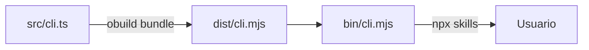
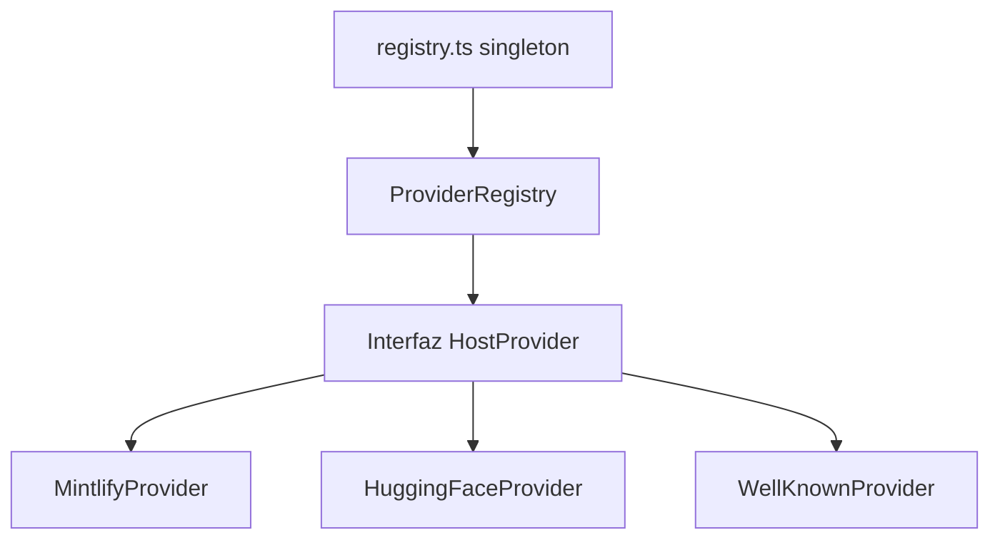
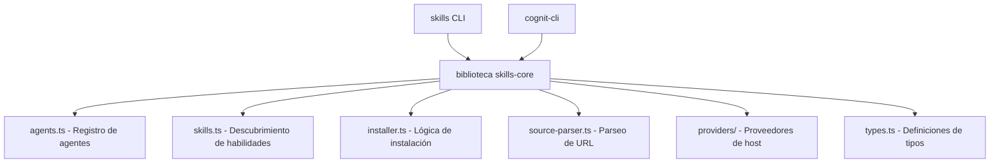

# vercel-labs/skills -- Reporte de Análisis del Upstream

> **Fecha**: 09-02-2026
> **Repo**: https://github.com/vercel-labs/skills
> **Versión analizada**: v1.3.7 (06-02-2026)
> **Paquete**: `skills` en npm

---

## 1. Propósito y Visión

### Qué resuelve
`vercel-labs/skills` es la **CLI** para un ecosistema de habilidades abierto y multi-agente. Proporciona una experiencia similar a un gestor de paquetes (`npx skills add/remove/list/find/check/update`) para instalar **habilidades de agentes** (archivos de instrucciones en markdown -- `SKILL.md`) en las ubicaciones correctas del sistema de archivos para más de 38 agentes de programación (Claude Code, Cursor, Codex, Amp, Gemini CLI, etc.).

### Alcance
- **Instalar** habilidades desde repositorios de GitHub, GitLab, URLs directas, rutas locales, documentación de Mintlify, HuggingFace Spaces y puntos de enlace conocidos (RFC 8615).
- **Gestionar** habilidades instaladas: listar, eliminar, buscar actualizaciones, actualizar.
- **Descubrir** habilidades a través de `skills find` (llama a la API de búsqueda de `skills.sh`).
- **Crear** andamiaje de habilidades a través de `skills init`.
- **Rastrear** metadatos de instalación en un archivo de bloqueo (`~/.agents/.skill-lock.json`).

### Qué NO es
- NO es un SDK o biblioteca para construir agentes.
- NO ejecuta ni interpreta habilidades; solo instala/elimina/lista archivos SKILL.md.
- NO proporciona abstracciones o hooks de tiempo de ejecución; es puramente una CLI de gestión de archivos.

---

## 2. Arquitectura

### Estructura del Repositorio

```
vercel-labs/skills/
|-- bin/cli.mjs             # Punto de entrada Node (compile-cache + import dist/cli.mjs)
|-- build.config.mjs        # Configuración de obuild - entrada de paquete único desde src/cli.ts
|-- package.json            # v1.3.7, type: module, bin: "skills"
|-- tsconfig.json           # ESNext, resolución de bundler, modo estricto
|-- src/
|   |-- cli.ts              # Entrada principal: enrutamiento de comandos, init/check/update en línea
|   |-- add.ts              # Comando "add" central (~1900 líneas), flujo clone+discover+install
|   |-- agents.ts           # 38 definiciones de agentes (nombre, rutas, funciones de detección)
|   |-- installer.ts        # Lógica de instalación (symlink/copy), listInstalledSkills
|   |-- skills.ts           # Descubrimiento + parseo de SKILL.md (frontmatter de gray-matter)
|   |-- source-parser.ts    # Parseo de URL/ruta (GitHub, GitLab, local, directo, well-known)
|   |-- git.ts              # Wrapper simple-git para clones superficiales
|   |-- skill-lock.ts       # Gestión de ~/.agents/.skill-lock.json
|   |-- find.ts             # Búsqueda interactiva estilo fzf (API skills.sh)
|   |-- list.ts             # Listar habilidades instaladas
|   |-- remove.ts           # Eliminar habilidades instaladas
|   |-- telemetry.ts        # Seguimiento de uso anónimo a add-skill.vercel.sh
|   |-- mintlify.ts         # Recuperador de habilidades legado de Mintlify
|   |-- plugin-manifest.ts  # Compatibilidad con el marketplace de plugins de Claude Code
|   |-- types.ts            # Tipos de TypeScript centrales
|   |-- constants.ts        # 3 constantes (.agents, skills, .agents/skills)
|   |-- prompts/
|   |   `-- search-multiselect.ts  # Componente de prompt personalizado
|   `-- providers/
|       |-- index.ts        # Registro de proveedores (mintlify, huggingface)
|       |-- registry.ts     # Registro de proveedores singleton
|       |-- types.ts        # Interfaces HostProvider, ProviderMatch
|       |-- mintlify.ts     # Proveedor de Mintlify
|       |-- huggingface.ts  # Proveedor de HuggingFace
|       `-- wellknown.ts    # Proveedor de habilidades well-known RFC 8615
|-- tests/                  # 12 archivos de prueba (vitest)
|-- scripts/                # Sincronización de agentes, validación, generación de licencias
|-- skills/find-skills/     # Habilidad "find-skills" auto-hospedada
`-- .github/workflows/      # CI (ubuntu+windows), auto-publicación con semver
```

### Sistema de Construcción



- **Herramienta de construcción**: `obuild` (unjs) -- paquete ESM único desde `src/cli.ts`
- **Runtime**: Node.js >= 18, módulos ESM
- **Gestor de paquetes**: pnpm 10.17.1
- **Sin monorepo** -- paquete único, sin workspaces

### Dependencias Clave (todas devDependencies)

| Dependencia | Propósito |
|-----------|---------|
| `@clack/prompts` | Prompts interactivos de terminal |
| `gray-matter` | Parseo de frontmatter YAML |
| `simple-git` | Operaciones de clonación de Git |
| `picocolors` | Colores de terminal |
| `obuild` | Herramienta de construcción/empaquetado |
| `vitest` | Framework de pruebas |
| `xdg-basedir` | Resolución del directorio de configuración XDG |

**Nota**: Todas las dependencias son `devDependencies` porque `obuild` empaqueta todo en un solo archivo. El paquete npm publicado contiene solo `dist/`, `bin/`, `README.md` y `ThirdPartyNoticeText.txt`.

---

## 3. Patrones de Extensión

### Cómo se definen las habilidades

Las habilidades son directorios que contienen un archivo `SKILL.md` con frontmatter YAML:

```markdown
---
name: my-skill
description: Qué hace esta habilidad
metadata:
  internal: true  # opcional: oculta del descubrimiento
---

# Mi Habilidad
Instrucciones para el agente...
```

**Campos obligatorios**: `name`, `description`
**Campos opcionales**: `metadata.internal` (booleano)

### Cómo se descubren las habilidades

La función `discoverSkills()` (`src/skills.ts`) busca en orden de prioridad:
1. `SKILL.md` raíz (si la subruta apunta a él)
2. Más de 30 ubicaciones comunes: `skills/`, `.claude/skills/`, `.cursor/skills/`, etc.
3. Rutas de manifiesto de plugins (`.claude-plugin/marketplace.json`)
4. Fallback: búsqueda recursiva hasta profundidad 5

### Cómo se registran los agentes

`src/agents.ts` define un `Record<AgentType, AgentConfig>` estático donde cada agente especifica:
- `name` / `displayName`
- `skillsDir` (ruta relativa al nivel del proyecto)
- `globalSkillsDir` (ruta absoluta bajo `~/`)
- `detectInstalled()` -- función asíncrona que verifica el sistema de archivos

**Añadir un nuevo agente**: Editar manualmente `agents.ts`, ejecutar `scripts/validate-agents.ts` y `scripts/sync-agents.ts`.

### Sistema de Proveedores

El módulo `providers/` implementa un patrón de registro para hosts de habilidades remotos:



- Interfaz `HostProvider`: `match()`, `fetchSkill()`, `toRawUrl()`, `getSourceIdentifier()`
- Registro vía `registerProvider()` -- Mintlify y HuggingFace se auto-registran
- El proveedor well-known se usa como fallback explícito (no registrado en el registro global)

### Modos de Instalación

| Modo | Descripción |
|------|-------------|
| **Symlink** (recomendado) | Copia canónica en `.agents/skills/<name>`, enlaces simbólicos desde cada directorio de agente |
| **Copia** | Copias independientes en el directorio de habilidades de cada agente |

Alcance de la instalación: **Proyecto** (`./<agent>/skills/`) o **Global** (`~/<agent>/skills/`)

---

## 4. Superficie de la API

### API Pública (exportaciones vía paquete npm)

**NO existe una API programática.** El paquete solo expone un binario CLI (`skills`). Hay:
- Sin funciones exportadas
- Sin tipos exportados
- Sin campo `main` o `exports` en package.json (más allá de `bin`)

Todo el código base se empaqueta en un solo `dist/cli.mjs` solo para ejecución de la CLI.

### APIs Internas (para comprensión, no para consumo)

| Módulo | Exportaciones Clave | Estabilidad |
|--------|------------|-----------|
| `types.ts` | `AgentType`, `Skill`, `AgentConfig`, `ParsedSource`, `RemoteSkill` | Moderada -- AgentType cambia semanalmente |
| `agents.ts` | Registro `agents`, `detectInstalledAgents()`, `getUniversalAgents()` | Baja -- agentes añadidos/modificados con mucha frecuencia |
| `skills.ts` | `discoverSkills()`, `parseSkillMd()`, `filterSkills()` | Moderada |
| `source-parser.ts` | `parseSource()`, `getOwnerRepo()` | Moderada |
| `installer.ts` | `installSkillForAgent()`, `sanitizeName()`, `listInstalledSkills()` | Moderada |
| `providers/types.ts` | `HostProvider`, `ProviderRegistry` | Moderada |

### Servicios Externos

| Servicio | URL | Propósito |
|---------|-----|---------|
| Telemetría | `https://add-skill.vercel.sh/t` | Seguimiento de uso anónimo |
| Verificación de act. | `https://add-skill.vercel.sh/check-updates` | Detección de actualizaciones del lado del servidor |
| Búsqueda | `https://skills.sh/api/search` | Descubrimiento de habilidades |

---

## 5. Mantenibilidad y Velocidad

### Estadísticas del Repositorio

| Métrica | Valor |
|--------|-------|
| Estrellas | 5,275 |
| Forks | 444 |
| Issues Abiertos | 99 |
| Creado | 14-01-2026 (**< 1 mes de antigüedad**) |
| Último push | 06-02-2026 |
| Lanzamientos totales | 10+ (v1.2.2 a v1.3.7 en ~1 semana) |
| Frecuencia de lanzamiento | **~diaria** |

### Colaboradores

| Colaborador | Commits | Rol |
|-------------|---------|------|
| `quuu` (Andrew Qu) | 60 | Autor principal / mantenedor |
| `github-actions[bot]` | 28 | Versionado automático |
| `huozhi` (Jiachi Liu) | 21 | Colaborador activo (equipo Vercel) |
| `pi0` | 8 | Colaborador activo |
| 16+ otros | 1-3 cada uno | PRs de la comunidad (adiciones de agentes, correcciones) |

### Velocidad de Commits

- **30 commits en 6 días** (1-6 de feb de 2026)
- Extremadamente activo, rozando lo volátil
- La mayoría de los cambios: soporte para nuevos agentes, correcciones de errores, actualizaciones de dependencias
- **Patrón de cambio disruptivo**: La versión del archivo de bloqueo subió de v2 a v3 (borra el archivo de bloqueo antiguo)

### Panorama de Issues (99 abiertos)

- Muchas solicitudes de funciones "añadir agente X"
- Varias solicitudes de mejora (archivo de configuración, búsqueda difusa, modelo de confianza)
- Reportes de errores activos (bucles infinitos, rutas incorrectas, problemas con URLs SSH)
- Varios PRs abiertos de la comunidad para nuevos agentes

### Actividad de PRs (últimos 20)

- Mezcla de fusionados y abiertos
- Contribuciones de la comunidad centradas en: añadir nuevos agentes, corregir casos borde
- El equipo central maneja: arquitectura, proveedores, lógica de instalación
- **Notable**: `joicodev` (parece ser el usuario actual) tiene 2 PRs: `Feature/cognitive types` (#312 cerrado, #316 cerrado)

---

## 6. Fortalezas

### Fortalezas Técnicas
1. **Arquitectura limpia**: Módulos de responsabilidad única, preocupaciones bien separadas
2. **Patrón de proveedor**: Sistema de proveedor de host extensible para fuentes de habilidades remotas
3. **Multiplataforma**: Pruebas de CI en Ubuntu + Windows
4. **Consciente de la seguridad**: Prevención de recorrido de rutas, nombres saneados, directorios temporales contenidos
5. **Instalación inteligente**: Enfoque de enlace simbólico primero con fallback de copia, rutas canónicas
6. **Soporte integral de agentes**: 38 agentes con detección de rutas adecuada
7. **Sistema de archivo de bloqueo**: Seguimiento de versiones, detección de actualizaciones, integridad de hash de carpetas
8. **Sin dependencias de ejecución**: Todo empaquetado -- huella de instalación mínima

### Fortalezas del Ecosistema
1. **Ventaja del primer movimiento**: Convirtiéndose en el estándar de facto para la gestión de habilidades
2. **Amplia adopción de agentes**: más de 38 agentes soportan oficialmente el formato de habilidades
3. **Comunidad activa**: 444 forks, más de 5K estrellas en < 1 mes
4. **Respaldo de Vercel**: Credibilidad, infraestructura (servidor de telemetría, API de búsqueda)
5. **Especificación agentskills.io**: Estandarizando el formato SKILL.md

---

## 7. Debilidades

### Debilidades Técnicas
1. **Sin API programática**: No se puede hacer `import { discoverSkills } from 'skills'` -- solo CLI
2. **add.ts monolítico**: ~1900 líneas en un solo archivo -- difícil de extender o enganchar
3. **Registro de agentes estático**: Añadir agentes requiere cambios de código + PR al upstream
4. **URLs de servicio hardcodeadas**: Puntos de enlace de telemetría y búsqueda integrados en el código fuente
5. **Sin sistema de plugins**: No se puede extender el comportamiento de la CLI sin hacer un fork
6. **Paquete de un solo archivo**: `obuild` produce un solo archivo -- sin tree-shaking para los consumidores
7. **Acoplamiento del archivo de bloqueo**: Los cambios en el formato del archivo de bloqueo borran el estado del usuario (v2->v3)
8. **Pruebas limitadas**: 12 archivos de prueba para la lógica central, sin pruebas de integración

### Debilidades del Ecosistema
1. **Código base muy joven**: < 1 mes de antigüedad, API no estabilizada
2. **Alta rotación**: Lanzamientos diarios, cambios disruptivos frecuentes
3. **Riesgo de mantenedor único**: `quuu` (Andrew Qu) es autor de ~60% de los commits
4. **Servicios centralizados**: La telemetría/búsqueda dependen de la infraestructura de Vercel
5. **Sin disciplina de versionado semántico**: Borrados de archivos de bloqueo, cambios de rutas de agentes no comunicados claramente
6. **99 issues abiertos**: Creciendo más rápido que la tasa de resolución

---

## 8. Viabilidad de Integración como SDK

### ¿Se puede usar como una dependencia npm?

**No, no directamente.** El paquete:
- Solo expone un binario CLI (`bin.skills`)
- No tiene campos `main`, `exports` o `types`
- Empaqueta todo en un solo `dist/cli.mjs`
- Todas las dependencias son `devDependencies` (empaquetadas)

### ¿Qué necesitaría ser envuelto?

Para usarlo como un SDK, necesitarías:

#### Opción A: Fork y Refactorización

Extraer los módulos centrales en un paquete de biblioteca separado:



**Esfuerzo**: Medio-Alto. Los módulos están razonablemente bien separados pero tienen referencias cruzadas internas (especialmente `add.ts` que importa de casi todo).

#### Opción B: Envolver la CLI

Llamar a los comandos de `npx skills` y parsear la salida:

```typescript
// Pseudo-código
import { execSync } from 'child_process';
const result = execSync('npx skills add owner/repo --list --yes');
```

**Esfuerzo**: Bajo. Pero frágil, lento (sobrecarga de npx) y limitado al formato de salida de la CLI.

#### Opción C: Vendorizar / Copiar módulos específicos

Copiar los archivos fuente específicos que necesites (la licencia MIT permite esto):

- `types.ts` -- Definiciones de tipos
- `agents.ts` -- Registro de agentes
- `skills.ts` -- Lógica de descubrimiento de habilidades
- `source-parser.ts` -- Parseo de URL
- `installer.ts` -- Lógica de instalación (parcial)

**Esfuerzo**: Bajo inicialmente, pero crea una carga de mantenimiento al rastrear los cambios del upstream.

#### Opción D: Contribuir al upstream para dividir CLI/Core

Proponer una refactorización donde `skills` se convierta en un monorepo con:
- `@skills/core` -- paquete de biblioteca con funciones exportadas
- `skills` -- paquete CLI que depende del núcleo

**Esfuerzo**: Alto. Requiere la aceptación del upstream y una refactorización significativa de `add.ts`.

### Matriz de Compatibilidad de Integración

| Necesidad de Cognit-CLI | Soporte del Upstream | Brecha |
|----------------|-----------------|-----|
| Descubrimiento de habilidades | `discoverSkills()` en skills.ts | No exportado |
| Detección de agentes | `detectInstalledAgents()` en agents.ts | No exportado |
| Instalación de habilidades | `installSkillForAgent()` en installer.ts | No exportado, estrechamente acoplado al flujo de la CLI |
| Agentes personalizados | Registro `agents` estático | No se puede añadir sin cambio de código |
| Proveedores personalizados | `registerProvider()` en registry.ts | No exportado |
| Telemetría personalizada | URL hardcodeada | No se puede sobrescribir |
| Gestión de archivo de bloqueo | `skill-lock.ts` | No exportado, el formato puede cambiar |
| Autoría de habilidades | `skills init` | Solo CLI |
| Verificación de act. | Llama a la API de `add-skill.vercel.sh` | Dependencia del lado del servidor |

---

## 9. Evaluación de Riesgos

| Riesgo | Gravedad | Probabilidad | Mitigación |
|------|----------|-----------|------------|
| **Cambios disruptivos** | Alta | Muy Alta | Fijar a una versión específica, hacer un fork si es necesario |
| **Inestabilidad de la API** | Alta | Alta | No existe una API pública que romper, pero la estructura interna cambia con frecuencia |
| **Mantenedor único** | Media | Media | El respaldo de Vercel proporciona continuidad, pero el factor bus es de 1-2 |
| **Dependencia de telemetría** | Baja | Baja | Se puede desactivar con variable de entorno |
| **Dependencia de servicio** | Media | Baja | Búsqueda/verificación de act. requieren servidores de Vercel |
| **Incompatibilidad del arch. de bloqueo** | Media | Alta | Ya ocurrió (v2->v3), sin ruta de migración |
| **Scope creep** | Media | Media | Adiciones rápidas de funciones (proveedores, well-known, manifiestos de plugins) |
| **Rotación de agentes** | Baja | Alta | Nuevos agentes añadidos semanalmente, pero aditivo |

---

## 10. Decisiones Clave para la Estrategia de Fork vs SDK

### Argumentos para el Forking
1. Sin API pública -- no se puede consumir como dependencia
2. Necesidad de personalizar el registro de agentes, telemetría, URLs de servicio
3. La alta rotación del upstream hace que el seguimiento sea arriesgado
4. `add.ts` monolítico no diseñado para uso programático
5. La licencia MIT hace que el forking sea sencillo

### Argumentos contra el Forking
1. El ecosistema de 38 agentes evoluciona rápidamente -- el fork divergerá rápido
2. El sistema de proveedores y el soporte well-known son valiosos y complejos
3. Las contribuciones de la comunidad (correcciones, nuevos agentes) fluyen al upstream
4. Mantener un fork duplica el esfuerzo para las actualizaciones de compatibilidad de agentes

### Argumentos para el enfoque SDK/Wrapper
1. Se pueden elegir módulos específicos (enfoque vendor)
2. Beneficiarse de las correcciones del upstream con un acoplamiento mínimo
3. Centrar los esfuerzos de cognit-cli en funciones diferenciadas
4. Menor carga de mantenimiento

### Argumentos contra el SDK/Wrapper
1. No existe un SDK real que envolver
2. El envoltorio de la CLI es frágil y lento
3. La personalización profunda requiere acceso al código fuente de todos modos
4. El upstream puede que nunca se divida en biblioteca + CLI

---

## Apéndice: Tamaño de Archivo y Complejidad

| Archivo | Líneas Aprox | Complejidad |
|------|-------------|-----------|
| `add.ts` | ~1,900 | Muy Alta -- orquestación principal, prompts, flujo de instalación |
| `cli.ts` | ~500 | Media -- enrutamiento de comandos, lógica de check/update en línea |
| `installer.ts` | ~900 | Alta -- lógica de symlink/copy, gestión de rutas |
| `agents.ts` | ~500 | Baja -- definiciones de datos |
| `skills.ts` | ~200 | Baja -- descubrimiento/parseo |
| `source-parser.ts` | ~250 | Media -- parseo de URL con muchos casos borde |
| `find.ts` | ~300 | Media -- UI de terminal, llamadas a API |
| `remove.ts` | ~250 | Baja-Media |
| `skill-lock.ts` | ~300 | Media |
| `wellknown.ts` | ~350 | Media -- implementación de RFC 8615 |
| `telemetry.ts` | ~100 | Baja |
| `types.ts` | ~100 | Baja -- definiciones de tipos puras |

---

*Reporte generado por el Agente A -- Investigador del Upstream*
*Basado en vercel-labs/skills @ commit 556555c (06-02-2026)*
