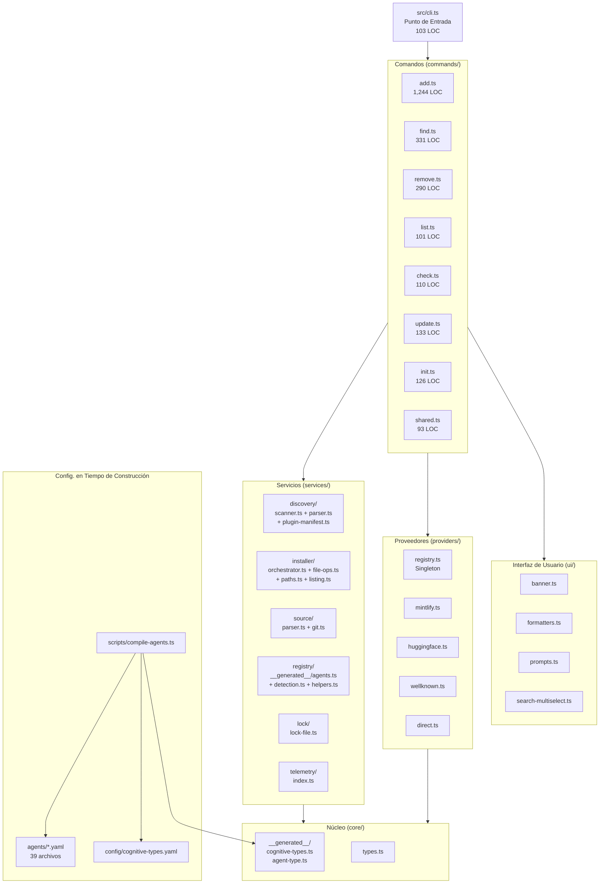
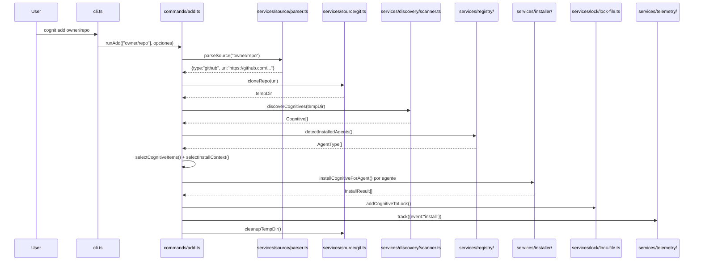
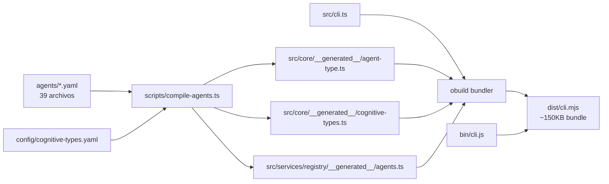

# Reporte de Análisis Profundo de Cognit

**Repositorio:** `SynapSync/cognit` (remoto de origen: `SynapSync/synk`)
**Versión:** 1.3.0
**LOC Totales de Fuente:** ~9,200 líneas TypeScript (src/)
**Licencia:** MIT
**Publicado como:** `cognit` en npm

---

## 1. Reconstrucción de la Visión

### ¿Qué es este proyecto?
Cognit es una herramienta CLI para un **ecosistema cognitivo universal para agentes de programación de IA**. Extiende el concepto de `skills` de Vercel de un tipo único (SKILL.md) a un sistema de tres tipos:

- **Skills** (Habilidades) (`SKILL.md`) -- Instrucciones orientadas a tareas.
- **Agents** (Agentes) (`AGENT.md`) -- Definiciones de persona/comportamiento.
- **Prompts** (Avisos) (`PROMPT.md`) -- Plantillas de avisos reutilizables.

Estos "cognitivos" son archivos markdown con frontmatter YAML que enseñan a los agentes de programación de IA cómo realizar tareas. La CLI gestiona la instalación, el descubrimiento, la actualización y la eliminación de estos cognitivos en **39 agentes de programación diferentes** (Claude Code, Cursor, Codex, OpenCode, etc.).

### Usuarios Objetivo
- Desarrolladores que usan agentes de programación de IA y quieren extender sus capacidades.
- Equipos que comparten habilidades de agentes estandarizadas en proyectos.
- Autores de habilidades/cognitivos que publican instrucciones de agentes reutilizables.

### Propuesta de Valor Central
Una CLI para gestionar las habilidades de los agentes en TODOS los agentes de programación, sin estar bloqueado en ningún ecosistema de agente único.

---

## 2. Mapa de Módulos

### 2.1 Arquitectura de Alto Nivel



### 2.2 Mapa Detallado de Archivos

| Directorio | Archivo | LOC | Propósito |
|-----------|------|-----|---------|
| `src/` | `cli.ts` | 103 | Punto de entrada, enrutamiento de comandos vía switch |
| `src/commands/` | `add.ts` | 1,244 | Instalar cognitivos (pipeline de instalación unificado) |
| | `find.ts` | 331 | Búsqueda interactiva estilo fzf vía API skills.sh |
| | `remove.ts` | 290 | Eliminar cognitivos instalados |
| | `list.ts` | 101 | Listar cognitivos instalados |
| | `check.ts` | 110 | Buscar actualizaciones vía API de GitHub |
| | `update.ts` | 133 | Actualizar cognitivos vía reinstalación npx |
| | `init.ts` | 126 | Andamiaje de nuevo SKILL.md/AGENT.md/PROMPT.md |
| | `shared.ts` | 93 | Utilidades compartidas (cancelación, validación) |
| `src/services/discovery/` | `scanner.ts` | 256 | `discoverCognitives()` -- escaneo del sistema de archivos |
| | `parser.ts` | 86 | Parseo de frontmatter de archivos markdown |
| | `plugin-manifest.ts` | 110 | Soporte para manifiesto de marketplace de plugins de Claude |
| | `index.ts` | 15 | Exportaciones de barril |
| `src/services/installer/` | `orchestrator.ts` | 423 | `installCognitiveForAgent()` -- 3 variantes |
| | `file-ops.ts` | 149 | Operaciones de copia, symlink, limpieza |
| | `paths.ts` | 109 | Saneamiento de rutas y directorios canónicos |
| | `listing.ts` | ~312 | `listInstalledCognitives()` |
| | `index.ts` | 33 | Exportaciones de barril |
| `src/services/source/` | `parser.ts` | 319 | `parseSource()` -- parseo de URL/ruta |
| | `git.ts` | 81 | `cloneRepo()` vía simple-git |
| | `index.ts` | 2 | Exportaciones de barril |
| `src/services/registry/` | `__generated__/agents.ts` | 520 | 39 configuraciones de agentes autogeneradas |
| | `detection.ts` | 13 | `detectInstalledAgents()` |
| | `helpers.ts` | 65 | Accesores de configuración de agentes |
| | `index.ts` | 11 | Exportaciones de barril |
| `src/services/lock/` | `lock-file.ts` | 450 | CRUD de archivo de bloqueo, obtención de hash de GitHub |
| `src/services/telemetry/` | `index.ts` | 107 | "Dispara y olvida" a add-skill.vercel.sh |
| `src/providers/` | `registry.ts` | 52 | Registro de proveedores singleton |
| | `types.ts` | 108 | Interfaces `HostProvider`, `RemoteCognitive` |
| | `mintlify.ts` | 136 | Proveedor de documentación de Mintlify |
| | `huggingface.ts` | 164 | Proveedor de HuggingFace Spaces |
| | `wellknown.ts` | 481 | Proveedor RFC 8615 well-known |
| | `direct.ts` | 154 | Proveedor de URL directa genérica |
| | `index.ts` | 41 | Barril + autorregistro |
| `src/core/` | `types.ts` | 86 | Interfaces centrales (Cognitive, AgentConfig, etc.) |
| | `__generated__/cognitive-types.ts` | 19 | Unión CognitiveType + constantes |
| | `__generated__/agent-type.ts` | 44 | Unión AgentType (39 miembros) |
| | `index.ts` | 2 | Barril |
| `src/ui/` | `banner.ts` | 143 | Arte ASCII, texto de ayuda |
| | `formatters.ts` | 134 | Acortamiento de rutas, formateo de listas |
| | `prompts.ts` | ~143 | Selección interactiva de agentes |
| | `search-multiselect.ts` | 297 | Multiselect personalizado de @clack/prompts |
| `src/utils/` | `logger.ts` | 128 | Logger centralizado con picocolors + ora |
| **Construcción** | `scripts/compile-agents.ts` | 495 | Generador de código YAML -> TypeScript |
| | `scripts/sync-agents.ts` | ~200 | Sincronizar lista de agentes con el README |
| | `scripts/validate-agents.ts` | ~200 | Validar configuraciones YAML de agentes |
| | `scripts/generate-licenses.ts` | ~200 | Generador de ThirdPartyNoticeText.txt |
| | `scripts/execute-tests.ts` | ~100 | Ayudante de ejecución de pruebas |
| **Configuración** | `agents/*.yaml` | 39 archivos | Definiciones de configuración de agentes |
| | `config/cognitive-types.yaml` | 12 | Definiciones de tipos cognitivos |

### 2.3 Flujo de Datos: `cognit add owner/repo`



---

## 3. Análisis de Origen (Vercel vs Original)

### 3.1 Línea de Tiempo de la Historia de Git

El registro de git revela un camino de evolución claro:

```
v1.3.5-1.3.7  -- Commits del upstream vercel-labs/skills (agentes, correcciones)
v1.0.0        -- Primer hito de SynapSync
93f9e8a       -- "renombrar a synk y añadir soporte para tipos cognitivos"
f0dec7e       -- "restructurar src/ en una arquitectura modular"
7807318       -- "migrar configuraciones de agentes de TS hardcodeado a YAML"
e31f29e       -- "generalizar habilidades a cognitivos (skills, agentes, prompts)"
df16e4c       -- "deduplicar comandos y renombrar componentes internos de habilidades"
44058c4       -- "renombrar proyecto de synk a cognit"
682c7f6       -- "actualizar logo de arte ASCII a COGNIT SYNC"
```

### 3.2 Mapa de Origen de Componentes

| Componente | Origen | Confianza | Evidencia |
|-----------|--------|------------|----------|
| Flujo central de `commands/add.ts` | **Vercel** | Alta | Sigue el patrón `runAdd` de vercel-labs/skills, el punto de telemetría es `add-skill.vercel.sh` |
| `commands/find.ts` | **Vercel** | Alta | Usa el punto de enlace de la API de `skills.sh` |
| `commands/check.ts` / `update.ts` | **Vercel** | Alta | Referencia a la API `add-skill.vercel.sh/check-updates` |
| `commands/remove.ts` | **Vercel** | Alta | Patrón estándar de eliminación de habilidades |
| `commands/list.ts` | **Vercel** | Alta | Patrón de listado estándar |
| `services/source/parser.ts` | **Vercel** | Alta | El parseo de URL de GitHub/GitLab es central en vercel-labs/skills |
| `services/source/git.ts` | **Vercel** | Alta | Clonación de simple-git con tiempo de espera |
| `services/installer/file-ops.ts` | **Vercel** | Alta | Patrón copyDirectory, createSymlink |
| `services/installer/paths.ts` | **Vercel** | Alta | sanitizeName, seguridad de rutas |
| `services/lock/lock-file.ts` | **Mixto** | Alta | Base de Vercel, extendido con `cognitiveType`, renombrado de `.skill-lock.json` a `.cognit-lock.json` |
| `services/telemetry/` | **Vercel** | Alta | Apunta a `add-skill.vercel.sh/t` |
| `providers/mintlify.ts` | **Vercel** | Alta | Patrón de proveedor de Mintlify |
| `providers/huggingface.ts` | **Vercel** | Alta | Patrón de proveedor de HuggingFace |
| `providers/wellknown.ts` | **Vercel** | Alta | Patrón well-known RFC 8615 |
| `providers/direct.ts` | **Original** | Media | Nuevo: captura todo para URLs raw de GitHub/GitLab |
| `providers/registry.ts` | **Vercel** | Alta | Patrón de registro de proveedores singleton |
| `services/registry/agents.ts` (antiguo) | **Vercel** | Alta | Configs para 39 agentes -- el upstream las mantiene |
| `agents/*.yaml` | **Original** | Alta | La configuración de agentes basada en YAML es una innovación de cognit |
| `scripts/compile-agents.ts` | **Original** | Alta | Generador de código de YAML a TypeScript |
| `config/cognitive-types.yaml` | **Original** | Alta | Configuración de tipos cognitivos |
| `core/__generated__/*` | **Original** | Alta | Sistema de tipos generado en tiempo de construcción |
| `commands/shared.ts` | **Original** | Alta | Utilidades compartidas extraídas |
| `commands/init.ts` (flag --type) | **Original** | Media | Extendido init para soportar tipos agente/prompt |
| Sistema CognitiveType | **Original** | Alta | El triple skill->agent->prompt es la innovación central de cognit |
| Wrappers `@deprecated` | **Original** | Alta | Alias de compatibilidad hacia atrás (Skill -> Cognitive, etc.) |
| `ui/search-multiselect.ts` | **Vercel** | Alta | Componente personalizado de @clack |
| `ui/banner.ts` (logo COGNIT SYNC) | **Original** | Media | Arte ASCII renombrado |

### 3.3 Dependencias del Upstream

| Dependencia | Por qué es crítica |
|------------|-------------|
| `add-skill.vercel.sh/t` | Punto de enlace de telemetría -- todavía apunta a Vercel |
| `add-skill.vercel.sh/check-updates` | API de verificación de actualizaciones (referenciada en AGENTS.md pero no en el código actual -- reemplazada por la API directa de GitHub) |
| `skills.sh` | API de búsqueda usada por `cognit find` |
| API de GitHub | Dependencia directa para los comandos `check` e `update` |

---

## 4. Inmersión Profunda en la Arquitectura

### 4.1 Pipeline de Construcción



Idea clave: La construcción es un proceso de dos fases:
1. **Fase de compilación**: `compile-agents.ts` lee las configuraciones YAML y genera TypeScript.
2. **Fase de empaquetado**: `obuild` empaqueta todo en un solo `dist/cli.mjs`.

### 4.2 Sistema de Configuración de Agentes (Innovación Original)

Cada agente se define en `agents/<nombre>.yaml` con un DSL mínimo:

```yaml
# Agente simple (convención sobre configuración):
name: cursor
displayName: Cursor
rootDir: .cursor
# Por defecto: localRoot=rootDir, globalRoot=~/rootDir, detect=[homeDir: rootDir]

# Agente complejo:
name: opencode
displayName: OpenCode
localRoot: .agents              # Directorio universal
globalRoot: ${XDG_CONFIG_HOME}/opencode
detect:
  - xdgConfig: opencode
  - envResolvedPath:
      var: claudeHome
      subpath: skills
```

El script `compile-agents.ts` resuelve las convenciones, genera la lógica de detección y produce el registro completo de `agents` con:
- `dirs: Record<CognitiveType, { local: string; global: string }>` -- generado dinámicamente para TODOS los tipos cognitivos.
- `detectInstalled: async () => boolean` -- funciones de detección generadas.

Esta es una mejora significativa sobre el enfoque de TypeScript hardcodeado del upstream.

### 4.3 Sistema de Tipos Cognitivos (Innovación Original)

Definido en `config/cognitive-types.yaml`:
```yaml
skill:
  subdir: skills
  fileName: SKILL.md
agent:
  subdir: agents
  fileName: AGENT.md
prompt:
  subdir: prompts
  fileName: PROMPT.md
```

Esto se compila en tipos y constantes de TypeScript, lo que facilita la adición de nuevos tipos cognitivos en el futuro.

### 4.4 Puntos de Entrada

| Entrada | Binario | Propósito |
|-------|--------|---------|
| `bin/cli.js` | `cognit` | Entrada principal de la CLI (también con los alias `skills` y `add-skill`) |
| `src/cli.ts` | (dev) | Ejecución directa vía `node src/cli.ts` |

---

## 5. Inventario de Deuda Técnica

### 5.1 Crítico: La telemetría apunta a Vercel

**Archivo:** `src/services/telemetry/index.ts:1`
```typescript
const TELEMETRY_URL = 'https://add-skill.vercel.sh/t';
```
Toda la telemetría de uso va al servidor de Vercel. Esto significa:
- Vercel rastrea las instalaciones de cognit.
- Si Vercel cambia o elimina el punto de enlace, la telemetría se rompe silenciosamente.
- No hay una alternativa auto-hospedada.

### 5.2 Crítico: Dependencia de la API de búsqueda

**Archivo:** `src/commands/find.ts:9`
```typescript
const SEARCH_API_BASE = process.env.SKILLS_API_URL || 'https://skills.sh';
```
El comando `find` depende totalmente de `skills.sh` para el descubrimiento. No hay fallback ni índice local.

### 5.3 Alto: Alias de compatibilidad hacia atrás

A lo largo del código base, hay ~20 alias `@deprecated`:
- `Skill` -> `Cognitive`
- `RemoteSkill` -> `RemoteCognitive`
- `MintlifySkill` -> `MintlifyCognitive`
- `fetchSkill` -> `fetchCognitive`
- `discoverSkills` -> `discoverCognitives`
- `filterSkills` -> `filterCognitives`
- etc.

Estos existen para la compatibilidad hacia atrás, pero añaden ruido. La pregunta es: ¿compatibilidad con qué? Dado que este es un fork, no una biblioteca consumida por otros, probablemente podrían eliminarse.

### 5.4 Alto: Duplicación de Proveedores/Fuentes

Como se documenta en `docs/CURRENT_STATUS.md`, los directorios `providers/` y `services/source/` se superponen:
- Ambos manejan la obtención de cognitivos basada en URL.
- `providers/mintlify.ts` duplica `services/source/mintlify.ts` (aunque este último no se exporta desde index.ts).
- `commands/add.ts` utiliza ambos sistemas en diferentes rutas de código.

### 5.5 Medio: El archivo de bloqueo todavía hace referencia a la terminología "skill"

**Archivo:** `src/services/lock/lock-file.ts:11`
```typescript
const OLD_LOCK_FILES = ['.synk-lock.json', '.skill-lock.json'];
```
El código de migración maneja tres nombres históricos. La `CognitiveLockEntry` todavía tiene una clave `skills` en `getCognitivesBySource()`:
```typescript
bySource.set(entry.source, { skills: [name], entry }); // Línea 389 -- "skills", no "cognitives"
```

### 5.6 Medio: `commands/add.ts` tiene 1,244 líneas

Este es el archivo individual más grande. Aunque se ha refactorizado en un pipeline de instalación unificado, todavía contiene:
- 3 funciones de resolución (`resolveRemoteCognitive`, `resolveWellKnownCognitives`, `resolveGitRepoCognitives`).
- Toda la orquestación del flujo de instalación.
- Parseo de opciones.
- El aviso promocional `promptForFindSkills`.

### 5.7 Medio: El comando de actualización usa `npx -y cognit add`

**Archivo:** `src/commands/update.ts:102`
```typescript
const result = spawnSync('npx', ['-y', 'cognit', 'add', installUrl, '-g', '-y'], {
  stdio: ['inherit', 'pipe', 'pipe'],
});
```
El comando de actualización genera un proceso hijo para reinstalar, en lugar de llamar a `runAdd()` directamente. Esto es frágil y lento (sobrecarga de resolución de npm por cada habilidad).

### 5.8 Bajo: No hay biblioteca de parseador de argumentos

La CLI utiliza el parseo manual de `process.argv` con bucles de opciones hechos a mano. Esto funciona pero carece de:
- Seguridad de tipos para las opciones.
- Ayuda autogenerada.
- Composición de subcomandos.
- Manejo de errores para flags inválidas.

### 5.9 Bajo: Falta de cobertura de pruebas

| Área | Pruebas | Estado |
|------|-------|--------|
| Source parser | `source-parser.test.ts` | Bueno |
| Saneamiento de nombre | `sanitize-name.test.ts` | Bueno |
| Manifiesto de plugin | `plugin-manifest-discovery.test.ts` | Bueno |
| Installer symlink | `installer-symlink.test.ts` | Bueno |
| Listar instalados | `list-installed.test.ts` | Bueno |
| Well-known provider | `wellknown-provider.test.ts` | Bueno |
| Rutas multiplataforma | `cross-platform-paths.test.ts` | Bueno |
| Comandos (add, init, list, remove) | `src/__tests__/commands/*.test.ts` | Existe |
| **Proveedores (mintlify, huggingface, direct)** | **Ninguna** | Faltante |
| **Telemetría** | **Ninguna** | Faltante |
| **Operaciones de archivo de bloqueo** | **Ninguna** | Faltante |
| **Comandos update/check** | **Ninguna** | Faltante |
| **Detección de agentes** | **Ninguna** | Faltante |

---

## 6. Componentes del Núcleo Extraíbles

### 6.1 Registro de Agentes (Valor ALTO, Acoplamiento BAJO)

**Archivos:**
- `agents/*.yaml` (39 definiciones de agentes)
- `config/cognitive-types.yaml`
- `scripts/compile-agents.ts`
- `src/services/registry/`
- `src/core/__generated__/`

**Por qué es extraíble:** Este es un sistema autónomo para:
1. Definir configuraciones de agentes de IA en YAML.
2. Compilarlas a TypeScript en tiempo de construcción.
3. Detección de agentes en tiempo de ejecución (qué agentes están instalados).
4. Resolución de rutas (dónde almacena cada agente los cognitivos).

**Dependencias:** Solo `os.homedir()`, `fs.existsSync()`, `path`, `xdg-basedir`.

**Podría ser:** `@synapsync/agent-registry` -- reutilizable por cualquier herramienta que necesite conocer los agentes de programación de IA.

### 6.2 Motor de Descubrimiento Cognitivo (Valor ALTO, Acoplamiento BAJO)

**Archivos:**
- `src/services/discovery/` (scanner.ts, parser.ts, plugin-manifest.ts)
- `src/core/types.ts` (interfaz Cognitive)

**Por qué es extraíble:** Escaneo del sistema de archivos para SKILL.md/AGENT.md/PROMPT.md con:
- Búsqueda de directorio basada en prioridades.
- Soporte para manifiesto de plugin (marketplace de Claude Code).
- Parseo de frontmatter con gray-matter.
- Fallback recursivo a profundidad completa.

**Dependencias:** `fs/promises`, `path`, `gray-matter`.

**Podría ser:** `@synapsync/cognitive-discovery`

### 6.3 Source Parser (Valor MEDIO, Acoplamiento BAJO)

**Archivos:**
- `src/services/source/parser.ts`
- `src/services/source/git.ts`

**Por qué es extraíble:** Parseo de URL para GitHub, GitLab, rutas locales, URLs directas, puntos de enlace well-known. Detección de formato inteligente con soporte de abreviatura de dueño/repositorio.

**Dependencias:** `path`, `simple-git`.

### 6.4 Sistema de Proveedores (Valor MEDIO, Acoplamiento MEDIO)

**Archivos:**
- `src/providers/` (directorio completo)

**Por qué es extraíble:** Registro de proveedores extensible para obtener cognitivos de varios hosts (Mintlify, HuggingFace, well-known, URLs directas).

**Dependencias:** `gray-matter`, `core/types.ts`.

### 6.5 Instalador (Extraibilidad BAJA, Acoplamiento ALTO)

**Archivos:**
- `src/services/installer/`

**Por qué NO es fácilmente extraíble:** Estrechamente acoplado al registro de agentes para la resolución de rutas. El orquestador tiene 3 funciones de instalación especializadas para diferentes tipos de fuente.

### 6.6 Sistema de Archivo de Bloqueo (Valor MEDIO, Acoplamiento BAJO)

**Archivos:**
- `src/services/lock/lock-file.ts`

**Por qué es extraíble:** CRUD de archivo de bloqueo autónomo con versionado, soporte de migración y obtención de SHA de árbol de GitHub para la detección de actualizaciones.

---

## 7. Qué Funciona Bien

### 7.1 Configuración de Agentes Basada en YAML
El patrón de compilación desde YAML (`agents/*.yaml` -> TypeScript) es la mejor decisión arquitectónica del proyecto:
- Añadir un nuevo agente = añadir un archivo YAML de 3 líneas.
- La convención sobre la configuración reduce el boilerplate.
- Salida generada con seguridad de tipos.
- Sin coste de parseo de YAML en tiempo de ejecución.

### 7.2 Generalización del Tipo Cognitivo
El sistema de tres tipos (skill/agent/prompt) está bien implementado:
- Fuente de configuración única (`config/cognitive-types.yaml`).
- Propagado a través de patrones `Record<CognitiveType, ...>`.
- Fácil de extender a nuevos tipos.
- Todas las estructuras de directorios se derivan dinámicamente.

### 7.3 Pipeline de Instalación Unificado
La refactorización de `commands/add.ts` creó una abstracción limpia:
```
parseSource -> resolve* -> PreparedInstallation -> executeInstallFlow
```
Esto maneja repositorios de git, proveedores remotos y puntos de enlace well-known a través de un único flujo.

### 7.4 Prácticas de Seguridad
- Prevención de recorrido de rutas (`isPathSafe`, `sanitizeName`, `isContainedIn`).
- Validación de directorio temporal (limpieza solo dentro de `tmpdir()`).
- Sin ejecución de código arbitrario.
- Validación de ruta de manifiesto de plugin.

### 7.5 Manejo de Symlinks Multiplataforma
La lógica de symlink de `file-ops.ts` maneja bien los casos borde:
- ELOOP (symlinks circulares).
- Resolución de symlink de directorio padre.
- Fallback de unión de Windows.
- Fallback de copia transparente cuando los symlinks fallan.

---

## 8. Qué Bloquea la Evolución

### 8.1 Acoplamiento Estrecho a la Infraestructura de Vercel
- Telemetría: `add-skill.vercel.sh/t`
- Búsqueda: API de `skills.sh`
- Hash de archivo de bloqueo: API de GitHub (asume a GitHub como host principal)
- El aviso promocional `find-skills` hardcodea a `vercel-labs/skills`

### 8.2 Sin Superficie de SDK/Biblioteca
Todo es solo CLI. No hay forma de:
- Usar el registro de agentes programáticamente.
- Descubrir cognitivos desde una biblioteca.
- Instalar cognitivos desde una llamada a la API.
- Acceder al sistema de proveedores como un plugin.

### 8.3 Archivos de Comandos Monolíticos
Aunque es mejor que el upstream original, `add.ts` con 1,244 líneas todavía está haciendo demasiado. Las tres funciones de resolución podrían extraerse en un patrón de resolución.

### 8.4 Confusión de Nombres
El repositorio pasó por: `skills` -> `synk` -> `cognit`. Quedan remanentes por todas partes:
- El remoto es `SynapSync/synk`.
- El archivo de bloqueo migra de `.synk-lock.json` a `.cognit-lock.json`.
- Tipo `Skill` interno con alias a `Cognitive`.
- El flag `--skill` todavía se usa (no `--cognitive`).

### 8.5 Sin Arquitectura de Plugins
Añadir un nuevo proveedor requiere modificar `src/providers/index.ts` para registrarlo. No hay un mecanismo de plugin externo.

### 8.6 Brechas en las Pruebas
La capa de proveedores, telemetría, operaciones de archivo de bloqueo y comandos de actualización/verificación no tienen cobertura de pruebas. Esto hace que la refactorización sea arriesgada.

---

## 9. Análisis de Dependencias

### Dependencias de Ejecución (devDependencies, empaquetadas por obuild)

| Paquete | Versión | Propósito | ¿Reemplazable? |
|---------|---------|---------|-------------|
| `@clack/prompts` | ^0.11.0 | Prompts interactivos de CLI | Se podría usar inquirer, pero clack es bueno |
| `gray-matter` | ^4.0.3 | Parseo de frontmatter YAML | Núcleo -- no se necesita reemplazo |
| `ora` | ^9.3.0 | Animaciones de spinner | Se podría usar nanospinner |
| `picocolors` | ^1.1.1 | Colores de terminal | Se podría usar chalk, pero pico es más ligero |
| `simple-git` | ^3.27.0 | Operaciones de clonación de Git | Se podría usar child_process, pero simple-git es más seguro |
| `xdg-basedir` | ^5.1.0 | Resolución del dir. de config. XDG | Mínimo, necesario para multiplataforma |
| `yaml` | ^2.8.2 | Parseo de YAML (scripts de construcción) | Solo en tiempo de construcción |

### Dependencias de Construcción

| Paquete | Propósito |
|---------|---------|
| `obuild` | Empaquetar src/ en dist/cli.mjs |
| `typescript` | Verificación de tipos |
| `vitest` | Ejecutor de pruebas |
| `husky` | Hooks de git |
| `lint-staged` | Formateo pre-commit |
| `prettier` | Formateo de código |

---

## 10. Números Clave

| Métrica | Valor |
|--------|-------|
| Archivos fuente (TypeScript) | 50 |
| LOC de fuente | ~9,200 |
| LOC generadas | ~583 |
| Configuraciones de agentes | 39 |
| Tipos cognitivos | 3 |
| Comandos | 7 (add, find, list, remove, check, update, init) |
| Proveedores | 4 (mintlify, huggingface, wellknown, direct) |
| Archivos de prueba | 19 (src/__tests__ + tests/) |
| Salida de construcción | Paquete único de ~150KB |
| Palabras clave de npm | 40+ (SEO agresivo) |

---

## 11. Evaluación de Resumen

**Cognit es un fork bien ejecutado** que añade valor genuino sobre vercel-labs/skills:

1. **El sistema de configuración de agentes YAML** es la innovación destacada; hace que añadir agentes sea trivial y elimina más de 500 líneas de TypeScript hardcodeado.
2. **La generalización del tipo cognitivo** (skill/agent/prompt) es limpia y extensible.
3. **La arquitectura modular** (post-refactorización) es razonable para una herramienta CLI.

**Sin embargo, sigue profundamente acoplado a la infraestructura de Vercel:**
- Los mecanismos de telemetría, búsqueda y actualización dependen de servicios alojados por Vercel.
- El aviso de `find-skills` promueve específicamente a `vercel-labs/skills`.
- No hay un mecanismo para infraestructura propia o alternativa.

**El camino a seguir** debería extraer el núcleo reutilizable (registro de agentes, descubrimiento, tipos cognitivos) en módulos independientes, reemplazando las dependencias de la infraestructura de Vercel con alternativas conectables.
