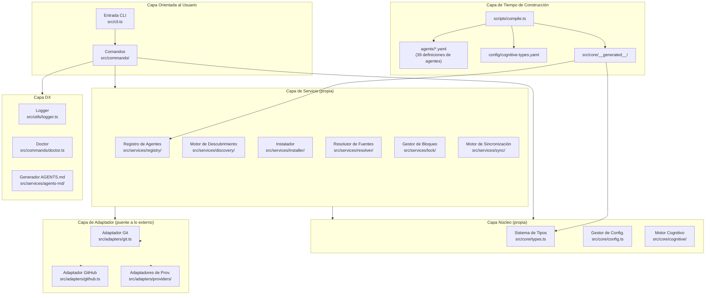
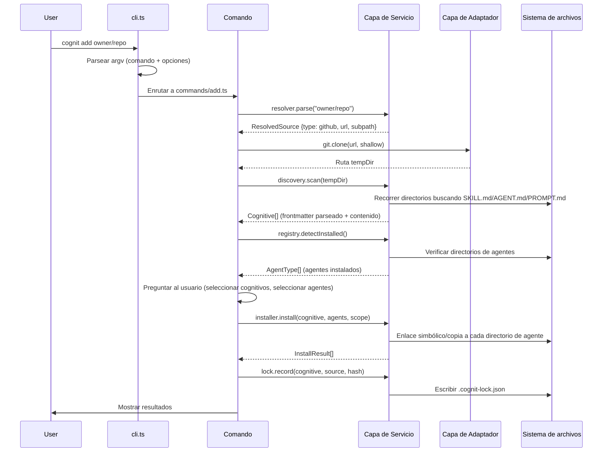
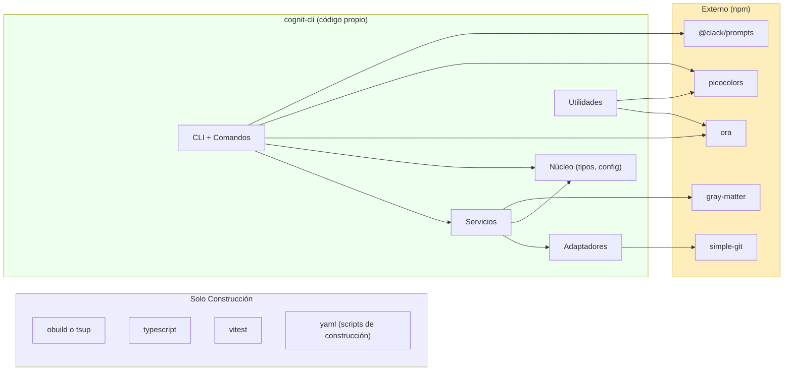
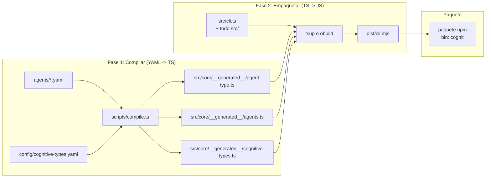

# Arquitectura Propuesta: cognit-cli

> **Fecha**: 09-02-2026
> **Estrategia**: Arquitectura Híbrida (Núcleo Propio + Adaptación Selectiva del Upstream)
> **Basado en**: Matriz de Decisión Estratégica (Reporte 04)

---

## 1. Principios de Diseño

1. **Se dueño del núcleo, referencia el ecosistema.** Sin dependencia de código de vercel-labs/skills. Adoptar el estándar de formato SKILL.md voluntariamente.
2. **Registro de agentes impulsado por datos.** Las definiciones de los agentes son archivos de datos YAML, no código TypeScript. Añadir un agente = añadir un archivo YAML.
3. **Tres tipos cognitivos desde el primer día.** Habilidades (Skills), Agentes (Agents) y Avisos (Prompts), diseñados en el sistema de tipos, no añadidos posteriormente.
4. **Separación comando-servicio.** Los comandos son envoltorios de interfaz de usuario delgados. Los servicios contienen toda la lógica de negocio y son probables de forma independiente.
5. **Sostenibilidad del desarrollador en solitario.** Cada elección arquitectónica debe ser mantenible por una sola persona. Minimizar la superficie de exposición.
6. **Mejora progresiva.** El MVP es mínimo. Las funciones se añaden de forma incremental. Sin abstracciones prematuras.

---

## 2. Arquitectura de Componentes

### 2.1 Diagrama de Capas de Alto Nivel



### 2.2 Diagrama de Flujo de la CLI



### 2.3 Grafo de Dependencias



---

## 3. Diseño Detallado de Módulos

### 3.1 Estructura de Archivos

```
cognit-cli/
|-- package.json                    # tipo: módulo, bin: cognit
|-- tsconfig.json                   # modo estricto, ESNext
|-- tsup.config.ts                  # (o build.config.mjs para obuild)
|-- vitest.config.ts
|-- agents/                         # Definiciones de agentes en YAML (datos)
|   |-- claude-code.yaml
|   |-- cursor.yaml
|   |-- codex.yaml
|   |-- ... (39 archivos)
|-- config/
|   |-- cognitive-types.yaml        # Definiciones de skill/agent/prompt
|-- scripts/
|   |-- compile.ts                  # Generador de código YAML -> TypeScript
|-- src/
|   |-- cli.ts                      # Entrada: parseo de argv, enrutamiento de comandos
|   |-- commands/
|   |   |-- add.ts                  # Instalar cognitivos
|   |   |-- find.ts                 # Buscar/descubrir cognitivos
|   |   |-- list.ts                 # Listar cognitivos instalados
|   |   |-- remove.ts              # Eliminar cognitivos instalados
|   |   |-- check.ts               # Buscar actualizaciones
|   |   |-- update.ts              # Actualizar cognitivos instalados
|   |   |-- init.ts                # Andamiaje de nuevo cognitivo
|   |   |-- doctor.ts              # Verificaciones de salud de diagnóstico
|   |   |-- sync.ts                # Sinc. manifiesto <-> sistema de archivos
|   |-- core/
|   |   |-- types.ts               # Interfaces centrales: Cognitive, AgentConfig, CognitiveType
|   |   |-- config.ts              # Gestor de config. de proyecto (descubrimiento walk-up)
|   |   |-- constants.ts           # Rutas, valores por defecto
|   |   |-- __generated__/
|   |       |-- agent-type.ts      # Unión AgentType (generada desde YAML)
|   |       |-- agents.ts          # Registro de configs de agentes Record (generado)
|   |       |-- cognitive-types.ts # Constantes CognitiveType (generado)
|   |-- services/
|   |   |-- registry/
|   |   |   |-- agents.ts          # Re-exporta agentes generados + lógica de detección
|   |   |   |-- detection.ts       # detectInstalledAgents()
|   |   |-- discovery/
|   |   |   |-- scanner.ts         # Escaneo del sist. de arch. para SKILL.md/AGENT.md/PROMPT.md
|   |   |   |-- parser.ts          # Parseo de frontmatter (gray-matter)
|   |   |-- installer/
|   |   |   |-- orchestrator.ts    # Flujo de inst.: resolver -> preguntar -> instalar -> bloquear
|   |   |   |-- file-ops.ts        # Symlink/copia con fallback
|   |   |   |-- paths.ts           # Saneamiento de rutas, rutas canónicas
|   |   |-- resolver/
|   |   |   |-- source-parser.ts   # Parsear fuentes GitHub/GitLab/local/URL
|   |   |-- lock/
|   |   |   |-- lock-file.ts       # CRUD de .cognit-lock.json, versionado
|   |   |-- sync/
|   |   |   |-- engine.ts          # 4-fases: escanear -> comparar -> reconciliar -> aplicar
|   |   |-- agents-md/
|   |   |   |-- generator.ts       # Generación de AGENTS.md basada en marcadores
|   |-- adapters/
|   |   |-- git.ts                 # Wrapper simple-git (clonar, limpieza)
|   |   |-- github.ts             # API de GitHub (hash de árbol, contenido raw)
|   |   |-- providers/
|   |       |-- types.ts           # Interfaz HostProvider
|   |       |-- registry.ts        # Registro de proveedores
|   |       |-- mintlify.ts        # Proveedor de docs de Mintlify
|   |       |-- huggingface.ts     # Proveedor de HuggingFace Spaces
|   |       |-- wellknown.ts       # Proveedor RFC 8615 well-known
|   |-- utils/
|   |   |-- logger.ts             # Logger centralizado (picocolors + ora)
|   |   |-- errors.ts             # Clases de error personalizadas
|-- tests/
|   |-- unit/
|   |   |-- commands/
|   |   |-- services/
|   |   |-- adapters/
|   |   |-- utils/
|   |-- fixtures/                  # Fixtures de prueba (muestra SKILL.md, configs de agentes)
```

### 3.2 Interfaces del Núcleo (Contratos)

```typescript
// src/core/types.ts

/** Los tres tipos cognitivos */
type CognitiveType = 'skill' | 'agent' | 'prompt';

/** Un cognitivo descubierto (parseado del sistema de archivos) */
interface Cognitive {
  name: string;
  description: string;
  type: CognitiveType;
  content: string;           // Contenido markdown completo
  filePath: string;          // Ruta absoluta al archivo fuente
  metadata?: Record<string, unknown>;
}

/** Una configuración de agente de IA de programación (generada desde YAML) */
interface AgentConfig {
  name: string;              // p. ej. "claude-code"
  displayName: string;       // p. ej. "Claude Code"
  dirs: Record<CognitiveType, {
    local: string;           // Ruta relativa al proyecto
    global: string;          // Ruta absoluta bajo ~/
  }>;
  detectInstalled: () => Promise<boolean>;
}

/** Una referencia de fuente parseada */
interface ResolvedSource {
  type: 'github' | 'gitlab' | 'local' | 'url' | 'wellknown';
  url: string;
  owner?: string;
  repo?: string;
  subpath?: string;
  ref?: string;
}

/** Resultado de la instalación */
interface InstallResult {
  cognitive: string;
  agent: string;
  scope: 'project' | 'global';
  method: 'symlink' | 'copy';
  path: string;
  success: boolean;
  error?: string;
}

/** Proveedor de host para fuentes cognitivas remotas */
interface HostProvider {
  name: string;
  match(url: string): boolean;
  fetchCognitive(url: string): Promise<Cognitive[]>;
}
```

### 3.3 Contratos de la Capa de Adaptador

La capa de adaptador es el **único lugar** donde se tocan los sistemas externos. Esto significa:
- **git.ts**: Único módulo que importa `simple-git`.
- **github.ts**: Único módulo que llama a la API de GitHub.
- **providers/*.ts**: Únicos módulos que llaman a servicios remotos de hospedaje de habilidades.

Este aislamiento significa que se pueden referenciar los patrones del upstream sin acoplamiento de código. Si `vercel-labs/skills` añade un nuevo proveedor, podemos implementar nuestro propio adaptador usando su patrón como referencia.

```typescript
// src/adapters/git.ts
export async function cloneRepo(url: string, options?: { depth?: number; timeout?: number }): Promise<string>;
export async function cleanupTemp(dir: string): Promise<void>;

// src/adapters/github.ts
export async function getTreeSha(owner: string, repo: string, ref?: string): Promise<string>;
export async function getRawContent(owner: string, repo: string, path: string): Promise<string>;

// src/adapters/providers/types.ts
export interface HostProvider {
  name: string;
  match(url: string): boolean;
  fetchCognitive(url: string): Promise<Cognitive[]>;
}
```

---

## 4. Pipeline de Construcción

### 4.1 Construcción en Dos Fases



### 4.2 Comandos de Construcción

```json
{
  "scripts": {
    "compile": "tsx scripts/compile.ts",
    "build": "npm run compile && tsup",
    "dev": "npm run compile && tsx src/cli.ts",
    "test": "npm run compile && vitest",
    "prepublishOnly": "npm run build"
  }
}
```

### 4.3 Estrategia de Versionado

- **Versionado semántico** con adherencia estricta.
- **Mayor**: Cambios disruptivos en el formato cognitivo, formato de archivo de bloqueo o interfaz de CLI.
- **Menor**: Nuevos comandos, nuevos agentes, nuevos proveedores.
- **Parche**: Corrección de errores, documentación.
- **Pre-lanzamiento**: `0.x.y` hasta que el MVP se estabilice; se permiten cambios disruptivos en versiones menores.

---

## 5. Manejo de Cambios en el Upstream

### 5.1 Qué monitorear

| Cambio en el Upstream | Frecuencia | Cómo manejarlo |
|----------------|-----------|---------------|
| Nuevo agente añadido | Semanal | Portar como un nuevo archivo `agents/<nombre>.yaml`. Trabajo de ~5 min. |
| Ruta de agente cambiada | Raro | Actualizar el archivo YAML correspondiente. |
| Nuevo proveedor añadido | Mensual | Implementar adaptador propio usando el patrón del upstream como referencia. |
| Cambio de formato SKILL.md | Muy raro | Evaluar y adoptar si es razonable. |
| Cambio de formato de archivo de bloqueo | Raro | No relevante; sistema de archivo de bloqueo propio. |
| Correc. de errores en source parser | Ocasional | Revisar y aplicar la lógica de corrección al propio parser si aplica. |

### 5.2 Proceso de Monitoreo

1. **Observar lanzamientos del upstream** vía notificaciones de GitHub o RSS.
2. **Revisión mensual** de los commits del upstream en busca de adiciones de agentes y cambios de formato.
3. **Sin fusión automática**: todos los cambios son portabilidades manuales e intencionales.
4. **Las adiciones de agentes son datos, no código**: añadir un archivo YAML, no fusionar TypeScript.

### 5.3 Compatibilidad con el Upstream

El proyecto mantiene la compatibilidad con el ecosistema de `vercel-labs/skills` a través de:
- Uso del mismo formato de frontmatter de `SKILL.md` (nombre, descripción, metadatos).
- Uso de las mismas convenciones de directorios de agentes (`.claude/skills/`, `.cursor/skills/`, etc.).
- Uso de la instalación de enlace simbólico primero con fallback de copia.
- Soporte para los mismos formatos de fuente (GitHub dueño/repositorio, URLs, rutas locales).

Esto significa que los cognitivos instalados por `cognit` son legibles por `skills` y viceversa.

---

## 6. Estructura del Paquete

### 6.1 Paquete Único (No Monorepo)

Para un desarrollador en solitario, un paquete único es la elección correcta:
- Sin complejidad de configuración de workspaces.
- Sin coordinación de versiones entre paquetes.
- Sin orquestación de publicación.
- CI/CD simple.

Si el proyecto crece hasta necesitar extraer bibliotecas (p. ej., `@synapsync/agent-registry`), se puede introducir un monorepo más adelante. Esto es una optimización, no un requisito previo.

### 6.2 Configuración del paquete npm

```json
{
  "name": "cognit",
  "version": "0.1.0",
  "type": "module",
  "bin": {
    "cognit": "./bin/cli.mjs"
  },
  "files": [
    "dist/",
    "bin/",
    "README.md",
    "LICENSE"
  ],
  "engines": {
    "node": ">=20"
  }
}
```

### 6.3 Ruta de Extracción Futura

Si el registro de agentes resulta valioso para otros, se puede extraer:

```
cognit-cli/          (monorepo, futuro)
|-- packages/
|   |-- cognit/            # Paquete CLI
|   |-- @synapsync/agent-registry/  # Def. de agentes + detección
|   |-- @synapsync/cognitive-discovery/  # Escaneo de SKILL.md + parseo
```

Esta extracción **no es necesaria para el MVP** y solo debería ocurrir cuando haya una demanda externa real.

---

## 7. Decisiones Arquitectónicas Clave

### 7.1 Sin biblioteca de parseador de argumentos (Inicialmente)

Tanto el fork de cognit como el upstream usan el parseo manual de `process.argv`. Synapse-CLI usaba Commander.js. Para el MVP, el parseo manual está bien; evita una dependencia y mantiene el binario pequeño. Si la complejidad de los comandos crece, considera `citty` (de UnJS, el mismo ecosistema que `obuild`) o `commander`.

### 7.2 Telemetría Propia (o Ninguna)

NO apuntar a `add-skill.vercel.sh`. Ya sea:
- **Omitir la telemetría para el MVP** (recomendado; enviar más rápido).
- Construir telemetría propia opcional con un punto de enlace auto-hospedado más tarde.

### 7.3 Búsqueda Propia (o Ninguna)

NO depender de la API de `skills.sh`. Para el MVP, `cognit find` puede:
- Buscar directamente en GitHub (API, no se necesita servidor propietario).
- Soportar una lista curada de repositorios cognitivos conocidos.
- Añadir un backend de búsqueda adecuado más tarde si es necesario.

### 7.4 gray-matter sobre parser personalizado

Usar `gray-matter` para el parseo de frontmatter (como hacen cognit/upstream). El parser personalizado de synapse-cli se identificó como una decisión de diseño a evitar (Reporte 03, Sección 6.2).

### 7.5 tsup sobre obuild

Synapse-CLI usaba `tsup` (bien establecido, ampliamente adoptado). El upstream usa `obuild` (ecosistema UnJS, menos común). Cualquiera funciona, pero `tsup` tiene mejor documentación y soporte de la comunidad. Usa lo que el usuario ya conoce.

---

*Diseño de arquitectura por el Agente D -- Arquitecto de Estrategia*
*Basado en el análisis de vercel-labs/skills, fork de cognit y synapse-cli*
