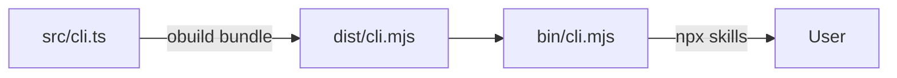
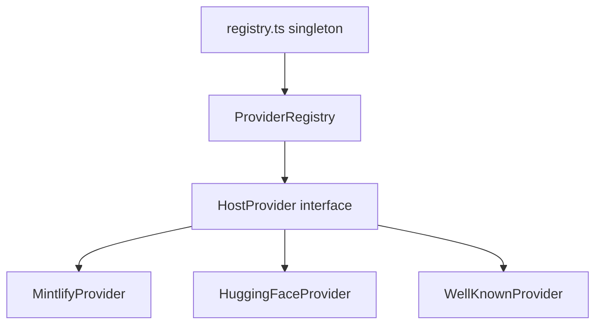
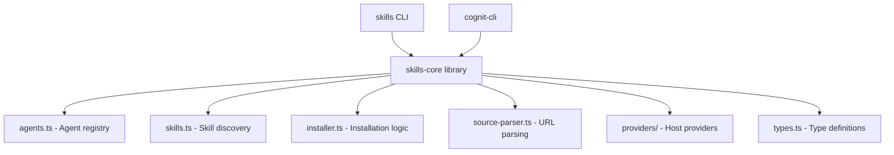

# vercel-labs/skills -- Upstream Analysis Report

> **Date**: 2026-02-09
> **Repo**: https://github.com/vercel-labs/skills
> **Version analyzed**: v1.3.7 (2026-02-06)
> **Package**: `skills` on npm

---

## 1. Purpose & Vision

### What It Solves
`vercel-labs/skills` is the **CLI** for an open, cross-agent skills ecosystem. It provides a package-manager-like experience (`npx skills add/remove/list/find/check/update`) for installing **agent skills** (markdown instruction files -- `SKILL.md`) into the correct filesystem locations for 38+ coding agents (Claude Code, Cursor, Codex, Amp, Gemini CLI, etc.).

### Scope
- **Install** skills from GitHub repos, GitLab repos, direct URLs, local paths, Mintlify docs, HuggingFace Spaces, and well-known endpoints (RFC 8615).
- **Manage** installed skills: list, remove, check for updates, update.
- **Discover** skills via `skills find` (calls `skills.sh` search API).
- **Create** skill scaffolding via `skills init`.
- **Track** installation metadata in a lockfile (`~/.agents/.skill-lock.json`).

### What It Is NOT
- It is NOT an SDK or library for building agents.
- It does NOT run, execute, or interpret skills -- it only installs/removes/lists SKILL.md files.
- It does NOT provide runtime abstractions or hooks -- it's purely a file management CLI.

---

## 2. Architecture

### Repository Structure

```
vercel-labs/skills/
|-- bin/cli.mjs             # Node entry point (compile-cache + import dist/cli.mjs)
|-- build.config.mjs        # obuild config - single bundle entry from src/cli.ts
|-- package.json            # v1.3.7, type: module, bin: "skills"
|-- tsconfig.json           # ESNext, bundler resolution, strict mode
|-- src/
|   |-- cli.ts              # Main entry: command routing, init/check/update inline
|   |-- add.ts              # Core "add" command (~1900 lines), clone+discover+install flow
|   |-- agents.ts           # 38 agent definitions (name, paths, detection functions)
|   |-- installer.ts        # Install logic (symlink/copy), listInstalledSkills
|   |-- skills.ts           # SKILL.md discovery + parsing (gray-matter frontmatter)
|   |-- source-parser.ts    # URL/path parsing (GitHub, GitLab, local, direct, well-known)
|   |-- git.ts              # simple-git wrapper for shallow clones
|   |-- skill-lock.ts       # ~/.agents/.skill-lock.json management
|   |-- find.ts             # Interactive fzf-style search (skills.sh API)
|   |-- list.ts             # List installed skills
|   |-- remove.ts           # Remove installed skills
|   |-- telemetry.ts        # Anonymous usage tracking to add-skill.vercel.sh
|   |-- mintlify.ts         # Legacy Mintlify skill fetcher
|   |-- plugin-manifest.ts  # Claude Code plugin marketplace compat
|   |-- types.ts            # Core TypeScript types
|   |-- constants.ts        # 3 constants (.agents, skills, .agents/skills)
|   |-- prompts/
|   |   `-- search-multiselect.ts  # Custom prompt component
|   `-- providers/
|       |-- index.ts        # Provider registration (mintlify, huggingface)
|       |-- registry.ts     # Singleton provider registry
|       |-- types.ts        # HostProvider, ProviderMatch interfaces
|       |-- mintlify.ts     # Mintlify provider
|       |-- huggingface.ts  # HuggingFace provider
|       `-- wellknown.ts    # RFC 8615 well-known skills provider
|-- tests/                  # 12 test files (vitest)
|-- scripts/                # Agent sync, validation, license generation
|-- skills/find-skills/     # Self-hosted "find-skills" skill
`-- .github/workflows/      # CI (ubuntu+windows), auto-publish with semver
```

### Build System



- **Build tool**: `obuild` (unjs) -- single ESM bundle from `src/cli.ts`
- **Runtime**: Node.js >= 18, ESM modules
- **Package manager**: pnpm 10.17.1
- **No monorepo** -- single package, no workspaces

### Key Dependencies (all devDependencies)

| Dependency | Purpose |
|-----------|---------|
| `@clack/prompts` | Interactive terminal prompts |
| `gray-matter` | YAML frontmatter parsing |
| `simple-git` | Git clone operations |
| `picocolors` | Terminal colors |
| `obuild` | Build/bundle tool |
| `vitest` | Testing framework |
| `xdg-basedir` | XDG config dir resolution |

**Notable**: All deps are `devDependencies` because `obuild` bundles everything into a single file. The published npm package contains only `dist/`, `bin/`, `README.md`, and `ThirdPartyNoticeText.txt`.

---

## 3. Extension Patterns

### How Skills Are Defined

Skills are directories containing a `SKILL.md` file with YAML frontmatter:

```markdown
---
name: my-skill
description: What this skill does
metadata:
  internal: true  # optional: hidden from discovery
---

# My Skill
Instructions for the agent...
```

**Required fields**: `name`, `description`
**Optional fields**: `metadata.internal` (boolean)

### How Skills Are Discovered

The `discoverSkills()` function (`src/skills.ts`) searches in priority order:
1. Root `SKILL.md` (if subpath points to it)
2. 30+ common locations: `skills/`, `.claude/skills/`, `.cursor/skills/`, etc.
3. Plugin manifest paths (`.claude-plugin/marketplace.json`)
4. Fallback: recursive search up to depth 5

### How Agents Are Registered

`src/agents.ts` defines a static `Record<AgentType, AgentConfig>` where each agent specifies:
- `name` / `displayName`
- `skillsDir` (project-level relative path)
- `globalSkillsDir` (absolute path under `~/`)
- `detectInstalled()` -- async function checking filesystem

**Adding a new agent**: Manually edit `agents.ts`, run `scripts/validate-agents.ts` and `scripts/sync-agents.ts`.

### Provider System

The `providers/` module implements a registry pattern for remote skill hosts:



- `HostProvider` interface: `match()`, `fetchSkill()`, `toRawUrl()`, `getSourceIdentifier()`
- Registration via `registerProvider()` -- Mintlify and HuggingFace are auto-registered
- Well-known provider is used as explicit fallback (not registered in global registry)

### Installation Modes

| Mode | Description |
|------|-------------|
| **Symlink** (recommended) | Canonical copy in `.agents/skills/<name>`, symlinks from each agent dir |
| **Copy** | Independent copies in each agent's skills dir |

Installation scope: **Project** (`./<agent>/skills/`) or **Global** (`~/<agent>/skills/`)

---

## 4. API Surface

### Public API (exports via npm package)

**There is NO programmatic API.** The package only exposes a CLI binary (`skills`). There are:
- No exported functions
- No exported types
- No `main` or `exports` field in package.json (beyond `bin`)

The entire codebase is bundled into a single `dist/cli.mjs` for CLI execution only.

### Internal APIs (for understanding, not consumption)

| Module | Key Exports | Stability |
|--------|------------|-----------|
| `types.ts` | `AgentType`, `Skill`, `AgentConfig`, `ParsedSource`, `RemoteSkill` | Moderate -- AgentType changes weekly |
| `agents.ts` | `agents` record, `detectInstalledAgents()`, `getUniversalAgents()` | Low -- agents added/modified very frequently |
| `skills.ts` | `discoverSkills()`, `parseSkillMd()`, `filterSkills()` | Moderate |
| `source-parser.ts` | `parseSource()`, `getOwnerRepo()` | Moderate |
| `installer.ts` | `installSkillForAgent()`, `sanitizeName()`, `listInstalledSkills()` | Moderate |
| `providers/types.ts` | `HostProvider`, `ProviderRegistry` | Moderate |

### External Services

| Service | URL | Purpose |
|---------|-----|---------|
| Telemetry | `https://add-skill.vercel.sh/t` | Anonymous usage tracking |
| Update check | `https://add-skill.vercel.sh/check-updates` | Server-side update detection |
| Search | `https://skills.sh/api/search` | Skill discovery |

---

## 5. Maintainability & Velocity

### Repository Stats

| Metric | Value |
|--------|-------|
| Stars | 5,275 |
| Forks | 444 |
| Open Issues | 99 |
| Created | 2026-01-14 (**< 1 month old**) |
| Last push | 2026-02-06 |
| Total releases | 10+ (v1.2.2 to v1.3.7 in ~1 week) |
| Release frequency | **~daily** |

### Contributors

| Contributor | Commits | Role |
|-------------|---------|------|
| `quuu` (Andrew Qu) | 60 | Primary author / maintainer |
| `github-actions[bot]` | 28 | Automated versioning |
| `huozhi` (Jiachi Liu) | 21 | Active contributor (Vercel team) |
| `pi0` | 8 | Active contributor |
| 16+ others | 1-3 each | Community PRs (agent additions, fixes) |

### Commit Velocity

- **30 commits in 6 days** (Feb 1-6, 2026)
- Extremely active, bordering on volatile
- Most changes: new agent support, bug fixes, dependency updates
- **Breaking change pattern**: Lock file version bumped from v2 to v3 (wipes old lockfile)

### Issue Landscape (99 open)

- Many "add agent X" feature requests
- Several enhancement requests (config file, fuzzy search, trust model)
- Active bug reports (infinite loops, incorrect paths, SSH URL issues)
- Several open PRs from community for new agents

### PR Activity (last 20)

- Mix of merged and open
- Community contributions focused on: adding new agents, fixing edge cases
- Core team handles: architecture, providers, installation logic
- **Notable**: `joicodev` (appears to be the current user) has 2 PRs: `Feature/cognitive types` (#312 closed, #316 closed)

---

## 6. Strengths

### Technical Strengths
1. **Clean architecture**: Single-responsibility modules, well-separated concerns
2. **Provider pattern**: Extensible host provider system for remote skill sources
3. **Cross-platform**: CI tests on Ubuntu + Windows
4. **Security-conscious**: Path traversal prevention, sanitized names, contained temp dirs
5. **Smart installation**: Symlink-first approach with copy fallback, canonical paths
6. **Comprehensive agent support**: 38 agents with proper path detection
7. **Lock file system**: Version tracking, update detection, folder hash integrity
8. **No runtime dependencies**: Everything bundled -- minimal install footprint

### Ecosystem Strengths
1. **First-mover advantage**: Becoming the de-facto standard for skill management
2. **Broad agent adoption**: 38+ agents officially support the skill format
3. **Active community**: 444 forks, 5K+ stars in < 1 month
4. **Vercel backing**: Credibility, infrastructure (telemetry server, search API)
5. **agentskills.io specification**: Standardizing the SKILL.md format

---

## 7. Weaknesses

### Technical Weaknesses
1. **No programmatic API**: Cannot `import { discoverSkills } from 'skills'` -- CLI only
2. **Monolithic add.ts**: ~1900 lines in a single file -- hard to extend or hook into
3. **Static agent registry**: Adding agents requires code changes + PR to upstream
4. **Hard-coded service URLs**: Telemetry and search endpoints baked into source
5. **No plugin system**: Cannot extend CLI behavior without forking
6. **Single-file bundle**: `obuild` produces one file -- no tree-shaking for consumers
7. **Lock file coupling**: Lock file format changes wipe user state (v2->v3)
8. **Limited testing**: 12 test files for core logic, no integration tests

### Ecosystem Weaknesses
1. **Very young codebase**: < 1 month old, API not stabilized
2. **High churn**: Daily releases, frequent breaking changes
3. **Single maintainer risk**: `quuu` (Andrew Qu) authors ~60% of commits
4. **Centralized services**: Telemetry/search depend on Vercel infrastructure
5. **No semantic versioning discipline**: Lock file wipes, agent path changes not clearly communicated
6. **99 open issues**: Growing faster than resolution rate

---

## 8. SDK Integration Feasibility

### Can It Be Used as an npm Dependency?

**No, not directly.** The package:
- Only exposes a CLI binary (`bin.skills`)
- Has no `main`, `exports`, or `types` fields
- Bundles everything into a single `dist/cli.mjs`
- All dependencies are `devDependencies` (bundled)

### What Would Need Wrapping?

To use as an SDK, you would need to either:

#### Option A: Fork and Refactor

Extract core modules into a separate library package:



**Effort**: Medium-High. The modules are reasonably well-separated but have internal cross-references (especially `add.ts` which imports from almost everything).

#### Option B: Wrap the CLI

Shell out to `npx skills` commands and parse output:

```typescript
// Pseudo-code
import { execSync } from 'child_process';
const result = execSync('npx skills add owner/repo --list --yes');
```

**Effort**: Low. But fragile, slow (npx overhead), and limited to CLI output format.

#### Option C: Vendor / Copy Specific Modules

Copy the specific source files you need (MIT license allows this):

- `types.ts` -- Type definitions
- `agents.ts` -- Agent registry
- `skills.ts` -- Skill discovery logic
- `source-parser.ts` -- URL parsing
- `installer.ts` -- Installation logic (partial)

**Effort**: Low initially, but creates maintenance burden tracking upstream changes.

#### Option D: Contribute Upstream to Split CLI/Core

Propose a refactor where `skills` becomes a monorepo with:
- `@skills/core` -- library package with exported functions
- `skills` -- CLI package that depends on core

**Effort**: High. Requires upstream buy-in and significant refactoring of `add.ts`.

### Integration Compatibility Matrix

| Cognit-CLI Need | Upstream Support | Gap |
|----------------|-----------------|-----|
| Skill discovery | `discoverSkills()` in skills.ts | Not exported |
| Agent detection | `detectInstalledAgents()` in agents.ts | Not exported |
| Skill installation | `installSkillForAgent()` in installer.ts | Not exported, tightly coupled to CLI flow |
| Custom agents | Static `agents` record | Cannot add without code change |
| Custom providers | `registerProvider()` in registry.ts | Not exported |
| Custom telemetry | Hard-coded URL | Cannot override |
| Lock file management | `skill-lock.ts` | Not exported, format may change |
| Skill authoring | `skills init` | CLI-only |
| Update checking | Calls `add-skill.vercel.sh` API | Server-side dependency |

---

## 9. Risk Assessment

| Risk | Severity | Likelihood | Mitigation |
|------|----------|-----------|------------|
| **Breaking changes** | High | Very High | Pin to specific version, fork if needed |
| **API instability** | High | High | No public API exists to break, but internal structure shifts frequently |
| **Single maintainer** | Medium | Medium | Vercel backing provides continuity, but bus factor is 1-2 |
| **Telemetry dependency** | Low | Low | Can disable with env var |
| **Service dependency** | Medium | Low | Search/update check require Vercel servers |
| **Lock file incompatibility** | Medium | High | Already happened (v2->v3), no migration path |
| **Scope creep** | Medium | Medium | Rapid feature additions (providers, well-known, plugin manifests) |
| **Agent churn** | Low | High | New agents added weekly, but additive |

---

## 10. Key Decisions for Fork vs SDK Strategy

### Arguments for Forking
1. No public API -- cannot consume as dependency
2. Need to customize agent registry, telemetry, service URLs
3. High upstream churn makes tracking risky
4. Monolithic `add.ts` not designed for programmatic use
5. MIT license makes forking straightforward

### Arguments Against Forking
1. 38-agent ecosystem evolving rapidly -- fork will diverge quickly
2. Provider system and well-known support are valuable and complex
3. Community contributions (bug fixes, new agents) flow to upstream
4. Maintaining a fork doubles effort for agent compatibility updates

### Arguments for SDK/Wrapper Approach
1. Can cherry-pick specific modules (vendor approach)
2. Benefit from upstream bug fixes with minimal coupling
3. Focus cognit-cli efforts on differentiated features
4. Less maintenance burden

### Arguments Against SDK/Wrapper
1. No actual SDK exists to wrap
2. CLI wrapping is fragile and slow
3. Deep customization requires source access anyway
4. Upstream may never split into library + CLI

---

## Appendix: File Size & Complexity

| File | Approx Lines | Complexity |
|------|-------------|-----------|
| `add.ts` | ~1,900 | Very High -- main orchestration, prompts, installation flow |
| `cli.ts` | ~500 | Medium -- command routing, check/update logic inline |
| `installer.ts` | ~900 | High -- symlink/copy logic, path management |
| `agents.ts` | ~500 | Low -- data definitions |
| `skills.ts` | ~200 | Low -- discovery/parsing |
| `source-parser.ts` | ~250 | Medium -- URL parsing with many edge cases |
| `find.ts` | ~300 | Medium -- terminal UI, API calls |
| `remove.ts` | ~250 | Low-Medium |
| `skill-lock.ts` | ~300 | Medium |
| `wellknown.ts` | ~350 | Medium -- RFC 8615 implementation |
| `telemetry.ts` | ~100 | Low |
| `types.ts` | ~100 | Low -- pure type definitions |

---

*Report generated by Agent A -- Upstream Investigator*
*Based on vercel-labs/skills @ commit 556555c (2026-02-06)*
