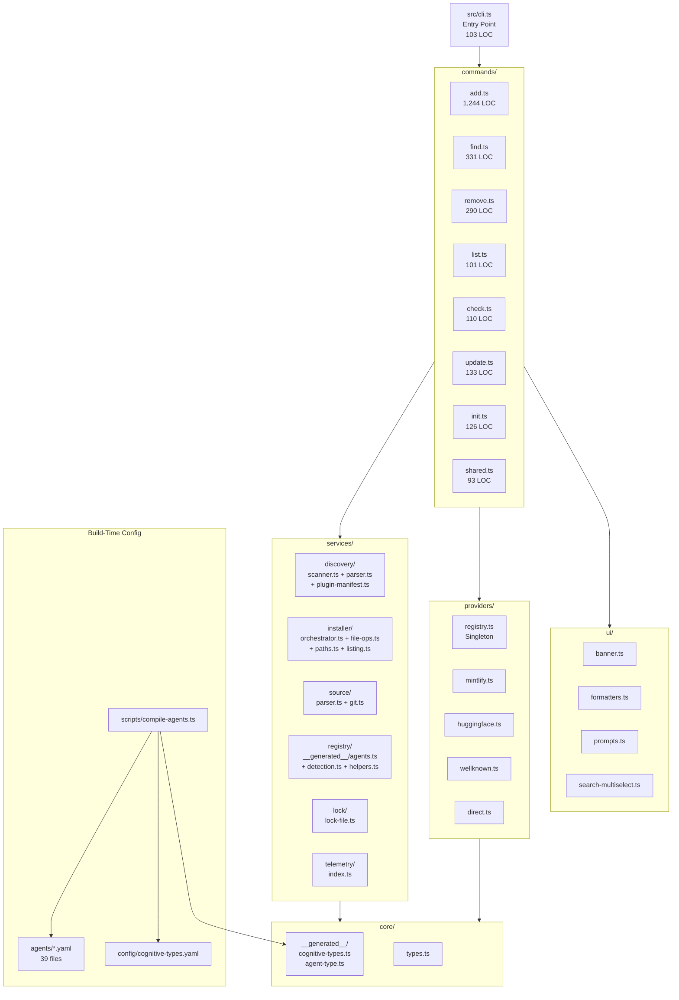
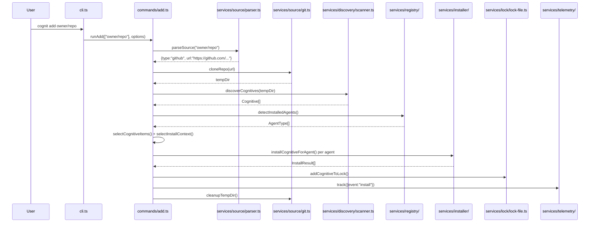
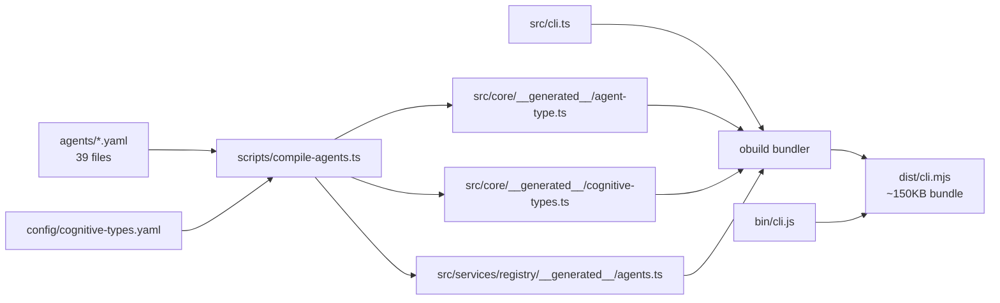

# Cognit Deep Analysis Report

**Repository:** `SynapSync/cognit` (origin remote: `SynapSync/synk`)
**Version:** 1.3.0
**Total Source LOC:** ~9,200 lines TypeScript (src/)
**License:** MIT
**Published As:** `cognit` on npm

---

## 1. Vision Reconstruction

### What is this project?
Cognit is a CLI tool for a **universal cognitive ecosystem for AI coding agents**. It extends the Vercel `skills` concept from single-type (SKILL.md) to a three-type system:

- **Skills** (`SKILL.md`) -- Task-oriented instructions
- **Agents** (`AGENT.md`) -- Persona/behavior definitions
- **Prompts** (`PROMPT.md`) -- Reusable prompt templates

These "cognitives" are markdown files with YAML frontmatter that teach AI coding agents how to perform tasks. The CLI manages installation, discovery, updating, and removal of these cognitives across **39 different AI coding agents** (Claude Code, Cursor, Codex, OpenCode, etc.).

### Target Users
- Developers using AI coding agents who want to extend agent capabilities
- Teams sharing standardized agent skills across projects
- Skill/cognitive authors publishing reusable agent instructions

### Core Value Proposition
One CLI to manage agent skills across ALL coding agents -- not locked into any single agent ecosystem.

---

## 2. Module Map

### 2.1 High-Level Architecture



### 2.2 Detailed File Map

| Directory | File | LOC | Purpose |
|-----------|------|-----|---------|
| `src/` | `cli.ts` | 103 | Entry point, command routing via switch |
| `src/commands/` | `add.ts` | 1,244 | Install cognitives (unified pipeline) |
| | `find.ts` | 331 | Interactive fzf-style search via skills.sh API |
| | `remove.ts` | 290 | Remove installed cognitives |
| | `list.ts` | 101 | List installed cognitives |
| | `check.ts` | 110 | Check for updates via GitHub API |
| | `update.ts` | 133 | Update cognitives via npx re-install |
| | `init.ts` | 126 | Scaffold new SKILL.md/AGENT.md/PROMPT.md |
| | `shared.ts` | 93 | Shared utilities (cancellation, validation) |
| `src/services/discovery/` | `scanner.ts` | 256 | `discoverCognitives()` -- filesystem scanning |
| | `parser.ts` | 86 | Parse frontmatter from markdown files |
| | `plugin-manifest.ts` | 110 | Claude plugin marketplace manifest support |
| | `index.ts` | 15 | Barrel exports |
| `src/services/installer/` | `orchestrator.ts` | 423 | `installCognitiveForAgent()` -- 3 variants |
| | `file-ops.ts` | 149 | Copy, symlink, clean operations |
| | `paths.ts` | 109 | Path sanitization and canonical directories |
| | `listing.ts` | ~312 | `listInstalledCognitives()` |
| | `index.ts` | 33 | Barrel exports |
| `src/services/source/` | `parser.ts` | 319 | `parseSource()` -- URL/path parsing |
| | `git.ts` | 81 | `cloneRepo()` via simple-git |
| | `index.ts` | 2 | Barrel exports |
| `src/services/registry/` | `__generated__/agents.ts` | 520 | Auto-generated 39 agent configs |
| | `detection.ts` | 13 | `detectInstalledAgents()` |
| | `helpers.ts` | 65 | Agent config accessors |
| | `index.ts` | 11 | Barrel exports |
| `src/services/lock/` | `lock-file.ts` | 450 | Lock file CRUD, GitHub hash fetching |
| `src/services/telemetry/` | `index.ts` | 107 | Fire-and-forget to add-skill.vercel.sh |
| `src/providers/` | `registry.ts` | 52 | Singleton provider registry |
| | `types.ts` | 108 | `HostProvider`, `RemoteCognitive` interfaces |
| | `mintlify.ts` | 136 | Mintlify docs provider |
| | `huggingface.ts` | 164 | HuggingFace Spaces provider |
| | `wellknown.ts` | 481 | RFC 8615 well-known provider |
| | `direct.ts` | 154 | Generic direct URL provider |
| | `index.ts` | 41 | Barrel + auto-registration |
| `src/core/` | `types.ts` | 86 | Core interfaces (Cognitive, AgentConfig, etc.) |
| | `__generated__/cognitive-types.ts` | 19 | CognitiveType union + constants |
| | `__generated__/agent-type.ts` | 44 | AgentType union (39 members) |
| | `index.ts` | 2 | Barrel |
| `src/ui/` | `banner.ts` | 143 | ASCII art, help text |
| | `formatters.ts` | 134 | Path shortening, list formatting |
| | `prompts.ts` | ~143 | Interactive agent selection |
| | `search-multiselect.ts` | 297 | Custom @clack/prompts multiselect |
| `src/utils/` | `logger.ts` | 128 | Centralized logger with picocolors + ora |
| **Build** | `scripts/compile-agents.ts` | 495 | YAML -> TypeScript code generator |
| | `scripts/sync-agents.ts` | ~200 | Sync agent list to README |
| | `scripts/validate-agents.ts` | ~200 | Validate agent YAML configs |
| | `scripts/generate-licenses.ts` | ~200 | ThirdPartyNoticeText.txt generator |
| | `scripts/execute-tests.ts` | ~100 | Test runner helper |
| **Config** | `agents/*.yaml` | 39 files | Agent configuration definitions |
| | `config/cognitive-types.yaml` | 12 | Cognitive type definitions |

### 2.3 Data Flow: `cognit add owner/repo`



---

## 3. Origin Analysis (Vercel vs Original)

### 3.1 Git History Timeline

The git log reveals a clear evolution path:

```
v1.3.5-1.3.7  -- Upstream vercel-labs/skills commits (agents, fixes)
v1.0.0        -- First SynapSync milestone
93f9e8a       -- "rename to synk and add support for cognitive types"
f0dec7e       -- "restructure src/ into modular architecture"
7807318       -- "migrate agent configs from hardcoded TS to YAML"
e31f29e       -- "generalize skills to cognitives (skills, agents, prompts)"
df16e4c       -- "deduplicate commands and rename skill internals"
44058c4       -- "rename project from synk to cognit"
682c7f6       -- "update ASCII art logo to COGNIT SYNC"
```

### 3.2 Component Origin Map

| Component | Origin | Confidence | Evidence |
|-----------|--------|------------|----------|
| `commands/add.ts` core flow | **Vercel** | High | Follows vercel-labs/skills `runAdd` pattern, telemetry endpoint is `add-skill.vercel.sh` |
| `commands/find.ts` | **Vercel** | High | Uses `skills.sh` API endpoint |
| `commands/check.ts` / `update.ts` | **Vercel** | High | Reference `add-skill.vercel.sh/check-updates` API |
| `commands/remove.ts` | **Vercel** | High | Standard skill removal pattern |
| `commands/list.ts` | **Vercel** | High | Standard listing pattern |
| `services/source/parser.ts` | **Vercel** | High | GitHub/GitLab URL parsing is core vercel-labs/skills |
| `services/source/git.ts` | **Vercel** | High | simple-git clone with timeout |
| `services/installer/file-ops.ts` | **Vercel** | High | copyDirectory, createSymlink pattern |
| `services/installer/paths.ts` | **Vercel** | High | sanitizeName, path safety |
| `services/lock/lock-file.ts` | **Mixed** | High | Base from Vercel, extended with `cognitiveType`, renamed from `.skill-lock.json` to `.cognit-lock.json` |
| `services/telemetry/` | **Vercel** | High | Points to `add-skill.vercel.sh/t` |
| `providers/mintlify.ts` | **Vercel** | High | Mintlify provider pattern |
| `providers/huggingface.ts` | **Vercel** | High | HuggingFace provider pattern |
| `providers/wellknown.ts` | **Vercel** | High | Well-known RFC 8615 pattern |
| `providers/direct.ts` | **Original** | Medium | New: catch-all for raw GitHub/GitLab URLs |
| `providers/registry.ts` | **Vercel** | High | Singleton provider registry pattern |
| `services/registry/agents.ts` (old) | **Vercel** | High | Agent configs for 39 agents -- upstream maintains |
| `agents/*.yaml` | **Original** | High | YAML-based agent config is a cognit innovation |
| `scripts/compile-agents.ts` | **Original** | High | Code generator from YAML to TypeScript |
| `config/cognitive-types.yaml` | **Original** | High | CognitiveType configuration |
| `core/__generated__/*` | **Original** | High | Build-time generated type system |
| `commands/shared.ts` | **Original** | High | Extracted shared utilities |
| `commands/init.ts` (--type flag) | **Original** | Medium | Extended init to support agent/prompt types |
| CognitiveType system | **Original** | High | The skill->agent->prompt triple is cognit's core innovation |
| `@deprecated` wrappers | **Original** | High | Backward compatibility aliases (Skill -> Cognitive, etc.) |
| `ui/search-multiselect.ts` | **Vercel** | High | Custom @clack component |
| `ui/banner.ts` (COGNIT SYNC logo) | **Original** | Medium | Rebranded ASCII art |

### 3.3 Upstream Dependencies

| Dependency | Why Critical |
|------------|-------------|
| `add-skill.vercel.sh/t` | Telemetry endpoint -- still points to Vercel |
| `add-skill.vercel.sh/check-updates` | Update checking API (referenced in AGENTS.md but not in current code -- replaced by direct GitHub API) |
| `skills.sh` | Search API used by `cognit find` |
| GitHub API | Direct dependency for `check` and `update` commands |

---

## 4. Architecture Deep Dive

### 4.1 Build Pipeline



Key insight: The build is a two-phase process:
1. **Compile phase**: `compile-agents.ts` reads YAML configs and generates TypeScript
2. **Bundle phase**: `obuild` bundles everything into a single `dist/cli.mjs`

### 4.2 Agent Configuration System (Original Innovation)

Each agent is defined in `agents/<name>.yaml` with a minimal DSL:

```yaml
# Simple agent (convention-over-config):
name: cursor
displayName: Cursor
rootDir: .cursor
# Defaults: localRoot=rootDir, globalRoot=~/rootDir, detect=[homeDir: rootDir]

# Complex agent:
name: opencode
displayName: OpenCode
localRoot: .agents              # Universal directory
globalRoot: ${XDG_CONFIG_HOME}/opencode
detect:
  - xdgConfig: opencode
  - envResolvedPath:
      var: claudeHome
      subpath: skills
```

The `compile-agents.ts` script resolves conventions, generates detection logic, and produces the full `agents` Record with:
- `dirs: Record<CognitiveType, { local: string; global: string }>` -- dynamically generated for ALL cognitive types
- `detectInstalled: async () => boolean` -- generated detection functions

This is a significant improvement over the upstream hardcoded TypeScript approach.

### 4.3 Cognitive Type System (Original Innovation)

Defined in `config/cognitive-types.yaml`:
```yaml
skill:
  subdir: skills
  fileName: SKILL.md
agent:
  subdir: agents
  fileName: AGENT.md
prompt:
  subdir: prompts
  fileName: PROMPT.md
```

This is compiled into TypeScript types and constants, making it trivial to add new cognitive types in the future.

### 4.4 Entry Points

| Entry | Binary | Purpose |
|-------|--------|---------|
| `bin/cli.js` | `cognit` | Primary CLI entry (also aliased as `skills` and `add-skill`) |
| `src/cli.ts` | (dev) | Direct execution via `node src/cli.ts` |

---

## 5. Tech Debt Inventory

### 5.1 Critical: Telemetry Points to Vercel

**File:** `src/services/telemetry/index.ts:1`
```typescript
const TELEMETRY_URL = 'https://add-skill.vercel.sh/t';
```
All usage telemetry goes to Vercel's server. This means:
- Vercel tracks cognit installations
- If Vercel changes/removes the endpoint, telemetry silently breaks
- No self-hosted alternative

### 5.2 Critical: Search API Dependency

**File:** `src/commands/find.ts:9`
```typescript
const SEARCH_API_BASE = process.env.SKILLS_API_URL || 'https://skills.sh';
```
The `find` command depends entirely on `skills.sh` for discovery. No fallback, no local index.

### 5.3 High: Backward Compatibility Aliases

Throughout the codebase, there are ~20 `@deprecated` aliases:
- `Skill` -> `Cognitive`
- `RemoteSkill` -> `RemoteCognitive`
- `MintlifySkill` -> `MintlifyCognitive`
- `fetchSkill` -> `fetchCognitive`
- `discoverSkills` -> `discoverCognitives`
- `filterSkills` -> `filterCognitives`
- etc.

These exist for backward compatibility but add noise. The question is: compatibility with what? Since this is a fork, not a library consumed by others, these could likely be removed.

### 5.4 High: Provider/Source Duplication

As documented in `docs/CURRENT_STATUS.md`, the `providers/` and `services/source/` directories overlap:
- Both handle URL-based cognitive fetching
- `providers/mintlify.ts` duplicates `services/source/mintlify.ts` (though the latter is not exported from index.ts)
- `commands/add.ts` uses both systems in different code paths

### 5.5 Medium: Lock File Still References "skill" Terminology

**File:** `src/services/lock/lock-file.ts:11`
```typescript
const OLD_LOCK_FILES = ['.synk-lock.json', '.skill-lock.json'];
```
Migration code handles three historical names. The `CognitiveLockEntry` still has a `skills` key in `getCognitivesBySource()`:
```typescript
bySource.set(entry.source, { skills: [name], entry }); // Line 389 -- "skills" not "cognitives"
```

### 5.6 Medium: `commands/add.ts` is 1,244 Lines

This is the largest single file. While it has been refactored into a unified install pipeline, it still contains:
- 3 resolver functions (`resolveRemoteCognitive`, `resolveWellKnownCognitives`, `resolveGitRepoCognitives`)
- The entire install flow orchestration
- Option parsing
- The `promptForFindSkills` promotional prompt

### 5.7 Medium: Update Command Uses `npx -y cognit add`

**File:** `src/commands/update.ts:102`
```typescript
const result = spawnSync('npx', ['-y', 'cognit', 'add', installUrl, '-g', '-y'], {
  stdio: ['inherit', 'pipe', 'pipe'],
});
```
The update command spawns a child process to reinstall, rather than calling `runAdd()` directly. This is fragile and slow (npm resolution overhead per skill).

### 5.8 Low: No Argument Parser Library

The CLI uses manual `process.argv` parsing with hand-rolled option loops. This works but lacks:
- Type safety for options
- Auto-generated help
- Subcommand composition
- Error handling for invalid flags

### 5.9 Low: Missing Test Coverage

| Area | Tests | Status |
|------|-------|--------|
| Source parser | `source-parser.test.ts` | Good |
| Sanitize name | `sanitize-name.test.ts` | Good |
| Plugin manifest | `plugin-manifest-discovery.test.ts` | Good |
| Installer symlink | `installer-symlink.test.ts` | Good |
| List installed | `list-installed.test.ts` | Good |
| Well-known provider | `wellknown-provider.test.ts` | Good |
| Cross-platform paths | `cross-platform-paths.test.ts` | Good |
| Commands (add, init, list, remove) | `src/__tests__/commands/*.test.ts` | Exists |
| **Providers (mintlify, huggingface, direct)** | **None** | Missing |
| **Telemetry** | **None** | Missing |
| **Lock file operations** | **None** | Missing |
| **Update/check commands** | **None** | Missing |
| **Agent detection** | **None** | Missing |

---

## 6. Extractable Core Components

### 6.1 Agent Registry (HIGH value, LOW coupling)

**Files:**
- `agents/*.yaml` (39 agent definitions)
- `config/cognitive-types.yaml`
- `scripts/compile-agents.ts`
- `src/services/registry/`
- `src/core/__generated__/`

**Why extractable:** This is a self-contained system for:
1. Defining AI agent configurations in YAML
2. Compiling them to TypeScript at build time
3. Runtime agent detection (which agents are installed)
4. Path resolution (where each agent stores cognitives)

**Dependencies:** Only `os.homedir()`, `fs.existsSync()`, `path`, `xdg-basedir`

**Could be:** `@synapsync/agent-registry` -- reusable by any tool that needs to know about AI coding agents.

### 6.2 Cognitive Discovery Engine (HIGH value, LOW coupling)

**Files:**
- `src/services/discovery/` (scanner.ts, parser.ts, plugin-manifest.ts)
- `src/core/types.ts` (Cognitive interface)

**Why extractable:** Filesystem scanning for SKILL.md/AGENT.md/PROMPT.md with:
- Priority-based directory search
- Plugin manifest support (Claude Code marketplace)
- Frontmatter parsing with gray-matter
- Full-depth recursive fallback

**Dependencies:** `fs/promises`, `path`, `gray-matter`

**Could be:** `@synapsync/cognitive-discovery`

### 6.3 Source Parser (MEDIUM value, LOW coupling)

**Files:**
- `src/services/source/parser.ts`
- `src/services/source/git.ts`

**Why extractable:** URL parsing for GitHub, GitLab, local paths, direct URLs, well-known endpoints. Smart format detection with owner/repo shorthand support.

**Dependencies:** `path`, `simple-git`

### 6.4 Provider System (MEDIUM value, MEDIUM coupling)

**Files:**
- `src/providers/` (entire directory)

**Why extractable:** Extensible provider registry for fetching cognitives from various hosts (Mintlify, HuggingFace, well-known, direct URLs).

**Dependencies:** `gray-matter`, `core/types.ts`

### 6.5 Installer (LOW extractability, HIGH coupling)

**Files:**
- `src/services/installer/`

**Why NOT easily extractable:** Tightly coupled to agent registry for path resolution. The orchestrator has 3 specialized install functions for different source types.

### 6.6 Lock File System (MEDIUM value, LOW coupling)

**Files:**
- `src/services/lock/lock-file.ts`

**Why extractable:** Self-contained lock file CRUD with versioning, migration support, and GitHub tree SHA fetching for update detection.

---

## 7. What Works Well

### 7.1 YAML-Based Agent Configuration
The compile-from-YAML pattern (`agents/*.yaml` -> TypeScript) is the project's best architectural decision:
- Adding a new agent = adding a 3-line YAML file
- Convention-over-configuration reduces boilerplate
- Type-safe generated output
- No runtime YAML parsing cost

### 7.2 Cognitive Type Generalization
The three-type system (skill/agent/prompt) is well-implemented:
- Single config source (`config/cognitive-types.yaml`)
- Propagated through `Record<CognitiveType, ...>` patterns
- Easy to extend to new types
- All directory structures are dynamically derived

### 7.3 Unified Install Pipeline
The `commands/add.ts` refactor created a clean abstraction:
```
parseSource -> resolve* -> PreparedInstallation -> executeInstallFlow
```
This handles git repos, remote providers, and well-known endpoints through a single flow.

### 7.4 Security Practices
- Path traversal prevention (`isPathSafe`, `sanitizeName`, `isContainedIn`)
- Temp directory validation (cleanup only within `tmpdir()`)
- No arbitrary code execution
- Plugin manifest path validation

### 7.5 Cross-Platform Symlink Handling
The `file-ops.ts` symlink logic handles edge cases well:
- ELOOP (circular symlinks)
- Parent directory symlink resolution
- Windows junction fallback
- Transparent copy fallback when symlinks fail

---

## 8. What Blocks Evolution

### 8.1 Tight Coupling to Vercel Infrastructure
- Telemetry: `add-skill.vercel.sh/t`
- Search: `skills.sh` API
- Lock file hash: GitHub API (assumes GitHub as primary host)
- The `find-skills` promotional prompt hard-codes `vercel-labs/skills`

### 8.2 No SDK/Library Surface
Everything is CLI-only. There's no way to:
- Use the agent registry programmatically
- Discover cognitives from a library
- Install cognitives from an API call
- Access the provider system as a plugin

### 8.3 Monolithic Command Files
While better than the original upstream, `add.ts` at 1,244 lines is still doing too much. The three resolver functions could be extracted into a resolver pattern.

### 8.4 Name Confusion
The repo went through: `skills` -> `synk` -> `cognit`. Remnants appear everywhere:
- Remote is `SynapSync/synk`
- Lock file migrates from `.synk-lock.json` to `.cognit-lock.json`
- Internal `Skill` type aliased to `Cognitive`
- The `--skill` flag still used (not `--cognitive`)

### 8.5 No Plugin Architecture
Adding a new provider requires modifying `src/providers/index.ts` to register it. There's no external plugin mechanism.

### 8.6 Test Gaps
The provider layer, telemetry, lock file operations, and update/check commands have no test coverage. This makes refactoring risky.

---

## 9. Dependency Analysis

### Runtime Dependencies (devDependencies, bundled by obuild)

| Package | Version | Purpose | Replaceable? |
|---------|---------|---------|-------------|
| `@clack/prompts` | ^0.11.0 | Interactive CLI prompts | Could use inquirer, but clack is good |
| `gray-matter` | ^4.0.3 | YAML frontmatter parsing | Core -- no replacement needed |
| `ora` | ^9.3.0 | Spinner animations | Could use nanospinner |
| `picocolors` | ^1.1.1 | Terminal colors | Could use chalk, but pico is lighter |
| `simple-git` | ^3.27.0 | Git clone operations | Could use child_process, but simple-git is safer |
| `xdg-basedir` | ^5.1.0 | XDG config directory resolution | Minimal, needed for cross-platform |
| `yaml` | ^2.8.2 | YAML parsing (build scripts) | Build-time only |

### Build Dependencies

| Package | Purpose |
|---------|---------|
| `obuild` | Bundle src/ into dist/cli.mjs |
| `typescript` | Type checking |
| `vitest` | Test runner |
| `husky` | Git hooks |
| `lint-staged` | Pre-commit formatting |
| `prettier` | Code formatting |

---

## 10. Key Numbers

| Metric | Value |
|--------|-------|
| Source files (TypeScript) | 50 |
| Source LOC | ~9,200 |
| Generated LOC | ~583 |
| Agent configurations | 39 |
| Cognitive types | 3 |
| Commands | 7 (add, find, list, remove, check, update, init) |
| Providers | 4 (mintlify, huggingface, wellknown, direct) |
| Test files | 19 (src/__tests__ + tests/) |
| Build output | ~150KB single bundle |
| npm keywords | 40+ (aggressive SEO) |

---

## 11. Summary Assessment

**Cognit is a well-executed fork** that adds genuine value on top of vercel-labs/skills:

1. **The YAML agent config system** is the standout innovation -- it makes adding agents trivial and eliminates 500+ lines of hardcoded TypeScript
2. **The cognitive type generalization** (skill/agent/prompt) is clean and extensible
3. **The modular architecture** (post-refactor) is reasonable for a CLI tool

**However, it remains deeply coupled to Vercel infrastructure:**
- Telemetry, search, and update mechanisms all depend on Vercel-hosted services
- The `find-skills` prompt promotes `vercel-labs/skills` specifically
- No mechanism for self-hosted or alternative infrastructure

**The path forward** should extract the reusable core (agent registry, discovery, cognitive types) into independent modules while replacing Vercel infrastructure dependencies with pluggable alternatives.
