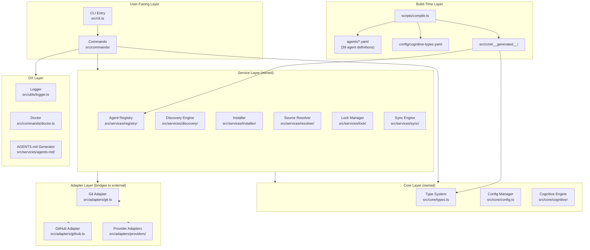
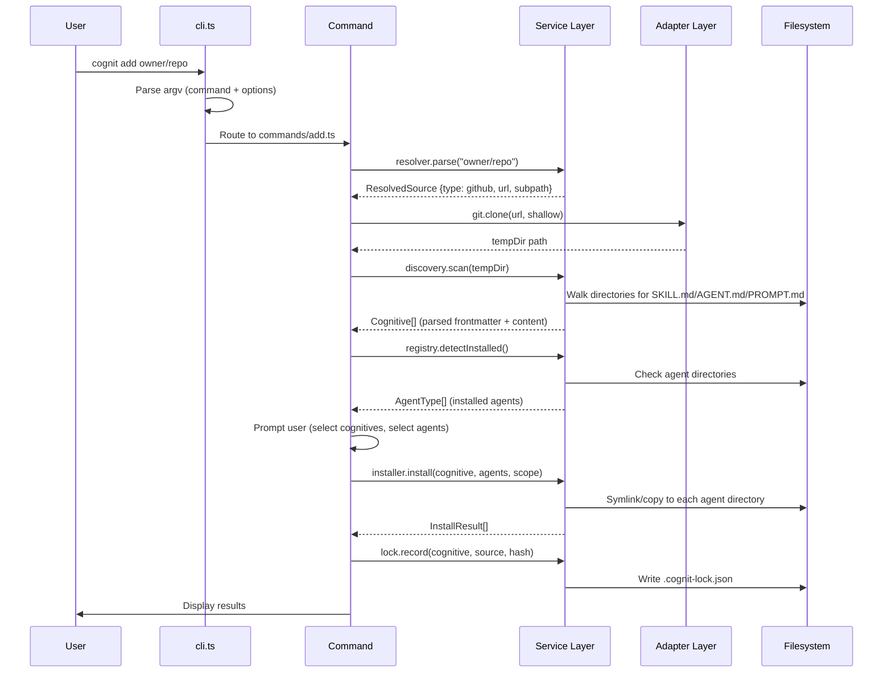
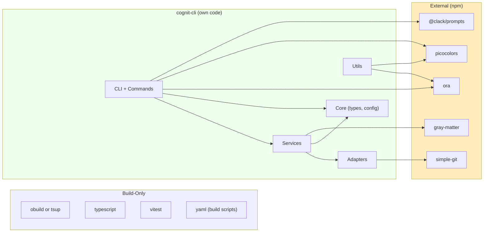
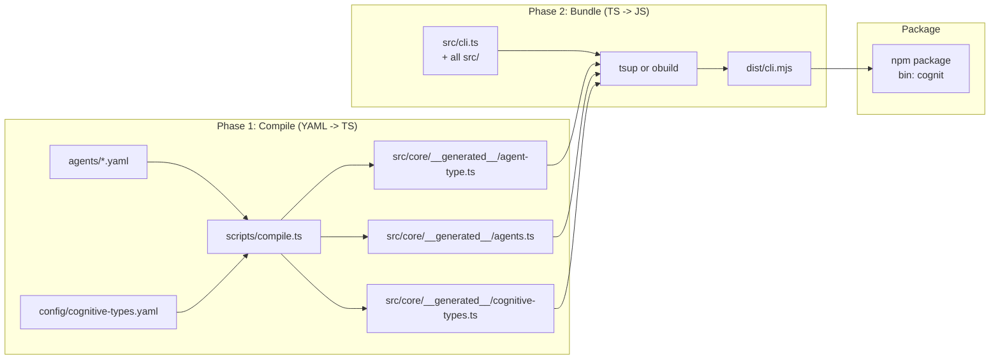

# Proposed Architecture: cognit-cli

> **Date**: 2026-02-09
> **Strategy**: Hybrid Architecture (Own Core + Selective Upstream Adaptation)
> **Based on**: Strategy Decision Matrix (Report 04)

---

## 1. Design Principles

1. **Own the core, reference the ecosystem.** No code dependency on vercel-labs/skills. Adopt the SKILL.md format standard voluntarily.
2. **Data-driven agent registry.** Agent definitions are YAML data files, not TypeScript code. Adding an agent = adding a YAML file.
3. **Three cognitive types from day one.** Skills, Agents, and Prompts -- designed into the type system, not bolted on later.
4. **Command-service separation.** Commands are thin UI wrappers. Services contain all business logic and are independently testable.
5. **Solo-developer sustainability.** Every architectural choice must be maintainable by one person. Minimize surface area.
6. **Progressive enhancement.** MVP is minimal. Features are added incrementally. No premature abstractions.

---

## 2. Component Architecture

### 2.1 High-Level Layer Diagram



### 2.2 CLI Flow Diagram



### 2.3 Dependency Graph



---

## 3. Detailed Module Design

### 3.1 File Structure

```
cognit-cli/
|-- package.json                    # type: module, bin: cognit
|-- tsconfig.json                   # strict mode, ESNext
|-- tsup.config.ts                  # (or build.config.mjs for obuild)
|-- vitest.config.ts
|-- agents/                         # YAML agent definitions (data)
|   |-- claude-code.yaml
|   |-- cursor.yaml
|   |-- codex.yaml
|   |-- ... (39 files)
|-- config/
|   |-- cognitive-types.yaml        # skill/agent/prompt definitions
|-- scripts/
|   |-- compile.ts                  # YAML -> TypeScript code generator
|-- src/
|   |-- cli.ts                      # Entry: argv parsing, command routing
|   |-- commands/
|   |   |-- add.ts                  # Install cognitives
|   |   |-- find.ts                 # Search/discover cognitives
|   |   |-- list.ts                 # List installed cognitives
|   |   |-- remove.ts              # Remove installed cognitives
|   |   |-- check.ts               # Check for updates
|   |   |-- update.ts              # Update installed cognitives
|   |   |-- init.ts                # Scaffold new cognitive
|   |   |-- doctor.ts              # Diagnostic health checks
|   |   |-- sync.ts                # Sync manifest <-> filesystem
|   |-- core/
|   |   |-- types.ts               # Core interfaces: Cognitive, AgentConfig, CognitiveType
|   |   |-- config.ts              # Project config manager (walk-up discovery)
|   |   |-- constants.ts           # Paths, defaults
|   |   |-- __generated__/
|   |       |-- agent-type.ts      # AgentType union (generated from YAML)
|   |       |-- agents.ts          # Agent configs Record (generated)
|   |       |-- cognitive-types.ts # CognitiveType constants (generated)
|   |-- services/
|   |   |-- registry/
|   |   |   |-- agents.ts          # Re-exports generated agents + detection logic
|   |   |   |-- detection.ts       # detectInstalledAgents()
|   |   |-- discovery/
|   |   |   |-- scanner.ts         # Filesystem scanning for SKILL.md/AGENT.md/PROMPT.md
|   |   |   |-- parser.ts          # Frontmatter parsing (gray-matter)
|   |   |-- installer/
|   |   |   |-- orchestrator.ts    # Install flow: resolve -> prompt -> install -> lock
|   |   |   |-- file-ops.ts        # Symlink/copy with fallback
|   |   |   |-- paths.ts           # Path sanitization, canonical paths
|   |   |-- resolver/
|   |   |   |-- source-parser.ts   # Parse GitHub/GitLab/local/URL sources
|   |   |-- lock/
|   |   |   |-- lock-file.ts       # .cognit-lock.json CRUD, versioning
|   |   |-- sync/
|   |   |   |-- engine.ts          # 4-phase: scan -> compare -> reconcile -> apply
|   |   |-- agents-md/
|   |   |   |-- generator.ts       # AGENTS.md marker-based generation
|   |-- adapters/
|   |   |-- git.ts                 # simple-git wrapper (clone, cleanup)
|   |   |-- github.ts             # GitHub API (tree SHA, raw content)
|   |   |-- providers/
|   |       |-- types.ts           # HostProvider interface
|   |       |-- registry.ts        # Provider registration
|   |       |-- mintlify.ts        # Mintlify docs provider
|   |       |-- huggingface.ts     # HuggingFace Spaces provider
|   |       |-- wellknown.ts       # RFC 8615 well-known provider
|   |-- utils/
|   |   |-- logger.ts             # Centralized logger (picocolors + ora)
|   |   |-- errors.ts             # Custom error classes
|-- tests/
|   |-- unit/
|   |   |-- commands/
|   |   |-- services/
|   |   |-- adapters/
|   |   |-- utils/
|   |-- fixtures/                  # Test fixtures (sample SKILL.md, agent configs)
```

### 3.2 Core Interfaces (Contracts)

```typescript
// src/core/types.ts

/** The three cognitive types */
type CognitiveType = 'skill' | 'agent' | 'prompt';

/** A discovered cognitive (parsed from filesystem) */
interface Cognitive {
  name: string;
  description: string;
  type: CognitiveType;
  content: string;           // Full markdown content
  filePath: string;          // Absolute path to source file
  metadata?: Record<string, unknown>;
}

/** An AI coding agent configuration (generated from YAML) */
interface AgentConfig {
  name: string;              // e.g. "claude-code"
  displayName: string;       // e.g. "Claude Code"
  dirs: Record<CognitiveType, {
    local: string;           // Project-relative path
    global: string;          // Absolute path under ~/
  }>;
  detectInstalled: () => Promise<boolean>;
}

/** A parsed source reference */
interface ResolvedSource {
  type: 'github' | 'gitlab' | 'local' | 'url' | 'wellknown';
  url: string;
  owner?: string;
  repo?: string;
  subpath?: string;
  ref?: string;
}

/** Installation result */
interface InstallResult {
  cognitive: string;
  agent: string;
  scope: 'project' | 'global';
  method: 'symlink' | 'copy';
  path: string;
  success: boolean;
  error?: string;
}

/** Host provider for remote cognitive sources */
interface HostProvider {
  name: string;
  match(url: string): boolean;
  fetchCognitive(url: string): Promise<Cognitive[]>;
}
```

### 3.3 Adapter Layer Contracts

The adapter layer is the **only place** where external systems are touched. This means:
- **git.ts**: Only module that imports `simple-git`
- **github.ts**: Only module that calls GitHub API
- **providers/*.ts**: Only modules that call remote skill hosting services

This isolation means upstream patterns can be referenced without code coupling. If `vercel-labs/skills` adds a new provider, we can implement our own adapter using their pattern as reference.

```typescript
// src/adapters/git.ts
export async function cloneRepo(url: string, options?: { depth?: number; timeout?: number }): Promise<string>;
export async function cleanupTemp(dir: string): Promise<void>;

// src/adapters/github.ts
export async function getTreeSha(owner: string, repo: string, ref?: string): Promise<string>;
export async function getRawContent(owner: string, repo: string, path: string): Promise<string>;

// src/adapters/providers/types.ts
export interface HostProvider {
  name: string;
  match(url: string): boolean;
  fetchCognitive(url: string): Promise<Cognitive[]>;
}
```

---

## 4. Build Pipeline

### 4.1 Two-Phase Build



### 4.2 Build Commands

```json
{
  "scripts": {
    "compile": "tsx scripts/compile.ts",
    "build": "npm run compile && tsup",
    "dev": "npm run compile && tsx src/cli.ts",
    "test": "npm run compile && vitest",
    "prepublishOnly": "npm run build"
  }
}
```

### 4.3 Versioning Strategy

- **Semantic versioning** with strict adherence
- **Major**: Breaking changes to cognitive format, lock file format, or CLI interface
- **Minor**: New commands, new agents, new providers
- **Patch**: Bug fixes, documentation
- **Pre-release**: `0.x.y` until MVP stabilizes -- breaking changes allowed in minor versions

---

## 5. Handling Upstream Changes

### 5.1 What to Monitor

| Upstream Change | Frequency | How to Handle |
|----------------|-----------|---------------|
| New agent added | Weekly | Port as new `agents/<name>.yaml` file. ~5 min work. |
| Agent path changed | Rare | Update corresponding YAML file |
| New provider added | Monthly | Implement own adapter using upstream pattern as reference |
| SKILL.md format change | Very rare | Evaluate and adopt if reasonable |
| Lock file format change | Rare | Not relevant -- own lock file system |
| Bug fix in source parser | Occasional | Review and apply fix logic to own parser if applicable |

### 5.2 Monitoring Process

1. **Watch upstream releases** via GitHub notifications or RSS
2. **Monthly review** of upstream commits for agent additions and format changes
3. **No automated merge** -- all changes are manual, intentional ports
4. **Agent additions are data, not code** -- adding a YAML file, not merging TypeScript

### 5.3 Upstream Compatibility

The project maintains compatibility with the `vercel-labs/skills` ecosystem through:
- Using the same `SKILL.md` frontmatter format (name, description, metadata)
- Using the same agent directory conventions (`.claude/skills/`, `.cursor/skills/`, etc.)
- Using symlink-first installation with copy fallback
- Supporting the same source formats (GitHub owner/repo, URLs, local paths)

This means cognitives installed by `cognit` are readable by `skills` and vice versa.

---

## 6. Package Structure

### 6.1 Single Package (Not Monorepo)

For a solo developer, a single package is the right choice:
- No workspace configuration complexity
- No cross-package version coordination
- No publish orchestration
- Simple CI/CD

If the project grows to need extracted libraries (e.g., `@synapsync/agent-registry`), a monorepo can be introduced later. This is an optimization, not a prerequisite.

### 6.2 npm Package Configuration

```json
{
  "name": "cognit",
  "version": "0.1.0",
  "type": "module",
  "bin": {
    "cognit": "./bin/cli.mjs"
  },
  "files": [
    "dist/",
    "bin/",
    "README.md",
    "LICENSE"
  ],
  "engines": {
    "node": ">=20"
  }
}
```

### 6.3 Future Extraction Path

If the agent registry proves valuable to others, it can be extracted:

```
cognit-cli/          (monorepo, future)
|-- packages/
|   |-- cognit/            # CLI package
|   |-- @synapsync/agent-registry/  # Agent definitions + detection
|   |-- @synapsync/cognitive-discovery/  # SKILL.md scanning + parsing
```

This extraction is **not needed for MVP** and should only happen when there is real external demand.

---

## 7. Key Architectural Decisions

### 7.1 No Argument Parser Library (Initially)

The cognit fork and upstream both use manual `process.argv` parsing. Synapse-CLI used Commander.js. For MVP, manual parsing is fine -- it avoids a dependency and keeps the binary small. If command complexity grows, consider `citty` (from UnJS, same ecosystem as `obuild`) or `commander`.

### 7.2 Own Telemetry (or None)

Do NOT point to `add-skill.vercel.sh`. Either:
- **Skip telemetry for MVP** (recommended -- ship faster)
- Build own opt-in telemetry with a self-hosted endpoint later

### 7.3 Own Search (or None)

Do NOT depend on `skills.sh` API. For MVP, `cognit find` can:
- Search GitHub directly (API, no proprietary server needed)
- Support a curated list of known cognitive repos
- Add a proper search backend later if needed

### 7.4 gray-matter Over Custom Parser

Use `gray-matter` for frontmatter parsing (as cognit/upstream do). The synapse-cli custom parser was identified as a design decision to avoid (Report 03, Section 6.2).

### 7.5 tsup Over obuild

Synapse-CLI used `tsup` (well-established, widely adopted). The upstream uses `obuild` (UnJS ecosystem, less common). Either works, but `tsup` has better documentation and community support. Use what the user is already familiar with.

---

*Architecture design by Agent D -- Strategy Architect*
*Based on analysis of vercel-labs/skills, cognit fork, and synapse-cli*
