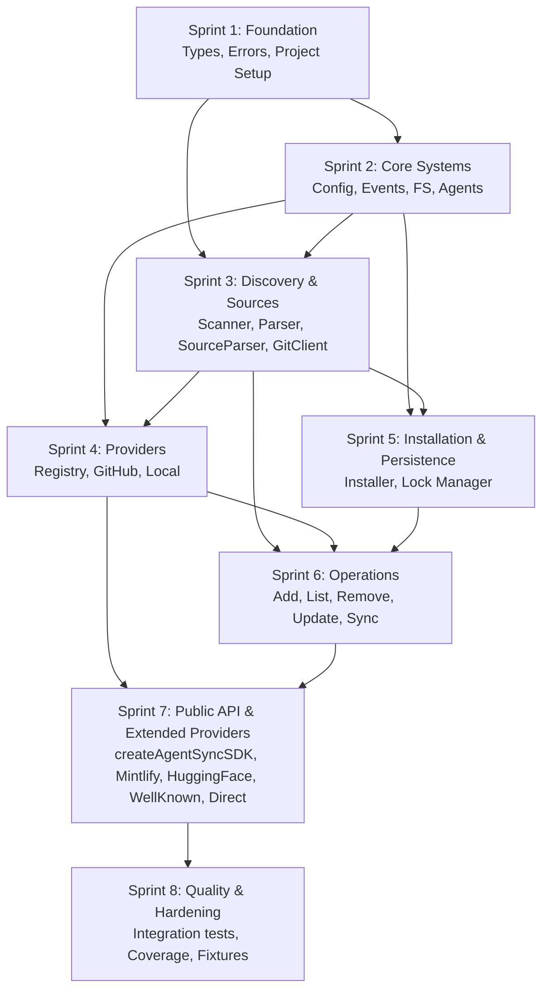

# EXECUTION.md -- @synapsync/agent-sync-sdk

> Detailed task breakdown for all 8 sprints (~46 days).
> Single npm package. No monorepo. No CLI.

---

## Table of Contents

1. [Dependency Graph](#dependency-graph)
2. [Sprint 1 -- Foundation (Days 1-5)](#sprint-1----foundation-days-1-5)
3. [Sprint 2 -- Core Systems (Days 6-11)](#sprint-2----core-systems-days-6-11)
4. [Sprint 3 -- Discovery & Sources (Days 12-17)](#sprint-3----discovery--sources-days-12-17)
5. [Sprint 4 -- Providers (Days 18-23)](#sprint-4----providers-days-18-23)
6. [Sprint 5 -- Installation & Persistence (Days 24-29)](#sprint-5----installation--persistence-days-24-29)
7. [Sprint 6 -- Operations (Days 30-35)](#sprint-6----operations-days-30-35)
8. [Sprint 7 -- Public API & Extended Providers (Days 36-41)](#sprint-7----public-api--extended-providers-days-36-41)
9. [Sprint 8 -- Quality & Hardening (Days 42-46)](#sprint-8----quality--hardening-days-42-46)

---

## Dependency Graph



---

## Sprint 1 -- Foundation (Days 1-5)

### Goal

Stand up the project skeleton and implement all Layer 0 types, branded types, the `Result<T, E>` pattern, the complete error hierarchy, and the const maps that every other module depends on. After this sprint, every interface in the SDK exists as a TypeScript type and the project compiles under `strict: true`.

### Phase 1.1 -- Project Setup (Day 1)

Create the single-package skeleton with all build tooling, configuration, and test infrastructure.

#### Files to Create

| File | Purpose |
|------|---------|
| `package.json` | `@synapsync/agent-sync-sdk`, `"type": "module"`, `engines: { node: ">=20" }`, exports map, scripts |
| `tsconfig.json` | `target: "ES2022"`, `module: "NodeNext"`, `moduleResolution: "NodeNext"`, `strict: true`, `noUncheckedIndexedAccess: true`, `exactOptionalPropertyTypes: true`, `declaration: true`, `declarationMap: true`, `sourceMap: true`, `outDir: "dist"`, `rootDir: "src"` |
| `tsup.config.ts` | ESM output, `dts: true`, `entry: ["src/index.ts"]` |
| `vitest.config.ts` | `test.include: ["tests/**/*.test.ts"]`, coverage provider: v8, thresholds: statements 80%, branches 75%, functions 80% |
| `.eslintrc.json` | Strict TypeScript rules, `no-restricted-imports` for layer enforcement |
| `.prettierrc` | Consistent formatting |
| `.gitignore` | `node_modules/`, `dist/`, `coverage/`, `__generated__/` |
| `src/index.ts` | Placeholder barrel export |

#### package.json Key Fields

```jsonc
{
  "name": "@synapsync/agent-sync-sdk",
  "version": "0.1.0",
  "type": "module",
  "exports": {
    ".": {
      "types": "./dist/index.d.ts",
      "import": "./dist/index.js"
    }
  },
  "types": "./dist/index.d.ts",
  "files": ["dist"],
  "engines": { "node": ">=20" },
  "scripts": {
    "build": "tsup",
    "test": "vitest",
    "test:coverage": "vitest run --coverage",
    "lint": "eslint src/ tests/",
    "typecheck": "tsc --noEmit",
    "compile-agents": "tsx scripts/compile-agents.ts",
    "prebuild": "npm run compile-agents"
  },
  "dependencies": {
    "gray-matter": "^4.0.3",
    "simple-git": "^3.27.0"
  },
  "devDependencies": {
    "typescript": "^5.7.0",
    "tsup": "^8.3.0",
    "vitest": "^3.0.0",
    "tsx": "^4.19.0",
    "@vitest/coverage-v8": "^3.0.0",
    "eslint": "^9.0.0"
  }
}
```

#### Success Criteria

- [ ] `npm install` succeeds
- [ ] `npm run build` compiles (empty `src/index.ts`)
- [ ] `npm run test` runs vitest and exits 0 (no tests yet)
- [ ] `npm run typecheck` passes with zero errors
- [ ] TypeScript strict mode enforced

---

### Phase 1.2 -- Branded Types (Day 2)

Implement branded types that prevent accidental mixing of string identifiers across domains.

#### Files to Create

| File | Purpose |
|------|---------|
| `src/types/branded.ts` | `Brand<T, B>` utility, `AgentName`, `CognitiveName`, `SafeName`, `SourceIdentifier` branded types, constructor functions `agentName()`, `cognitiveName()`, `safeName()`, `sourceIdentifier()` |
| `tests/types/branded.test.ts` | Validation tests for all constructors |

#### Interfaces & Functions

```typescript
// Brand utility
declare const __brand: unique symbol;
type Brand<T, B extends string> = T & { readonly [__brand]: B };

// Branded types
type AgentName = Brand<string, 'AgentName'>;
type CognitiveName = Brand<string, 'CognitiveName'>;
type SafeName = Brand<string, 'SafeName'>;
type SourceIdentifier = Brand<string, 'SourceIdentifier'>;

// Constructors with validation
function agentName(raw: string): AgentName;       // /^[a-z0-9][a-z0-9-]*$/
function cognitiveName(raw: string): CognitiveName; // no slashes, non-empty
function safeName(raw: string): SafeName;           // no path separators, no dots-only, no null bytes
function sourceIdentifier(raw: string): SourceIdentifier; // non-empty
```

#### Tests

- `agentName("claude-code")` succeeds
- `agentName("Claude Code")` throws (uppercase, space)
- `agentName("")` throws (empty)
- `cognitiveName("react-best-practices")` succeeds
- `cognitiveName("../hack")` throws (contains slash)
- `safeName("valid-name")` succeeds
- `safeName("..")` throws
- `safeName("foo/bar")` throws
- `sourceIdentifier("owner/repo")` succeeds
- `sourceIdentifier("")` throws

#### Success Criteria

- [ ] All branded constructors reject invalid inputs with descriptive errors
- [ ] Valid inputs return correctly branded values
- [ ] All tests pass

---

### Phase 1.3 -- Result Type (Day 2)

Implement the discriminated union `Result<T, E>` for expected failures.

#### Files to Create

| File | Purpose |
|------|---------|
| `src/types/result.ts` | `Result<T, E>` type, `ok()`, `err()`, `unwrap()`, `mapResult()` helpers |
| `tests/types/result.test.ts` | Unit tests for all helpers |

#### Type Definition

```typescript
type Result<T, E extends CognitError = CognitError> =
  | { readonly ok: true; readonly value: T }
  | { readonly ok: false; readonly error: E };

function ok<T>(value: T): Result<T, never>;
function err<E extends CognitError>(error: E): Result<never, E>;
function unwrap<T, E extends CognitError>(result: Result<T, E>): T; // throws E if not ok
function mapResult<T, U, E extends CognitError>(
  result: Result<T, E>,
  fn: (value: T) => U,
): Result<U, E>;
```

#### Tests

- `ok(42).ok === true` and `ok(42).value === 42`
- `err(someError).ok === false` and `err(someError).error === someError`
- `unwrap(ok(42)) === 42`
- `unwrap(err(someError))` throws `someError`
- `mapResult(ok(2), x => x * 3)` yields `ok(6)`
- `mapResult(err(e), fn)` yields the same `err(e)` without calling `fn`

#### Success Criteria

- [ ] Type-level: `Result<number, ProviderError>` constrains the error type
- [ ] All four helpers work as specified
- [ ] All tests pass

---

### Phase 1.4 -- Error Hierarchy (Days 2-3)

Implement the complete error class hierarchy for all SDK modules.

#### Files to Create

| File | Purpose |
|------|---------|
| `src/errors/base.ts` | `CognitError` abstract class with `code`, `module`, `toJSON()` |
| `src/errors/provider.ts` | `ProviderError`, `ProviderFetchError`, `ProviderMatchError` |
| `src/errors/install.ts` | `InstallError`, `PathTraversalError`, `SymlinkError`, `FileWriteError` |
| `src/errors/discovery.ts` | `DiscoveryError`, `ParseError`, `ScanError` |
| `src/errors/lock.ts` | `LockError`, `LockReadError`, `LockWriteError`, `LockMigrationError` |
| `src/errors/config.ts` | `ConfigError`, `InvalidConfigError` |
| `src/errors/source.ts` | `SourceError`, `SourceParseError`, `GitCloneError` |
| `src/errors/agent.ts` | `AgentError`, `AgentNotFoundError`, `AgentDetectionError` |
| `src/errors/codes.ts` | `ERROR_CODES` const map, `ErrorCode` type |
| `src/errors/index.ts` | Barrel re-exports |
| `tests/errors/hierarchy.test.ts` | `instanceof` chain tests |
| `tests/errors/codes.test.ts` | Every error class has a matching `ERROR_CODES` entry |
| `tests/errors/serialization.test.ts` | `toJSON()` produces expected shape |

#### Error Hierarchy

```
CognitError (abstract)
  code: string (abstract)
  module: string (abstract)
  toJSON(): Record<string, unknown>
  |
  +-- ProviderError           (code: PROVIDER_ERROR, module: providers)
  |     +-- ProviderFetchError  (code: PROVIDER_FETCH_ERROR)
  |     +-- ProviderMatchError  (code: PROVIDER_MATCH_ERROR)
  |
  +-- InstallError            (code: INSTALL_ERROR, module: installer)
  |     +-- PathTraversalError  (code: PATH_TRAVERSAL_ERROR)
  |     +-- SymlinkError        (code: SYMLINK_ERROR)
  |     +-- FileWriteError      (code: FILE_WRITE_ERROR)
  |
  +-- DiscoveryError          (code: DISCOVERY_ERROR, module: discovery)
  |     +-- ParseError          (code: PARSE_ERROR)
  |     +-- ScanError           (code: SCAN_ERROR)
  |
  +-- LockError               (code: LOCK_ERROR, module: lock)
  |     +-- LockReadError       (code: LOCK_READ_ERROR)
  |     +-- LockWriteError      (code: LOCK_WRITE_ERROR)
  |     +-- LockMigrationError  (code: LOCK_MIGRATION_ERROR)
  |
  +-- ConfigError             (code: CONFIG_ERROR, module: config)
  |     +-- InvalidConfigError  (code: INVALID_CONFIG_ERROR)
  |
  +-- SourceError             (code: SOURCE_ERROR, module: source)
  |     +-- SourceParseError    (code: SOURCE_PARSE_ERROR)
  |     +-- GitCloneError       (code: GIT_CLONE_ERROR)
  |
  +-- AgentError              (code: AGENT_ERROR, module: agents)
        +-- AgentNotFoundError  (code: AGENT_NOT_FOUND)
        +-- AgentDetectionError (code: AGENT_DETECTION_ERROR)
```

#### ERROR_CODES Const Map

```typescript
export const ERROR_CODES = {
  PROVIDER_ERROR: 'PROVIDER_ERROR',
  PROVIDER_FETCH_ERROR: 'PROVIDER_FETCH_ERROR',
  PROVIDER_MATCH_ERROR: 'PROVIDER_MATCH_ERROR',
  INSTALL_ERROR: 'INSTALL_ERROR',
  PATH_TRAVERSAL_ERROR: 'PATH_TRAVERSAL_ERROR',
  SYMLINK_ERROR: 'SYMLINK_ERROR',
  FILE_WRITE_ERROR: 'FILE_WRITE_ERROR',
  DISCOVERY_ERROR: 'DISCOVERY_ERROR',
  PARSE_ERROR: 'PARSE_ERROR',
  SCAN_ERROR: 'SCAN_ERROR',
  LOCK_ERROR: 'LOCK_ERROR',
  LOCK_READ_ERROR: 'LOCK_READ_ERROR',
  LOCK_WRITE_ERROR: 'LOCK_WRITE_ERROR',
  LOCK_MIGRATION_ERROR: 'LOCK_MIGRATION_ERROR',
  CONFIG_ERROR: 'CONFIG_ERROR',
  INVALID_CONFIG_ERROR: 'INVALID_CONFIG_ERROR',
  SOURCE_ERROR: 'SOURCE_ERROR',
  SOURCE_PARSE_ERROR: 'SOURCE_PARSE_ERROR',
  GIT_CLONE_ERROR: 'GIT_CLONE_ERROR',
  AGENT_ERROR: 'AGENT_ERROR',
  AGENT_NOT_FOUND: 'AGENT_NOT_FOUND',
  AGENT_DETECTION_ERROR: 'AGENT_DETECTION_ERROR',
} as const;

export type ErrorCode = typeof ERROR_CODES[keyof typeof ERROR_CODES];
```

#### Tests

- `ProviderFetchError instanceof ProviderError` is true
- `ProviderFetchError instanceof CognitError` is true
- `ProviderFetchError instanceof InstallError` is false
- Every error subclass has a `code` matching its `ERROR_CODES` entry
- Every error subclass has a `module` property
- `toJSON()` returns `{ name, code, module, message, cause }`

#### Success Criteria

- [ ] Full `instanceof` chain for every error class
- [ ] Every error has `code` and `module`
- [ ] `ERROR_CODES` covers all 22 error classes
- [ ] `toJSON()` serializes correctly
- [ ] All tests pass

---

### Phase 1.5 -- Core Type Definitions (Days 3-5)

Implement all type definition files that form the shared vocabulary of the SDK.

#### Files to Create

| File | Purpose |
|------|---------|
| `src/types/cognitive.ts` | `CognitiveType`, `CognitiveTypeConfig`, `COGNITIVE_TYPE_CONFIGS`, `COGNITIVE_SUBDIRS`, `COGNITIVE_FILE_NAMES`, `AGENTS_DIR`, `Cognitive`, `Skill`, `Prompt`, `Rule`, `AgentCognitive`, `RemoteCognitive`, `CognitiveRef` |
| `src/types/agent.ts` | `AgentType` (placeholder union), `AgentDirConfig`, `AgentConfig`, `AgentDetectionResult`, `AgentRegistry` interface |
| `src/types/provider.ts` | `SourceDescriptor`, `ParsedSource`, `ProviderMatch`, `HostProvider`, `ProviderRegistry`, `SourceParser`, `GitClient`, `GitCloneOptions`, `ProviderFetchOptions` |
| `src/types/installer.ts` | `InstallMode`, `InstallScope`, `InstallTarget`, `InstallResult`, `InstallRequest` (discriminated union: local/remote/wellknown), `WellKnownCognitive`, `Installer`, `InstallerOptions` |
| `src/types/lock.ts` | `LOCK_VERSION = 5`, `LockEntry`, `LockFile`, `LockManager` interface |
| `src/types/operations.ts` | `AddOptions`, `AddResult`, `InstallResultEntry`, `ListOptions`, `ListResult`, `InstalledCognitive`, `RemoveOptions`, `RemoveResult`, `UpdateOptions`, `UpdateResult`, `UpdateCheckEntry`, `SyncOptions`, `SyncResult` |
| `src/types/category.ts` | `Category`, `CategoryMapping`, `DEFAULT_CATEGORIES` |
| `src/types/config.ts` | `SDKConfig`, `FileSystemAdapter`, `FsStats`, `Dirent`, `GitConfig`, `ProviderConfig`, `AgentRegistryConfig`, `TelemetryConfig` |
| `src/types/events.ts` | `SDKEventMap` (28+ event types), `Unsubscribe`, `EventBus` interface |
| `src/types/index.ts` | Barrel re-exports for all types |

#### Key Type Details

**CognitiveType and const maps:**
```typescript
type CognitiveType = 'skill' | 'agent' | 'prompt' | 'rule';

const COGNITIVE_TYPE_CONFIGS = {
  skill:  { subdir: 'skills',  fileName: 'SKILL.md' },
  agent:  { subdir: 'agents',  fileName: 'AGENT.md' },
  prompt: { subdir: 'prompts', fileName: 'PROMPT.md' },
  rule:   { subdir: 'rules',   fileName: 'RULE.md' },
} as const satisfies Record<CognitiveType, CognitiveTypeConfig>;
```

**SDKEventMap (28+ events):**
```typescript
interface SDKEventMap {
  'sdk:initialized': { readonly configHash: string };
  'sdk:error': { readonly error: CognitError };
  'operation:start': { readonly operation: string; readonly options: unknown };
  'operation:complete': { readonly operation: string; readonly result: unknown; readonly durationMs: number };
  'operation:error': { readonly operation: string; readonly error: CognitError };
  'discovery:start': { readonly path: string };
  'discovery:found': { readonly cognitive: CognitiveRef; readonly type: CognitiveType };
  'discovery:complete': { readonly count: number; readonly durationMs: number };
  'provider:fetch:start': { readonly providerId: string; readonly url: string };
  'provider:fetch:complete': { readonly providerId: string; readonly url: string; readonly found: boolean };
  'provider:fetch:error': { readonly providerId: string; readonly url: string; readonly error: string };
  'install:start': { readonly cognitive: string; readonly agent: AgentType; readonly mode: InstallMode };
  'install:symlink': { readonly source: string; readonly target: string };
  'install:copy': { readonly source: string; readonly target: string };
  'install:complete': { readonly cognitive: string; readonly agent: AgentType; readonly result: InstallResult };
  'lock:read': { readonly path: string };
  'lock:write': { readonly path: string; readonly entryCount: number };
  'lock:migrate': { readonly fromVersion: number; readonly toVersion: number };
  'git:clone:start': { readonly url: string };
  'git:clone:complete': { readonly url: string; readonly path: string; readonly durationMs: number };
  'git:clone:error': { readonly url: string; readonly error: string };
  'agent:detect:start': Record<string, never>;
  'agent:detect:found': { readonly agent: AgentType; readonly displayName: string };
  'agent:detect:complete': { readonly results: readonly AgentDetectionResult[]; readonly durationMs: number };
  'progress:start': { readonly id: string; readonly message: string; readonly total?: number };
  'progress:update': { readonly id: string; readonly message: string; readonly current?: number };
  'progress:complete': { readonly id: string; readonly message: string };
}
```

**FileSystemAdapter:**
```typescript
interface FileSystemAdapter {
  readFile(path: string, encoding: 'utf-8'): Promise<string>;
  writeFile(path: string, content: string, encoding: 'utf-8'): Promise<void>;
  mkdir(path: string, options?: { recursive?: boolean }): Promise<void>;
  readdir(path: string, options: { withFileTypes: true }): Promise<Dirent[]>;
  stat(path: string): Promise<FsStats>;
  lstat(path: string): Promise<FsStats>;
  symlink(target: string, path: string): Promise<void>;
  readlink(path: string): Promise<string>;
  rm(path: string, options?: { recursive?: boolean; force?: boolean }): Promise<void>;
  rename(oldPath: string, newPath: string): Promise<void>;
  exists(path: string): Promise<boolean>;
  copyDirectory(source: string, target: string): Promise<void>;
}
```

**InstallRequest (discriminated union):**
```typescript
type InstallRequest =
  | { readonly kind: 'local'; readonly cognitive: Cognitive }
  | { readonly kind: 'remote'; readonly cognitive: RemoteCognitive }
  | { readonly kind: 'wellknown'; readonly cognitive: WellKnownCognitive };
```

**DEFAULT_CATEGORIES:**
```typescript
const DEFAULT_CATEGORIES = {
  planning:  { slug: 'planning',  displayName: 'Planning' },
  qa:        { slug: 'qa',        displayName: 'QA' },
  growth:    { slug: 'growth',    displayName: 'Growth' },
  frontend:  { slug: 'frontend',  displayName: 'Frontend' },
  backend:   { slug: 'backend',   displayName: 'Backend' },
  devops:    { slug: 'devops',    displayName: 'DevOps' },
  security:  { slug: 'security',  displayName: 'Security' },
  general:   { slug: 'general',   displayName: 'General' },
} as const satisfies Record<string, Category>;
```

#### Success Criteria

- [ ] All type files compile with zero errors under `strict: true`
- [ ] No `any` anywhere; `unknown` only at deserialization boundaries
- [ ] All `readonly` modifiers applied to interface properties
- [ ] `src/index.ts` barrel re-exports all public types and errors
- [ ] `npm run typecheck` passes

---

## Sprint 2 -- Core Systems (Days 6-11)

### Goal

Implement the Layer 1 modules (config resolution, event bus, filesystem adapter) and the Layer 2 agent system (YAML definitions, compile pipeline, agent registry, agent detection). After this sprint, every SDK service has its configuration, event bus, and filesystem adapter available for injection.

### Phase 2.1 -- Config Resolution (Day 6)

#### Files to Create

| File | Purpose |
|------|---------|
| `src/config/index.ts` | `resolveConfig()`, `validateConfig()` exports |
| `src/config/defaults.ts` | Default values for every `SDKConfig` field |
| `src/config/validation.ts` | Validation rules, throws `InvalidConfigError` |
| `tests/config/resolve.test.ts` | `resolveConfig()` with partial inputs, verify defaults |
| `tests/config/validation.test.ts` | `validateConfig()` rejects invalid configs |

#### Functions

```typescript
function resolveConfig(partial?: Partial<SDKConfig>): SDKConfig;
function validateConfig(config: SDKConfig): void; // throws InvalidConfigError
```

**resolveConfig() behavior:**

- Called with no args: returns full `SDKConfig` with all defaults
- Called with `{ cwd: '/tmp' }`: overrides only `cwd`, rest are defaults
- `fs` defaults to the real Node.js `fs/promises` wrapper (`nodeFs`)
- `git.cloneTimeoutMs` defaults to `30_000`
- `git.depth` defaults to `1`
- `agentsDir` defaults to `'.agents'`
- `lockFileName` defaults to `'.cognit-lock.json'`
- `providers.githubToken` auto-detects from environment (`GITHUB_TOKEN`, `GH_TOKEN`)
- `telemetry.enabled` defaults to `true`

**validateConfig() rejects:**

- Empty `cwd`
- Negative `git.cloneTimeoutMs`
- Zero `git.depth`

#### Success Criteria

- [ ] `resolveConfig()` fills all defaults when called with no arguments
- [ ] `resolveConfig({ cwd: '/tmp' })` merges correctly
- [ ] `validateConfig()` throws `InvalidConfigError` for invalid fields
- [ ] All tests pass

---

### Phase 2.2 -- Event Bus (Day 7)

#### Files to Create

| File | Purpose |
|------|---------|
| `src/events/index.ts` | `EventBusImpl`, `createCapturingEventBus()` |
| `tests/events/event-bus.test.ts` | Subscribe, emit, once, unsubscribe, capturing bus |

#### Implementation

```typescript
class EventBusImpl implements EventBus {
  private handlers: Map<string, Set<Function>> = new Map();

  emit<K extends keyof SDKEventMap>(event: K, payload: SDKEventMap[K]): void;
  on<K extends keyof SDKEventMap>(event: K, handler: (payload: SDKEventMap[K]) => void): Unsubscribe;
  once<K extends keyof SDKEventMap>(event: K, handler: (payload: SDKEventMap[K]) => void): Unsubscribe;
}

// Test utility: records all emitted events in order
function createCapturingEventBus(): EventBus & {
  readonly events: Array<{ event: string; payload: unknown }>;
};
```

#### Tests

- Subscribe to `'progress:start'`, emit it, verify handler called with correct payload
- `once()` fires exactly once, second emit does not call handler
- Unsubscribe removes handler; subsequent emit does not call it
- `createCapturingEventBus()` records events in emission order
- Multiple handlers for same event all receive the payload

#### Success Criteria

- [ ] `EventBusImpl` fully implements the `EventBus` interface
- [ ] All 28+ event types are type-safe (handler payload matches event)
- [ ] `createCapturingEventBus()` captures events for test assertions
- [ ] All tests pass

---

### Phase 2.3 -- Filesystem Adapter (Days 7-8)

#### Files to Create

| File | Purpose |
|------|---------|
| `src/fs/index.ts` | Barrel exports |
| `src/fs/node.ts` | `nodeFs: FileSystemAdapter` -- wraps `fs/promises` |
| `src/fs/memory.ts` | `createMemoryFs(seed?): FileSystemAdapter` -- in-memory for tests |
| `tests/fs/memory.test.ts` | Full test suite for in-memory FS |

#### nodeFs Implementation

Wraps `fs/promises` methods: `readFile`, `writeFile`, `mkdir`, `readdir`, `stat`, `lstat`, `symlink`, `readlink`, `rm`, `rename`. The `exists()` method uses `access()` with a try/catch. The `copyDirectory()` method recursively copies.

#### createMemoryFs Implementation

In-memory tree structure supporting:

- Recursive `mkdir`
- `readdir` with `withFileTypes: true` (returns `Dirent`-like objects)
- `readFile`/`writeFile` round-trip
- `symlink` creation and `readlink`
- `stat`/`lstat` distinguishing files, directories, symlinks
- `exists` check
- `rm` with recursive and force options
- `rename` (atomic move)
- Seeding from a `Record<string, string>` for test setup

#### Tests

- `mkdir` creates nested paths
- `writeFile` + `readFile` round-trip
- `readdir({ withFileTypes: true })` returns entries with `isFile()`, `isDirectory()`, `isSymbolicLink()`
- `symlink` + `readlink` round-trip
- `exists` returns true for existing, false for missing
- `rm` with `recursive: true` removes trees
- `stat` vs `lstat` on symlinks

#### Success Criteria

- [ ] `nodeFs` wraps all required `fs/promises` methods
- [ ] `createMemoryFs()` implements full `FileSystemAdapter`
- [ ] In-memory FS supports recursive mkdir, symlink, readdir with file types
- [ ] All tests pass

---

### Phase 2.4 -- Agent YAML Definitions & Compile Pipeline (Days 8-9)

#### Files to Create

| File | Purpose |
|------|---------|
| `agents/*.yaml` | 39+ agent definitions (claude-code, cursor, codex, opencode, windsurf, gemini-cli, github-copilot, goose, roo, amp, adal, augment, cline, junie, kiro-cli, trae, etc.) |
| `config/cognitive-types.yaml` | CognitiveType definitions (skill, agent, prompt, rule) with subdir and fileName |
| `config/categories.yaml` | Default category definitions (general, planning, qa, growth, frontend, backend, devops, security, data, mobile, infra) |
| `scripts/compile-agents.ts` | YAML-to-TypeScript compile pipeline |
| `scripts/validate-agents.ts` | Agent YAML validation script |
| `src/agents/__generated__/agents.ts` | Compiled `Record<AgentType, AgentConfig>` |
| `src/agents/__generated__/agent-type.ts` | `AgentType` string literal union |
| `src/agents/__generated__/cognitive-types.ts` | `CognitiveType` union + `COGNITIVE_*` const maps |
| `tests/scripts/compile-agents.test.ts` | End-to-end compile test |

#### Agent YAML Schema (Convention-over-Configuration)

```yaml
# agents/cursor.yaml
name: cursor
displayName: Cursor
rootDir: .cursor
# Convention: localRoot = rootDir, detect = cwdDir(rootDir)
# dirs auto-derived from cognitive-types.yaml subdirs
```

Full schema for complex agents:

```yaml
# agents/claude-code.yaml
name: claude-code
displayName: Claude Code
localRoot: .claude
globalRoot: ~/.claude
detect:
  - rule: cwdDir
    path: .claude
  - rule: homeDir
    path: .claude
dirs:
  skill:
    local: .claude/skills
    global: ~/.claude/skills
  prompt:
    local: .claude/prompts
    global: ~/.claude/prompts
  rule:
    local: .claude/rules
    global: ~/.claude/rules
  agent:
    local: .claude/agents
    global: ~/.claude/agents
```

#### Compile Pipeline Steps

1. Load all `agents/*.yaml` files
2. Load `config/cognitive-types.yaml`
3. Validate required fields (name, displayName, rootDir or localRoot)
4. Cross-validate (no duplicate names or displayNames)
5. Resolve conventions: `rootDir` -> `localRoot`, `globalRoot`, detect rules, dirs
6. Generate `agent-type.ts`: `export type AgentType = 'adal' | 'amp' | ... ;`
7. Generate `cognitive-types.ts`: `CognitiveType` union + const maps
8. Generate `agents.ts`: full `Record<AgentType, AgentConfig>` with `detectInstalled` functions
9. Write all files with `// AUTO-GENERATED -- DO NOT EDIT` header

#### Detection Rules

| Rule | Behavior |
|------|----------|
| `cwdDir` | Check if `path` directory exists under `cwd` |
| `homeDir` | Check if `path` directory exists under `homeDir` |
| `xdgConfig` | Check if directory exists under `$XDG_CONFIG_HOME` |
| `absolutePath` | Check if absolute `path` exists |
| `envVar` | Check if environment variable is set |
| `envResolved` | Check if env var resolves to an existing command |
| `envResolvedPath` | Check if env var value is an existing path |

#### Success Criteria

- [ ] `npm run compile-agents` generates all 3 output files without errors
- [ ] Generated `AgentType` union includes all 39+ agents
- [ ] Generated `agents.ts` has full config for every agent
- [ ] Convention: a 3-line YAML (name, displayName, rootDir) produces correct full config
- [ ] Generated files have `// AUTO-GENERATED -- DO NOT EDIT` header
- [ ] Compile test passes

---

### Phase 2.5 -- Agent Registry & Detection (Days 10-11)

#### Files to Create

| File | Purpose |
|------|---------|
| `src/agents/index.ts` | `AgentRegistryImpl` exports |
| `src/agents/registry.ts` | `AgentRegistryImpl` class |
| `src/agents/detector.ts` | `AgentDetectorImpl` (detection logic using `FileSystemAdapter`) |
| `tests/agents/registry.test.ts` | `getAll`, `get`, `getUniversalAgents`, `getNonUniversalAgents`, `isUniversal`, `getDir`, `register` |
| `tests/agents/detector.test.ts` | `detectInstalled` with mock filesystem |
| `tests/agents/generated.test.ts` | Verify generated agents match expected shape and count |

#### AgentRegistryImpl

```typescript
class AgentRegistryImpl implements AgentRegistry {
  constructor(config: SDKConfig, eventBus: EventBus);

  getAll(): ReadonlyMap<AgentType, AgentConfig>;
  get(type: AgentType): AgentConfig | undefined;
  getUniversalAgents(cognitiveType?: CognitiveType): AgentType[];
  getNonUniversalAgents(cognitiveType?: CognitiveType): AgentType[];
  isUniversal(type: AgentType, cognitiveType?: CognitiveType): boolean;
  getDir(type: AgentType, cognitiveType: CognitiveType, scope: 'local' | 'global'): string | undefined;
  detectInstalled(): Promise<AgentDetectionResult[]>;
  register(config: AgentConfig): void;
}
```

**Universal agents**: agents whose `localRoot` is `.agents` -- they read directly from the canonical directory without needing symlinks.

**Non-universal agents**: agents with their own directory (e.g., `.claude/skills/`, `.cursor/skills/`) that need symlinks from canonical.

#### Tests

- `getAll()` returns all 39+ agents
- `get('claude-code')` returns the claude-code config
- `get('nonexistent')` returns undefined
- `getUniversalAgents()` returns agents using `.agents/`
- `getNonUniversalAgents()` returns agents needing symlinks
- `isUniversal('claude-code')` returns false (`.claude/` is separate)
- `getDir('cursor', 'skill', 'local')` returns `.cursor/skills`
- `register()` adds a new agent at runtime
- `register()` rejects duplicate names
- `detectInstalled()` with seeded filesystem directories returns correct results
- Events emitted: `agent:detect:start`, `agent:detect:found`, `agent:detect:complete`

#### Success Criteria

- [ ] All `AgentRegistry` interface methods implemented
- [ ] Detection works with injected `FileSystemAdapter`
- [ ] Runtime registration works
- [ ] Event emission on detection
- [ ] All tests pass

---

## Sprint 3 -- Discovery & Sources (Days 12-17)

### Goal

Implement the Layer 3 discovery engine (filesystem scanning, frontmatter parsing) and the source system (source string parsing, git client). After this sprint, the SDK can scan directories for cognitive files and parse arbitrary source inputs into structured descriptors.

### Phase 3.1 -- Discovery Engine (Days 12-14)

#### Files to Create

| File | Purpose |
|------|---------|
| `src/discovery/index.ts` | `DiscoveryServiceImpl` exports |
| `src/discovery/scanner.ts` | `findCognitiveDirs()`, `buildPrioritySearchDirs()` |
| `src/discovery/parser.ts` | `parseCognitiveMd()`, `hasCognitiveMd()` -- frontmatter parsing via `gray-matter` |
| `src/discovery/plugin-manifest.ts` | `parsePluginManifest()` -- Claude `plugin-manifest.json` support |
| `tests/discovery/parser.test.ts` | Valid/invalid frontmatter, missing fields, empty file, various metadata |
| `tests/discovery/scanner.test.ts` | In-memory FS with seeded directories, verify discovery |
| `tests/discovery/discovery.test.ts` | Full `DiscoveryServiceImpl` with realistic dirs, type filtering, subpath, internal filtering |
| `tests/discovery/plugin-manifest.test.ts` | Plugin manifest parsing |

#### DiscoveryService Interface

```typescript
interface DiscoveryService {
  discover(basePath: string, options?: DiscoverOptions): Promise<Cognitive[]>;
  discoverByType(basePath: string, type: CognitiveType, options?: DiscoverOptions): Promise<Cognitive[]>;
}

interface DiscoverOptions {
  subpath?: string;
  types?: CognitiveType[];
  includeInternal?: boolean;
  fullDepth?: boolean;
}
```

#### Scanner Functions

- `findCognitiveDirs(fs, basePath, types?)` -- walk directory tree looking for `SKILL.md`, `AGENT.md`, `PROMPT.md`, `RULE.md`
- `buildPrioritySearchDirs(basePath)` -- generate priority-ordered directories: `skills/`, `prompts/`, `rules/`, `agents/` subdirs first, then root

#### Parser Functions

- `parseCognitiveMd(content, filePath)` -- parse YAML frontmatter with `gray-matter`, validate required fields (`name`, `description`), extract `CognitiveType` from file name, return `Cognitive`
- `hasCognitiveMd(fs, dirPath, type)` -- check if a directory contains a cognitive file of the given type

#### External Dependency

- `gray-matter` for YAML frontmatter parsing

#### Tests

- Parse valid frontmatter: extracts `name`, `description`, `type`, all metadata
- Parse missing `name` field: returns `ParseError`
- Parse missing `description` field: returns `ParseError`
- Parse empty file: returns `ParseError`
- Parse invalid YAML: returns `ParseError`
- Scanner finds `SKILL.md` in nested `skills/react-19/` directory
- Scanner finds multiple cognitive types in a single tree
- Type filtering: only discover skills, only discover prompts
- Subpath filtering: only discover within `skills/frontend/`
- Internal filtering: skip cognitives with `internal: true` in frontmatter
- Events emitted: `discovery:start`, `discovery:found`, `discovery:complete`

#### Success Criteria

- [ ] `parseCognitiveMd()` correctly extracts name, description, type, and metadata
- [ ] Parser returns `ParseError` for invalid files
- [ ] Scanner finds all cognitive files in nested structures
- [ ] `DiscoveryServiceImpl.discover()` returns correct `Cognitive[]` from in-memory FS
- [ ] Type filtering and subpath filtering work
- [ ] `internal: true` filtering works
- [ ] Events emitted correctly
- [ ] All tests pass

---

### Phase 3.2 -- Source Parser (Days 15-16)

#### Files to Create

| File | Purpose |
|------|---------|
| `src/source/index.ts` | Barrel exports |
| `src/source/parser.ts` | `SourceParserImpl` |
| `tests/source/parser.test.ts` | Exhaustive input variants |

#### SourceParserImpl

```typescript
class SourceParserImpl implements SourceParser {
  parse(source: string): SourceDescriptor;
  getOwnerRepo(source: SourceDescriptor): string | undefined;
}
```

#### 12-Step Resolution Rules (in priority order)

| Step | Match Condition | Result `kind` | Extra Fields |
|------|-----------------|---------------|--------------|
| 1 | `isLocalPath(input)` (absolute, `./`, `../`, `.`, `C:\`) | `local` | `localPath` |
| 2 | `isDirectCognitiveUrl(input)` (http(s) + ends in SKILL.md/AGENT.md/PROMPT.md) | `direct-url` | -- |
| 3 | GitHub tree with path: `github.com/o/r/tree/branch/path` | `github` | `ref`, `subpath` |
| 4 | GitHub tree: `github.com/o/r/tree/branch` | `github` | `ref` |
| 5 | GitHub repo: `github.com/o/r` | `github` | -- |
| 6 | GitLab tree with path | `gitlab` | `ref`, `subpath` |
| 7 | GitLab tree | `gitlab` | `ref` |
| 8 | GitLab repo | `gitlab` | -- |
| 9 | `owner/repo@name` (no `:` prefix, no `./`) | `github` | `nameFilter` |
| 10 | `owner/repo(/path)?` shorthand | `github` | optional `subpath` |
| 11 | `isWellKnownUrl(input)` (http(s), not git hosts, not cognitive file) | `well-known` | -- |
| 12 | Fallback | `git` | -- |

#### Test Cases

| Input | Expected `kind` | Notes |
|-------|-----------------|-------|
| `vercel-labs/skills` | `github` | Shorthand |
| `vercel-labs/skills/react` | `github` | `subpath: "react"` |
| `vercel-labs/skills@find-skills` | `github` | `nameFilter: "find-skills"` |
| `https://github.com/o/r` | `github` | Full URL |
| `https://github.com/o/r/tree/main` | `github` | `ref: "main"` |
| `https://github.com/o/r/tree/main/skills` | `github` | `ref: "main"`, `subpath: "skills"` |
| `./my-skills` | `local` | Relative path |
| `/abs/path/skills` | `local` | Absolute path |
| `.` | `local` | Current dir |
| `https://docs.bun.com/docs/SKILL.md` | `direct-url` | Direct cognitive URL |
| `https://example.com` | `well-known` | No cognitive file extension |
| `git@github.com:owner/repo.git` | `git` | SSH URL fallback |

#### Success Criteria

- [ ] All 12 resolution rules work correctly
- [ ] `getOwnerRepo()` extracts `owner/repo` for GitHub/GitLab sources
- [ ] All test cases pass

---

### Phase 3.3 -- Git Client (Days 16-17)

#### Files to Create

| File | Purpose |
|------|---------|
| `src/source/git.ts` | `GitClientImpl` |
| `tests/source/git.test.ts` | Clone and cleanup tests |

#### GitClientImpl

```typescript
class GitClientImpl implements GitClient {
  constructor(config: SDKConfig, eventBus: EventBus);

  clone(url: string, options?: GitCloneOptions): Promise<string>;
  cleanup(tempDir: string): Promise<void>;
}
```

**Clone behavior:**

- Shallow clone (`--depth 1`) to `os.tmpdir()` by default
- Honors `options.ref` for specific branch/tag
- Honors `options.depth` (defaults to `config.git.depth`)
- Honors `options.timeoutMs` (defaults to `config.git.cloneTimeoutMs`)
- Emits `git:clone:start`, `git:clone:complete`, `git:clone:error` events
- Throws `GitCloneError` on failure

**Cleanup behavior:**

- Removes the temporary directory recursively
- Silent on errors (best-effort cleanup)

#### External Dependency

- `simple-git` for git operations

#### Tests

- Clone with mocked git (verify correct args passed)
- Cleanup removes temp directory
- Timeout triggers `GitCloneError`
- Events are emitted in correct order

#### Success Criteria

- [ ] `clone()` creates a temp directory with cloned content
- [ ] `cleanup()` removes the temp directory
- [ ] Events emitted: `git:clone:start`, `git:clone:complete`, `git:clone:error`
- [ ] `GitCloneError` thrown on failure
- [ ] All tests pass

---

## Sprint 4 -- Providers (Days 18-23)

### Goal

Implement the provider registry and the two core providers (GitHub, Local). Additional providers (Mintlify, HuggingFace, WellKnown, Direct) are deferred to Sprint 7.

### Phase 4.1 -- Provider Registry (Days 18-19)

#### Files to Create

| File | Purpose |
|------|---------|
| `src/providers/index.ts` | `ProviderRegistryImpl`, `registerDefaultProviders()` |
| `src/providers/registry.ts` | Registry implementation |
| `tests/providers/registry.test.ts` | Register, findProvider, duplicate rejection, priority ordering |

#### ProviderRegistryImpl

```typescript
class ProviderRegistryImpl implements ProviderRegistry {
  constructor(eventBus: EventBus);

  register(provider: HostProvider): void;
  findProvider(url: string): HostProvider | null;
  getAll(): readonly HostProvider[];
}

function registerDefaultProviders(registry: ProviderRegistry, config: SDKConfig): void;
```

**Registration rules:**

- Providers are registered in priority order (first match wins)
- Duplicate provider IDs are rejected (throws)
- `registerDefaultProviders()` registers built-in providers in order:
  1. GitHubProvider (Sprint 4)
  2. LocalProvider (Sprint 4)
  3. MintlifyProvider (Sprint 7)
  4. HuggingFaceProvider (Sprint 7)
  5. DirectURLProvider (Sprint 7, catch-all -- registered last)

**Note:** `WellKnownProvider` is NOT auto-registered. It is used explicitly when `SourceParser.parse()` returns `kind: 'well-known'`.

#### Tests

- Register a provider, `findProvider()` returns it for matching URL
- Register two providers, first-match-wins priority works
- Reject duplicate provider ID
- `findProvider()` returns null when no provider matches
- `getAll()` returns all registered providers in order

#### Success Criteria

- [ ] Registry implements `ProviderRegistry` interface
- [ ] First-match-wins priority ordering
- [ ] Duplicate rejection
- [ ] All tests pass

---

### Phase 4.2 -- GitHub Provider (Days 19-21)

#### Files to Create

| File | Purpose |
|------|---------|
| `src/providers/github.ts` | `GitHubProvider` |
| `tests/providers/github.test.ts` | Match patterns, toRawUrl, getSourceIdentifier, fetchCognitive mock |

#### GitHubProvider

```typescript
class GitHubProvider implements HostProvider {
  readonly id = 'github';
  readonly displayName = 'GitHub';

  match(source: string): ProviderMatch;
  fetchCognitive(source: string, options?: ProviderFetchOptions): Promise<RemoteCognitive | null>;
  fetchAll(source: string, options?: ProviderFetchOptions): Promise<RemoteCognitive[]>;
  toRawUrl(url: string): string;
  getSourceIdentifier(source: string): string;
}
```

**Match patterns:**

| Input | Matches |
|-------|---------|
| `owner/repo` | Yes (shorthand) |
| `owner/repo/path/to/skill` | Yes (subpath) |
| `owner/repo@skill-name` | Yes (name filter) |
| `https://github.com/owner/repo` | Yes |
| `https://github.com/owner/repo/tree/branch` | Yes (ref) |
| `https://github.com/owner/repo/tree/branch/path` | Yes (ref + subpath) |
| `https://gitlab.com/owner/repo` | No |

**toRawUrl conversion:**
- `github.com/o/r/blob/main/SKILL.md` -> `raw.githubusercontent.com/o/r/main/SKILL.md`

**fetchAll flow:**
- Clone repository (shallow, with ref if specified)
- Discover cognitives using `DiscoveryService`
- Apply subpath and type filters
- Cleanup temp directory
- Return `RemoteCognitive[]`

**fetchCognitive flow (for single-file blob URLs):**
- Convert to raw URL
- Fetch content via HTTP
- Parse frontmatter
- Return `RemoteCognitive` or null

#### Tests

- `match()` for all URL patterns above
- `toRawUrl()` conversion
- `getSourceIdentifier()` returns `owner/repo`
- Events emitted: `provider:fetch:start`, `provider:fetch:complete`

#### Success Criteria

- [ ] Matches all GitHub URL patterns
- [ ] Raw URL conversion works
- [ ] Source identifier extraction works
- [ ] All tests pass

---

### Phase 4.3 -- Local Provider (Days 21-23)

#### Files to Create

| File | Purpose |
|------|---------|
| `src/providers/local.ts` | `LocalProvider` |
| `tests/providers/local.test.ts` | Match patterns, fetchCognitive from in-memory FS |

#### LocalProvider

```typescript
class LocalProvider implements HostProvider {
  readonly id = 'local';
  readonly displayName = 'Local';

  constructor(private fs: FileSystemAdapter, private discoveryService: DiscoveryService);

  match(source: string): ProviderMatch;
  fetchCognitive(source: string, options?: ProviderFetchOptions): Promise<RemoteCognitive | null>;
  fetchAll(source: string, options?: ProviderFetchOptions): Promise<RemoteCognitive[]>;
  toRawUrl(url: string): string; // identity for local paths
  getSourceIdentifier(source: string): string; // resolved absolute path
}
```

**Match patterns:**

| Input | Matches |
|-------|---------|
| `/Users/bob/skills` | Yes (absolute path) |
| `./my-skills` | Yes (relative) |
| `../shared-skills` | Yes (relative) |
| `.` | Yes (current dir) |
| `C:\Users\bob\skills` | Yes (Windows absolute) |
| `owner/repo` | No (shorthand, not local) |

**fetchAll flow:**
- Resolve path (relative to `config.cwd`)
- Validate path exists
- Discover cognitives using `DiscoveryService`
- Return `RemoteCognitive[]`

#### Tests

- `match()` for all path patterns
- `fetchAll()` from in-memory FS with seeded cognitive files
- `getSourceIdentifier()` returns resolved absolute path
- Non-existent path returns empty array (not error)

#### Success Criteria

- [ ] Matches local path patterns correctly
- [ ] `fetchCognitive()` reads from injected `FileSystemAdapter`
- [ ] All tests pass

---

## Sprint 5 -- Installation & Persistence (Days 24-29)

### Goal

Implement the Layer 4 modules: the unified installer (symlink/copy, canonical storage, path safety) and the lock file system (v5 schema, CRUD, migration, hashing).

### Phase 5.1 -- Path Utilities & File Operations (Days 24-25)

#### Files to Create

| File | Purpose |
|------|---------|
| `src/installer/paths.ts` | `sanitizeName()`, `getCanonicalDir()`, `getAgentPath()`, `isPathSafe()`, `isContainedIn()`, `findProjectRoot()` |
| `src/installer/file-ops.ts` | `FileOperationsImpl` |
| `src/installer/symlink.ts` | Cross-platform symlink creation with ELOOP detection, fallback to copy |
| `tests/installer/paths.test.ts` | sanitizeName edge cases, isPathSafe traversal tests, getCanonicalDir, getAgentPath |
| `tests/installer/file-ops.test.ts` | copyDirectory, createSymlink, atomicWrite, cleanAndCreate -- all with in-memory FS |
| `tests/installer/symlink.test.ts` | resolveParentSymlinks, ELOOP detection, relative path computation |

#### Path Functions

```typescript
// Normalize to safe filesystem name
function sanitizeName(raw: string): SafeName;
  // lowercase, replace [^a-z0-9._] with hyphens, strip leading/trailing dots and hyphens, limit 255 chars

// Central canonical path: .agents/cognit/<type>/<category>/<name>/
function getCanonicalDir(
  cognitiveType: CognitiveType,
  category: string,
  name: string,
  scope: InstallScope,
  cwd: string,
  homeDir: string
): string;

// Agent-specific path (flattened, no category): .<agent>/<type>/<name>/
function getAgentPath(
  agent: AgentType,
  cognitiveType: CognitiveType,
  name: string,
  scope: InstallScope,
  cwd: string,
  agentRegistry: AgentRegistry
): string;

// Path traversal prevention
function isPathSafe(basePath: string, targetPath: string): boolean;
function isContainedIn(parent: string, child: string): boolean;
```

#### FileOperations Interface

```typescript
interface FileOperations {
  copyDirectory(source: string, target: string): Promise<void>;
  cleanAndCreateDirectory(dir: string): Promise<void>;
  createSymlink(source: string, target: string): Promise<boolean>;
  writeFile(path: string, content: string): Promise<void>; // atomic: temp + rename
  removeDirectory(dir: string): Promise<void>;
}

class FileOperationsImpl implements FileOperations {
  constructor(fs: FileSystemAdapter);
}
```

#### Tests

- `sanitizeName("React Best Practices")` -> `"react-best-practices"`
- `sanitizeName("../../../etc/passwd")` -> safe name (no traversal)
- `sanitizeName("")` -> `"unnamed-cognitive"`
- `isPathSafe("/base", "/base/child")` -> true
- `isPathSafe("/base", "/base/../outside")` -> false
- `getCanonicalDir('skill', 'frontend', 'react-19', 'project', '/project', '/home')` -> `/project/.agents/cognit/skills/frontend/react-19`
- `getAgentPath('cursor', 'skill', 'react-19', 'project', '/project', registry)` -> `/project/.cursor/skills/react-19`
- Atomic write: verify no partial state via temp-file-then-rename
- Symlink creation with ELOOP detection

#### Success Criteria

- [ ] `sanitizeName()` handles all edge cases safely
- [ ] `isPathSafe()` rejects `../` traversal attempts
- [ ] Canonical path includes category, agent path does not
- [ ] Atomic writes use temp-file-then-rename
- [ ] Symlink ELOOP detection works
- [ ] All tests pass

---

### Phase 5.2 -- Unified Installer (Days 25-27)

#### Files to Create

| File | Purpose |
|------|---------|
| `src/installer/index.ts` | `InstallerImpl` exports |
| `src/installer/installer.ts` | `InstallerImpl` class |
| `tests/installer/installer.test.ts` | Full test suite |

#### InstallerImpl

```typescript
class InstallerImpl implements Installer {
  constructor(
    agentRegistry: AgentRegistry,
    fileOps: FileOperations,
    eventBus: EventBus
  );

  install(
    request: InstallRequest,
    target: InstallTarget,
    options: InstallerOptions
  ): Promise<InstallResult>;

  remove(
    cognitiveName: string,
    cognitiveType: CognitiveType,
    target: InstallTarget
  ): Promise<boolean>;
}
```

**Unified install flow** (replaces 3 separate functions from legacy code):

1. Validate inputs (name, type, category)
2. Sanitize name via `sanitizeName()`
3. Resolve canonical path: `.agents/cognit/<type>/<category>/<name>/`
4. Path safety check
5. Write content to canonical directory:
   - `kind: 'local'` -> copy directory from source
   - `kind: 'remote'` -> write single file (SKILL.md etc.)
   - `kind: 'wellknown'` -> write all files from `Map<string, string>`
6. For each target agent:
   - Resolve agent path (flattened): `.<agent>/<type>/<name>/`
   - If universal agent (path == canonical): skip symlink
   - If symlink mode: create symlink from agent dir -> canonical dir
   - If symlink fails: fallback to copy, set `symlinkFailed: true`
   - If copy mode: copy directly to agent dir
7. Emit events: `install:start`, `install:symlink` or `install:copy`, `install:complete`
8. Return `InstallResult`

#### Tests

- Symlink mode: canonical dir and symlink created correctly
- Copy mode: direct copy to agent directory
- Symlink fallback: falls back to copy when symlink fails, `symlinkFailed: true`
- Universal agent (`.agents/` localRoot): skip symlink creation
- Remote cognitive: content written to canonical dir
- WellKnown cognitive: multiple files written
- Category included in canonical path, absent from agent path
- `remove()` cleans up both symlink and canonical dir
- Events emitted in correct order

#### Success Criteria

- [ ] `install()` handles all three `InstallRequest` kinds
- [ ] Canonical storage pattern enforced (categories in central, flattened in agent)
- [ ] Symlink fallback works transparently
- [ ] Universal agents skip symlink
- [ ] `remove()` cleans up correctly
- [ ] Events emitted
- [ ] All tests pass

---

### Phase 5.3 -- Lock File System (Days 27-29)

#### Files to Create

| File | Purpose |
|------|---------|
| `src/lock/index.ts` | `LockManagerImpl` exports |
| `src/lock/manager.ts` | `LockManagerImpl` class |
| `src/lock/reader.ts` | Lock file reading, JSON parsing, version detection, migration |
| `src/lock/writer.ts` | Lock file writing (atomic: temp + rename) |
| `src/lock/hash.ts` | `computeContentHash()` (SHA-256), `fetchCognitiveFolderHash()` (GitHub Trees API) |
| `src/lock/migration.ts` | `migrateFromV3()`, `migrateFromV4()` -> v5 |
| `tests/lock/manager.test.ts` | Full CRUD: read empty, addEntry, getEntry, removeEntry, getAllEntries, getBySource |
| `tests/lock/reader.test.ts` | Read valid v5, v4 migration, v3 migration, corrupted JSON, missing file |
| `tests/lock/writer.test.ts` | Write and re-read round-trip, atomic write verification |
| `tests/lock/hash.test.ts` | `computeContentHash` determinism, known SHA-256 values |
| `tests/lock/migration.test.ts` | v4->v5 migration (add category, add metadata block) |

#### Lock File v5 Schema

```json
{
  "version": 5,
  "metadata": {
    "createdAt": "2026-02-09T12:00:00.000Z",
    "updatedAt": "2026-02-09T12:00:00.000Z",
    "sdkVersion": "0.1.0"
  },
  "entries": {
    "skill:frontend:react-19": {
      "source": "owner/repo",
      "sourceType": "github",
      "sourceUrl": "https://github.com/owner/repo.git",
      "cognitivePath": "skills/frontend/react-19",
      "contentHash": "abc123...",
      "cognitiveType": "skill",
      "category": "frontend",
      "installedAt": "2026-02-09T12:00:00.000Z",
      "updatedAt": "2026-02-09T12:00:00.000Z"
    }
  },
  "lastSelectedAgents": ["claude-code", "cursor"]
}
```

**Composite key format:** `{type}:{category}:{name}`

#### LockManagerImpl

```typescript
class LockManagerImpl implements LockManager {
  constructor(config: SDKConfig, fileOps: FileOperations, eventBus: EventBus);

  read(): Promise<LockFile>;           // Empty if not found; migrates old versions
  write(lock: LockFile): Promise<void>; // Atomic (temp + rename)
  addEntry(name: string, entry: Omit<LockEntry, 'installedAt' | 'updatedAt'>): Promise<void>;
  removeEntry(name: string): Promise<boolean>;
  getEntry(name: string): Promise<LockEntry | null>;
  getAllEntries(): Promise<Readonly<Record<string, LockEntry>>>;
  getBySource(): Promise<ReadonlyMap<SourceIdentifier, { names: string[]; entry: LockEntry }>>;
  getLastSelectedAgents(): Promise<readonly string[] | undefined>;
  saveLastSelectedAgents(agents: readonly string[]): Promise<void>;
}
```

#### Hash Utilities

```typescript
function computeContentHash(content: string): string;
  // SHA-256 hex digest

function fetchCognitiveFolderHash(
  ownerRepo: string,
  cognitivePath: string,
  token?: string | null
): Promise<string | null>;
  // GitHub Trees API for remote update detection
```

#### Migration

- **v3 -> v5**: Flatten old structure, add category `'general'`, add metadata block
- **v4 -> v5**: Rename `cognitives` -> `entries`, add `category` field to each entry, add metadata block
- **Corrupted JSON**: Return empty lock file (never crash)
- **Missing file**: Return empty lock file with `version: 5`

#### Tests

- Read empty: returns `{ version: 5, entries: {}, metadata: {...} }`
- `addEntry()` sets `installedAt` on new entries, `updatedAt` on existing
- `removeEntry()` returns true if existed, false otherwise
- `getBySource()` groups entries by source identifier
- Write + re-read round-trip preserves data
- Atomic write: no partial state on disk
- v4 migration: `cognitives` -> `entries`, category added
- Corrupted JSON: returns empty lock file
- `computeContentHash("hello")` produces deterministic SHA-256
- Events: `lock:read`, `lock:write`, `lock:migrate`

#### Success Criteria

- [ ] All `LockManager` interface methods implemented
- [ ] v3 and v4 migration to v5 works correctly
- [ ] Corrupted JSON handled gracefully (empty lock file, not crash)
- [ ] Atomic write via temp-file-then-rename
- [ ] `computeContentHash()` is deterministic
- [ ] Events emitted
- [ ] All tests pass

---

## Sprint 6 -- Operations (Days 30-35)

### Goal

Implement the Layer 5 operations that compose all lower-layer services: add, list, remove, update, sync. Each operation is interface-agnostic (returns `Result<T, E>`, emits events, never touches stdin/stdout).

### Phase 6.1 -- AddOperation (Days 30-31)

#### Files to Create

| File | Purpose |
|------|---------|
| `src/operations/index.ts` | Barrel exports |
| `src/operations/add.ts` | `AddOperation` class |
| `tests/operations/add.test.ts` | Full add flow with mocked deps |

#### AddOperation

```typescript
class AddOperation {
  constructor(deps: {
    discoveryService: DiscoveryService;
    providerRegistry: ProviderRegistry;
    sourceParser: SourceParser;
    gitClient: GitClient;
    installer: Installer;
    lockManager: LockManager;
    agentRegistry: AgentRegistry;
    agentDetector: AgentDetectorImpl;
    eventBus: EventBus;
    config: SDKConfig;
  });

  execute(source: string, options?: AddOptions): Promise<Result<AddResult>>;
}
```

**Algorithm:**

1. Parse source via `SourceParser.parse()` -> `SourceDescriptor`
2. Resolve source:
   - `local`: validate path, set `sourceDir = localPath`
   - `github`/`gitlab`/`git`: clone via `GitClient`, set `sourceDir = tempDir`
   - `direct-url`: find provider via `ProviderRegistry`, fetch single cognitive, skip to step 5
   - `well-known`: fetch all cognitives, skip to step 4
3. Discover cognitives via `DiscoveryService.discover(sourceDir, options)`
4. Filter by `options.typeFilter`, `options.nameFilter`, `nameFilter` from source
5. If no agents specified in options: return intermediate result with `discovered` field (two-phase pattern for consumer selection)
6. For each cognitive x agent pair: `Installer.install()`
7. For each success: `LockManager.addEntry()`
8. Cleanup temp directory
9. Return `Result<AddResult>`

**Events:** `operation:start`, `discovery:start/found/complete`, `install:start/complete`, `operation:complete`

#### Tests

- Full flow: parse -> discover -> install -> lock
- Multiple cognitives from a repo
- Filter by name
- Filter by type
- Two-phase: no agents -> returns `available` list
- Error: source not found -> `err(ProviderError)`
- Error: no cognitives found -> `err(DiscoveryError)`

#### Success Criteria

- [ ] Full add flow works end-to-end with mocked deps
- [ ] Two-phase pattern for interactive selection
- [ ] Correct events emitted
- [ ] Returns `Result<AddResult>`
- [ ] All tests pass

---

### Phase 6.2 -- ListOperation (Day 32)

#### Files to Create

| File | Purpose |
|------|---------|
| `src/operations/list.ts` | `ListOperation` class |
| `tests/operations/list.test.ts` | List with filters, include lock data |

#### ListOperation

```typescript
class ListOperation {
  constructor(deps: Pick<OperationDeps,
    'discoveryService' | 'agentRegistry' | 'lockManager' | 'eventBus' | 'config'
  >);

  execute(options?: ListOptions): Promise<Result<ListResult>>;
}
```

**Algorithm:**

1. Read lock file via `LockManager.getAllEntries()`
2. For each entry: resolve canonical path, check existence
3. For each agent: resolve agent path, check if symlink exists and is valid
4. Apply filters: `typeFilter`, `agentFilter`, `scope`
5. If `options.includeLockData`: attach lock metadata
6. Return `Result<ListResult>`

#### Tests

- List all installed cognitives
- Filter by type (only skills)
- Filter by agent (only cursor)
- Include lock data
- Empty result when nothing installed

#### Success Criteria

- [ ] Lists installed cognitives with agent and lock data
- [ ] All filters work correctly
- [ ] Returns `Result<ListResult>`
- [ ] All tests pass

---

### Phase 6.3 -- RemoveOperation (Day 33)

#### Files to Create

| File | Purpose |
|------|---------|
| `src/operations/remove.ts` | `RemoveOperation` class |
| `tests/operations/remove.test.ts` | Remove from all/specific agents, not found case |

#### RemoveOperation

```typescript
class RemoveOperation {
  constructor(deps: Pick<OperationDeps,
    'installer' | 'lockManager' | 'agentRegistry' | 'eventBus' | 'config'
  >);

  execute(name: string, options?: RemoveOptions): Promise<Result<RemoveResult>>;
}
```

**Algorithm:**

1. Look up in lock file via `LockManager.getEntry(name)`
2. If not found: return `err(AgentNotFoundError)`
3. Determine affected agents (from options or all detected)
4. For each agent: `Installer.remove(name, type, target)`
5. Remove canonical directory
6. `LockManager.removeEntry(name)`
7. Return `Result<RemoveResult>`

#### Tests

- Remove from all agents
- Remove from specific agent
- Not found case
- Events emitted

#### Success Criteria

- [ ] Removes files, symlinks, and lock entries
- [ ] Returns `Result<RemoveResult>`
- [ ] All tests pass

---

### Phase 6.4 -- UpdateOperation (Day 34)

#### Files to Create

| File | Purpose |
|------|---------|
| `src/operations/update.ts` | `UpdateOperation` class |
| `tests/operations/update.test.ts` | Check-only mode, hash change, up-to-date case |

#### UpdateOperation

```typescript
class UpdateOperation {
  constructor(deps: OperationDeps);

  execute(options?: UpdateOptions): Promise<Result<UpdateResult>>;
}
```

**Algorithm:**

1. Read lock file, filter by `options.names` if specified
2. For each entry: fetch remote hash (`fetchCognitiveFolderHash` for GitHub, `computeContentHash` for others)
3. Compare with stored `contentHash`
4. If different: re-install via AddOperation flow, update lock
5. Return `Result<UpdateResult>` with `checked`, `updated`, `failed` arrays

#### Tests

- Check-only mode (no re-install)
- Update with changed hash
- Up-to-date case (same hash)
- Failed update (remote not reachable)

#### Success Criteria

- [ ] Detects hash changes
- [ ] Re-installs updated cognitives
- [ ] Returns `Result<UpdateResult>`
- [ ] All tests pass

---

### Phase 6.5 -- SyncOperation (Day 35)

#### Files to Create

| File | Purpose |
|------|---------|
| `src/operations/sync.ts` | `SyncOperation` class |
| `tests/operations/sync.test.ts` | Detect missing files, broken symlinks, orphans; verify fixes |

#### SyncOperation

```typescript
class SyncOperation {
  constructor(deps: Pick<OperationDeps,
    'lockManager' | 'installer' | 'agentRegistry' | 'agentDetector' | 'eventBus' | 'config'
  >);

  execute(options?: SyncOptions): Promise<Result<SyncResult>>;
}
```

**Algorithm:**

1. Read lock file
2. Detect installed agents
3. For each lock entry:
   - Check canonical path exists
   - Check agent symlinks exist and are valid
4. Detect drift:
   - `missing_files`: lock entry exists, files missing -> re-install
   - `broken_symlink`: symlink exists but target missing -> recreate
   - `orphaned_files`: files exist but no lock entry -> remove
   - `lock_mismatch`: content hash changed -> update lock
5. Fix drift by re-creating symlinks, re-installing, or removing orphans
6. Return `Result<SyncResult>` with `synced` and `orphaned` arrays

#### Tests

- Detect missing canonical files
- Detect broken symlinks
- Detect orphaned files
- Fix all drift types
- Dry-run mode (detect but do not fix)

#### Success Criteria

- [ ] Detects all drift types
- [ ] Fixes broken symlinks, missing files, orphaned entries
- [ ] Returns `Result<SyncResult>`
- [ ] All tests pass

---

## Sprint 7 -- Public API & Extended Providers (Days 36-41)

### Goal

Wire everything together in the public API facade (`createAgentSyncSDK()`), create the barrel export `index.ts`, and implement the remaining providers (Mintlify, HuggingFace, WellKnown, Direct).

### Phase 7.1 -- SDK Facade & Composition Root (Days 36-38)

#### Files to Create

| File | Purpose |
|------|---------|
| `src/sdk.ts` | `createAgentSyncSDK()` factory function, `AgentSyncSDKImpl` class |
| `src/index.ts` | Complete barrel exports (update from placeholder) |
| `tests/sdk.test.ts` | `createAgentSyncSDK()` with defaults, custom config, memory FS |
| `tests/integration/add-flow.test.ts` | Full add flow through SDK facade |
| `tests/integration/list-flow.test.ts` | Full list flow through SDK facade |
| `tests/integration/remove-flow.test.ts` | Full remove flow through SDK facade |

#### createAgentSyncSDK() -- The Composition Root

```typescript
export function createAgentSyncSDK(userConfig?: Partial<SDKConfig>): AgentSyncSDK {
  // 1. Resolve config
  const config = resolveConfig(userConfig);

  // 2. Create event bus
  const eventBus = new EventBusImpl();

  // 3. Layer 2: Agents
  const agentRegistry = new AgentRegistryImpl(config, eventBus);
  const agentDetector = new AgentDetectorImpl(agentRegistry, config.fs);

  // 4. Layer 3: Sources
  const sourceParser = new SourceParserImpl();
  const gitClient = new GitClientImpl(config, eventBus);
  const providerRegistry = new ProviderRegistryImpl(eventBus);
  registerDefaultProviders(providerRegistry, config);
  const discoveryService = new DiscoveryServiceImpl(config.fs, eventBus);

  // 5. Layer 4: Installer & Lock
  const fileOps = new FileOperationsImpl(config.fs);
  const lockManager = new LockManagerImpl(config, fileOps, eventBus);
  const installer = new InstallerImpl(agentRegistry, fileOps, eventBus);

  // 6. Layer 5: Operations
  const operations = {
    add: new AddOperation({ discoveryService, providerRegistry, sourceParser, gitClient, installer, lockManager, agentRegistry, agentDetector, eventBus, config }),
    list: new ListOperation({ discoveryService, agentRegistry, lockManager, eventBus, config }),
    remove: new RemoveOperation({ installer, lockManager, agentRegistry, eventBus, config }),
    update: new UpdateOperation({ discoveryService, providerRegistry, sourceParser, gitClient, installer, lockManager, agentRegistry, eventBus, config }),
    sync: new SyncOperation({ lockManager, installer, agentRegistry, agentDetector, eventBus, config }),
  };

  // 7. Build SDK facade
  const sdk = new AgentSyncSDKImpl(config, eventBus, operations, agentRegistry, providerRegistry);

  // 8. Emit initialized
  eventBus.emit('sdk:initialized', { configHash: computeContentHash(JSON.stringify(config)) });

  return sdk;
}
```

#### AgentSyncSDK Interface

```typescript
interface AgentSyncSDK {
  // Operations
  add(source: string, options?: AddOptions): Promise<Result<AddResult>>;
  list(options?: ListOptions): Promise<Result<ListResult>>;
  remove(name: string, options?: RemoveOptions): Promise<Result<RemoveResult>>;
  update(options?: UpdateOptions): Promise<Result<UpdateResult>>;
  sync(options?: SyncOptions): Promise<Result<SyncResult>>;

  // Registry access
  readonly agents: AgentRegistry;
  readonly providers: ProviderRegistry;

  // Event subscription
  on<K extends keyof SDKEventMap>(event: K, handler: (payload: SDKEventMap[K]) => void): Unsubscribe;
  once<K extends keyof SDKEventMap>(event: K, handler: (payload: SDKEventMap[K]) => void): Unsubscribe;

  // Config
  readonly config: Readonly<SDKConfig>;

  // Lifecycle
  dispose(): Promise<void>;
}
```

#### Public Exports (`src/index.ts`)

```typescript
// Main entry
export { createAgentSyncSDK } from './sdk.js';
export type { AgentSyncSDK } from './sdk.js';

// Types
export type {
  Cognitive, CognitiveType, CognitiveRef, Skill, Prompt, Rule, AgentCognitive,
  RemoteCognitive, WellKnownCognitive,
  AgentConfig, AgentType, AgentDirConfig, AgentDetectionResult, AgentRegistry,
  HostProvider, ProviderMatch, ProviderRegistry, SourceDescriptor, SourceParser, GitClient,
  InstallMode, InstallScope, InstallTarget, InstallResult, InstallRequest, Installer,
  LockFile, LockEntry, LockManager,
  AddOptions, AddResult, ListOptions, ListResult, RemoveOptions, RemoveResult,
  UpdateOptions, UpdateResult, SyncOptions, SyncResult,
  SDKConfig, FileSystemAdapter, SDKEventMap, EventBus, Unsubscribe,
  Result, Category, CategoryMapping,
} from './types/index.js';

// Branded types
export type { AgentName, CognitiveName, SafeName, SourceIdentifier } from './types/branded.js';
export { agentName, cognitiveName, safeName, sourceIdentifier } from './types/branded.js';

// Result helpers
export { ok, err, unwrap, mapResult } from './types/result.js';

// Const maps
export { COGNITIVE_TYPE_CONFIGS, COGNITIVE_SUBDIRS, COGNITIVE_FILE_NAMES, AGENTS_DIR } from './types/cognitive.js';
export { DEFAULT_CATEGORIES } from './types/category.js';
export { LOCK_VERSION } from './types/lock.js';

// Errors
export {
  CognitError,
  ProviderError, ProviderFetchError, ProviderMatchError,
  InstallError, PathTraversalError, SymlinkError, FileWriteError,
  DiscoveryError, ParseError, ScanError,
  LockError, LockReadError, LockWriteError, LockMigrationError,
  ConfigError, InvalidConfigError,
  SourceError, SourceParseError, GitCloneError,
  AgentError, AgentNotFoundError, AgentDetectionError,
} from './errors/index.js';
export { ERROR_CODES } from './errors/codes.js';
export type { ErrorCode } from './errors/codes.js';
```

#### Tests

- `createAgentSyncSDK()` with zero args (all defaults)
- `createAgentSyncSDK({ fs: createMemoryFs() })` for testing
- `sdk.add()`, `.list()`, `.remove()`, `.update()`, `.sync()` delegate to operations
- `sdk.on()` and `sdk.once()` subscribe to events
- `sdk.agents` exposes `AgentRegistry`
- `sdk.providers` exposes `ProviderRegistry`
- `sdk.config` is readonly
- `sdk.dispose()` is callable
- Integration: full add -> list -> remove flow through the facade

#### Success Criteria

- [ ] `createAgentSyncSDK()` works with zero arguments
- [ ] `createAgentSyncSDK({ fs: createMemoryFs() })` works for testing
- [ ] All operations delegate correctly
- [ ] Event subscription works
- [ ] `import { createAgentSyncSDK, CognitError } from '@synapsync/agent-sync-sdk'` works
- [ ] Package builds and produces valid `dist/index.js` + `dist/index.d.ts`
- [ ] Integration tests pass
- [ ] All tests pass

---

### Phase 7.2 -- Mintlify Provider (Day 39)

#### Files to Create

| File | Purpose |
|------|---------|
| `src/providers/mintlify.ts` | `MintlifyProvider` |
| `tests/providers/mintlify.test.ts` | Match patterns, toRawUrl, fetchCognitive with mocked HTTP |

#### MintlifyProvider

```typescript
class MintlifyProvider implements HostProvider {
  readonly id = 'mintlify';
  readonly displayName = 'Mintlify';

  match(url: string): ProviderMatch;
  // Matches HTTP(S) URLs ending in cognitive file names,
  // EXCLUDING github.com, gitlab.com, huggingface.co
  // Actual Mintlify validation during fetch: frontmatter must contain metadata.mintlify-proj
  // If absent, returns null (falls through to DirectProvider)

  fetchCognitive(source: string, options?: ProviderFetchOptions): Promise<RemoteCognitive | null>;
  fetchAll(source: string, options?: ProviderFetchOptions): Promise<RemoteCognitive[]>;
  toRawUrl(url: string): string; // identity (Mintlify URLs are already raw)
  getSourceIdentifier(url: string): string; // returns "mintlify/com"
}
```

#### Tests

- `match()` matches `https://docs.example.com/SKILL.md`
- `match()` does not match `https://github.com/SKILL.md`
- `fetchCognitive()` with `mintlify-proj` in frontmatter -> returns `RemoteCognitive`
- `fetchCognitive()` without `mintlify-proj` -> returns null (fall through)
- Events emitted

#### Success Criteria

- [ ] Correctly identifies Mintlify-hosted cognitives
- [ ] Falls through when `mintlify-proj` missing
- [ ] All tests pass

---

### Phase 7.3 -- HuggingFace Provider (Day 39)

#### Files to Create

| File | Purpose |
|------|---------|
| `src/providers/huggingface.ts` | `HuggingFaceProvider` |
| `tests/providers/huggingface.test.ts` | Match patterns, blob-to-raw conversion, fetchCognitive |

#### HuggingFaceProvider

```typescript
class HuggingFaceProvider implements HostProvider {
  readonly id = 'huggingface';
  readonly displayName = 'HuggingFace';

  match(url: string): ProviderMatch;
  // Matches huggingface.co URLs with /spaces/ path ending in a cognitive file name

  fetchCognitive(source: string, options?: ProviderFetchOptions): Promise<RemoteCognitive | null>;
  fetchAll(source: string, options?: ProviderFetchOptions): Promise<RemoteCognitive[]>;
  toRawUrl(url: string): string; // /blob/ -> /raw/
  getSourceIdentifier(url: string): string; // "huggingface/owner/repo"
}
```

#### Tests

- `match()` matches `https://huggingface.co/spaces/owner/repo/blob/main/SKILL.md`
- `toRawUrl()` converts `/blob/` to `/raw/`
- `getSourceIdentifier()` returns `"huggingface/owner/repo"`

#### Success Criteria

- [ ] Matches HuggingFace Spaces URLs
- [ ] Blob-to-raw URL conversion
- [ ] All tests pass

---

### Phase 7.4 -- WellKnown Provider (Day 40)

#### Files to Create

| File | Purpose |
|------|---------|
| `src/providers/wellknown.ts` | `WellKnownProvider` |
| `tests/providers/wellknown.test.ts` | Match, index.json parsing, individual file fetching |

#### WellKnownProvider

```typescript
class WellKnownProvider implements HostProvider {
  readonly id = 'well-known';
  readonly displayName = 'Well-Known Cognitives';

  match(url: string): ProviderMatch;
  fetchCognitive(source: string, options?: ProviderFetchOptions): Promise<RemoteCognitive | null>;
  fetchAll(source: string, options?: ProviderFetchOptions): Promise<RemoteCognitive[]>;
  fetchIndex(baseUrl: string): Promise<{ index: WellKnownIndex; resolvedBaseUrl: string } | null>;
  toRawUrl(url: string): string;
  getSourceIdentifier(url: string): string; // "wellknown/{hostname}"
}
```

**Discovery flow:**

1. Fetch `{baseUrl}/.well-known/cognitives/index.json`
2. Fallback: `{baseUrl}/.well-known/skills/index.json` (legacy)
3. Parse index to get cognitive entries
4. Fetch each cognitive's files

#### Tests

- `fetchAll()` with mocked index.json
- Legacy fallback to `.well-known/skills/`
- Individual file fetching
- Empty index

#### Success Criteria

- [ ] Fetches and parses index.json
- [ ] Legacy path fallback
- [ ] All tests pass

---

### Phase 7.5 -- Direct URL Provider (Day 41)

#### Files to Create

| File | Purpose |
|------|---------|
| `src/providers/direct.ts` | `DirectURLProvider` |
| `tests/providers/direct.test.ts` | Match patterns, GitHub blob URL conversion |

#### DirectURLProvider

```typescript
class DirectURLProvider implements HostProvider {
  readonly id = 'direct-url';
  readonly displayName = 'Direct URL';

  match(url: string): ProviderMatch;
  // Catch-all: any HTTP(S) URL ending in SKILL.md/AGENT.md/PROMPT.md/RULE.md
  // Registered LAST in priority (other providers checked first)

  fetchCognitive(source: string, options?: ProviderFetchOptions): Promise<RemoteCognitive | null>;
  fetchAll(source: string, options?: ProviderFetchOptions): Promise<RemoteCognitive[]>;
  toRawUrl(url: string): string; // GitHub blob -> raw.githubusercontent.com; others as-is
  getSourceIdentifier(url: string): string; // hostname or "github/owner/repo"
}
```

#### Tests

- `match()` matches any URL ending in `SKILL.md`
- `toRawUrl()` converts GitHub blob URLs to raw.githubusercontent.com
- `getSourceIdentifier()` extracts hostname

#### Success Criteria

- [ ] Catch-all for cognitive file URLs
- [ ] GitHub blob URL conversion
- [ ] All tests pass

---

### Phase 7.6 -- Update Provider Registration (Day 41)

Update `registerDefaultProviders()` in `src/providers/index.ts` to register all providers in priority order:

1. `MintlifyProvider` (specific host)
2. `HuggingFaceProvider` (specific host)
3. `GitHubProvider` (git host)
4. `LocalProvider` (filesystem)
5. `DirectURLProvider` (catch-all -- LAST)

**Note:** `WellKnownProvider` is NOT auto-registered; it is used explicitly.

#### Success Criteria

- [ ] All providers registered in correct priority order
- [ ] First-match-wins works across all providers
- [ ] Package builds successfully

---

## Sprint 8 -- Quality & Hardening (Days 42-46)

### Goal

Comprehensive testing pass, integration tests, E2E tests, coverage enforcement, fixtures, and quality gates. This sprint ensures the SDK is production-ready.

### Phase 8.1 -- Test Fixtures (Day 42)

#### Files to Create

| File | Purpose |
|------|---------|
| `tests/fixtures/skills/valid-skill/SKILL.md` | Valid skill with full frontmatter (name, description, category, tags, author) |
| `tests/fixtures/skills/minimal-skill/SKILL.md` | Skill with only name + description |
| `tests/fixtures/skills/no-frontmatter/SKILL.md` | Skill without frontmatter (should fail parsing) |
| `tests/fixtures/prompts/valid-prompt/PROMPT.md` | Valid prompt with variables |
| `tests/fixtures/rules/valid-rule/RULE.md` | Valid rule with severity |
| `tests/fixtures/agents/valid-agent/AGENT.md` | Valid agent with capabilities |
| `tests/fixtures/lock/v4-lock.json` | Version 4 lock file for migration testing |
| `tests/fixtures/lock/v5-lock.json` | Version 5 lock file (current schema) |
| `tests/fixtures/lock/corrupted-lock.json` | Invalid JSON for error handling |
| `tests/fixtures/agent-yamls/minimal.yaml` | 3-line agent YAML (convention test) |
| `tests/fixtures/agent-yamls/complex.yaml` | Full-featured agent YAML |

#### Success Criteria

- [ ] All fixtures present and valid
- [ ] Fixtures used by integration tests

---

### Phase 8.2 -- Integration Tests (Days 43-44)

#### Files to Create

| File | Purpose |
|------|---------|
| `tests/integration/full-lifecycle.test.ts` | add -> list -> update -> remove flow through SDK facade |
| `tests/integration/multi-agent.test.ts` | Install to multiple agents, verify symlinks |
| `tests/integration/global-install.test.ts` | Global scope installation |
| `tests/integration/sync-drift.test.ts` | Create drift (delete file, break symlink) -> sync -> verify fixed |
| `tests/integration/lock-migration.test.ts` | Start with v4 lock, run operations, verify v5 migration |
| `tests/integration/category-flow.test.ts` | Install with category, list by category |

#### Test Strategy

All integration tests use `createMemoryFs()` and `createCapturingEventBus()` for deterministic, fast, parallel-safe execution:

```typescript
const memFs = createMemoryFs({ /* seed files */ });
const sdk = createAgentSyncSDK({
  cwd: '/test-project',
  homeDir: '/test-home',
  fs: memFs,
  telemetry: { enabled: false },
});
```

#### Key Integration Scenarios

**Full Lifecycle:**
1. `sdk.add("./fixtures", { agents: ['claude-code'], scope: 'project' })`
2. Verify: canonical dir exists, symlink exists, lock entry created
3. `sdk.list()` returns the installed cognitive
4. `sdk.update()` returns up-to-date (same hash)
5. `sdk.remove("react-19")` removes files and lock entry
6. `sdk.list()` returns empty

**Multi-Agent:**
1. Add cognitive targeting `['claude-code', 'cursor', 'codex']`
2. Verify: one canonical dir, three symlinks (or copies for universal agents)
3. Remove from `cursor` only
4. Verify: `cursor` symlink removed, others intact

**Sync Drift:**
1. Add cognitive
2. Manually delete canonical file via `memFs`
3. `sdk.sync()` detects `missing_files` and re-creates

#### Success Criteria

- [ ] All integration tests pass
- [ ] Tests run in < 5 seconds total (in-memory FS)
- [ ] No filesystem side effects (all in-memory)

---

### Phase 8.3 -- E2E Tests (Day 44)

#### Files to Create

| File | Purpose |
|------|---------|
| `tests/e2e/add-from-local.test.ts` | Create temp dir with SKILL.md, add from local path, verify installed |
| `tests/e2e/init-and-add.test.ts` | Init a new cognitive, verify directory structure |

**Note:** E2E tests that require network (e.g., cloning from GitHub) are marked with a `skipIf` for CI environments without network access.

#### Success Criteria

- [ ] Local-only E2E tests pass
- [ ] Network tests skippable in CI

---

### Phase 8.4 -- Coverage Enforcement (Day 45)

#### Coverage Targets Per Module

| Module | Statements | Branches | Functions |
|--------|-----------|----------|-----------|
| `types/` | 95% | 90% | 95% |
| `errors/` | 90% | 85% | 90% |
| `config/` | 90% | 85% | 90% |
| `events/` | 95% | 90% | 95% |
| `fs/` | 85% | 80% | 85% |
| `agents/` | 85% | 80% | 85% |
| `discovery/` | 85% | 80% | 85% |
| `providers/` | 80% | 75% | 80% |
| `source/` | 85% | 80% | 85% |
| `installer/` | 85% | 80% | 85% |
| `lock/` | 90% | 85% | 90% |
| `operations/` | 80% | 75% | 80% |
| `sdk.ts` | 90% | 85% | 90% |
| **Overall** | **85%** | **80%** | **85%** |

#### vitest.config.ts Coverage Configuration

```typescript
export default defineConfig({
  test: {
    include: ['tests/**/*.test.ts'],
    coverage: {
      provider: 'v8',
      reporter: ['text', 'html', 'lcov'],
      thresholds: {
        statements: 80,
        branches: 75,
        functions: 80,
      },
      include: ['src/**/*.ts'],
      exclude: ['src/**/__generated__/**', 'src/index.ts'],
    },
  },
});
```

#### Tasks

- Run `npm run test:coverage` and identify gaps
- Write additional unit tests for uncovered branches
- Ensure all error paths are tested
- Ensure all event emission paths are tested

#### Success Criteria

- [ ] Overall coverage meets thresholds
- [ ] No module below its target
- [ ] Coverage report generated

---

### Phase 8.5 -- Final Quality Gates (Day 46)

#### Checklist

- [ ] `npm run typecheck` -- zero TypeScript errors
- [ ] `npm run lint` -- zero ESLint errors
- [ ] `npm run test` -- all tests pass
- [ ] `npm run test:coverage` -- meets all thresholds
- [ ] `npm run build` -- produces `dist/index.js` + `dist/index.d.ts`
- [ ] No `any` in source code
- [ ] No `console.log` in source code
- [ ] No `process.exit` in source code
- [ ] No stdin/stdout access in source code
- [ ] All public types exported from `index.ts`
- [ ] `import { createAgentSyncSDK } from '@synapsync/agent-sync-sdk'` works
- [ ] `import type { AgentSyncSDK, Result, CognitError } from '@synapsync/agent-sync-sdk'` works
- [ ] Package size is reasonable (< 500KB unpacked)

#### Final File Count Estimate

| Module | Source Files | Test Files |
|--------|-------------|------------|
| `types/` | 12 | 2 |
| `errors/` | 9 | 3 |
| `config/` | 3 | 2 |
| `events/` | 1 | 1 |
| `fs/` | 3 | 1 |
| `agents/` | 4 + 3 generated | 3 + 1 |
| `discovery/` | 4 | 4 |
| `providers/` | 7 | 7 |
| `source/` | 3 | 2 |
| `installer/` | 4 | 4 |
| `lock/` | 5 | 5 |
| `operations/` | 6 | 5 |
| `sdk.ts` + `index.ts` | 2 | 1 |
| Integration/E2E | -- | 8 |
| Fixtures | -- | 11 |
| **Total** | **~69** | **~60** |

**Estimated total LOC:** ~5,250 source + ~4,000 tests = ~9,250 total

---

## Appendix A -- Module Dependency Table

| Module | Layer | Depends On | Depended On By |
|--------|-------|-----------|---------------|
| `types/` | 0 | -- | Everything |
| `errors/` | 0 | -- | Everything except types |
| `config/` | 1 | types, errors | agents, lock, operations, sdk |
| `events/` | 1 | types | agents, discovery, providers, source, installer, lock, operations, sdk |
| `fs/` | 0-1 | types | config (via adapter), discovery, installer, lock |
| `agents/` | 2 | types, config, events | installer, operations, sdk |
| `discovery/` | 3 | types, events, fs | operations |
| `providers/` | 3 | types, events, errors, source | operations, sdk |
| `source/` | 3 | types, events, errors | providers, operations |
| `installer/` | 4 | types, agents, events, errors, fs | operations |
| `lock/` | 4 | types, config, events, errors, fs | operations |
| `operations/` | 5 | all lower layers | sdk |
| `sdk.ts` | 6 | operations, config, events, types, errors, agents, providers | consumer |

---

## Appendix B -- Key Design Decisions

| Decision | Choice | Rationale |
|----------|--------|-----------|
| DI vs singletons | Constructor injection, composition root at `createAgentSyncSDK()` | Testability, parallelism, no hidden state |
| Result vs exceptions | Hybrid: `Result<T, E>` for expected failures, throw for bugs | Explicit error handling, composable |
| Events vs callbacks | Typed `SDKEventMap` with `on()`/`once()`/`emit()` | Decoupled, multiple listeners, typed payloads |
| Single package vs monorepo | Single package (`@synapsync/agent-sync-sdk`) | Simpler, no version coordination, one install |
| ESM-only | Yes, `"type": "module"`, Node >= 20 | Modern baseline, no CJS baggage |
| Enums vs const maps | Const maps with `as const satisfies` | Better inference, tree-shakeable, no runtime overhead |
| In-memory FS for tests | `createMemoryFs(seed?)` | Fast, deterministic, no cleanup, parallel-safe |
| Unified installer | One `install()` with `InstallRequest` discriminated union | Replaces 3 functions sharing 80% logic |
| Canonical + symlink pattern | `.agents/cognit/<type>/<cat>/<name>/` with symlinks from `.<agent>/<type>/<name>/` | Single source of truth, agent compatibility via flattening |
| Lock file v5 | Composite keys `{type}:{category}:{name}`, metadata block | Categories, migration from v3/v4, SDK version tracking |
| No CLI, no UI | SDK returns structured data and events, never touches stdout | Interface-agnostic, embeddable in any consumer |

---

## Appendix C -- External Dependencies

| Package | Version | Purpose | Used By |
|---------|---------|---------|---------|
| `gray-matter` | ^4.0.3 | YAML frontmatter parsing | discovery, providers |
| `simple-git` | ^3.27.0 | Git clone operations | source/git.ts |
| `typescript` | ^5.7.0 | Build | dev |
| `tsup` | ^8.3.0 | Bundle | dev |
| `vitest` | ^3.0.0 | Test runner | dev |
| `@vitest/coverage-v8` | ^3.0.0 | Coverage | dev |
| `tsx` | ^4.19.0 | TypeScript execution for scripts | dev |
| `eslint` | ^9.0.0 | Linting | dev |

**Runtime dependencies:** 2 (`gray-matter`, `simple-git`)
**Dev dependencies:** 6
