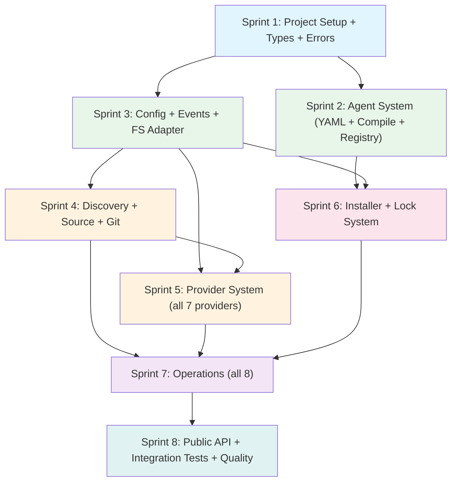

# Planning: Agent Sync SDK

**Package:** `@synapsync/agent-sync-sdk`
**Architecture Reference:** `.agents/plan/cognit-sdk-core/` (13 documents)
**Date:** 2026-02-09

---

## Implementation Strategy

- **Single package** with clear internal module boundaries enforced by strict layering rules and ESLint `no-restricted-imports`.
- **Bottom-up build:** types -> infrastructure -> features -> API. Each sprint produces a testable, independently verifiable layer.
- **Event-driven architecture** enables progress tracking without coupling to any UI framework.
- **In-memory filesystem** (`createMemoryFs`) is the primary test tool. Unit and integration tests never touch the real disk or network.
- **No monorepo.** The CLI is a separate future package. This is a single npm package: `@synapsync/agent-sync-sdk`.
- **Composition root** at `createAgentSyncSDK()` is the only place where concrete implementations are wired. Every other module depends on interfaces.

---

## Package Structure

```
agent-sync-sdk/                         # Repository root
  package.json                          # @synapsync/agent-sync-sdk, type: module
  tsconfig.json                         # strict mode, ES2022, NodeNext
  tsup.config.ts                        # ESM output, dts: true
  vitest.config.ts                      # tests/**/*.test.ts, v8 coverage
  .eslintrc.json                        # no-restricted-imports for layer enforcement
  .gitignore
  .prettierrc

  src/
    index.ts                            # Public API: createAgentSyncSDK, types, errors
    sdk.ts                              # createAgentSyncSDK() factory, AgentSyncSDKImpl

    types/
      index.ts                          # Barrel re-exports for all types
      branded.ts                        # AgentName, CognitiveName, SafeName, SourceIdentifier
      result.ts                         # Result<T,E>, ok(), err(), unwrap(), mapResult()
      cognitive.ts                      # Cognitive, CognitiveType, CognitiveRef, Skill, Prompt, Rule
      agent.ts                          # AgentConfig, AgentType, AgentDetectionResult, AgentRegistry
      provider.ts                       # HostProvider, ProviderMatch, ProviderRegistry, SourceParser, GitClient
      installer.ts                      # InstallMode, InstallScope, InstallTarget, InstallResult, Installer
      lock.ts                           # LockFile, LockEntry, LockManager, LOCK_VERSION
      operations.ts                     # AddOptions/Result, ListOptions/Result, RemoveOptions/Result, etc.
      category.ts                       # Category, CategoryMapping, DEFAULT_CATEGORIES
      config.ts                         # SDKConfig, FileSystemAdapter, FsStats, Dirent
      events.ts                         # SDKEventMap, EventBus, Unsubscribe (30+ event types)

    errors/
      index.ts                          # Barrel re-exports
      base.ts                           # CognitError abstract class (code, module, toJSON)
      provider.ts                       # ProviderError, ProviderFetchError, ProviderMatchError
      install.ts                        # InstallError, PathTraversalError, SymlinkError, FileWriteError
      discovery.ts                      # DiscoveryError, ParseError, ScanError
      lock.ts                           # LockError, LockReadError, LockWriteError, LockMigrationError
      config.ts                         # ConfigError, InvalidConfigError
      source.ts                         # SourceError, SourceParseError, GitCloneError
      agent.ts                          # AgentError, AgentNotFoundError, AgentDetectionError
      codes.ts                          # ERROR_CODES const map, ErrorCode type

    config/
      index.ts                          # resolveConfig(), validateConfig()
      defaults.ts                       # Default config values
      validation.ts                     # Config validation rules

    events/
      index.ts                          # EventBusImpl, createCapturingEventBus

    fs/
      index.ts                          # Barrel exports
      node.ts                           # Node.js fs/promises wrapper (FileSystemAdapter)
      memory.ts                         # In-memory FS implementation (for tests)

    agents/
      index.ts                          # AgentRegistryImpl exports
      registry.ts                       # AgentRegistryImpl class
      detector.ts                       # AgentDetectorImpl (filesystem detection logic)
      __generated__/
        agents.ts                       # Compiled Record<AgentType, AgentConfig>
        agent-type.ts                   # AgentType union (39+ members)
        cognitive-types.ts              # CognitiveType union + COGNITIVE_* const maps

    discovery/
      index.ts                          # DiscoveryServiceImpl exports
      scanner.ts                        # findCognitiveDirs, buildPrioritySearchDirs
      parser.ts                         # parseCognitiveMd, hasCognitiveMd (gray-matter)
      plugin-manifest.ts                # Claude plugin manifest support

    source/
      index.ts                          # Barrel exports
      parser.ts                         # SourceParserImpl (12-rule priority chain)
      git.ts                            # GitClientImpl (simple-git wrapper)

    providers/
      index.ts                          # ProviderRegistryImpl, registerDefaultProviders
      registry.ts                       # ProviderRegistry implementation
      github.ts                         # GitHubProvider (clone + raw API)
      local.ts                          # LocalProvider (filesystem read)
      mintlify.ts                       # MintlifyProvider (mintlify-proj validation)
      huggingface.ts                    # HuggingFaceProvider (Spaces blob-to-raw)
      wellknown.ts                      # WellKnownProvider (RFC 8615, legacy fallback)
      direct.ts                         # DirectURLProvider (catch-all, registered last)

    installer/
      index.ts                          # InstallerImpl exports
      installer.ts                      # InstallerImpl (unified install: local|remote|wellknown)
      file-ops.ts                       # FileOperationsImpl (copy, symlink, atomic write)
      paths.ts                          # sanitizeName, getCanonicalDir, isPathSafe, isContainedIn
      symlink.ts                        # Cross-platform symlink with ELOOP detection + fallback

    lock/
      index.ts                          # LockManagerImpl exports
      manager.ts                        # LockManagerImpl class
      reader.ts                         # Lock file reading, JSON parsing, version detection
      writer.ts                         # Atomic write (temp + rename)
      hash.ts                           # computeContentHash (SHA-256), fetchCognitiveFolderHash (GitHub Trees API)
      migration.ts                      # migrateFromV3, migrateFromV4 -> v5

    operations/
      index.ts                          # Barrel exports
      add.ts                            # AddOperation
      list.ts                           # ListOperation
      remove.ts                         # RemoveOperation
      update.ts                         # UpdateOperation
      sync.ts                           # SyncOperation
      check.ts                          # CheckOperation
      init.ts                           # InitOperation
      find.ts                           # FindOperation

  agents/                               # 39+ YAML agent definitions (source of truth)
    claude-code.yaml
    cursor.yaml
    codex.yaml
    opencode.yaml
    windsurf.yaml
    gemini-cli.yaml
    github-copilot.yaml
    goose.yaml
    roo.yaml
    amp.yaml
    cline.yaml
    junie.yaml
    kiro-cli.yaml
    trae.yaml
    adal.yaml
    augment.yaml
    ...                                 # (39+ total)

  config/
    cognitive-types.yaml                # skill, agent, prompt, rule definitions
    categories.yaml                     # Default category definitions (8 categories)

  scripts/
    compile-agents.ts                   # YAML -> TypeScript compile pipeline
    validate-agents.ts                  # Agent YAML validation script

  tests/                                # Mirror of src/ structure
    helpers/
      fixtures.ts                       # Shared test fixtures
      memory-fs.ts                      # Pre-seeded memory FS factories
      capturing-bus.ts                  # Event bus test helpers
      mock-providers.ts                 # Fake HostProvider implementations
      mock-git.ts                       # Fake GitClient
      sample-agents.ts                  # Minimal agent configs for testing
    types/
      branded.test.ts
      result.test.ts
    errors/
      hierarchy.test.ts
      codes.test.ts
      serialization.test.ts
    config/
      resolve.test.ts
      validation.test.ts
    events/
      event-bus.test.ts
    fs/
      memory.test.ts
    agents/
      registry.test.ts
      detector.test.ts
      generated.test.ts
    discovery/
      parser.test.ts
      scanner.test.ts
      discovery.test.ts
      plugin-manifest.test.ts
    source/
      parser.test.ts
      git.test.ts
    providers/
      registry.test.ts
      github.test.ts
      local.test.ts
      mintlify.test.ts
      huggingface.test.ts
      wellknown.test.ts
      direct.test.ts
    installer/
      paths.test.ts
      file-ops.test.ts
      installer.test.ts
      symlink.test.ts
    lock/
      manager.test.ts
      reader.test.ts
      writer.test.ts
      hash.test.ts
      migration.test.ts
    operations/
      add.test.ts
      list.test.ts
      remove.test.ts
      update.test.ts
      sync.test.ts
      check.test.ts
      init.test.ts
      find.test.ts
    integration/
      full-lifecycle.test.ts
      multi-agent.test.ts
      global-install.test.ts
      sync-drift.test.ts
      lock-migration.test.ts
      category-flow.test.ts
    e2e/
      add-from-local.test.ts
      init-and-add.test.ts
    fixtures/
      skills/valid-skill/SKILL.md
      skills/minimal-skill/SKILL.md
      skills/no-frontmatter/SKILL.md
      skills/internal-skill/SKILL.md
      prompts/valid-prompt/PROMPT.md
      rules/valid-rule/RULE.md
      agents/valid-agent/AGENT.md
      lock/v4-lock.json
      lock/v5-lock.json
      lock/corrupted-lock.json
      agent-yamls/minimal.yaml
      agent-yamls/complex.yaml

  dist/                                 # Built output (ESM-only)
    index.js                            # ESM entry
    index.d.ts                          # Type declarations
    index.d.ts.map                      # Declaration source maps
```

---

## Execution Phases (8 Sprints)

### Sprint Dependency Graph



### Sprint 1: Project Setup + Type System + Error Hierarchy

**Duration:** 1-2 days
**Objectives:** Initialize the project, implement all types, branded type constructors, Result utilities, and the complete error hierarchy.

**Deliverables:**
- `package.json` with `@synapsync/agent-sync-sdk`, `type: module`, ESM exports
- `tsconfig.json` with strict mode, `ES2022`, `NodeNext`
- `tsup.config.ts`, `vitest.config.ts`, `.eslintrc.json`
- All 12 files in `src/types/` (branded, result, cognitive, agent, provider, installer, lock, operations, category, config, events, index)
- All 9 files in `src/errors/` (base, provider, install, discovery, lock, config, source, agent, codes, index)
- Tests: `branded.test.ts`, `result.test.ts`, `hierarchy.test.ts`, `codes.test.ts`, `serialization.test.ts`

**Dependencies:** None (starting point)
**Blocks:** All subsequent sprints

**Acceptance Criteria:**
- `pnpm install && pnpm build` succeeds
- TypeScript strict mode passes with zero errors
- All branded type constructors reject invalid inputs
- `Result<T,E>` works with generic types
- `instanceof` chains work: `ProviderFetchError instanceof ProviderError instanceof CognitError instanceof Error`
- Every error class has `code` and `module` properties
- `toJSON()` on all errors produces structured output
- All tests pass

**Reference:** `11-implementation-roadmap.md` Phase 0 + Phase 1

---

### Sprint 2: Agent System

**Duration:** 2-3 days
**Objectives:** Create all 39+ YAML agent definitions, build the compile-to-TypeScript pipeline, implement the agent registry and detector.

**Deliverables:**
- 39+ YAML files in `agents/` (claude-code, cursor, codex, opencode, windsurf, gemini-cli, github-copilot, goose, roo, amp, cline, junie, kiro-cli, trae, adal, augment, etc.)
- `config/cognitive-types.yaml` defining skill, agent, prompt, rule
- `config/categories.yaml` defining 8 default categories
- `scripts/compile-agents.ts` -- the full compile pipeline (load YAML, validate, resolve conventions, generate TypeScript)
- `scripts/validate-agents.ts` -- standalone validation
- `src/agents/registry.ts` -- `AgentRegistryImpl` implementing all `AgentRegistry` methods
- `src/agents/detector.ts` -- `AgentDetectorImpl` with 7 detection rule types
- `src/agents/__generated__/agents.ts`, `agent-type.ts`, `cognitive-types.ts`
- Tests: `registry.test.ts`, `detector.test.ts`, `generated.test.ts`

**Dependencies:** Sprint 1 (types and errors)
**Blocks:** Sprint 6 (installer needs agent registry), Sprint 7 (operations need agents)

**Acceptance Criteria:**
- `pnpm run compile-agents` generates all 3 output files
- `AgentType` union includes all 39+ agents
- Convention-over-configuration: 3-line YAML (`name`, `displayName`, `rootDir`) produces full `AgentConfig`
- `AgentRegistryImpl.getAll().size >= 39`
- `isUniversal('codex')` returns true (`.agents` localRoot)
- `isUniversal('cursor')` returns false (`.cursor` localRoot)
- `getDir('claude-code', 'skill', 'local')` returns `.claude/skills`
- `detectInstalled()` works with injected filesystem adapter
- Build pipeline runs `compile-agents` before TypeScript compilation (`prebuild` script)

**Reference:** `04-agent-system.md`, `11-implementation-roadmap.md` Phase 2

---

### Sprint 3: Config, Events, and Filesystem Adapter

**Duration:** 1-2 days
**Objectives:** Implement SDK configuration resolution/validation, the typed event bus, and the filesystem abstraction layer (real + in-memory).

**Deliverables:**
- `src/config/index.ts` -- `resolveConfig()`, `validateConfig()`
- `src/config/defaults.ts` -- default values for all config fields
- `src/config/validation.ts` -- validation rules (throw `InvalidConfigError`)
- `src/events/index.ts` -- `EventBusImpl`, `createCapturingEventBus()`
- `src/fs/index.ts`, `src/fs/node.ts` -- Node.js `fs/promises` wrapper
- `src/fs/memory.ts` -- In-memory filesystem (supports recursive mkdir, symlink, readdir with types, stat/lstat)
- Tests: `resolve.test.ts`, `validation.test.ts`, `event-bus.test.ts`, `memory.test.ts`

**Dependencies:** Sprint 1 (types and errors)
**Blocks:** Sprint 4 (discovery needs FS + events), Sprint 5 (providers need events), Sprint 6 (installer + lock need FS + config + events)

**Acceptance Criteria:**
- `resolveConfig()` fills all defaults when called with no arguments
- `resolveConfig({ git: { cloneTimeoutMs: 60_000 } })` merges correctly
- `validateConfig()` rejects empty `cwd`, negative timeouts
- `EventBusImpl.on()` delivers typed payloads
- `EventBusImpl.once()` fires exactly once
- Unsubscribe removes handler
- `createCapturingEventBus()` records events in order with `{ event, payload }` shape
- `createMemoryFs()` implements all 12 `FileSystemAdapter` methods
- In-memory FS supports: recursive mkdir, symlink/readlink, readdir with file types, stat vs lstat, seeding with initial files

**Reference:** `01-architecture.md` Sections 7-9, `11-implementation-roadmap.md` Phase 3

---

### Sprint 4: Discovery Engine + Source Parser + Git Client

**Duration:** 2-3 days
**Objectives:** Implement cognitive file discovery (scan + parse), source string parsing (12-rule chain), and git clone operations.

**Deliverables:**
- `src/discovery/` -- `DiscoveryServiceImpl`, `scanner.ts`, `parser.ts`, `plugin-manifest.ts`
- `src/source/` -- `SourceParserImpl`, `GitClientImpl`
- Tests: `parser.test.ts` (frontmatter), `scanner.test.ts`, `discovery.test.ts`, `plugin-manifest.test.ts`, `source/parser.test.ts` (exhaustive input variants), `git.test.ts`

**Dependencies:** Sprint 1 (types), Sprint 3 (events, FS adapter)
**Blocks:** Sprint 5 (providers need source parser), Sprint 7 (operations need discovery + source)

**Acceptance Criteria:**
- `parseCognitiveMd()` extracts name, description, type, metadata from frontmatter
- Parser returns `ParseError` for missing required fields (name, description)
- Scanner finds cognitive files in nested directory structures via in-memory FS
- `DiscoveryServiceImpl.discover()` supports type filtering, subpath filtering, `internal: true` filtering
- Events emitted: `discovery:start`, `discovery:found`, `discovery:complete`
- `SourceParserImpl.parse()` correctly identifies all 12 source types:
  - `./path` -> `local`, `owner/repo` -> `github`, `owner/repo@name` -> `github` with nameFilter
  - GitHub tree URLs with ref + subpath, GitLab patterns, direct URLs, well-known
- `GitClientImpl.clone()` wraps `simple-git` with configurable depth/timeout
- Events emitted: `git:clone:start`, `git:clone:complete`, `git:clone:error`

**Reference:** `03-modules.md` Sections 2.6-2.8, `05-provider-system.md` Section 6, `11-implementation-roadmap.md` Phases 4-5

---

### Sprint 5: Provider System

**Duration:** 2-3 days
**Objectives:** Implement the provider registry and all 7 provider implementations: GitHub, Local, Mintlify, HuggingFace, WellKnown, Direct URL, Registry (stub).

**Deliverables:**
- `src/providers/registry.ts` -- `ProviderRegistryImpl` (register, findProvider, getAll)
- `src/providers/index.ts` -- `registerDefaultProviders()` with priority ordering
- `src/providers/github.ts` -- `GitHubProvider` (clone-based + raw API for single files)
- `src/providers/local.ts` -- `LocalProvider` (filesystem read)
- `src/providers/mintlify.ts` -- `MintlifyProvider` (HTTP URLs, `mintlify-proj` validation)
- `src/providers/huggingface.ts` -- `HuggingFaceProvider` (Spaces, blob-to-raw)
- `src/providers/wellknown.ts` -- `WellKnownProvider` (RFC 8615, legacy `.well-known/skills/` fallback)
- `src/providers/direct.ts` -- `DirectURLProvider` (catch-all, registered last)
- Tests: 7 provider test files + `registry.test.ts`

**Dependencies:** Sprint 1 (types), Sprint 3 (events), Sprint 4 (source parser)
**Blocks:** Sprint 7 (operations need providers)

**Acceptance Criteria:**
- `ProviderRegistryImpl` registers providers, rejects duplicates, first-match-wins priority
- Registration order: Mintlify -> HuggingFace -> Direct (WellKnown used explicitly)
- Each provider implements `match()`, `fetchCognitive()`, `toRawUrl()`, `getSourceIdentifier()`
- `GitHubProvider` converts blob URLs to `raw.githubusercontent.com`
- `MintlifyProvider` returns null when `mintlify-proj` is missing (falls through to Direct)
- `HuggingFaceProvider` matches `huggingface.co/spaces/` URLs
- `WellKnownProvider` tries `.well-known/cognitives/index.json` then legacy path
- `DirectURLProvider` matches HTTP(S) URLs ending in cognitive file names
- Events emitted: `provider:fetch:start`, `provider:fetch:complete`, `provider:fetch:error`
- All tests pass with mocked HTTP responses (no real network calls in unit tests)

**Reference:** `05-provider-system.md`, `11-implementation-roadmap.md` Phases 6 + 11

---

### Sprint 6: Installer + Lock System

**Duration:** 2-3 days
**Objectives:** Implement the unified installer (symlink/copy, canonical paths, agent paths) and the lock file system (v5 schema, CRUD, migration, hashing).

**Deliverables:**
- `src/installer/` -- `InstallerImpl`, `FileOperationsImpl`, `paths.ts` (sanitizeName, getCanonicalDir, isPathSafe), `symlink.ts`
- `src/lock/` -- `LockManagerImpl`, `reader.ts`, `writer.ts`, `hash.ts`, `migration.ts`
- Tests: `paths.test.ts`, `file-ops.test.ts`, `installer.test.ts`, `symlink.test.ts`, `manager.test.ts`, `reader.test.ts`, `writer.test.ts`, `hash.test.ts`, `migration.test.ts`

**Dependencies:** Sprint 1 (types), Sprint 2 (agents -- installer needs `AgentRegistry`), Sprint 3 (config, events, FS adapter)
**Blocks:** Sprint 7 (operations need installer + lock)

**Acceptance Criteria:**
- **Installer:**
  - `InstallerImpl.install()` handles all 3 `InstallRequest` kinds (local, remote, wellknown)
  - Symlink mode: writes to canonical dir (`.agents/cognit/<type>/<category>/<name>/`) and creates symlink from agent dir
  - Universal agents (`.agents/` localRoot) skip symlink creation
  - Copy mode: writes directly to agent directory
  - Symlink failure falls back to copy with `symlinkFailed: true` in result
  - `sanitizeName()` produces safe filesystem names for all edge cases (spaces, slashes, dots, unicode, empty)
  - `isPathSafe()` rejects `../` traversal attempts
  - Events: `install:start`, `install:symlink`, `install:copy`, `install:complete`
- **Lock:**
  - `LockManagerImpl.read()` returns empty lock when file doesn't exist
  - v3 and v4 formats migrated to v5 on read
  - Corrupted JSON returns empty lock (no crash)
  - `addEntry()` sets `installedAt` on new entries, `updatedAt` on updates
  - `removeEntry()` returns true if existed
  - `getBySource()` groups entries by `SourceIdentifier`
  - Atomic write: temp-file-then-rename pattern
  - `computeContentHash()` produces deterministic SHA-256 hex
  - Events: `lock:read`, `lock:write`, `lock:migrate`

**Reference:** `07-installer.md`, `08-lock-system.md`, `11-implementation-roadmap.md` Phases 7-8

---

### Sprint 7: Operations

**Duration:** 3-4 days
**Objectives:** Implement all 8 SDK operations. Each operation receives dependencies via constructor injection, returns `Result<T,E>`, emits events, and is fully non-interactive.

**Deliverables:**
- `src/operations/` -- `AddOperation`, `ListOperation`, `RemoveOperation`, `UpdateOperation`, `SyncOperation`, `CheckOperation`, `InitOperation`, `FindOperation`
- Tests: 8 operation test files

**Dependencies:** Sprint 2 (agents), Sprint 4 (discovery, source), Sprint 5 (providers), Sprint 6 (installer, lock)
**Blocks:** Sprint 8 (public API wraps operations)

**Acceptance Criteria:**
- **add:** Parse -> clone/fetch -> discover -> filter -> install -> lock. Returns `available` when no agents specified (two-phase non-interactive).
- **list:** Read lock + scan filesystem -> merge state -> filter by type/agent/scope -> return `InstalledCognitive[]`.
- **remove:** Lookup in lock -> remove files/symlinks for each agent -> remove canonical dir -> remove lock entry.
- **update:** Read lock -> fetch remote hashes (GitHub tree SHA or content SHA-256) -> compare -> re-install changed -> update lock.
- **sync:** Read lock -> scan filesystem -> detect drift (missing files, broken symlinks, orphaned entries) -> fix.
- **check:** Read lock -> verify canonical paths exist -> verify symlinks valid -> verify hashes -> report `healthy` and `issues`.
- **init:** Validate name -> create directory -> generate template file with frontmatter (`name`, `description` fields).
- **find:** Parse source -> resolve via provider -> fetch cognitives -> cross-reference lock for installed status -> filter -> return.
- All operations emit correct events via EventBus
- All operations return `Result<T, CognitError>` -- never throw for expected failures
- No operation reads stdin, writes stdout, or calls `process.exit`
- Each operation receives only the dependencies it needs (e.g., `ListOperation` gets `discoveryService`, `agentRegistry`, `lockManager`, `eventBus`, `config`)

**Reference:** `06-operations.md`, `11-implementation-roadmap.md` Phase 9

---

### Sprint 8: Public API + Integration Testing + Quality Gates

**Duration:** 2-3 days
**Objectives:** Create the SDK facade, wire the composition root, set up all public exports, write integration tests, hit coverage targets, and verify the full build pipeline.

**Deliverables:**
- `src/sdk.ts` -- `createAgentSyncSDK()` composition root, `AgentSyncSDKImpl` class
- `src/index.ts` -- All public exports (factory, types, errors, categories)
- Integration tests: `full-lifecycle.test.ts`, `multi-agent.test.ts`, `global-install.test.ts`, `sync-drift.test.ts`, `lock-migration.test.ts`, `category-flow.test.ts`
- E2E tests: `add-from-local.test.ts`, `init-and-add.test.ts`
- Test fixtures: sample cognitive files, lock files (v4, v5, corrupted), agent YAMLs

**Dependencies:** All previous sprints (S1-S7)
**Blocks:** None (final sprint)

**Acceptance Criteria:**
- `createAgentSyncSDK()` works with zero arguments (all defaults)
- `createAgentSyncSDK({ fs: memoryFs })` works for testing
- `sdk.add()`, `.list()`, `.remove()`, `.update()`, `.sync()` delegate to operations
- `sdk.on()` and `sdk.once()` subscribe to typed events
- `sdk.agents` exposes `AgentRegistry`, `sdk.providers` exposes `ProviderRegistry`
- `sdk.config` is `Readonly<SDKConfig>`
- `sdk.dispose()` cleans up resources
- `import { createAgentSyncSDK, CognitError } from '@synapsync/agent-sync-sdk'` works
- Full lifecycle test passes: add -> list -> update -> remove through SDK facade with in-memory FS
- Multi-agent test: install to claude-code + cursor, verify symlinks
- Sync drift test: break symlink, run sync, verify fixed
- Lock migration test: seed v4 lock, run operations, verify v5
- Overall coverage: statements >= 85%, branches >= 80%, functions >= 85%
- `tsc --noEmit` passes with zero errors
- `tsup` produces valid `dist/index.js` + `dist/index.d.ts`
- No `console.` calls in `src/` (grep verification)
- Package builds and can be imported as ESM

**Reference:** `01-architecture.md` Section 5 + 11, `12-testing-strategy.md`, `11-implementation-roadmap.md` Phases 10 + 12

---

## Resource Plan

| Aspect | Detail |
|--------|--------|
| **Team** | Single developer with Claude Code agents |
| **Agent assignment** | Each sprint can be assigned to an agent with clear inputs (interfaces from types) and outputs (implementations + tests) |
| **Parallelization** | Sprints 2 and 3 can run in parallel after Sprint 1. Sprints 4 and 5 can partially overlap. Sprint 6 depends on both 2 and 3. |
| **Module isolation** | Agents work on isolated modules with well-defined interfaces. No cross-module implementation dependencies during development. |
| **Contract testing** | Each sprint produces tests that verify the module against its interface, not its internal implementation |
| **Estimated total** | 14-21 days of focused development (single developer) |

---

## Risk Mitigation

| Risk | Probability | Impact | Mitigation |
|------|-------------|--------|------------|
| **Agent YAML diversity** -- 39+ agents with unique conventions may produce edge cases in the compile pipeline | Medium | Medium | Convention-over-configuration reduces variation. Comprehensive test suite for compile script. Validation step catches schema violations at build time. |
| **Symlink failures on Windows** -- Windows requires DevMode for symlinks; CI may not have it | Medium | Low | Automatic fallback to copy mode. `symlinkFailed: true` in `InstallResult` enables consumer warnings. Test both modes explicitly. |
| **Lock migration data loss** -- v3/v4 lock files may have unexpected shapes | Low | High | Backup as `.bak` before migration. Corrupted files return empty lock with warning event (never crash). Migration functions tested with fixture files. |
| **Provider HTTP failures** -- Mintlify, HuggingFace, WellKnown endpoints may be down or change format | Medium | Low | Each provider returns `null` on failure (graceful fallback). DirectURLProvider is the catch-all. No operation fails because a single provider is unavailable. |
| **In-memory FS fidelity** -- Memory FS may not perfectly replicate real FS edge cases (permissions, symlink loops, case sensitivity) | Low | Medium | E2E tests validate against real filesystem. Memory FS tested for all 12 `FileSystemAdapter` methods. Known limitations documented. |
| **Gray-matter parsing edge cases** -- Unusual frontmatter (empty, malformed YAML, no closing `---`) | Low | Low | `parseCognitiveMd` catches all `gray-matter` exceptions and wraps in `ParseError`. Fixture files test edge cases. |
| **GitHub API rate limiting** -- `fetchCognitiveFolderHash` uses GitHub Trees API which has rate limits | Medium | Medium | `GITHUB_TOKEN` / `GH_TOKEN` auto-detection increases limits. Token passed via `SDKConfig.providers.githubToken`. Graceful degradation: skip hash check if API unavailable. |
| **Circular dependencies** -- Complex module graph may introduce import cycles | Low | High | Strict layer enforcement via ESLint `no-restricted-imports`. Layer N only imports from layer < N. No lateral imports except `providers` -> `source`. |
| **Scope creep into CLI concerns** -- Operations may inadvertently include UI logic | Low | Medium | Non-interactive design enforced: operations return `Result<T,E>` and emit events. No `process` access in `src/`. Code review checks for stdin/stdout/stderr usage. |
| **Generated code drift** -- `__generated__/` files may get out of sync with YAML sources | Low | Medium | `prebuild` script runs `compile-agents` before every build. CI runs compile step. Generated files committed to repo for IDE support. |

---

## Conventions Alignment

### Code Style

| Convention | Rule |
|------------|------|
| **File names** | `kebab-case.ts` (e.g., `file-ops.ts`, `agent-type.ts`) |
| **Types / Interfaces** | `PascalCase` (e.g., `AgentConfig`, `CognitiveType`, `HostProvider`) |
| **Functions / Variables** | `camelCase` (e.g., `resolveConfig`, `createMemoryFs`, `computeContentHash`) |
| **Constants** | `UPPER_SNAKE_CASE` for const maps (e.g., `COGNITIVE_TYPE_CONFIGS`, `ERROR_CODES`, `LOCK_VERSION`) |
| **Branded types** | `PascalCase` type, `camelCase` constructor (e.g., type `AgentName`, constructor `agentName()`) |
| **Error classes** | `PascalCase` ending in `Error` (e.g., `ProviderFetchError`, `PathTraversalError`) |
| **Generated files** | `// AUTO-GENERATED -- DO NOT EDIT` header. No imports from SDK modules. |

### Module Organization

| Convention | Rule |
|------------|------|
| **Barrel exports** | Every module has `index.ts` that controls its public surface |
| **Interface-first** | All modules depend on interfaces, not implementations |
| **Implementation suffix** | Concrete classes end in `Impl` (e.g., `AgentRegistryImpl`, `InstallerImpl`) |
| **No default exports** | All exports are named |
| **Readonly interfaces** | All interface properties are `readonly` |
| **No `any`** | Only `unknown` at JSON deserialization boundaries, immediately narrowed |

### Testing

| Convention | Rule |
|------------|------|
| **Test location** | `tests/` directory mirroring `src/` structure |
| **Test naming** | `<module>.test.ts` (e.g., `registry.test.ts`, `installer.test.ts`) |
| **No mocking libraries** | Hand-written fakes via DI. `createMemoryFs()`, `createCapturingEventBus()`, `createFakeGitClient()` |
| **Fixture files** | Shared in `tests/fixtures/` and `tests/helpers/` |
| **Coverage exclusions** | `__generated__/`, barrel `index.ts` files, pure type files (no runtime code) |
| **Parallel safety** | No singletons, no global state, no shared mutable fixtures |

### TypeScript Config

```jsonc
{
  "compilerOptions": {
    "target": "ES2022",
    "module": "NodeNext",
    "moduleResolution": "NodeNext",
    "strict": true,
    "noUncheckedIndexedAccess": true,
    "exactOptionalPropertyTypes": true,
    "declaration": true,
    "declarationMap": true,
    "sourceMap": true,
    "outDir": "dist",
    "rootDir": "src"
  }
}
```

### Package Exports

```jsonc
{
  "name": "@synapsync/agent-sync-sdk",
  "type": "module",
  "exports": {
    ".": {
      "types": "./dist/index.d.ts",
      "import": "./dist/index.js"
    }
  },
  "types": "./dist/index.d.ts",
  "files": ["dist"],
  "engines": { "node": ">=20" }
}
```
